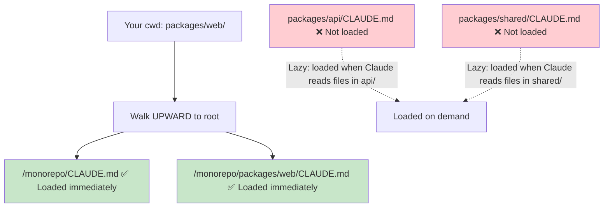

# Module 10.1: Team CLAUDE.md

> **Estimated time**: ~30 minutes
>
> **Prerequisite**: Module 4.2 (CLAUDE.md — Project Memory), Phase 9 (Legacy Code)
>
> **Outcome**: After this module, you will know how to create and maintain a shared CLAUDE.md for teams, establish contribution workflows, and ensure consistent Claude behavior across all team members.

---

## 1. WHY — Why This Matters

Your team of 5 developers all use Claude Code. Developer A's Claude uses camelCase. Developer B's Claude uses snake_case. Developer C's Claude imports lodash for everything. Developer D's Claude learned to avoid lodash. Every PR has style conflicts. Claude is supposed to help, but it's creating inconsistency.

Team CLAUDE.md solves this: ONE shared file that ALL team members' Claude instances read. Same rules, same patterns, same knowledge. Consistency at scale.

---

## 2. CONCEPT — Core Ideas

### Individual vs. Team CLAUDE.md

| Aspect | Individual | Team |
|--------|-----------|------|
| Location | Personal projects | Repo root (committed) |
| Scope | Personal preferences | Team standards |
| Updates | You decide | Team consensus |
| Versioned | Optional | Required (git) |

### Team CLAUDE.md Structure

```markdown
# Project: [Name]

## Team Conventions
- Coding style, naming, file organization

## Architecture Decisions
- Why we chose X over Y
- Patterns to follow

## Forbidden Patterns
- What NOT to do and why

## Dependencies Policy
- Approved libraries
- Banned libraries with reasons

## Testing Requirements
- Coverage expectations
- Test patterns

## Claude-Specific Instructions
- How Claude should behave for this project
```

### The Contribution Workflow

1. CLAUDE.md lives in repo root
2. Changes go through PR like any code
3. Team reviews CLAUDE.md changes
4. Merge = team consensus

### Layered CLAUDE.md

For complex projects:
- `/CLAUDE.md` — Global team rules
- `/backend/CLAUDE.md` — Backend-specific rules
- `/frontend/CLAUDE.md` — Frontend-specific rules

Claude reads all applicable files when working in a directory.

### Monorepo CLAUDE.md Hierarchy

In large monorepos (Turborepo, Nx, Lerna), the layered approach becomes critical. Claude Code's CLAUDE.md loading behavior makes this powerful:

#### How Claude Loads CLAUDE.md Files



**Key behavior**:
- On startup, Claude walks **upward** from your current directory to filesystem root
- Loads every CLAUDE.md found along that upward path **immediately**
- CLAUDE.md files in sibling or child directories are **NOT** loaded at launch
- Those files are **lazy-loaded** only when Claude reads files in those directories

#### Monorepo Structure Pattern

```text
monorepo/
├── CLAUDE.md                    # Shared: TypeScript strict, commit format, PR template
├── packages/
│   ├── web/
│   │   └── CLAUDE.md            # Next.js conventions, component patterns
│   ├── api/
│   │   └── CLAUDE.md            # Express patterns, DB access rules
│   ├── shared/
│   │   └── CLAUDE.md            # Shared types, no side effects allowed
│   └── mobile/
│       └── CLAUDE.md            # React Native patterns, platform specifics
└── .claude/
    └── rules/                   # Modular rule files (loaded automatically)
        ├── testing.md           # Test conventions across all packages
        └── security.md          # Security rules for the entire repo
```

#### What Goes Where

| Level | Content | Example |
|-------|---------|---------|
| **Root CLAUDE.md** | Repo-wide conventions | TypeScript strict, no `any`, commit format |
| **Package CLAUDE.md** | Framework-specific rules | "Server Components by default" |
| **`.claude/rules/*.md`** | Cross-cutting concerns | Testing standards, security rules |
| **CLAUDE.local.md** | Personal preferences (`.gitignore`d) | Debug shortcuts, editor config |

> **Tip**: Add `CLAUDE.local.md` to `.gitignore`. Use it for personal instructions that shouldn't be shared with the team — custom aliases, debug workflows, preferred output format.

### Living Document Principle

- CLAUDE.md evolves with the project
- After every "Claude did wrong thing" → update CLAUDE.md
- After every architectural decision → document in CLAUDE.md
- Regular review (monthly/quarterly)

---

## 3. DEMO — Step by Step

**Scenario**: Setting up Team CLAUDE.md for a 5-person development team.

### Step 1: Initialize with Team Context

```bash
$ claude
```

```text
You: We're setting up CLAUDE.md for our team. Read our existing codebase
and generate a starting CLAUDE.md that captures:
- Our apparent coding conventions
- Our tech stack
- Patterns you observe

Claude: [Reads codebase, generates initial CLAUDE.md]
```

### Step 2: Add Team-Specific Rules

```markdown
# Project: E-commerce Platform

## Team Conventions
- TypeScript strict mode, no `any`
- React functional components only, no classes
- File naming: kebab-case for files, PascalCase for components
- Imports: absolute paths from `@/` alias

## Architecture Decisions
- State management: Zustand (NOT Redux — too much boilerplate)
- API layer: React Query for server state
- Styling: Tailwind CSS, no inline styles

## Forbidden Patterns
- ❌ `any` type — always define proper types
- ❌ `console.log` in production code — use logger service
- ❌ Direct DOM manipulation — use React refs
- ❌ lodash — use native JS methods (bundle size)

## Dependencies Policy
- New dependencies require team discussion
- Check bundle size before adding (bundlephobia.com)
- Security: no packages with known CVEs

## Testing Requirements
- Unit tests for all utils
- Integration tests for API routes
- E2E tests for critical user flows
- Minimum 70% coverage for new code

## Claude-Specific Instructions
- Always run `npm run lint` after code changes
- Suggest tests for any new function
- When unsure about architecture, ask rather than assume
```

### Step 3: Commit and Establish Workflow

```bash
$ git add CLAUDE.md && git commit -m "docs: add team CLAUDE.md for AI assistant context"
```

Output:
```text
[main abc1234] docs: add team CLAUDE.md for AI assistant context
 1 file changed, 45 insertions(+)
 create mode 100644 CLAUDE.md
```

### Step 4: Verify It Works

```text
You: What are our rules about using lodash?

Claude: According to CLAUDE.md, lodash is forbidden. Use native JS
methods instead due to bundle size concerns.
```

---

## 4. PRACTICE — Try It Yourself

### Exercise 1: Audit Your Current State

**Goal**: Create initial Team CLAUDE.md from existing standards.

**Instructions**:
1. If your team has coding standards docs, convert them to CLAUDE.md format
2. If not, ask Claude to analyze your codebase and generate initial conventions
3. Review and refine with team input

<details>
<summary>💡 Hint</summary>

```text
"Read our codebase. Generate a CLAUDE.md that captures:
- Coding conventions you observe
- Tech stack and patterns
- Any anti-patterns to avoid"
```
</details>

### Exercise 2: The Forbidden Patterns Section

**Goal**: Prevent common mistakes with explicit rules.

**Instructions**:
1. Think of 5 things developers on your team commonly do wrong
2. Add them to "Forbidden Patterns" with clear explanations
3. Test: ask Claude to do one of those things, verify it refuses

### Exercise 3: Layered CLAUDE.md

**Goal**: Set up directory-specific rules.

**Instructions**:
1. Create root CLAUDE.md with global rules
2. Create subdirectory CLAUDE.md for one specific area (e.g., `/api/CLAUDE.md`)
3. Verify Claude reads both when working in that area

<details>
<summary>✅ Solution</summary>

Structure:
```text
/CLAUDE.md           # "All code must be TypeScript"
/api/CLAUDE.md       # "API routes use Express middleware pattern"
```

Test by asking Claude about API conventions while in `/api/` directory — it should know both global and API-specific rules.
</details>

---

## 5. CHEAT SHEET

### Team CLAUDE.md Template

```markdown
# Project: [Name]

## Team Conventions
- [Coding style rules]

## Architecture Decisions
- [Why we chose X]

## Forbidden Patterns
- ❌ [Thing to avoid] — [reason]

## Dependencies Policy
- [What's allowed/banned]

## Testing Requirements
- [Coverage, patterns]

## Claude-Specific Instructions
- [How Claude should behave]
```

### Workflow

1. CLAUDE.md in repo root (committed)
2. Changes via PR
3. Team reviews
4. Update after every "Claude mistake"

### Layered Structure

```text
/CLAUDE.md           # Global rules
/backend/CLAUDE.md   # Backend-specific
/frontend/CLAUDE.md  # Frontend-specific
```

---

## 6. PITFALLS — Common Mistakes

| ❌ Mistake | ✅ Correct Approach |
|-----------|---------------------|
| Individual CLAUDE.md not in git | Team CLAUDE.md MUST be committed and shared |
| One person maintains CLAUDE.md | Team ownership. PRs for changes. Everyone contributes. |
| Written once, never updated | Living document. Update after every issue. |
| Too vague ("write good code") | Specific, actionable ("use camelCase, not snake_case") |
| Too long (nobody reads) | Concise. Most important rules first. |
| Only coding style | Include architecture, dependencies, testing, Claude behavior |
| Not testing if Claude reads it | Verify by asking Claude about rules |

---

## 7. REAL CASE — Production Story

**Scenario**: Vietnamese fintech startup, 8 developers, all using Claude Code. Before Team CLAUDE.md: every PR had style conflicts, different error handling patterns, inconsistent API responses.

**Implementation**:
1. Tech lead drafted initial CLAUDE.md from existing (informal) standards
2. Team reviewed in 1-hour meeting, added forbidden patterns from past incidents
3. Committed to repo, announced in Slack
4. Rule: "If Claude does wrong thing, fix it AND update CLAUDE.md"

**CLAUDE.md highlights**:
- VND currency: always use integer (no decimals)
- Error responses: use standard ApiError class
- Forbidden: any direct database queries in controllers

**Results after 1 month**:
- Style conflicts in PRs: down 80%
- "why did Claude do this?" questions: down 90%
- New developer onboarding: from 2 weeks to 3 days (Claude knew all the rules)

**Quote**: "CLAUDE.md is our best onboarding document. It teaches Claude AND new developers at the same time."

---

> **Next**: [Module 10.2: Git Conventions](../02-git-conventions/) →
