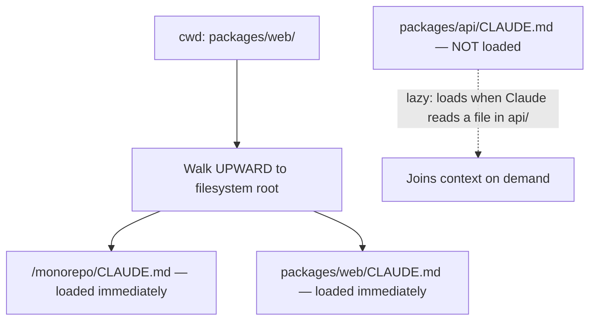

# Module 10.1: Team CLAUDE.md

> **Estimated time**: ~30 minutes
>
> **Prerequisite**: Module 4.2 (CLAUDE.md — Project Memory), Phase 9 (Legacy Code)
>
> **Outcome**: After this module, you will know which mechanism to use for team-wide Claude
> instructions — repo `CLAUDE.md`, path-scoped `.claude/rules/`, or org-wide managed policy — and
> how to verify what actually loaded for a given file.

---

## 1. WHY — Why This Matters

Five developers, five different Claude habits: one's Claude writes camelCase, another's writes
snake_case, a third imports lodash everywhere. A single project `CLAUDE.md` fixes the "same repo,
different rules" problem — but it doesn't fix "the frontend rule loaded while Claude was editing
the backend" or "nobody can prove which file actually got read." Module 4.2 covers writing a lean
`CLAUDE.md`; this module covers distributing instructions across a team and multiple apps, and
proving they loaded.

---

## 2. CONCEPT — Core Ideas

### Individual vs. team CLAUDE.md

| Aspect | Individual (`CLAUDE.local.md`) | Team (`CLAUDE.md`) |
|--------|-----------|------|
| Location | Repo root, gitignored | Repo root, committed |
| Scope | Personal preferences | Team standards |
| Updates | You decide | PR + review |
| Loaded for everyone | No | Yes |

### Monorepo hierarchy (concatenated, not overridden)

Claude Code walks **upward** from the working directory at launch and loads every `CLAUDE.md`
found along that path immediately. Files in sibling or child packages are **not** loaded at
launch — they load lazily, only when Claude reads a file inside that package (full mechanics,
including `@imports` and precedence order, are in Module 4.2):


```mermaid
graph TD
    CWD["cwd: packages/web/"] --> Walk[Walk UPWARD to filesystem root]
    Walk --> Root["/monorepo/CLAUDE.md — loaded immediately"]
    Walk --> Pkg["packages/web/CLAUDE.md — loaded immediately"]
    Other["packages/api/CLAUDE.md — NOT loaded"] -.->|"lazy: loads when Claude reads a file in api/"| Later[Joins context on demand]
```

### Two ways to scope a team rule

| Mechanism | Loads | Who can exclude it |
|---|---|---|
| `CLAUDE.md` (root or package) | At launch, if on the upward path | `claudeMdExcludes` (not managed policy) |
| `.claude/rules/*.md` with `paths:` frontmatter | "When Claude reads files matching the pattern, not on every tool use" | Same as above |
| `.claude/rules/*.md` **without** `paths:` | At launch, same priority as `.claude/CLAUDE.md` | Same as above |

`paths:` is the only frontmatter field Claude Code reads in a rule file (budget: 1,000 expanded
glob patterns / 4 MiB). This is how a team keeps `apps/web/**`-only conventions from ever entering
context while someone works in `apps/api/`.

### Org-wide: managed policy CLAUDE.md

For rules that must apply to every developer regardless of what's checked into the repo, an admin
deploys a **managed policy CLAUDE.md**, loaded before user and project files and impossible to
exclude with `claudeMdExcludes`:

| OS | Path |
|---|---|
| macOS | `/Library/Application Support/ClaudeCode/CLAUDE.md` |
| Linux / WSL | `/etc/claude-code/CLAUDE.md` |
| Windows | `C:\Program Files\ClaudeCode\CLAUDE.md` |

Or skip the separate file and inline the text with the `claudeMd` key inside
`managed-settings.json` (Module 10.5 covers deploying that file). Committed `CLAUDE.md` is still
the right tool for team conventions the team itself owns and reviews; managed policy is for the
handful of rules an org needs enforced regardless of repo.

### Verifying what loaded

`/memory` lists every CLAUDE.md-family file in scope, whether auto-memory is on, and lets you open
the auto-memory folder. It does **not** list `.claude/rules/` — those only show up once a matching
file is read (see DEMO). `/init` analyzes the repo and writes a starting `CLAUDE.md`, or proposes
edits if one exists (Module 4.2, Exercise 1, has the full prune workflow for a bloated file).

---

## 3. DEMO — Step by Step

**Scenario**: a 2-app monorepo (`apps/web` Next.js, `apps/api` Express) with a root `CLAUDE.md`
and one path-scoped rule for the frontend only.

**Step 1: Root CLAUDE.md + a scoped rule**

```bash
mkdir -p apps/web/src apps/api/src .claude/rules
cat > CLAUDE.md <<'EOF'
# Storefront Monorepo
- Two apps: apps/web (Next.js) and apps/api (Express).
- TypeScript strict mode everywhere. No `any`.
EOF
cat > .claude/rules/frontend-testing.md <<'EOF'
---
paths: apps/web/**
---
# Frontend testing rule
- Every component in apps/web needs a co-located *.test.tsx.
- Use React Testing Library, not Enzyme.
EOF
git add -A && git commit -q -m "init monorepo demo"
```

**Step 2: Confirm the CLAUDE.md family with `/memory`**

```text
> /memory
```
```text
# Output may vary
Memory
❯ Auto-memory  true
❯ User instructions   Saved in ~/.claude/CLAUDE.md
  Project instructions   Checked in at ./CLAUDE.md
  Open auto-memory folder
```

The `.claude/rules/frontend-testing.md` rule is absent here — it hasn't triggered yet.

**Step 3: Open a file inside `apps/web` — the rule loads**

```text
> Read apps/web/src/Button.tsx, then tell me what our testing rule for this file requires.
```
```text
# Output may vary
Opening Button.tsx loaded the project rule .claude/rules/frontend-testing.md, which covers
everything in apps/web. It requires: a test file next to the component (apps/web/src/Button.test.tsx)
and React Testing Library, not Enzyme.
```

**Step 4: Same question for `apps/api` — the rule stays silent**

```text
> Read apps/api/src/index.ts. Does the frontend testing rule apply to this file?
```
```text
# Output may vary
No, it doesn't apply. .claude/rules/frontend-testing.md is scoped to paths: apps/web/**, and
apps/api/src/index.ts is in the Express API app.
```

That asymmetry — loaded for `apps/web`, silent for `apps/api` — is the whole point of `paths:`.

---

## 4. PRACTICE — Try It Yourself

### Exercise 1: Split a shared rule out of CLAUDE.md

**Goal**: Move one directory-specific convention out of the root file.

**Instructions**:
1. Pick a rule in your `CLAUDE.md` that only applies to one package or directory.
2. Move it into `.claude/rules/<name>.md` with a `paths:` glob for that directory.
3. Commit both files, open the PR like any code change.
4. Verify with the DEMO's Step 3 pattern: read a matching file, then a non-matching one.

<details>
<summary>💡 Hint</summary>

`paths:` accepts a YAML list or a comma-separated string — `apps/web/**` and
`["apps/web/**", "packages/ui/**"]` both work.
</details>

### Exercise 2: Managed vs. committed — pick the right layer

**Goal**: Decide which of three rules belongs in `CLAUDE.md`, `.claude/rules/`, or managed policy.

**Instructions**: For each rule below, name the mechanism and say why:
1. "Use Zustand, not Redux, for state management."
2. "Files under `payments/**` need a security review before merge."
3. "Never disable the permission-bypass mode on a company laptop."

<details>
<summary>✅ Solution</summary>

1. `CLAUDE.md` — a team convention the team itself decided and can change by PR.
2. `.claude/rules/payments.md` with `paths: payments/**` — cross-cutting, but only relevant in
   that directory.
3. Managed policy (`disableBypassPermissionsMode`, Module 10.5) — must hold even if a developer
   edits or deletes the repo's `CLAUDE.md`.
</details>

### Exercise 3: Contribution workflow

**Goal**: Turn CLAUDE.md maintenance into a team habit, not one person's job.

**Instructions**: Draft a one-line PR-template checkbox: "Updated `CLAUDE.md` or a rule after this
change?" Add it to your repo and use it for one week.

---

## 5. CHEAT SHEET

| Mechanism | Loads | Scope |
|---|---|---|
| `./CLAUDE.md` | At launch, if on the upward path | Whole repo (or subtree if nested) |
| `.claude/rules/*.md` (no `paths:`) | At launch | Whole repo |
| `.claude/rules/*.md` (`paths:`) | When a matching file is read | That path glob only |
| `CLAUDE.local.md` | At launch, gitignored | Personal |
| Managed policy CLAUDE.md | Before user/project files, every session | Org-wide, can't be excluded |
| `claudeMd` (in `managed-settings.json`) | Same as above, inline instead of a file | Org-wide |
| `/memory` | — | Lists CLAUDE.md family, toggles auto-memory |
| `/init` | — | Generates/updates `CLAUDE.md` (interactive only) |

---

## 6. PITFALLS — Common Mistakes

| ❌ Mistake | ✅ Correct Approach |
|-----------|---------------------|
| One 600-line `CLAUDE.md` nobody reads | Run the S1 prune test per section — "Would removing this cause Claude to make mistakes?" (Module 4.2) — then move what's left into scoped `.claude/rules/` |
| Only one person edits `CLAUDE.md` | Team-owned, PR + review like code |
| Assuming a rule without `paths:` is lazy-loaded | It loads at launch, same priority as `.claude/CLAUDE.md` — only `paths:` makes it lazy |
| Assuming `CLAUDE.md`/rules block a dangerous action | Advisory only — use `permissions.deny` or a hook (Module 2.2, 11.3) for anything that must never happen |
| Individual preferences committed to `CLAUDE.md` | Use `CLAUDE.local.md`, gitignored |
| Writing a managed CLAUDE.md for team style choices | Reserve managed policy for rules that must hold even without repo cooperation; team style stays in the committed file |

---

## 7. REAL CASE — Production Story

A fintech team in Ho Chi Minh City ran one root `CLAUDE.md` for three services in a monorepo:
payments, ledger, and a public API. Every session loaded all three services' conventions,
including payment-specific rules ("always use the `Money` value type, never a raw float") while
someone was only touching the public API. After splitting service-specific rules into
`.claude/rules/payments/**.md`, `.claude/rules/ledger/**.md`, and leaving only cross-cutting
conventions (commit format, TypeScript strict mode) in the root file, the team verified with
`/context` that public-API sessions no longer carried payment-rule tokens at all — and, more
importantly, a reviewer could point at the exact rule file responsible when Claude got a
service-specific convention wrong, instead of debugging one large document.

---

> **Next**: [Module 10.2: Git Conventions](../02-git-conventions/) →
