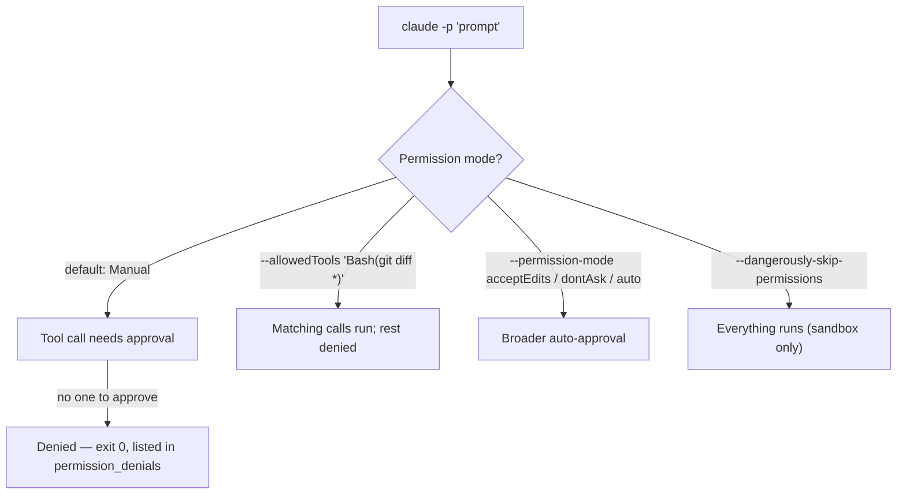

# Module 11.1: Headless Mode

> **Estimated time**: ~35 minutes
>
> **Prerequisite**: Module 2.2 (Permission System Deep Dive)
>
> **Outcome**: After this module, you will run `claude -p` in scripts with explicit permissions,
> get machine-readable results with `--output-format json` and `--json-schema`, stream events, and
> authenticate CI with `claude setup-token` or an API key.

---

## 1. WHY — Why This Matters

Your CI job runs `claude -p "fix the lint errors"` on every push. It finishes in a few seconds,
exits `0`, and the pipeline goes green — but `git diff` is empty. Nothing got fixed. In an
interactive terminal, Claude would have shown a permission prompt and waited for a click. In a
script, there is no one to click "Yes." The `-p` run declined the edit, reported success anyway,
and CI trusted it. Headless mode is not "interactive minus the UI" — it is a different contract,
and you have to pre-authorize what you want done before you run it.

---

## 2. CONCEPT — Non-Authorize Or Denied

**Non-interactive = pre-authorize or denied.** For `-p`, the built-in starting permission mode is
Manual on every plan, so you must pass the permission mode you want — nobody is at the keyboard to
approve a prompt, so anything that would prompt gets denied and the run can still exit `0`. From
Claude Code v2.1.259, `--output-format stream-json` reports every denial as a `permission_denied`
system message, and the final `result` message lists them all under `permission_denials` — the
only reliable way to tell "approved" apart from "silently skipped."



Pre-authorize on a ladder, narrowest first: `--allowedTools` with a scoped pattern such as
`"Bash(git diff *)"` (the space before `*` matters — `Bash(git diff*)` would also match
`git diff-index`); `--permission-mode acceptEdits|dontAsk|auto` for broader auto-approval; then
`--dangerously-skip-permissions`, only inside a sandbox/container you can throw away.

Output comes in three shapes. `text` (default) prints the final answer. `--output-format json`
wraps it with `result`, `session_id`, `total_cost_usd`, and a per-model cost breakdown, so a script
can `jq` a field instead of parsing prose. Add `--json-schema '<schema>'` and the same JSON payload
gains a validated `structured_output` field; an invalid schema fails fast with
`Error: --json-schema is not a valid JSON Schema`. `--output-format stream-json` (with `--verbose`,
optionally `--include-partial-messages`) prints one JSON object per line — `system` (subtype
`init` first), `assistant`, `user`, `stream_event`, ending in `result` — for real-time pipelines.

`--bare` skips hooks, skills, custom commands, subagents, plugins, MCP servers, auto memory, and
CLAUDE.md — "the recommended mode for scripted and SDK calls," and it will become the `-p` default
in a future release. It never reads `CLAUDE_CODE_OAUTH_TOKEN`, so a bare script needs
`ANTHROPIC_API_KEY` or an `apiKeyHelper`. Bound a run with `--max-turns`, `--max-budget-usd`, or
`--no-session-persistence`; reopen a prior `-p` run with `--continue`/`--resume`. Piped stdin is
capped at 10MB.

For CI auth: `claude setup-token` mints a one-year OAuth token tied to the creator's Pro/Max/Team/
Enterprise subscription — fine for your own script, fragile for a shared pipeline (it breaks if
that person leaves). An `ANTHROPIC_API_KEY` from the Console belongs to the org, not a person, so
it is the safer default for CI.

---

## 3. DEMO — Step by Step

**Step 1: Manual mode denies silently**
```bash
# docs: headless
claude -p "Add a subtract function to src/math.js"
git diff
```
Expected output:
```text
# Output may vary
I didn't add `subtract`. Permission to write to `src/math.js` and `tests/math.test.mjs` was
declined, so neither file was changed.

These are the changes I would make:
...
If you grant write access, I'll make these edits and run `npm test` to check them.
```
`git diff` prints nothing — the run exited `0` but changed no files.

**Step 2: pre-authorize with `--allowedTools`**
```bash
# docs: headless
claude -p "Add a subtract function to src/math.js" --allowedTools "Read,Edit"
git diff --stat
```
Expected output:
```text
# Output may vary
I added `subtract(a, b)` to `src/math.js:2` ... both tests pass when I run `npm test`.

 src/math.js         | 1 +
 tests/math.test.mjs | 1 +
 2 files changed, 2 insertions(+)
```
Reset (`git checkout -- .`) before the next step.

**Step 3: structured `json` output**
```bash
# docs: headless
claude -p "List exported functions in src/math.js" --output-format json | \
  jq '{result, session_id, total_cost_usd}'
```
Expected output:
```text
# Output may vary
{
  "result": "`src/math.js` exports two functions:\n\n- `add(a, b)` ...",
  "session_id": "fc02c4ee-1247-42da-aaa8-32f46f6fc81f",
  "total_cost_usd": 0.2626594
}
```

**Step 4: validated output with `--json-schema`**
```bash
# docs: headless
claude -p "List exported functions in src/math.js" --output-format json \
  --json-schema '{"type":"object","properties":{"functions":{"type":"array","items":{"type":"string"}}},"required":["functions"]}' | \
  jq .structured_output
```
Expected output:
```text
# Output may vary
{
  "functions": ["add", "divide"]
}
```

**Step 5: `stream-json` events**
```bash
# docs: headless
claude -p "List exported functions in src/math.js" --output-format stream-json --verbose | \
  jq -c 'select(.type) | {type, subtype}' | head
```
Expected output:
```text
# Output may vary
…                                    # your own SessionStart/Setup hooks, if any, stream first
{"type":"system","subtype":"init"}
{"type":"assistant","subtype":null}
{"type":"user","subtype":null}
{"type":"assistant","subtype":null}
{"type":"result","subtype":"success"}
```

**Step 6: fan out, 2 files first**
```bash
# docs: headless
for f in src/*.js; do
  claude -p "Add JSDoc to $f" --allowedTools "Read,Edit,Write" --max-turns 5
done
git diff --stat
```
Expected output:
```text
# Output may vary
I added JSDoc comments to both functions in `src/math.js` ...
I added a JSDoc block to `capitalize` in `src/string.js` ...

 src/math.js   | 14 ++++++++++++++
 src/string.js |  9 +++++++++
 2 files changed, 23 insertions(+)
```
Try on 2-3 files, then scale to the rest of `src/*.js` — the same "check before you widen the
blast radius" habit as any other fan-out (S1). Reset the lab after this step.

**Step 7: `--bare` never reads the OAuth token**
```bash
# docs: headless, authentication
ANTHROPIC_API_KEY="sk-ant-FAKE-DO-NOT-USE" claude -p "List exported functions in src/math.js" --bare
```
Expected output:
```text
# Output may vary
Failed to authenticate. API Error: 401 API key is invalid.
```
`CLAUDE_CODE_OAUTH_TOKEN` from `claude setup-token` was set in the shell too, and `--bare` still
ignored it and tried the (fake) API key instead — proving the "bare mode doesn't read the OAuth
token" claim.

`Tested with:` Claude Code v2.1.283, macOS, 2026-09-27, in `~/cc-lab`.

---

## 4. PRACTICE — Try It Yourself

### Exercise 1: Read-only pre-commit review

**Goal**: Block a commit when Claude's structured review flags it, without letting the review
touch any file.

**Instructions**:
1. Write a script that runs `claude -p` on `git diff --cached` with only `--allowedTools "Bash(git diff *)"`.
2. Ask for `--json-schema '{"type":"object","properties":{"blocking":{"type":"boolean"},"summary":{"type":"string"}},"required":["blocking","summary"]}'`.
3. `exit 1` when `jq -e '.structured_output.blocking' file.json` is `true`.

**Expected result**: staged changes with an obvious bug make the script exit non-zero; clean
changes exit `0`.

<details>
<summary>💡 Hint</summary>
`--allowedTools "Bash(git diff *)"` only allows Claude to read the diff — it cannot edit anything,
so this is safe to run on every commit.
</details>

<details>
<summary>✅ Solution</summary>

```bash
#!/bin/bash
out=$(claude -p "Review the staged diff (git diff --cached) for bugs or security issues" \
  --allowedTools "Bash(git diff *)" \
  --output-format json \
  --json-schema '{"type":"object","properties":{"blocking":{"type":"boolean"},"summary":{"type":"string"}},"required":["blocking","summary"]}')
blocking=$(echo "$out" | jq -r '.structured_output.blocking')
if [ "$blocking" = "true" ]; then
  echo "$out" | jq -r '.structured_output.summary'
  exit 1
fi
exit 0
```
</details>

### Exercise 2: Continue a session by ID

**Goal**: Ask a follow-up question in the same conversation a script already ran.

**Instructions**:
1. Run a `-p` call with `--output-format json` and capture `session_id` from the result.
2. Pass it back with `--resume "$session_id"` on a second `-p` call.

**Expected result**: the second call answers using context from the first.

<details>
<summary>✅ Solution</summary>

```bash
sid=$(claude -p "Remember the number 42" --output-format json | jq -r '.session_id')
claude -p "What number did I ask you to remember?" --resume "$sid" --output-format json | jq -r '.result'
# Output: You asked me to remember 42.
```
</details>

### Exercise 3: Cap cost and turns

**Goal**: Run an open-ended refactor prompt without risking a runaway bill.

**Instructions**:
1. Add `--max-budget-usd 0.50` and `--max-turns 3` to a `-p` call that edits files.
2. Observe the run stop with an error once either limit is hit.

<details>
<summary>✅ Solution</summary>

```bash
claude -p "Refactor src/math.js for readability" \
  --allowedTools "Read,Edit" --max-budget-usd 0.50 --max-turns 3
```
</details>

---

## 5. CHEAT SHEET

| Flag | Purpose | Needs permission? |
|---|---|---|
| `-p "prompt"` | Run non-interactively | starts in Manual mode |
| `--allowedTools "Bash(git diff *)"` | Pre-authorize scoped tool calls | narrows what still prompts |
| `--permission-mode acceptEdits\|dontAsk\|auto` | Broader auto-approval | replaces Manual for the run |
| `--dangerously-skip-permissions` | Skip prompts entirely | sandbox/container only |
| `--output-format text\|json\|stream-json` | Choose result shape | no |
| `--json-schema '<schema>'` | Validate output into `structured_output` | no |
| `--verbose --include-partial-messages` | Token-level `stream-json` events | no |
| `--bare` | Skip hooks/skills/MCP/CLAUDE.md; needs `ANTHROPIC_API_KEY` | no (drops OAuth token) |
| `--max-turns N` / `--max-budget-usd N` | Bound a run | no |
| `--no-session-persistence` | Don't save the session | no |
| `--continue` / `--resume "$id"` | Reopen a prior `-p` session | no |
| `--system-prompt` / `--append-system-prompt` | Replace / extend the system prompt | no |
| `--tools "Bash,Edit,Read"` | Restrict which tools even exist | no |
| `--strict-mcp-config` | Only use `--mcp-config` servers | no |
| `--setting-sources user,project,local` | Choose which settings files load | no |

**`--output-format json` fields**: `result` (text), `session_id`, `total_cost_usd`,
`structured_output` (with `--json-schema`), `permission_denials` (array, v2.1.259+).

**`stream-json` event types**: `system` (`init` first), `assistant`, `user`, `stream_event`
(partial deltas), `result` (last line: final text, cost, session metadata).

**CI auth**: `claude setup-token` → one-year OAuth token, tied to the creator's subscription
(Pro/Max/Team/Enterprise) → env var `CLAUDE_CODE_OAUTH_TOKEN`. `ANTHROPIC_API_KEY` (Console) → not
tied to a person, works with `--bare`, recommended for org CI.

---

## 6. PITFALLS — Common Mistakes

| ❌ Mistake | ✅ Correct Approach |
|---|---|
| `claude -p "fix lint"` on CI with no permission flag | Add `--allowedTools` or `--permission-mode` — Manual denies silently and still exits `0` |
| `Bash(git diff*)` to allow `git diff` | Write `Bash(git diff *)` — the space matters, or it also matches `git diff-index` |
| Parsing `result` text with regex to extract data | Use `--json-schema` and read `structured_output` |
| `--bare` combined with `CLAUDE_CODE_OAUTH_TOKEN` | Bare mode never reads it — set `ANTHROPIC_API_KEY` instead |
| Running `-p` in a repo you have not reviewed | A `-p` session runs that repo's `.claude/settings.json` hooks and `.mcp.json` servers with no trust dialog — use `--bare` or read `.claude/` first |
| Sharing one person's `claude setup-token` as the org's CI secret | Use an `ANTHROPIC_API_KEY` from the Console instead — it is not tied to one subscription |

---

## 7. REAL CASE — Production Story

A Vietnamese platform team generates their nightly changelog from `git log` with
`claude -p --json-schema`, run by GitHub Actions. Auth is a workspace-scoped
`ANTHROPIC_API_KEY` (not one engineer's `claude setup-token`), so the job survives team changes.
`--max-budget-usd 1` caps the run, and the schema forces a `{version, sections}` shape the
release script consumes directly — no prose-parsing, no surprise diffs, no "who's OAuth token is
this."

---

> **Next**: [Module 11.2: Claude Agent SDK](../02-claude-agent-sdk/) →
