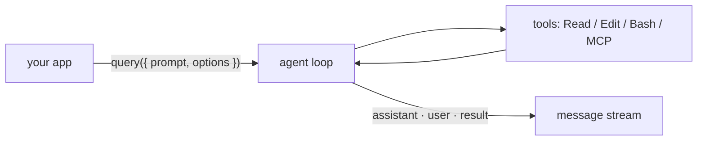

# Module 11.2: Claude Agent SDK

> **Estimated time**: ~40 minutes
>
> **Prerequisite**: Module 11.1 (Headless Mode)
>
> **Outcome**: After this module, you will be able to run an agent from TypeScript or Python with
> `query()`, restrict tools/permissions, add an in-process MCP tool, and fall back to
> `claude -p --output-format json` safely.

---

## 1. WHY — Why This Matters

`claude -p` from a shell script is fine for one-shot jobs (Module 11.1). It stops working when
you need a multi-turn loop inside a service, a tool of your own that Claude can call, a hook that
runs *in your code*, or typed messages instead of parsed stdout. That is the **Claude Agent SDK**:
the same engine as Claude Code, embedded in your process.

Two naming traps. In September 2025 the "Claude Code SDK" became the **Claude Agent SDK**; the
packages `@anthropic-ai/claude-code` and `claude-code-sdk` are retired. And it is not
**Managed Agents**: with the SDK *you* run the process; Managed Agents run the loop in an
Anthropic-hosted sandbox, configured through the Claude API.

---

## 2. CONCEPT — Core Ideas

An agent runs one loop: **gather context → take action → verify work → repeat** (S7). `query()`
starts that loop for one prompt and streams every message back. The SDK launches a bundled Claude
Code binary, so you get Claude Code's tools, permission rules, CLAUDE.md and settings (via
`settingSources`), hooks and subagents — no shell in between.



Options used here (TypeScript names; Python: `snake_case`):

| Option | Type | What it does |
|---|---|---|
| `allowedTools` | `string[]` | Auto-approve listed tools; others stay visible and fall through to `permissionMode`. Scoped rules like `Bash(git diff *)` work. |
| `permissionMode` | `'default' \| 'acceptEdits' \| 'plan' \| 'dontAsk' \| 'bypassPermissions' \| 'auto'` | Baseline for unresolved calls. `dontAsk` denies; `bypassPermissions` approves the rest (critical-path `rm` and ask rules still prompt). |
| `systemPrompt` | `string \| { type: 'preset', preset: 'claude_code', append?: string }` | Default is minimal, *not* Claude Code's prompt; use the preset. |
| `mcpServers` | `Record<string, McpServerConfig>` | External or in-process servers; key → `mcp__<key>__<tool>`. |
| `hooks` | `Partial<Record<HookEvent, HookCallbackMatcher[]>>` | `PreToolUse`, `PostToolUse`, `Stop`… (Module 11.3). |
| `agents` | `Record<string, AgentDefinition>` | Subagents defined in code. |
| `settingSources` | `('user' \| 'project' \| 'local')[]` | Settings files to load. Omitted = all (like the CLI); `[]` = none (policy, `~/.claude.json`, auto memory still load). |
| `maxTurns` | `number` | Cap on tool-use round trips. No default. |
| `outputFormat` | `{ type: 'json_schema', schema }` | Validated JSON in `result.structured_output`. |

Permission order is fixed: hooks → deny rules → ask rules → mode → allow rules → `canUseTool`.
Read-only calls (file reads inside `cwd`, read-only Bash) need no rule.

---

## 3. DEMO — Step by Step

Lab: `~/cc-lab` from Module 11.1. Scripts live in `~/cc-lab/sdk-demo/`, run from `~/cc-lab` so
`cwd` is the repo. Versions: `@anthropic-ai/claude-agent-sdk@0.3.278`, `claude-agent-sdk==0.2.157`,
Node 22.

**Step 1: Install the SDK**

```bash
# docs: agent-sdk/quickstart
mkdir -p ~/cc-lab/sdk-demo && cd ~/cc-lab/sdk-demo
npm init -y && npm pkg set type=module
npm install @anthropic-ai/claude-agent-sdk zod
```

```text
# Output may vary
added 103 packages, and audited 104 packages in 3s
found 0 vulnerabilities
```

The package bundles a Claude Code binary. Set `ANTHROPIC_API_KEY` in the process environment —
the SDK does not read `.env` files.

**Step 2: Minimal `query()`, read-only**

```javascript
// sdk-demo/list-exports.mjs   docs: agent-sdk/typescript
import { query } from '@anthropic-ai/claude-agent-sdk';

for await (const message of query({
  prompt: 'List the exported functions in src/math.js',
  options: {
    allowedTools: ['Read', 'Glob'],   // auto-approve read-only tools
    permissionMode: 'default',        // everything else would need approval
    maxTurns: 3,                      // hard stop: never loop forever
  },
})) {
  if (message.type === 'assistant') {
    for (const block of message.message.content) {
      if (block.type === 'tool_use') console.log(`[tool] ${block.name}`, block.input);
    }
  } else if (message.type === 'result' && message.subtype === 'success') {
    console.log(`[${message.subtype}] turns=${message.num_turns} cost=$${message.total_cost_usd.toFixed(4)}`);
    console.log(message.result);          // only the success subtype carries result
  }
}
```

```text
# Output may vary
$ cd ~/cc-lab && node sdk-demo/list-exports.mjs
[tool] Grep { pattern: '^(export|module\\.exports|exports\\.)', path: '/Users/luatnq/cc-lab/src/math.js', output_mode: 'content' }
[success] turns=2 cost=$0.0965
`src/math.js` exports two functions:

- `add(a, b)` — returns `a + b`
- `divide(a, b)` — returns `a / b`
```

Claude used `Grep`, not in `allowedTools` — read-only calls need no approval. And $0.10 for a
two-line file? Without `settingSources` the SDK loaded this machine's `~/.claude` (user
settings, CLAUDE.md, skills). With `settingSources: []` the same script cost `$0.0567`; numbers
move with prompt caching, the gap holds. Every script below sets it.

**Step 3: Editing with `acceptEdits`**

```javascript
// sdk-demo/add-function.mjs   docs: agent-sdk/permissions
import { query } from '@anthropic-ai/claude-agent-sdk';

for await (const message of query({
  prompt: 'Add an exported multiply(a, b) function to src/math.js. Do not touch other files.',
  options: {
    allowedTools: ['Read', 'Edit'],
    permissionMode: 'acceptEdits',    // Edit/Write inside cwd auto-approved
    maxTurns: 5,
    settingSources: [],               // ignore this machine's ~/.claude and .claude/
  },
})) {
  if (message.type === 'assistant') {
    for (const block of message.message.content) {
      if (block.type === 'tool_use') console.log(`[tool] ${block.name}`, block.input.file_path ?? '');
    }
  } else if (message.type === 'result' && message.subtype === 'success') {
    console.log(`[${message.subtype}] turns=${message.num_turns} cost=$${message.total_cost_usd.toFixed(4)}`);
    console.log(message.result);          // only the success subtype carries result
  }
}
```

```text
# Output may vary
$ node sdk-demo/add-function.mjs && git diff src/math.js
[tool] Read /Users/luatnq/cc-lab/src/math.js
[tool] Edit /Users/luatnq/cc-lab/src/math.js
[success] turns=3 cost=$0.0347
Added `export function multiply(a, b) { return a * b; }` to `src/math.js`, matching the existing one-line style of `add` and `divide`. No other files were changed.
diff --git a/src/math.js b/src/math.js
@@ -1,2 +1,3 @@
 export function add(a, b) { return a + b; }
 export function divide(a, b) { return a / b; }
+export function multiply(a, b) { return a * b; }
```

Undo with `git checkout src/math.js`.

**Step 4: An in-process tool with `tool()` + `createSdkMcpServer()`**

```javascript
// sdk-demo/build-status.mjs   docs: agent-sdk/custom-tools
import { query, tool, createSdkMcpServer } from '@anthropic-ai/claude-agent-sdk';
import { z } from 'zod';

// Describe the tool the way you would brief a new hire: what it returns, when to use it.
const getBuildStatus = tool(
  'get_build_status',
  'Return the latest CI build status for a git branch of this repo. Use it before answering any question about whether a branch is green.',
  { branch: z.string().describe('Branch name, e.g. main') },
  async ({ branch }) => ({
    content: [{ type: 'text', text: JSON.stringify({ branch, status: 'failed', failing_job: 'unit-tests', build: 1842 }) }],
  }),
  { annotations: { readOnlyHint: true } },
);

const ci = createSdkMcpServer({ name: 'ci', version: '1.0.0', tools: [getBuildStatus] });

for await (const message of query({
  prompt: 'Is the main branch build green? Answer in one sentence.',
  options: {
    mcpServers: { ci },                            // key "ci" → tool name mcp__ci__get_build_status
    allowedTools: ['mcp__ci__get_build_status'],
    permissionMode: 'default',
    maxTurns: 3,
    settingSources: [],
  },
})) {
  if (message.type === 'assistant') {
    for (const block of message.message.content) {
      if (block.type === 'tool_use') console.log(`[tool] ${block.name}`, block.input);
    }
  } else if (message.type === 'result' && message.subtype === 'success') {
    console.log(message.result);
  }
}
```

```text
# Output may vary
[tool] ToolSearch { query: 'select:mcp__ci__get_build_status', max_results: 1 }
[tool] mcp__ci__get_build_status { branch: 'main' }
No — the latest main build (#1842) is failing on the `unit-tests` job.
```

The handler runs inside your Node process. `ToolSearch` is tool search (default on) loading the
deferred schema.

**Step 5: Python equivalent**

```bash
# docs: agent-sdk/python
cd ~/cc-lab/sdk-demo && python3 -m venv .venv && .venv/bin/pip install claude-agent-sdk
```

```python
# sdk-demo/list_exports.py
import asyncio
from claude_agent_sdk import query, ClaudeAgentOptions, AssistantMessage, ResultMessage, ToolUseBlock


async def main():
    options = ClaudeAgentOptions(
        allowed_tools=["Read", "Glob"],
        permission_mode="default",
        max_turns=3,
        setting_sources=[],
    )
    async for message in query(prompt="List the exported functions in src/math.js", options=options):
        if isinstance(message, AssistantMessage):
            for block in message.content:
                if isinstance(block, ToolUseBlock):
                    print(f"[tool] {block.name} {block.input}")
        elif isinstance(message, ResultMessage) and message.subtype == "success":
            print(f"[{message.subtype}] turns={message.num_turns} cost=${message.total_cost_usd or 0:.4f}")
            print(message.result)


asyncio.run(main())
```

```text
# Output may vary
$ cd ~/cc-lab && sdk-demo/.venv/bin/python sdk-demo/list_exports.py
[tool] Grep {'pattern': '^(export|module\\.exports|exports\\.)', 'path': '/Users/luatnq/cc-lab/src/math.js', 'output_mode': 'content'}
[success] turns=2 cost=$0.0533
`src/math.js` exports two functions:

- `add(a, b)` — returns `a + b`
- `divide(a, b)` — returns `a / b`
```

**Step 6: Safe subprocess fallback**

Other languages: run the CLI as a subprocess. Two rules: arguments as an **array** (never a
shell string), and `--output-format json` plus `--json-schema`.

```javascript
// sdk-demo/subprocess-fallback.mjs   docs: headless, cli-reference
import { execFileSync } from 'node:child_process';

const prompt = process.argv[2] ?? 'List the exported functions in src/math.js';
const schema = JSON.stringify({
  type: 'object',
  properties: { functions: { type: 'array', items: { type: 'string' } } },
  required: ['functions'],
});

// Arguments go in an array: the prompt is never interpolated into a shell string.
const stdout = execFileSync('claude', [
  '-p', prompt,
  '--output-format', 'json',
  '--json-schema', schema,
  '--allowedTools', 'Read',
  '--permission-mode', 'default',
  '--max-turns', '3',
], { encoding: 'utf8', timeout: 120_000, maxBuffer: 10 * 1024 * 1024 });

const data = JSON.parse(stdout);             // safe: --output-format json is always JSON
console.log(data.structured_output);          // validated against the schema
console.log(`cost=$${data.total_cost_usd.toFixed(4)} session=${data.session_id}`);
```

```text
# Output may vary
$ node sdk-demo/subprocess-fallback.mjs 'List the exported functions in src/math.js; the file has "quotes" and $(dollar) in this prompt on purpose'
{ functions: [ 'add', 'divide' ] }
cost=$0.4687 session=324de8c2-c77b-4446-86f7-cf4746d2a0aa
```

The quotes and `$(dollar)` reached Claude as text; interpolated into a shell command string, they
would have run in your shell. `--permission-mode default` forces the stock behavior; on a fresh
install you get the same result without it unless `settings.json` sets `permissions.defaultMode`.

---

## 4. PRACTICE — Try It Yourself

### Exercise 1: Diff reviewer with a scoped Bash rule

**Goal**: Review `git diff main` from the SDK without granting general shell access.

**Instructions**:
1. In `~/cc-lab`, branch off and add a buggy `average(xs)` to `src/math.js`; commit.
2. Write `sdk-demo/review-diff.mjs` with `allowedTools: ['Read', 'Bash(git diff *)']` and
   `permissionMode: 'dontAsk'`.
3. Print each tool call and `result.permission_denials.length`.

**Expected result**: one `Bash git diff …` call, `denied=0`, a list that catches `average([])` →
`NaN`.

<details>
<summary>💡 Hint</summary>

The space before `*` in `Bash(git diff *)` matters. `dontAsk` turns any other prompt-worthy call
into a denial listed in `permission_denials` instead of a prompt nobody answers.

</details>

<details>
<summary>✅ Solution</summary>

```javascript
// sdk-demo/review-diff.mjs   docs: agent-sdk/permissions
import { query } from '@anthropic-ai/claude-agent-sdk';

const base = process.argv[2] ?? 'main';

for await (const message of query({
  prompt: `Run "git diff ${base}" and review the changes. Report bugs and edge cases as a bullet list. Do not edit files.`,
  options: {
    allowedTools: ['Read', 'Bash(git diff *)'],   // git diff yes; any other Bash falls through
    permissionMode: 'dontAsk',                     // ...and "falls through" means denied
    maxTurns: 5,
    settingSources: [],
  },
})) {
  if (message.type === 'assistant') {
    for (const block of message.message.content) {
      if (block.type === 'tool_use') console.log(`[tool] ${block.name}`, block.input.command ?? block.input.file_path ?? '');
    }
  } else if (message.type === 'result') {
    console.log(`[${message.subtype}] denied=${message.permission_denials.length}`);
    if (message.subtype === 'success') console.log(message.result);
  }
}
```

```text
# Output may vary
[tool] Bash git diff main --stat && git diff main
[success] denied=0
Reviewed the diff against `main` — two new functions in `src/math.js`:

**`average(xs)`**
- **Empty array returns `NaN`**: `[].reduce(..., 0) / 0` → `0 / 0` → `NaN`. Callers likely expect a thrown error or a defined sentinel, not a silent `NaN` that propagates.
- **No input validation**: `average(null)` / `average(undefined)` throws `TypeError` on `.reduce`; …
- **Sparse arrays**: `reduce` skips holes but `.length` counts them, so `average([1, , 3])` → `4 / 3`, not `2`.
…
```

</details>

### Exercise 2: Retry + bounded concurrency on `query()`

**Goal**: Process N files, 2 sessions at a time, 3 attempts with backoff.

**Instructions**:
1. `runOnce(prompt)` runs one `query()` and throws unless `result.subtype === 'success'`.
2. `withRetry(prompt, retries = 3)` with 1s, then 2s backoff.
3. Chunk prompts with `Promise.all`; print a summary.

**Expected result**: `Summary: 3 succeeded, 0 failed`.

<details>
<summary>💡 Hint</summary>

`chunk.map(withRetry)` passes the array index as `retries`. Wrap it:
`chunk.map((p) => withRetry(p))`.

</details>

<details>
<summary>✅ Solution</summary>

```javascript
// sdk-demo/batch.mjs   docs: agent-sdk/typescript
import { query } from '@anthropic-ai/claude-agent-sdk';

const sleep = (ms) => new Promise((r) => setTimeout(r, ms));

async function runOnce(prompt) {
  let result;
  for await (const m of query({
    prompt,
    options: { allowedTools: ['Read', 'Glob'], permissionMode: 'dontAsk', maxTurns: 3, settingSources: [] },
  })) {
    if (m.type === 'result') result = m;
  }
  if (!result || result.subtype !== 'success') throw new Error(result?.subtype ?? 'no result');
  return result.result;
}

async function withRetry(prompt, retries = 3) {
  for (let attempt = 1; attempt <= retries; attempt++) {
    try {
      return { ok: true, attempts: attempt, output: await runOnce(prompt) };
    } catch (err) {
      console.error(`attempt ${attempt}/${retries} failed: ${err.message}`);
      if (attempt === retries) return { ok: false, attempts: attempt, error: err.message };
      await sleep(2 ** (attempt - 1) * 1000);   // 1s, then 2s
    }
  }
}

async function batch(prompts, concurrency = 2) {
  const results = [];
  for (let i = 0; i < prompts.length; i += concurrency) {
    const chunk = prompts.slice(i, i + concurrency);
    results.push(...(await Promise.all(chunk.map((p) => withRetry(p)))));
  }
  return results;
}

const files = process.argv.slice(2);
const results = await batch(files.map((f) => `In one sentence, what does ${f} do?`));
results.forEach((r, i) => console.log(r.ok ? `✅ ${files[i]} (${r.attempts} attempt) ${r.output}` : `❌ ${files[i]} ${r.error}`));
console.log(`Summary: ${results.filter((r) => r.ok).length} succeeded, ${results.filter((r) => !r.ok).length} failed`);
```

```text
# Output may vary
$ node sdk-demo/batch.mjs src/math.js tests/math.test.mjs package.json
✅ src/math.js (1 attempt) `src/math.js` exports four small arithmetic helpers — `add`, `subtract`, `divide`, and `average` …
✅ tests/math.test.mjs (1 attempt) It defines a single Node.js test … asserts that `add(1, 2)` equals `3`.
✅ package.json (1 attempt) `package.json` is the Node.js project manifest for `cc-lab` …
Summary: 3 succeeded, 0 failed
```

</details>

### Exercise 3: Structured output through the subprocess

**Goal**: Which functions in `src/math.js` can return `NaN`/`Infinity`? Get a typed list.

**Instructions**: copy Step 6, change the schema to `{ risky: [{ name, reason }] }`, and fail hard
if `is_error` or no `structured_output`.

<details>
<summary>✅ Solution</summary>

```javascript
// sdk-demo/risky-functions.mjs   docs: headless
import { execFileSync } from 'node:child_process';

const schema = JSON.stringify({
  type: 'object',
  properties: {
    risky: {
      type: 'array',
      items: {
        type: 'object',
        properties: { name: { type: 'string' }, reason: { type: 'string' } },
        required: ['name', 'reason'],
      },
    },
  },
  required: ['risky'],
});

const stdout = execFileSync('claude', [
  '-p', 'Which functions in src/math.js can return NaN or Infinity for some input? Explain each in one short sentence.',
  '--output-format', 'json',
  '--json-schema', schema,
  '--allowedTools', 'Read',
  '--permission-mode', 'default',
  '--max-turns', '3',
], { encoding: 'utf8', timeout: 120_000 });

const { structured_output, is_error, num_turns } = JSON.parse(stdout);
if (is_error || !structured_output) throw new Error('no structured output');
console.log(`turns=${num_turns}`);
for (const f of structured_output.risky) console.log(`- ${f.name}: ${f.reason}`);
```

```text
# Output may vary
turns=3
- divide: Dividing by 0 returns Infinity/-Infinity, and 0/0 returns NaN.
- average: An empty array computes 0 / 0, which is NaN.
- add: Only on overflow (MAX_VALUE + MAX_VALUE → Infinity) or non-finite inputs …
- subtract: Only on overflow (-MAX_VALUE - MAX_VALUE → -Infinity) or non-finite inputs …
```

</details>

---

## 5. CHEAT SHEET

| TypeScript | Python | Notes |
|---|---|---|
| `npm install @anthropic-ai/claude-agent-sdk` | `pip install claude-agent-sdk` | Old `@anthropic-ai/claude-code` / `claude-code-sdk` retired |
| `import { query } from '@anthropic-ai/claude-agent-sdk'` | `from claude_agent_sdk import query, ClaudeAgentOptions` | |
| `for await (const m of query({ prompt, options }))` | `async for m in query(prompt=…, options=…)` | |
| `m.type === 'assistant'` → `m.message.content` | `isinstance(m, AssistantMessage)` → `m.content` | `tool_use` / `ToolUseBlock` |
| `m.type === 'result'` → `subtype`, `result`, `num_turns`, `total_cost_usd`, `structured_output`, `permission_denials` | `isinstance(m, ResultMessage)` → same fields | `subtype`: `success`, `error_max_turns`, … |
| `tool(name, desc, zodShape, handler, { annotations })` | `@tool(name, desc, {"arg": type})` | Returns `{ content: [{ type: 'text', text }] }` |
| `createSdkMcpServer({ name, version, tools })` | `create_sdk_mcp_server(name=, version=, tools=)` | `mcpServers: { name: server }`; allow `mcp__name__tool` |
| `outputFormat: { type: 'json_schema', schema }` | `output_format={"type": "json_schema", "schema": …}` | Read `structured_output` |

Subprocess flags (`claude -p`): `--output-format json` (`result`, `session_id`, `total_cost_usd`,
`is_error`, `num_turns`), `--json-schema '<schema>'` → `structured_output`,
`--allowedTools "Read,Bash(git diff *)"`, `--permission-mode default|acceptEdits|dontAsk`,
`--max-turns N`, `--max-budget-usd N`. `--bare` skips hooks/plugins/CLAUDE.md discovery but
needs `ANTHROPIC_API_KEY`. Option table: §2.

---

## 6. PITFALLS — Common Mistakes

| ❌ Mistake | ✅ Correct Approach |
|---|---|
| ``execSync(`claude -p "${prompt}"`)`` — a prompt containing `"; rm -rf ~` runs in your shell | `execFileSync('claude', ['-p', prompt, …])` — argv array, no shell |
| `JSON.parse` on `--output-format text` | `--output-format json`, plus `--json-schema` when the shape matters |
| `permissionMode: 'bypassPermissions'` in a server — `allowedTools` does not constrain it | Narrow `allowedTools` + `dontAsk` (or `acceptEdits`), inside a sandbox |
| No `maxTurns` — a confused agent loops until the budget is gone | `maxTurns` on every `query()`; `maxBudgetUsd` for money |
| Hard-coded dated model ID | Aliases: `'sonnet'`, `'opus'`, `'haiku'` |
| Expecting Claude Code's system prompt by default — or CLAUDE.md after `settingSources: []` | `systemPrompt: { type: 'preset', preset: 'claude_code' }`; put `'project'` back in `settingSources` |
| Mixing up the Agent SDK and the Client SDK / Messages API (Module 12.3) | Client SDK: you write the tool loop. Agent SDK: loop, tools, permissions built in |

---

## 7. REAL CASE — Production Story

**Scenario**: A fintech team in Ho Chi Minh City runs an internal PR-review service: every Kotlin
backend pull request gets an automated first pass before a human reviewer.

**Problem**: Version one was a Node script that interpolated the prompt into a shell command
string and ran `JSON.parse` on stdout. PR titles with quotes broke the command; one malformed
answer took the pipeline down. Reviewers stopped trusting it.

**Solution**: Rebuilt on the Agent SDK: `query()` per PR, `allowedTools: ['Read', 'Grep',
'Bash(git diff *)']`, `permissionMode: 'dontAsk'`, `maxTurns: 8`, `settingSources: ['project']` so
the repo's CLAUDE.md and `.claude/` load but the runner's `~/.claude` settings do not
(`~/.claude.json` and auto memory still load; not a multi-tenant isolation boundary).
Findings come back through `outputFormat` as JSON the GitHub bot posts. Two in-process tools,
`get_ci_status` and `get_ticket`, replaced prompt text; the team kept tools few and described each
as if onboarding a new hire (S9). As in Anthropic's C-compiler write-up,
tools write the full CI log to a file and return only the failing lines in context (S14).

**Result**: No shell-injection surface, schema-validated output, per-PR cost in `total_cost_usd`.
No published accuracy numbers; reviewers read the bot's comments again.

---

> **Next**: [Module 11.3: Hooks System](../03-hooks-system/) →
