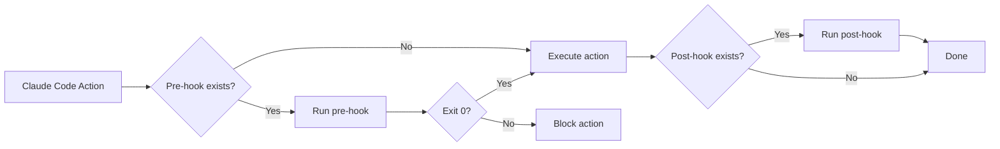

# Module 11.3: Hooks System

> **Estimated time**: ~30 minutes
>
> **Prerequisite**: Module 11.2 (SDK Integration)
>
> **Outcome**: After this module, you will understand the hooks concept, know common hook patterns, and be able to implement custom hooks for your workflows.

---

## 1. WHY — Why This Matters

Claude Code writes files, runs commands, makes changes. You want to log every file change for compliance. You want to run linting before any file is saved. You want to get a Slack message when a big task finishes. You want to block any changes to production config files. Without hooks, you'd have to manually intercept or post-process everything. Hooks give you automatic interception points — your code runs at exactly the right moment, every time.

---

## 2. CONCEPT — Core Ideas

### What Are Hooks?

**Hooks** are custom scripts or commands that run automatically at specific events during Claude Code's execution. Think of them as middleware, similar to Git hooks, React lifecycle methods, or Express.js middleware — your code intercepts the normal flow.

Two types:
- **Pre-hooks**: Run BEFORE an action. Can block the action by exiting with non-zero code.
- **Post-hooks**: Run AFTER an action. Used for logging, notifications, cleanup.

### Hook Events ⚠️ Needs verification

| Event | When | Use Case |
|-------|------|----------|
| `pre-file-write` | Before writing file | Lint check, validation, backup |
| `post-file-write` | After writing file | Logging, notification, sync |
| `pre-command` | Before running shell command | Safety validation, dry-run |
| `post-command` | After command completes | Log result, alert on failure |
| `pre-session` | Session starts | Environment setup, validation |
| `post-session` | Session ends | Cleanup, summary report, notification |

### Hook Configuration ⚠️ Needs verification

Hooks are defined in `.claude/hooks.json` (or similar config file):

```json
{
  "hooks": {
    "pre-file-write": "./hooks/lint-check.sh",
    "post-file-write": "./hooks/log-change.sh",
    "post-session": "./hooks/notify-complete.sh"
  }
}
```

### Hook Script Interface

Your hook script receives context:
- **Arguments**: File path, action type, etc.
- **Environment variables**: `CLAUDE_FILE_PATH`, `CLAUDE_ACTION`, `CLAUDE_SESSION_ID`
- **stdin**: Sometimes JSON payload with full context

**Exit codes**:
- Exit `0` = Success (allow action for pre-hooks)
- Exit `1` = Failure (block action for pre-hooks)
- Post-hooks typically don't block, but non-zero indicates error



---

## 3. DEMO — Step by Step

**Scenario**: Set up hooks for a team workflow that logs all changes, validates linting, and sends Slack notifications on completion.

**Step 1: Create hooks directory**
```bash
mkdir -p .claude/hooks
```
Expected output:
```
# Directory created (no output if successful)
```
Why: Centralized location for all hook scripts.

**Step 2: Create logging hook (post-file-write)**
```bash
cat > .claude/hooks/log-change.sh << 'EOF'
#!/bin/bash
# Post-file-write hook: Log every file change

LOGFILE=".claude/changes.log"
TIMESTAMP=$(date '+%Y-%m-%d %H:%M:%S')
FILE_PATH="${1:-unknown}"

echo "[$TIMESTAMP] WRITE: $FILE_PATH" >> "$LOGFILE"
echo "Change logged: $FILE_PATH"
exit 0
EOF

chmod +x .claude/hooks/log-change.sh
```
Expected output:
```
# Script created and made executable
```
Why: Immutable audit trail of every file Claude Code touches.

**Step 3: Create lint check hook (pre-file-write)**
```bash
cat > .claude/hooks/lint-check.sh << 'EOF'
#!/bin/bash
# Pre-file-write hook: Block if lint fails

FILE_PATH="$1"

# Only check JS/TS files
if [[ "$FILE_PATH" =~ \.(js|ts|jsx|tsx)$ ]]; then
  echo "Running lint check on $FILE_PATH..."
  npx eslint "$FILE_PATH" --quiet

  if [ $? -ne 0 ]; then
    echo "❌ BLOCKED: Lint errors in $FILE_PATH"
    exit 1  # Block the write
  fi

  echo "✅ Lint passed for $FILE_PATH"
fi

exit 0  # Allow write
EOF

chmod +x .claude/hooks/lint-check.sh
```
Expected output:
```
# Script created and made executable
```
Why: Prevents Claude Code from writing code that violates your style rules.

**Step 4: Create notification hook (post-session)**
```bash
cat > .claude/hooks/notify-complete.sh << 'EOF'
#!/bin/bash
# Post-session hook: Send Slack notification

SLACK_WEBHOOK="${SLACK_WEBHOOK_URL}"  # Set this in environment
SESSION_SUMMARY="${1:-No summary provided}"

if [ -n "$SLACK_WEBHOOK" ]; then
  curl -X POST "$SLACK_WEBHOOK" \
    -H 'Content-Type: application/json' \
    -d "{\"text\":\"🤖 Claude Code session complete: $SESSION_SUMMARY\"}"
fi

exit 0
EOF

chmod +x .claude/hooks/notify-complete.sh
```
Expected output:
```
# Script created and made executable
```
Why: Team visibility — everyone knows when AI-assisted work completes.

**Step 5: Configure hooks** ⚠️ Needs verification
```bash
cat > .claude/hooks.json << 'EOF'
{
  "hooks": {
    "pre-file-write": ".claude/hooks/lint-check.sh",
    "post-file-write": ".claude/hooks/log-change.sh",
    "post-session": ".claude/hooks/notify-complete.sh"
  }
}
EOF
```
Expected output:
```
# Configuration file created
```

**Step 6: Test the hooks**

Simulate a file write that passes lint:
```bash
# Assuming Claude Code writes to src/utils.ts with valid code
# Expected hook output:
Running lint check on src/utils.ts...
✅ Lint passed for src/utils.ts
[2026-02-04 10:30:15] WRITE: src/utils.ts
Change logged: src/utils.ts
```

Simulate a file write that fails lint:
```bash
# Assuming Claude Code tries to write to src/bad.ts with lint errors
# Expected hook output:
Running lint check on src/bad.ts...
❌ BLOCKED: Lint errors in src/bad.ts
# File write is prevented
```

---

## 4. PRACTICE — Try It Yourself

### Exercise 1: Audit Log Hook
**Goal**: Create a comprehensive audit log with timestamp, file path, and action type (write/delete).

**Instructions**:
1. Create `.claude/hooks/audit.sh` that logs JSON format to `.claude/audit.log`
2. Include: ISO timestamp, file path, action, user (from `$USER` env)
3. Make it executable
4. Configure as `post-file-write` hook

**Expected result**: Every file write produces a JSON line like:
```json
{"timestamp":"2026-02-04T10:30:15Z","action":"write","file":"src/app.ts","user":"ethan"}
```

<details>
<summary>💡 Hint</summary>
Use `date -u +%Y-%m-%dT%H:%M:%SZ` for ISO timestamp. Use `jq` or simple echo with JSON format. Append with `>>` to preserve log history.
</details>

<details>
<summary>✅ Solution</summary>

```bash
cat > .claude/hooks/audit.sh << 'EOF'
#!/bin/bash

LOGFILE=".claude/audit.log"
TIMESTAMP=$(date -u +%Y-%m-%dT%H:%M:%SZ)
FILE_PATH="${1:-unknown}"
ACTION="${2:-write}"
USER="${USER:-unknown}"

# Write JSON line
echo "{\"timestamp\":\"$TIMESTAMP\",\"action\":\"$ACTION\",\"file\":\"$FILE_PATH\",\"user\":\"$USER\"}" >> "$LOGFILE"

exit 0
EOF

chmod +x .claude/hooks/audit.sh
```

Configure in `.claude/hooks.json`:
```json
{
  "hooks": {
    "post-file-write": ".claude/hooks/audit.sh"
  }
}
```
</details>

### Exercise 2: Protection Hook
**Goal**: Block any writes to `.env`, `.env.local`, or files in `config/production/`.

**Instructions**:
1. Create `.claude/hooks/protect.sh` as a `pre-file-write` hook
2. Check if file path matches protected patterns
3. If match found, print error and exit 1
4. Otherwise, exit 0

**Expected result**: Claude Code cannot write to protected files.

<details>
<summary>💡 Hint</summary>
Use bash pattern matching: `[[ "$FILE_PATH" == *.env* ]]` or `[[ "$FILE_PATH" == config/production/* ]]`. Exit 1 to block.
</details>

<details>
<summary>✅ Solution</summary>

```bash
cat > .claude/hooks/protect.sh << 'EOF'
#!/bin/bash

FILE_PATH="$1"

# Protected patterns
if [[ "$FILE_PATH" == *".env"* ]] || [[ "$FILE_PATH" == config/production/* ]]; then
  echo "❌ BLOCKED: Cannot write to protected file: $FILE_PATH"
  exit 1
fi

exit 0
EOF

chmod +x .claude/hooks/protect.sh
```

Configure:
```json
{
  "hooks": {
    "pre-file-write": ".claude/hooks/protect.sh"
  }
}
```
</details>

### Exercise 3: Notification Pipeline
**Goal**: Send a Discord webhook notification when a Claude Code session completes.

**Instructions**:
1. Create `.claude/hooks/notify-discord.sh` as a `post-session` hook
2. Read Discord webhook URL from `DISCORD_WEBHOOK_URL` environment variable
3. Send a simple message with session summary (passed as argument)
4. Handle case where webhook URL is not set (silent skip)

**Expected result**: Discord channel receives message when session ends.

<details>
<summary>💡 Hint</summary>
Discord webhooks accept JSON: `{"content":"message text"}`. Use `curl -X POST` with `-H 'Content-Type: application/json'`. Check if env var is empty before curling.
</details>

<details>
<summary>✅ Solution</summary>

```bash
cat > .claude/hooks/notify-discord.sh << 'EOF'
#!/bin/bash

WEBHOOK_URL="${DISCORD_WEBHOOK_URL}"
SUMMARY="${1:-Session complete}"

if [ -z "$WEBHOOK_URL" ]; then
  echo "No Discord webhook URL set. Skipping notification."
  exit 0
fi

curl -X POST "$WEBHOOK_URL" \
  -H 'Content-Type: application/json' \
  -d "{\"content\":\"🤖 Claude Code: $SUMMARY\"}" \
  --silent --output /dev/null

exit 0
EOF

chmod +x .claude/hooks/notify-discord.sh
```

Set environment variable:
```bash
export DISCORD_WEBHOOK_URL="https://discord.com/api/webhooks/YOUR_WEBHOOK_HERE"
```

Configure:
```json
{
  "hooks": {
    "post-session": ".claude/hooks/notify-discord.sh"
  }
}
```
</details>

---

## 5. CHEAT SHEET

### Hook Types

| Type | Timing | Can Block? | Use Case |
|------|--------|------------|----------|
| Pre-hook | Before action | Yes (exit 1) | Validation, safety checks, blocking |
| Post-hook | After action | No | Logging, notifications, cleanup |

### Common Events ⚠️ Needs verification

| Event | Context Passed | Typical Use |
|-------|----------------|-------------|
| `pre-file-write` | File path | Lint, validate, backup |
| `post-file-write` | File path | Log, sync, notify |
| `pre-command` | Command string | Safety check, dry-run |
| `post-command` | Command, exit code | Log result, alert on error |
| `pre-session` | Session config | Setup, environment check |
| `post-session` | Session summary | Cleanup, report, notify |

### Hook Script Template

```bash
#!/bin/bash
# Hook: [event-name]
# Type: [pre/post]

# Get context
ARG1="${1:-default}"
ENV_VAR="${SOME_ENV_VAR:-default}"

# Do work
echo "Processing $ARG1..."

# Exit appropriately
exit 0  # Success (allow for pre-hooks)
# exit 1  # Failure (block for pre-hooks)
```

### Exit Codes

| Code | Pre-hook Meaning | Post-hook Meaning |
|------|------------------|-------------------|
| 0 | Allow action | Success |
| 1 | Block action | Error (logged, doesn't block) |
| >1 | Block action | Error (logged, doesn't block) |

### Configuration Format ⚠️ Needs verification

```json
{
  "hooks": {
    "event-name": "path/to/script.sh",
    "another-event": "node path/to/script.js"
  }
}
```

---

## 6. PITFALLS — Common Mistakes

| ❌ Mistake | ✅ Correct Approach |
|---|---|
| Forgetting `chmod +x` on hook scripts | Always run `chmod +x` after creating. Test with `./script.sh` to verify. |
| Trying to block actions in post-hooks | Post-hooks run AFTER the action completes. Use pre-hooks to block. |
| Slow hooks that delay every action | Keep hooks fast (<100ms). For slow operations (API calls), run async in background. |
| No error handling in hooks | Always check exit codes, handle missing files/env vars gracefully. Use `|| true` if failure is OK. |
| Hardcoding file paths in hooks | Use environment variables for paths. Makes hooks portable across machines. |
| Silent failures (no output when hook fails) | Always print clear error messages. Check hook logs when things go wrong. |
| Not testing hooks independently | Test each hook script standalone before configuring. Run `./hook.sh test-file.ts` manually. |
| Blocking all file writes accidentally | Be specific in pre-hook conditions. Default to allowing, block only specific patterns. |

---

## 7. REAL CASE — Production Story

**Scenario**: Vietnamese fintech company building payment gateway integration. Regulatory compliance requires full audit trail of all code changes, including AI-assisted changes.

**Problem**: Manual logging is error-prone. Developers forget to document changes. Compliance audits found gaps in change history.

**Solution**: Implemented comprehensive hooks system:

```bash
# .claude/hooks/audit-log.sh
#!/bin/bash

LOGFILE="/var/log/code-changes/audit.log"
TIMESTAMP=$(date -u +%Y-%m-%dT%H:%M:%SZ)
FILE_PATH="$1"
USER="${USER:-unknown}"
PROJECT="${PWD##*/}"

# Write structured JSON
echo "{\"timestamp\":\"$TIMESTAMP\",\"project\":\"$PROJECT\",\"file\":\"$FILE_PATH\",\"user\":\"$USER\",\"tool\":\"claude-code\"}" >> "$LOGFILE"

# Also send to central compliance service
curl -X POST https://compliance.internal/api/log \
  -H "Authorization: Bearer $COMPLIANCE_TOKEN" \
  -H "Content-Type: application/json" \
  -d "{\"timestamp\":\"$TIMESTAMP\",\"project\":\"$PROJECT\",\"file\":\"$FILE_PATH\",\"user\":\"$USER\"}" \
  --silent &

exit 0
```

Configured as `post-file-write` hook across all projects using shared template.

**Result**:
- 100% audit coverage for AI-assisted changes
- Zero manual overhead for developers
- Compliance audits pass with flying colors
- Real-time dashboard showing AI contribution metrics

**Quote from compliance officer**: "Hooks turned compliance from a burden into an automatic process. We now have better audit trails than our manual processes ever provided."

---

> **Next**: [Module 11.4: GitHub Actions Integration](../04-github-actions/) →
