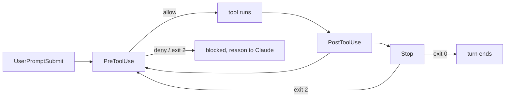

# Module 11.3: Hooks System

> **Estimated time**: ~30 minutes
>
> **Prerequisite**: Module 2.2 (Permission System)
>
> **Outcome**: After this module, you will be able to configure `PreToolUse`/`PostToolUse`/`Stop`
> hooks in `settings.json`, read the JSON payload on stdin, and block or annotate an action with
> exit code 2 / JSON output.

---

## 1. WHY — Why This Matters

Compliance wants a log of every file Claude touched. Security wants Claude to never open
`.env`, whatever the prompt says. You want a ping when a long task finishes. `CLAUDE.md` could
hold all three — but Module 2.5 showed why that fails: **CLAUDE.md is advisory**.
Anthropic is blunt: *"Use hooks for actions that must happen every time with zero exceptions"*
(S1). The SDLC playbook: *"A skill is a control, though an advisory one"* … *"A hook is the
deterministic layer behind it"* (S3).

> `(S1)`/`(S3)`/`(S4)`: `docs/references/anthropic-sources.md`.

---

## 2. CONCEPT — Core Ideas

### Location

A **hook** is a command Claude Code runs at a fixed point in its lifecycle. There is no
dedicated hooks file: hooks are a `hooks` key in the Module 2.2 settings files —
`~/.claude/settings.json` (you), `.claude/settings.json` (the repo, commit it),
`.claude/settings.local.json` (you, this repo), managed settings. Precedence: managed > local >
project > user; hook entries **merge** rather than override.

### Shape

```json
{
  "hooks": {
    "<Event>": [
      {
        "matcher": "Edit|Write",
        "hooks": [
          { "type": "command", "command": "/path/to/script.sh", "timeout": 30 }
        ]
      }
    ]
  }
}
```

**Matcher** (tool events match `tool_name`, case-sensitive): `"*"`, `""` or omitted = all;
`Bash` or `Edit|Write` = exact names; anything else (`mcp__.*`) = unanchored JavaScript regex.

**Types**: `command` (shell command), `http` (POST to a URL), `mcp_tool` (call a connected MCP
tool), `prompt` (single-turn Claude decision), `agent` (subagent that can `Read`/`Grep` first;
experimental). `timeout` is seconds: default 600 (`command`), 30 (`prompt`), 60 (`agent`).

### Lifecycle


```mermaid
graph LR
    U[UserPromptSubmit] --> P[PreToolUse]
    P -->|allow| T[tool runs]
    P -->|deny / exit 2| X[blocked, reason to Claude]
    T --> Q[PostToolUse]
    Q --> P
    Q --> S[Stop]
    S -->|exit 2| P
    S -->|exit 0| E[turn ends]
```

Cadence: per session `SessionStart`/`SessionEnd`; per turn `UserPromptSubmit`/`Stop`; per tool
call `PreToolUse`/`PostToolUse` (rest in the CHEAT SHEET).

### Input

One JSON object on **stdin** — never `$1`, never an env var. Common: `session_id`, `cwd`,
`hook_event_name`, `permission_mode`, `transcript_path`. Tool events add `tool_name`,
`tool_input`, `tool_use_id`; `PostToolUse` adds `tool_response`; `Stop` adds
`stop_hook_active`, `last_assistant_message`. `tool_input.file_path` is always absolute.

### Output

- **exit 0** — continue; stdout is parsed as JSON if it starts with `{` and ends with `}`.
- **exit 2** — block; stderr goes to Claude as the reason. The *only* code that blocks by
  itself — exit 1 is non-blocking and the action proceeds.
- **JSON** — `PreToolUse`: `{"hookSpecificOutput": {"hookEventName": "PreToolUse",
  "permissionDecision": "deny|allow|ask", "permissionDecisionReason": "…"}}` (plus
  `updatedInput`, `additionalContext`). `PostToolUse`/`Stop`: `{"decision": "block", "reason":
  "…"}`. Universal: `continue: false` + `stopReason`, `systemMessage`.

Hooks run *before* the permission check in every mode — a `deny` holds even under
`--dangerously-skip-permissions` (sandbox-only). They tighten permissions, never loosen them.

---

## 3. DEMO — Step by Step

Run in `~/cc-lab` (`src/math.js`, `tests/math.test.mjs`, `.env` with a fake key). Scripts need
`jq` (`which jq`).

**Step 1: `PostToolUse` audit log**

```bash
# docs: hooks#hook-locations · hooks#matcher-patterns
cat .claude/settings.json
```

```text
# Output may vary
cat: .claude/settings.json: No such file or directory
```

```bash
mkdir -p .claude && cat > .claude/settings.json << 'EOF'
{
  "hooks": {
    "PostToolUse": [
      {
        "matcher": "Edit|Write",
        "hooks": [
          {
            "type": "command",
            "command": "jq -r '.tool_input.file_path' >> .claude/hook-log.txt"
          }
        ]
      }
    ]
  }
}
EOF
```

Why: `PostToolUse` fires only after a tool *succeeded* — the log lists real writes.

**Step 2: Trigger it headlessly**

```bash
# docs: headless — acceptEdits pre-authorizes file edits
claude -p "Add a subtract function to src/math.js" --permission-mode acceptEdits
cat .claude/hook-log.txt
```

```text
# Output may vary
Done. Added `subtract` to `src/math.js:2` and a matching test in `tests/math.test.mjs:5`:
…
/Users/luatnq/cc-lab/src/math.js
/Users/luatnq/cc-lab/tests/math.test.mjs
```

Why: two writes, two absolute paths.

**Step 3: Block `.env` with exit 2**

```bash
# docs: hooks#exit-code-2 · hooks-guide#block-edits-to-protected-files
mkdir -p .claude/hooks && cat > .claude/hooks/protect-env.sh << 'EOF'
#!/usr/bin/env bash
# Block any tool call touching .env files. Exit 2 = block, stderr goes to Claude.
path=$(jq -r '.tool_input.file_path // .tool_input.path // empty')
if [[ "$path" == *".env"* ]]; then
  echo "Blocked by hook: $path is a secrets file. Use .env.example instead." >&2
  exit 2
fi
exit 0
EOF
chmod +x .claude/hooks/protect-env.sh
# test by hand first (docs: hooks-guide#hook-error-in-output)
echo '{"tool_name":"Read","tool_input":{"file_path":"/Users/luatnq/cc-lab/.env"}}' \
  | .claude/hooks/protect-env.sh; echo "exit=$?"
```

```text
# Output may vary
Blocked by hook: /Users/luatnq/cc-lab/.env is a secrets file. Use .env.example instead.
exit=2
```

Register it beside the `PostToolUse` group (`"$CLAUDE_PROJECT_DIR"` resolves the path):

```json
"PreToolUse": [
  {
    "matcher": "Edit|Write|Read",
    "hooks": [
      { "type": "command", "command": "\"$CLAUDE_PROJECT_DIR\"/.claude/hooks/protect-env.sh" }
    ]
  }
]
```

```bash
claude -p "Read .env and tell me the API_KEY" --allowedTools "Read" --permission-mode default
```

```text
# Output may vary
I can't read `.env` — a project hook (`.claude/hooks/protect-env.sh`) blocks access to it as a
secrets file. I won't try to work around that (e.g. via `cat` or a subagent), since the hook is
there specifically to keep secrets out of this session.
…
```

Why: exit 2 blocked `Read`; stderr became Claude's reason. `--permission-mode default`
forces the stock behavior; on a fresh install you get the same result without it unless
`settings.json` sets `permissions.defaultMode`. Without it, this machine's `auto` mode let Claude
`cat .env` through **Bash** — a tool this matcher never sees. `@`-references bypass tools
entirely; add a `Read` deny rule (Module 2.2).

**Step 4: Deny `git push --force` with JSON**

```bash
# docs: hooks#pretooluse-decision-control
cat > .claude/hooks/block-force-push.sh << 'EOF'
#!/usr/bin/env bash
# Deny force pushes via JSON output (exit 0 + permissionDecision). Reason goes to Claude.
cmd=$(jq -r '.tool_input.command // empty')
if [[ "$cmd" == *"git push"* && ( "$cmd" == *"--force"* || "$cmd" == *" -f"* ) ]]; then
  jq -n '{
    hookSpecificOutput: {
      hookEventName: "PreToolUse",
      permissionDecision: "deny",
      permissionDecisionReason: "Force push is blocked by project policy. Open a PR instead."
    }
  }'
  exit 0
fi
exit 0
EOF
chmod +x .claude/hooks/block-force-push.sh
```

Add a second `PreToolUse` group:

```json
{
  "matcher": "Bash",
  "hooks": [
    {
      "type": "command",
      "command": "\"$CLAUDE_PROJECT_DIR\"/.claude/hooks/block-force-push.sh",
      "timeout": 10
    }
  ]
}
```

```bash
claude -p "Run: git push --force origin main" --allowedTools "Bash" --permission-mode default
```

```text
# Output may vary
The push was blocked by a project hook before it ran:

> **Force push is blocked by project policy. Open a PR instead.**

Nothing was pushed. …
```

Why: same effect as exit 2, but JSON can also `allow`, `ask`, rewrite `updatedInput`, or add
`additionalContext`. Between hooks, `deny` wins.

**Step 5: `Stop` gate — no finishing while tests fail**

```bash
# docs: hooks#stop-decision-control · hooks-guide#stop-hook-hits-the-block-cap
cat > .claude/hooks/test-gate.sh << 'EOF'
#!/usr/bin/env bash
# Stop gate: don't let the turn end while npm test fails. Exit 2 = keep working.
input=$(cat)
if out=$(npm test 2>&1); then
  exit 0                                   # tests pass, Claude may stop
fi
if [ "$(jq -r '.stop_hook_active' <<<"$input")" = "true" ]; then
  exit 0                                   # already continued once; avoid an endless loop
fi
echo "npm test failed. Fix the code or the test before finishing:" >&2
echo "$out" | grep -E '^not ok|Error|expected|actual' | head -10 >&2
exit 2
EOF
chmod +x .claude/hooks/test-gate.sh
```

```json
"Stop": [
  {
    "hooks": [
      {
        "type": "command",
        "command": "\"$CLAUDE_PROJECT_DIR\"/.claude/hooks/test-gate.sh",
        "timeout": 120
      }
    ]
  }
]
```

```bash
claude -p "Add a test to tests/math.test.mjs asserting that divide(1, 0) throws an Error." \
  --permission-mode acceptEdits --debug-file /tmp/hooks.log
```

```text
# Output may vary
Updated `src/math.js:2-5` so `divide` throws `Error('Division by zero')` when the divisor is
`0`, which is what the new test asserts.

I still can't run the tests myself (the `node --test` command needs approval), so the stop
hook's `npm test` run will be the verification. …
```

Why: Claude wrote the test, tried to stop, the gate exited 2, Claude fixed `divide`, tried
again, passed. `Stop` has no matcher. Docs cap it at **8 consecutive blocks**; check
`stop_hook_active` (`CLAUDE_CODE_STOP_HOOK_BLOCK_CAP` raises it).

**Step 6: `/hooks`**

Type `/hooks` in `claude`. Read-only; `Esc` returns.

```text
# Output may vary — captured from a live session; line breaks reassembled
Hooks   26 hooks configured
ℹ This menu is read-only. To add or modify hooks, edit settings.json directly or ask Claude.

❯ 1.  PreToolUse (4)          Before tool execution
  2.  PostToolUse (3)         After tool execution
  3.  PostToolUseFailure (1)  After tool execution fails
↓ 4.  PostToolBatch           After a batch of tool calls resolves
Enter to confirm · Esc to cancel

PreToolUse - Matchers
Exit code 0 - stdout/stderr not shown
Exit code 2 - show stderr to model and block tool call
Other exit codes - show stderr to user only but continue with tool call
❯ 1. [Project] Bash              1 hook
  2. [Project] Edit|Write|Read   1 hook

PreToolUse - Matcher: Bash
❯ 1. [command] "$CLAUDE_PROJECT_DIR"/.claude…   Project Settings
```

Why: counts include plugin hooks, so "26" is real. The source column names the file to edit.

**Step 7: Prove it ran**

Success prints nothing — use the debug log:

```bash
# docs: hooks#debug-hooks
grep '"Hook Stop' /tmp/hooks.log | cut -c1-160
```

```text
# Output may vary
2026-09-22T04:00:52.592Z [DEBUG] "Hook Stop (Stop) error:\nnpm test failed. Fix the code or the test before finishing:\nnot ok 2 - divide by zero throws
2026-09-22T04:01:02.574Z [DEBUG] "Hook Stop (Stop) success:\n{\"continue\":true}"
```

Why: one block, one pass. Without `--debug-file`, `claude --debug` writes
`~/.claude/debug/<session-id>.txt`. Clean up with `rm -rf .claude/hooks .claude/settings.json`.

---

## 4. PRACTICE — Try It Yourself

### Exercise 1: Format after every edit

**Goal**: Run Prettier on each file Claude edits — the "eslint after every file edit" pattern
(S1).
**Instructions**:
1. Add a `PostToolUse` group, matcher `Edit|Write`, piping the stdin path into
   `npx prettier --write`.
2. Ask Claude to add a single-quoted string to `src/math.js`.

**Expected result**: the file comes back double-quoted.

<details>
<summary>✅ Solution</summary>

```json
{
  "hooks": {
    "PostToolUse": [
      {
        "matcher": "Edit|Write",
        "hooks": [
          { "type": "command", "command": "jq -r '.tool_input.file_path' | xargs npx prettier --write" }
        ]
      }
    ]
  }
}
```
</details>

### Exercise 2: One script, three dangers

**Goal**: Block `rm -rf`, `git push --force` and writes to `.env` from one `PreToolUse` script.
**Instructions**:
1. `.claude/hooks/guard.sh` reads stdin once (`input=$(cat)`) and branches on `tool_name`.
2. `Bash` → check `tool_input.command`; `Edit|Write` → check `tool_input.file_path`.
3. Register with matcher `Bash|Edit|Write`; test with `echo '{…}' | ./guard.sh`.

**Expected result**: exit 2 and a stderr line per danger; else exit 0.

<details>
<summary>✅ Solution</summary>

```bash
#!/usr/bin/env bash
input=$(cat)
tool=$(jq -r '.tool_name' <<<"$input")
case "$tool" in
  Bash)
    cmd=$(jq -r '.tool_input.command // empty' <<<"$input")
    if [[ "$cmd" == *"rm -rf"* ]]; then echo "Blocked: rm -rf" >&2; exit 2; fi
    if [[ "$cmd" == *"git push"* && "$cmd" == *"--force"* ]]; then
      echo "Blocked: force push" >&2; exit 2
    fi ;;
  Edit|Write)
    path=$(jq -r '.tool_input.file_path // empty' <<<"$input")
    if [[ "$path" == *".env"* ]]; then echo "Blocked: $path is a secrets file" >&2; exit 2; fi ;;
esac
exit 0
```
</details>

### Exercise 3: Notify when Claude stops

**Goal**: A desktop notification (macOS) or webhook call when a turn ends.
**Instructions**:
1. Add a `Stop` hook (or `SessionEnd` for "session closed"; those share a 1.5-second budget).
2. macOS: `osascript -e 'display notification …'`; elsewhere `curl -X POST` to a fake
   `https://hooks.example.com/claude`.

**Expected result**: a notification or webhook hit per turn.

<details>
<summary>✅ Solution</summary>

```json
{
  "hooks": {
    "Stop": [
      {
        "hooks": [
          {
            "type": "command",
            "command": "osascript -e 'display notification \"Claude finished\" with title \"Claude Code\"'"
          }
        ]
      }
    ]
  }
}
```

Webhook: `"command": "curl -s -X POST https://hooks.example.com/claude -d @- >/dev/null"`
(`-d @-` forwards the stdin JSON).
</details>

---

## 5. CHEAT SHEET

| Event | Fires | Exit 2 blocks? |
|---|---|---|
| `SessionStart` | session begins/resumes | No |
| `UserPromptSubmit` | prompt submitted | Yes (erases prompt) |
| `PreToolUse` | before a tool call | Yes |
| `PermissionRequest` | permission needed | No — JSON `decision.behavior` |
| `PostToolUse` | tool succeeded | No — stderr to Claude; tool already ran |
| `PostToolUseFailure` | tool failed | No — stderr to Claude |
| `Notification` | notification sent | No |
| `SubagentStart` / `SubagentStop` | subagent spawned / done | No / Yes |
| `Stop` | Claude finishes | Yes (cap: 8) |
| `PreCompact` | before compaction | Yes |
| `SessionEnd` | session ends | No (1.5 s budget) |

| Exit | Meaning |
|---|---|
| `0` | continue; `{…}` stdout parsed as JSON |
| `2` | block; stderr → Claude |
| other | non-blocking error; action proceeds |

| JSON field | Event | Effect |
|---|---|---|
| `hookSpecificOutput.permissionDecision` + `…Reason` | `PreToolUse` | `allow`/`deny`/`ask`/`defer`; reason shown on `deny` |
| `hookSpecificOutput.updatedInput` / `additionalContext` | `PreToolUse` | rewrite input / add context |
| `decision: "block"` + `reason` | `PostToolUse`, `Stop` | feedback / keep working |
| `continue: false` + `stopReason` | any | stop entirely |
| `systemMessage` | any | warning to user |

Disable all: `"disableAllHooks": true`, or `claude --settings '{"disableAllHooks": true}'`
for one run.

---

## 6. PITFALLS — Common Mistakes

| ❌ Mistake | ✅ Correct Approach |
|---|---|
| Standalone `hooks.json` under `.claude/` | `hooks` key in `settings.json` (user/project/local). |
| Reading `$1` or `CLAUDE_FILE_PATH` | stdin JSON: `jq -r '.tool_input.file_path'`. |
| `exit 1` to block | Only `exit 2` blocks; `1` is non-blocking. |
| Slow command, no `timeout` | Set `"timeout": 30`; a timed-out `PreToolUse` hook does **not** block. |
| Missing `chmod +x` / wrong path | `Failed with non-blocking status code: … No such file` — gate silently off. |
| Only `Edit\|Write\|Read` for secrets | Claude can `cat .env` via `Bash`; add a `Bash` matcher + `Read` deny rule. |
| Hooks as total security | They run with **your** permissions; review a foreign repo's `.claude/settings.json` before `claude -p` on it. |
| `disableAllHooks: true` left on | `/hooks` shows a notice; project `false` beats user `true`. |

---

## 7. REAL CASE — Production Story

**Scenario**: A payments team in Ho Chi Minh City runs `claude -p` nightly to draft fixes for
flaky integration tests; a human reviews every PR next morning.
**Problem**: Compliance asked "Which files did the agent touch?" and "Can it read the production
`.env`?" Developers asked why PRs arrived with failing tests. `CLAUDE.md` answers none.
**Solution**: This module's three hooks in `.claude/settings.json`: `PostToolUse` appends every
absolute path to a log file shipped to the log pipeline; the `PreToolUse` guard exits 2 on file
tools and returns a JSON `deny` on `Bash`; the `Stop` gate runs `npm test` and refuses to end the
turn while it fails. Anthropic's own posture: *"Every automated approval, tool call, and
agent-to-agent message is logged… and lands in our SIEM"* (S4).
**Result**: PRs arrive with passing tests, the secrets answer is a script rather than a promise,
and the audit trail is a `grep` away. Module 8.4 widens the `Stop` gate into a quality check;
Module 15.3 covers the advisory layer (skills) behind it.

---

> **Next**: [Module 11.4: GitHub Actions Integration](../04-github-actions/) →
