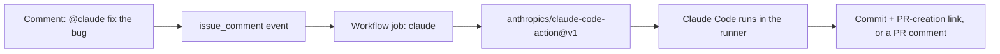

# Module 11.4: GitHub Actions Integration

> **Estimated time**: ~30 minutes
>
> **Prerequisite**: Module 11.1 (Headless Mode)
>
> **Outcome**: After this module, you will be able to install the Claude GitHub App with
> `/install-github-app`, run `anthropics/claude-code-action@v1` on `@claude` mentions and on a
> schedule, and keep secrets and untrusted input out of shell steps.

---

## 1. WHY — Why This Matters

You run Claude headless from your terminal already. Now the team wants it to show up automatically
— review every PR, triage issues weekly — without anyone typing a command. The tempting shortcut is
a hand-rolled workflow: `npm install -g @anthropic-ai/claude-code`, a custom `claude -p` step, a PR
title interpolated straight into a shell script. That breaks on every CLI release, has no actor
check, and a hostile PR title can execute commands on your runner. The maintained action fixes all
three.

---

## 2. CONCEPT — Core Ideas

`anthropics/claude-code-action@v1` runs the same Claude Code binary you use locally inside a GitHub
Actions runner, wired to GitHub's event system. It has two modes:

- **Interactive mode** — no `prompt` input. Claude waits for the trigger phrase (`@claude` by
  default) in a comment or review.
- **Automation mode** — a `prompt` input is set. Claude runs the moment the job starts — what
  `schedule` and `workflow_dispatch` jobs use.



Key inputs (full list in the CHEAT SHEET): `prompt`, `claude_args` (CLI flags, e.g.
`--max-turns 5 --model claude-sonnet-5`), `anthropic_api_key` or `claude_code_oauth_token`,
`github_token`, `trigger_phrase`, `settings`, and `use_bedrock` / `use_vertex` / `use_foundry` for
cloud-provider auth over OIDC.

The workflow's `permissions:` block controls what the action's token — and Claude — can touch. A
minimal set: `contents: write`, `pull-requests: write`, `issues: write`, plus `id-token: write`
(the action's GitHub App auth and OIDC federation both need it, even with your own `github_token`)
and `actions: read` (lets Claude read CI results on PRs).

Who can trigger it: the actor needs write access to the repo for issue/PR/comment/review events;
bots are rejected unless listed in `allowed_bots`. GitHub also never re-fires a workflow on commits
made with the default `GITHUB_TOKEN`, so Claude's own commits can't loop the job.

Security is baked in, not bolted on: the action strips hidden markdown (HTML comments, invisible
characters) from untrusted comments, and GitHub context values must never hit a shell step raw
(DEMO Step 5).

---

## 3. DEMO — Step by Step

**Scenario**: wire a repo so `@claude` mentions get a response, plus a weekly triage job — on the
official action, not a hand-rolled script.

**Step 1: Install the Claude GitHub App**

In a Claude Code session, inside a repo whose git remote points to `github.com`, run:

```text
/install-github-app
```

It installs the [Claude GitHub App](https://github.com/apps/claude) and writes a starter workflow —
after checking your local `gh` CLI auth. A real run, lab repo, under-scoped `gh` login:

```text
# Output may vary — actual run in a lab repo, no GitHub remote / full gh auth scope
❯ /install-github-app

✳ Burrowing…
────────────────────────────────────────────────────────────
──Install GitHub App──────────────────────────────────────────

  Error: GitHub CLI is missing required permissions: workflow.

  Reason: Missing required scopes

  How to fix:
    ● Your GitHub CLI authentication is missing the "workflow" scope needed to manage GitHub Actions and secrets.
    ●
    ● To fix this, run:
    ●   gh auth refresh -h github.com -s repo,workflow
    ●
    ● This will add the necessary permissions to manage workflows and secrets.

  For manual setup instructions, see: https://github.com/anthropics/claude-code-action/blob/main/docs/setup.md

  Press any key to exit
```

Fix the scope and it proceeds to browser authorization. On a `gitlab.com`/`bitbucket.org` remote,
it prints a notice and exits instead — see Step 6.

By hand: install the App (Contents/Issues/Pull requests read-write), add an `ANTHROPIC_API_KEY`
secret, and copy the workflow below.

**Step 2: The minimal workflow**

```yaml
# .github/workflows/claude.yml — docs: github-actions (verbatim starter)
name: Claude Code
on:
  issue_comment:
    types: [created]
  pull_request_review_comment:
    types: [created]
jobs:
  claude:
    if: contains(github.event.comment.body, '@claude')
    runs-on: ubuntu-latest
    permissions:
      contents: write
      pull-requests: write
      issues: write
      id-token: write
      actions: read
    steps:
      - uses: actions/checkout@v6
        with:
          fetch-depth: 1
      - uses: anthropics/claude-code-action@v1
        with:
          anthropic_api_key: ${{ secrets.ANTHROPIC_API_KEY }}
```

No `prompt` input — interactive mode, Claude waits for `@claude`.

**Step 3: Trigger it**

Comment `@claude add a README section about tests` on an issue or PR. By default Claude doesn't
open a PR for you — it "commits code changes to a new branch [and] provides a link to the GitHub PR
creation page... the user must click the link" (`claude-code-action/docs/security.md`). A human
still decides when a PR gets opened.

**Step 4: Automation mode — run on a schedule, no mention needed**

```yaml
# .github/workflows/claude-weekly-triage.yml
name: Claude Weekly Triage
on:
  schedule:
    - cron: '0 9 * * 1'
permissions:
  contents: read
  issues: write
  id-token: write
jobs:
  triage:
    runs-on: ubuntu-latest
    steps:
      - uses: actions/checkout@v6
      - uses: anthropics/claude-code-action@v1
        with:
          anthropic_api_key: ${{ secrets.ANTHROPIC_API_KEY }}
          prompt: "Summarize open issues labelled bug"
          claude_args: "--max-turns 5"
```

`prompt:` switches to automation mode — runs the moment the job starts. `permissions:` is narrower
than Step 2: no `contents: write` or `pull-requests`, since this job only reads issues.

**Step 5: Never let untrusted GitHub context reach a shell**

```yaml
# ❌ do not ship this — a hostile comment body becomes a shell command
- name: Echo comment (VULNERABLE)
  run: echo "${{ github.event.comment.body }}"
```

```yaml
# ✅ pass untrusted context through env: first (docs.github.com — Secure use reference)
- name: Echo comment safely
  env:
    COMMENT_BODY: ${{ github.event.comment.body }}
  run: echo "$COMMENT_BODY"
```

Why: a PR title of `a"; ls $GITHUB_WORKSPACE"` interpolated into `run:` executes `ls` on the runner
— `${{ }}` is substituted into the shell script *before* it runs. `env:` stores the value in memory
instead. The fix applies to every `${{ github.event.* }}` field your own steps touch, not just this
action's.

**Step 6: Not on GitHub? GitLab CI/CD has an equivalent (beta, maintained by GitLab)**

```yaml
# docs: gitlab-ci-cd — verbatim minimal example
stages:
  - ai

claude:
  stage: ai
  image: node:24-alpine3.21
  rules:
    - if: '$CI_PIPELINE_SOURCE == "web"'
    - if: '$CI_PIPELINE_SOURCE == "merge_request_event"'
  variables:
    GIT_STRATEGY: fetch
  before_script:
    - apk update
    - apk add --no-cache git curl bash
    - curl -fsSL https://claude.ai/install.sh | bash
    - export PATH="$HOME/.local/bin:$PATH"
  script:
    - /bin/gitlab-mcp-server || true
    - echo "$AI_FLOW_INPUT for $AI_FLOW_CONTEXT on $AI_FLOW_EVENT"
    - >
      claude
      -p "${AI_FLOW_INPUT:-'Review this MR and implement the requested changes'}"
      --permission-mode acceptEdits
      --allowedTools "Bash Read Edit Write mcp__gitlab"
      --debug
```

"Currently in beta... maintained by GitLab." Store the API key as a masked CI/CD variable — never
in `.gitlab-ci.yml`.

---

## 4. PRACTICE — Try It Yourself

### Exercise 1: Auto-review every PR
**Goal**: Get Claude to review PRs automatically, with no one typing `@claude`.

**Instructions**:
1. Trigger on `pull_request: [opened, synchronize]`.
2. Set a review `prompt:`, capped with `claude_args: "--max-turns 5"`.
3. Scope `permissions:` to a reviewer's needs.

**Expected result**: every PR gets an automated review comment, capped at 5 turns.

<details>
<summary>💡 Hint</summary>
Automation mode needs `prompt:` — `pull_request` carries no comment to match `@claude` against.
</details>

<details>
<summary>✅ Solution</summary>

```yaml
name: Claude PR Review
on:
  pull_request:
    types: [opened, synchronize]
permissions:
  contents: read
  pull-requests: write
  id-token: write
jobs:
  review:
    runs-on: ubuntu-latest
    steps:
      - uses: actions/checkout@v6
      - uses: anthropics/claude-code-action@v1
        with:
          anthropic_api_key: ${{ secrets.ANTHROPIC_API_KEY }}
          prompt: "Review this pull request for bugs, security issues, and missing tests."
          claude_args: "--max-turns 5"
```
No `contents: write` needed — a review comment doesn't touch the repository.
</details>

### Exercise 2: Fix a broken filter combination
**Goal**: A teammate's `pull_request` workflow sets two path filters; one is silently ignored.

**Instructions**:
1. Find the two filter keys that can't both apply on one event.
2. Rewrite the trigger to use only one.
3. Confirm the intended file set is still covered.

**Expected result**: one filter key controls which changes fire the workflow.

<details>
<summary>💡 Hint</summary>
See the PITFALLS table for the pair and which one to keep.
</details>

<details>
<summary>✅ Solution</summary>

```yaml
on:
  pull_request:
    types: [opened, synchronize]
    paths:
      - 'src/**'
      - 'lib/**'
```
Fold the exclusion into the include list's shape instead of adding a second, competing filter key.
</details>

### Exercise 3: Migrate a workflow off `@beta`
**Goal**: An existing workflow pins `@beta` with `mode`, `direct_prompt`, `custom_instructions`.

**Instructions**:
1. Bump the ref to `@v1`.
2. Remove `mode` — gone.
3. Rename `direct_prompt` to `prompt`.
4. Replace `custom_instructions` with `--append-system-prompt` inside `claude_args`.

**Expected result**: the workflow runs on `@v1` with equivalent behavior.

<details>
<summary>💡 Hint</summary>
`custom_instructions` has no same-name input on `@v1` — it becomes a CLI flag instead.
</details>

<details>
<summary>✅ Solution</summary>

```yaml
# before (@beta)
- uses: anthropics/claude-code-action@beta
  with:
    mode: tag
    direct_prompt: "Review this PR"
    custom_instructions: "Always check for SQL injection"

# after (@v1)
- uses: anthropics/claude-code-action@v1
  with:
    prompt: "Review this PR"
    claude_args: "--append-system-prompt 'Always check for SQL injection'"
```
</details>

---

## 5. CHEAT SHEET

### Key inputs

| Input | What it does |
|---|---|
| `prompt` | Switches to automation mode |
| `claude_args` | CLI flags, e.g. `--max-turns 5 --model claude-sonnet-5` |
| `anthropic_api_key` | Console API key from a secret |
| `claude_code_oauth_token` | Token from `claude setup-token` |
| `github_token` | Custom token; omit to auth as the App |
| `trigger_phrase` | Mention phrase (default `@claude`) |
| `settings` | Inline Claude Code settings JSON |
| `use_bedrock` / `use_vertex` / `use_foundry` | Cloud provider over OIDC |

### Minimal `permissions:`

```yaml
permissions:
  contents: write
  pull-requests: write
  issues: write
  id-token: write   # action's GitHub App auth / OIDC federation
  actions: read      # lets Claude read CI results on PRs
```

### Trigger matrix

| Mode | Input | Runs when |
|---|---|---|
| Interactive | no `prompt` | `@claude ...` in a comment/review |
| Automation | `prompt` set | job starts — `schedule`, `workflow_dispatch`, ... |
| GitLab (beta) | `AI_FLOW_INPUT` | a pipeline `rules:` entry matches |

### Auth options

| Option | Secret / variable | Best for |
|---|---|---|
| API key | `ANTHROPIC_API_KEY` | shared/org CI |
| OAuth token | `CLAUDE_CODE_OAUTH_TOKEN` | solo repos, Pro/Max/Team plan |
| OIDC federation | `anthropic_federation_rule_id` | no static secret at all |

---

## 6. PITFALLS — Common Mistakes

| ❌ Mistake | ✅ Correct Approach |
|---|---|
| Hand-rolling `npm install -g @anthropic-ai/claude-code` + a custom `claude -p` step | Use `anthropics/claude-code-action@v1` — install, App auth, and actor checks included |
| Interpolating `${{ github.event.comment.body }}` (or any untrusted context) into `run:` | Pass it through `env:` first — GitHub's documented fix for script injection |
| Setting both `paths` and `paths-ignore` on the same `pull_request` trigger | Keep only one filter key; the other is silently ignored |
| Committing an API key or OAuth token into the workflow file | Store it as a GitHub Secret (`ANTHROPIC_API_KEY` / `CLAUDE_CODE_OAUTH_TOKEN`) |
| Forgetting `id-token: write` | Needed for the App auth and OIDC federation, even with your own `github_token` |
| Running `/install-github-app` on a GitLab or Bitbucket remote | It prints a notice and exits — use the GitLab CI/CD integration instead |
| Sharing one person's `claude setup-token` OAuth token as an org-wide CI secret | Use a Console API key — the OAuth token is tied to that person's subscription |

---

## 7. REAL CASE — Production Story

**Scenario**: An open-source TypeScript library gets PRs from contributors across time zones.
Maintainers want a review only when they ask for one, not on every push.

**Problem**: A DIY workflow reviewed every commit on every PR update, re-running on typo-only
pushes and stacking up runs faster than reviewers could read them.

**Solution**: Rebuilt on `anthropics/claude-code-action@v1` with three controls: trigger only when
a maintainer adds the `needs-review` label, cap runs with `claude_args: "--max-turns 5"`, and
cancel a still-running review when a new push supersedes it.

```yaml
on:
  pull_request:
    types: [labeled, synchronize]
concurrency:
  group: claude-review-${{ github.ref }}
  cancel-in-progress: true
jobs:
  review:
    if: contains(github.event.pull_request.labels.*.name, 'needs-review')
    runs-on: ubuntu-latest
    permissions:
      contents: read
      pull-requests: write
      id-token: write
    steps:
      - uses: actions/checkout@v6
      - uses: anthropics/claude-code-action@v1
        with:
          anthropic_api_key: ${{ secrets.ANTHROPIC_API_KEY }}
          claude_args: "--max-turns 5"
```

**Result**: reviews run only when a maintainer asks via the label, every run has a hard turn cap,
and superseded runs cancel automatically instead of piling up.

---

> **Next**: [Module 11.5: MCP — Model Context Protocol](../05-mcp/) →
