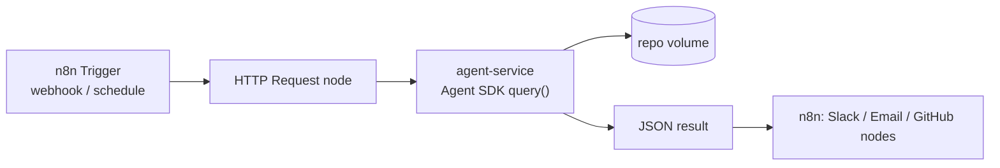

# Module 12.1: Claude Code + n8n

> **Estimated time**: ~35 minutes
>
> **Prerequisite**: Module 11.2 (Claude Agent SDK)
>
> **Outcome**: After this module, you will be able to call a small Agent SDK service from an n8n
> workflow over plain HTTP, and know when a self-hosted Execute Command node is the right (and
> only) alternative.

---

## 1. WHY — Why This Matters

You want n8n to trigger a repo-aware Claude Code task from a webhook or a schedule. The obvious
move is an **Execute Command** node running `claude -p` — that's how most tutorials show it. It
also doesn't work on the n8n most people run: Execute Command is disabled by default from n8n 2.0
onward, and it isn't available on n8n Cloud at all (docs: "This node isn't available on n8n
Cloud."). You need an approach that works on the n8n your team actually has.

---

## 2. CONCEPT — Core Ideas

There are two real ways to reach Claude Code from n8n, and they trade off differently.

**(A) Recommended — HTTP Request → a small Agent SDK service.** You run a tiny Node.js (or
Python) process that wraps the Agent SDK's `query()` and exposes it as `POST /run`. n8n's
**HTTP Request** node calls that endpoint like any other API. This works everywhere — n8n Cloud
included — because from n8n's side it's just an outbound HTTP call. You control exactly which
tools the agent can use (`allowedTools`) and what directory it can see (`cwd`), independent of
whatever n8n itself can reach.

**(B) Self-hosted only — Execute Command running `claude -p`.** If you self-host n8n, you can
re-enable Execute Command and run the `claude` CLI directly in that container. This means
installing the `claude` CLI in the n8n image, giving it credentials, and accepting that the node
now runs an arbitrary shell command with n8n's own process privileges — a materially bigger blast
radius than an HTTP call to a service you wrote.



| Node | Path | Works on n8n Cloud? | What it runs |
|---|---|---|---|
| **HTTP Request** | (A) recommended | Yes | Calls your `agent-service` over HTTP |
| **Execute Command** | (B) self-hosted only | No — "isn't available on n8n Cloud" | `claude -p …` as a shell command, in-process |
| **Code** | either | Yes | JavaScript/Python glue between nodes |

To re-enable Execute Command on a self-hosted instance, set the `NODES_EXCLUDE` environment
variable to a JSON array that leaves it out — for example
`NODES_EXCLUDE=["n8n-nodes-base.readWriteFile"]` (the docs' own default-blocked example pairs
Execute Command with Read/Write Files from Disk; drop the one you want back). Docs: "Some nodes,
like Execute Command, are blocked by default. Remove them from the exclude list to enable them."

---

## 3. DEMO — Step by Step

**Lab setup**: n8n runs in Docker; `agent-service` runs on the **host** with `node`, so the Agent
SDK reuses your machine's existing `claude` login — no token minted, no key baked into a
container. n8n reaches the host service at `http://host.docker.internal:8787`.

**Step 1: Write the service** (`agent-service/server.mjs`, ~40 lines)

```javascript
// docs: https://code.claude.com/docs/en/agent-sdk/typescript
import http from 'node:http';
import { query } from '@anthropic-ai/claude-agent-sdk';

const PORT = process.env.PORT || 8787;
const REPO_DIR = process.env.REPO_DIR || '/repo';

const server = http.createServer(async (req, res) => {
  if (req.method !== 'POST' || req.url !== '/run') {
    res.writeHead(404).end('not found');
    return;
  }
  let body = '';
  for await (const chunk of req) body += chunk;
  const { prompt, session_id } = JSON.parse(body);

  let result = null;
  for await (const message of query({
    prompt,
    options: {
      cwd: REPO_DIR,
      allowedTools: ['Read', 'Grep', 'Glob'], // read-only — no Bash, no Edit
      permissionMode: 'dontAsk',              // deny anything not in allowedTools
      maxTurns: 6,
      resume: session_id,                     // continue a prior session if the caller sends one
    },
  })) {
    if (message.type === 'result') result = message;
  }

  res.writeHead(200, { 'content-type': 'application/json' });
  res.end(JSON.stringify({
    result: result?.result ?? null,
    session_id: result?.session_id ?? null,
    total_cost_usd: result?.total_cost_usd ?? null,
  }));
});

server.listen(PORT, () => console.log(`agent-service listening on :${PORT}`));
```

`npm install @anthropic-ai/claude-agent-sdk` installed `0.1.77` for this lab.

**Step 2: Run it on the host**

```bash
REPO_DIR=$HOME/cc-lab PORT=8787 node server.mjs
```

**Step 3: Test the service directly**

```bash
curl -s localhost:8787/run -H 'content-type: application/json' \
  -d '{"prompt":"List exported functions in src/math.js"}'
```
Expected output:
```text
# Output may vary
{"result":"The exported functions in `src/math.js` are:\n\n1. **`add(a, b)`** - Returns the sum of two numbers\n2. **`divide(a, b)`** - Returns the division of two numbers","session_id":"6f86887b-d23c-4f63-bb19-40dd8404cbad","total_cost_usd":0.0558}
```

**Step 4: Start n8n in Docker**

```bash
# compose.yaml — lab only: n8n in a container, agent-service on the host
services:
  n8n:
    image: docker.n8n.io/n8nio/n8n
    ports: ['5678:5678']
    extra_hosts: ['host.docker.internal:host-gateway']
    volumes: ['n8n_data:/home/node/.n8n']
volumes:
  n8n_data:
```
```bash
docker compose up -d
```
`docker run --rm docker.n8n.io/n8nio/n8n --version` printed `2.40.7` for this lab.

**Step 5: Build the workflow**

1. **Webhook** node — Method `POST`, Path `agent`, Respond: **Using 'Respond to Webhook' Node**.
2. **HTTP Request** node — Method `POST`, URL `http://host.docker.internal:8787/run`, Send Body
   on, Specify Body: **Using JSON**, body: `{"prompt": "{{ $json.body.prompt }}"}`.
3. **Respond to Webhook** node — default (**First Incoming Item**, i.e. the HTTP Request node's
   response).

**Step 6: Publish and call the production webhook**

```bash
curl -s -X POST http://localhost:5678/webhook/agent \
  -H 'content-type: application/json' \
  -d '{"prompt":"List exported functions in src/math.js"}'
```
Expected output:
```text
# Output may vary
{"result":"The exported functions in `src/math.js` are:\n\n1. **`add(a, b)`** - Returns the sum of two numbers\n2. **`divide(a, b)`** - Returns the division of two numbers","session_id":"c11a4f3e-29e0-44d4-915a-9630befa3cc3","total_cost_usd":0.2176}
```

**Trimmed exported workflow** (`n8n export:workflow`, node identifiers as this n8n version wrote
them):
```json
{
  "name": "agent-service-demo",
  "nodes": [
    { "type": "n8n-nodes-base.webhook", "typeVersion": 2.1, "name": "Webhook",
      "parameters": { "httpMethod": "POST", "path": "agent", "responseMode": "responseNode" } },
    { "type": "n8n-nodes-base.httpRequest", "typeVersion": 4.5, "name": "HTTP Request",
      "parameters": { "method": "POST", "url": "http://host.docker.internal:8787/run",
        "sendBody": true, "specifyBody": "json",
        "jsonBody": "={\"prompt\": \"{{ $json.body.prompt }}\"}" } },
    { "type": "n8n-nodes-base.respondToWebhook", "typeVersion": 1.5, "name": "Respond to Webhook" }
  ],
  "connections": {
    "Webhook": { "main": [[{ "node": "HTTP Request", "type": "main", "index": 0 }]] },
    "HTTP Request": { "main": [[{ "node": "Respond to Webhook", "type": "main", "index": 0 }]] }
  }
}
```

---

## 4. PRACTICE — Try It Yourself

### Exercise 1: Widen the service's reach

**Goal**: Let the agent read files but not run shell commands, still without editing anything.

**Instructions**:
1. In `server.mjs`, change `allowedTools` to `['Read', 'Grep', 'Glob', 'WebSearch']`.
2. Restart the service and re-run the Step 3 curl with a prompt that needs a web search.

**Expected result**: The response includes a synthesized answer; `total_cost_usd` is still
returned. `Bash` and `Edit` remain unavailable no matter what the prompt asks for.

<details>
<summary>💡 Hint</summary>
`allowedTools` only *adds* tools the agent may use without prompting — it does not need `Bash` or
`Edit` listed to keep those tools out; they're simply absent.
</details>

<details>
<summary>✅ Solution</summary>
Edit the array, restart with `node server.mjs`, then:
```bash
curl -s localhost:8787/run -H 'content-type: application/json' \
  -d '{"prompt":"What does this project'\''s package.json say the entry point is?"}'
```
</details>

### Exercise 2: Enable Execute Command safely (self-hosted only)

**Goal**: Understand exactly what you're trading away before you flip this switch.

**Instructions**:
1. On a self-hosted n8n, set `NODES_EXCLUDE=["n8n-nodes-base.readWriteFile"]` (leaving Execute
   Command out of the exclude list re-enables it).
2. List, in your own words, what an attacker who can edit this workflow could now do that they
   couldn't with the HTTP Request approach.

<details>
<summary>💡 Hint</summary>
Execute Command runs a real shell inside the n8n process's container, with whatever credentials
that container has — not just the ones you intended for Claude.
</details>

<details>
<summary>✅ Solution</summary>
They could run any command the container's user can run — read other workflows' credentials from
disk, reach internal network hosts, or install a backdoor — none of which the `agent-service`
path exposes, since that service only accepts a `prompt` field over HTTP.
</details>

---

## 5. CHEAT SHEET

| Task | Command / Config |
|---|---|
| Install SDK | `npm install @anthropic-ai/claude-agent-sdk` |
| Run service on host | `REPO_DIR=~/cc-lab PORT=8787 node server.mjs` |
| Pull n8n image | `docker pull docker.n8n.io/n8nio/n8n` |
| n8n → host service URL | `http://host.docker.internal:8787/run` |
| Re-enable Execute Command | `NODES_EXCLUDE=["n8n-nodes-base.readWriteFile"]` |
| Webhook → HTTP Request body | `{"prompt": "{{ $json.body.prompt }}"}` |

| Node | Purpose |
|---|---|
| Webhook | Trigger, respond via "Respond to Webhook" node |
| HTTP Request | Call `agent-service` (path A) |
| Execute Command | Run `claude -p` directly (path B, self-hosted only) |
| Respond to Webhook | Return the HTTP Request node's JSON |

---

## 6. PITFALLS — Common Mistakes

| ❌ Mistake | ✅ Correct Approach |
|---|---|
| Execute Command → `claude -p` on n8n Cloud | Not available there at all; use the HTTP Request → service path |
| Assuming Execute Command just works self-hosted | It's blocked by default from n8n 2.0; requires `NODES_EXCLUDE` |
| Hardcoding an old system-wide install path for the CLI | The native installer puts it at `~/.local/bin/claude`; use `which claude` |
| `claude -p` with no permission flag in a node | Always pass `--permission-mode` or `--allowedTools`; a bare `-p` run defaults to Manual |
| Baking `ANTHROPIC_API_KEY` into the n8n image | Pass it from the environment at container start; never a literal in `compose.yaml` |
| Treating a natural-language refusal as a thrown error | The Agent SDK returns `result: "success"` even when Claude declines a request in text — check the text, don't assume HTTP status alone means success |

---

## 7. REAL CASE — Production Story

**Scenario**: A Vietnamese marketing agency's client briefs land in a shared inbox. Someone reads
each one, logs it to a spreadsheet, and pings the right Slack channel — about two hours of manual
triage every morning.

**Problem**: The team's first attempt used an Execute Command node calling `claude -p` directly
inside n8n Cloud. It silently failed — Execute Command isn't available there — and the team lost a
day debugging a node that was never going to run.

**Solution**: They moved to the architecture in this module: a small `agent-service` (running as a
lightweight Fly.io app for production, with `ANTHROPIC_API_KEY` set from the platform's secret
store, never in a Dockerfile) that a webhook-triggered n8n Cloud workflow calls over HTTP. The
service reads each brief, extracts client name/deadline/requirements with `allowedTools: ['Read']`
scoped to a read-only mailbox export, and returns structured JSON that a Code node turns into a
spreadsheet row and a Slack message.

**Result**: Morning triage now takes about the time it takes a human to skim the extracted
summaries and approve them — the extraction itself runs unattended. The team runs entirely on n8n
Cloud, something the Execute Command approach could never have supported.

---

> **Next**: [Module 12.2: Workflow Patterns](../02-workflow-patterns/) →
