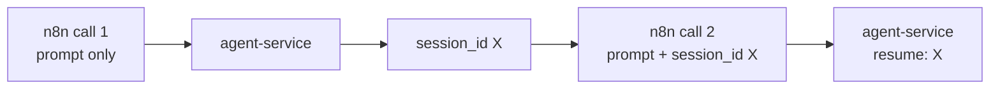

# Module 12.3: n8n + SDK Orchestration

> **Estimated time**: ~40 minutes
>
> **Prerequisite**: Module 12.2 (Workflow Patterns), Module 11.2 (Claude Agent SDK)
>
> **Outcome**: After this module, you will be able to carry a Claude Code conversation across
> multiple n8n calls with `resume`, and know when to use n8n's native AI Agent node instead of
> Claude Code entirely.

---

## 1. WHY — Why This Matters

Every call in Modules 12.1 and 12.2 started a fresh Claude Code session — no memory of the last
call. A support-ticket workflow that asks a follow-up question, or a review loop that revises a
draft based on feedback, needs the second call to remember the first. And not every n8n AI
workflow needs Claude Code at all — plenty of chat/tool-calling automations are a better fit for
n8n's own AI Agent node. Picking the wrong one costs you either unnecessary complexity or missing
filesystem access.

---

## 2. CONCEPT — Core Ideas

### Resuming a session across calls

The Agent SDK's `query()` takes a `resume` option: `resume` | `string` | "Session ID to resume".
Pass the `session_id` your first call returned, and the second call continues the same
conversation instead of starting cold — no repo re-scan, and Claude remembers what it just told
you.



### Claude Code vs n8n's native AI nodes

n8n ships its own **AI Agent** node ("Connect a chat model and one or more tools, and the agent
decides which tools to call") paired with an **Anthropic Chat Model** node ("Use Anthropic's
Claude family of chat models with conversational agents"). These run entirely inside n8n — no
separate service, no repo checkout.

| Need | Use |
|---|---|
| Chat/tool-calling over n8n-defined tools (an API call, a database lookup) | n8n **AI Agent** + **Anthropic Chat Model** |
| Needs to read/search an actual repository | Claude Code via `agent-service` (Module 12.1) |
| Needs `Bash`, `Edit`, or other Claude Code built-in tools | Claude Code via `agent-service` |
| Needs the exact same permission model (`allowedTools`, hooks) across every call | Claude Code via `agent-service` |
| A quick classification or chat reply with no filesystem involved | n8n **AI Agent** + **Anthropic Chat Model** — one fewer moving part |

The Anthropic Chat Model node's **Model** field is populated live from your connected credential —
there's no fixed list published in the node's docs, so this course doesn't hardcode a model ID
here either. Pick whatever current Claude model your credential's dropdown shows, the same way you
would pass a model *alias* (not a dated ID) to the Agent SDK's own `model` option.

---

## 3. DEMO — Step by Step

**Step 1: First call — no `session_id` yet**

```bash
curl -s localhost:8787/run -H 'content-type: application/json' \
  -d '{"prompt":"In one sentence, what does tests/math.test.mjs test?"}'
```
Expected output:
```text
# Output may vary
{"result":"This test file verifies that the `add` function from `../src/math.js` correctly returns 3 when given the inputs 1 and 2.","session_id":"ca3ccf44-3294-4806-b3b8-12f48cdaa336","total_cost_usd":0.0551}
```

**Step 2: Second call — pass that `session_id` back**

```bash
curl -s localhost:8787/run -H 'content-type: application/json' \
  -d '{"prompt":"Which function from that file did I just ask about? Answer in 5 words or fewer.","session_id":"ca3ccf44-3294-4806-b3b8-12f48cdaa336"}'
```
Expected output:
```text
# Output may vary
{"result":"The `add` function.","session_id":"ca3ccf44-3294-4806-b3b8-12f48cdaa336","total_cost_usd":0.0085}
```

Notice: the `session_id` in the response is unchanged, and the second call correctly answers
"which function," which it could only know from the first call's context — the resume worked. In
n8n, wire this by storing `session_id` from the first HTTP Request node's response (a Set node, or
a workflow-scoped variable) and referencing it in the second HTTP Request node's body:
`{"prompt": "{{ $json.followup }}", "session_id": "{{ $('HTTP Request').item.json.session_id }}"}`.

**Step 3: When to skip Claude Code entirely**

For a workflow that only classifies incoming Slack messages by intent — no file access needed —
add n8n's own **AI Agent** node with an **Anthropic Chat Model** sub-node attached, instead of a
call to `agent-service`. That AI Agent node can itself hold n8n **Tool** sub-nodes (an HTTP Request
tool, a database tool) if the classification needs to look something up — but none of them touch a
filesystem the way Claude Code's `Read`/`Grep`/`Bash` tools do.

**Step 4: Add hooks in `agent-service` code (not in a `.claude/settings.json` this service never
reads)**

```javascript
// docs: https://code.claude.com/docs/en/agent-sdk/typescript — options.hooks
options: {
  cwd: REPO_DIR,
  allowedTools: ['Read', 'Grep', 'Glob'],
  permissionMode: 'dontAsk',
  resume: session_id,
  hooks: {
    PreToolUse: [{
      hooks: [async (input) => {
        console.log(`[audit] about to run ${input.tool_name}`);
        return { continue: true };
      }],
    }],
  },
}
```
Because this service passes `hooks` directly to `query()`, it has no `.claude/settings.json` to
read from — pass `settingSources: []` (the SDK default already excludes CLAUDE.md-style project
settings unless you explicitly include `'project'`) if you want to guarantee nothing on the host's
filesystem changes this service's behavior.

---

## 4. PRACTICE — Try It Yourself

### Exercise 1: Build a two-turn follow-up workflow

**Goal**: Ask the agent one question, then a follow-up that depends on the first answer, in a
single n8n workflow.

**Instructions**:
1. Webhook receives `{"question": "...", "followup": "..."}`.
2. HTTP Request #1 calls `agent-service` with `question` only.
3. HTTP Request #2 calls `agent-service` with `followup` and the `session_id` from #1's response.
4. Respond to Webhook returns both results.

**Expected result**: The second answer clearly depends on context only the first call established
— test it the way Step 1–2 of the DEMO did.

<details>
<summary>💡 Hint</summary>
Reference the first node's output from the second node's body with
`{{ $('HTTP Request').item.json.session_id }}`, not `$json.session_id` (which refers to the
immediately preceding node — fine here, but the explicit node reference is clearer once you have
branches).
</details>

<details>
<summary>✅ Solution</summary>
This is exactly the wiring shown in DEMO Step 2's closing paragraph — two HTTP Request nodes
sharing one `session_id`.
</details>

### Exercise 2: Choose the right tool

**Goal**: Decide, for three scenarios, whether to use `agent-service` (Claude Code) or n8n's AI
Agent + Anthropic Chat Model node.

**Instructions**: For each, name the right approach and one sentence why:
1. Summarize a Slack thread and suggest three reply options.
2. Find every file in a repo that imports a deprecated function and list them.
3. Answer "what's our refund policy?" from a short pasted FAQ text.

<details>
<summary>✅ Solution</summary>
1. n8n AI Agent + Anthropic Chat Model — no filesystem involved, just text in, text out.
2. `agent-service` (Claude Code) — needs `Grep`/`Glob` over an actual repository.
3. n8n AI Agent + Anthropic Chat Model — the FAQ text can go straight in the prompt; no repo
   access needed.
</details>

---

## 5. CHEAT SHEET

| Need | Option |
|---|---|
| Continue a prior conversation | `query({ prompt, options: { resume: session_id } })` |
| Ignore all filesystem settings for this service | `settingSources: []` |
| Per-tool audit logging | `options.hooks.PreToolUse` |
| Chat/classification, no repo | n8n **AI Agent** + **Anthropic Chat Model** node |
| Repo-aware task (`Read`, `Grep`, `Bash`, `Edit`) | `agent-service` (Claude Code) |
| Model choice | An alias from your credential's live dropdown, never a hardcoded dated ID |

---

## 6. PITFALLS — Common Mistakes

| ❌ Mistake | ✅ Correct Approach |
|---|---|
| Calling the Messages API directly with `require('@anthropic-ai/sdk')` in a Code node | Use the Agent SDK's `query()` in `agent-service`; it already gives you tools, permissions, and sessions |
| Assuming every call needs a repo | If there's no filesystem involved, n8n's native AI Agent node is simpler and one fewer service to run |
| Hardcoding a dated, versioned model snapshot ID | Use the model alias your credential's dropdown currently shows, or the Agent SDK's `model` alias option |
| Forgetting to pass `resume` on the follow-up call | Without it, every call is a brand-new session with no memory of the last one |
| Letting `agent-service` read the host's `.claude/settings.json` unintentionally | Pass `settingSources: []` if you need the service's behavior to depend only on its own code |

---

## 7. REAL CASE — Production Story

**Scenario**: A Vietnamese SaaS support team wants a workflow that drafts a reply, lets the agent
answer a clarifying question from a human reviewer, then finalizes the reply — all as one logical
conversation.

**Problem**: Their first version called `agent-service` fresh for every step, so the "clarifying
question" step had no idea what the original ticket said — every call needed the entire ticket
history pasted back in, which was slow and error-prone to keep in sync across nodes.

**Solution**: The first HTTP Request node's response `session_id` is stored in a Set node and
threaded through every later call in the workflow with `resume`. Simple classification (routing a
new ticket to a queue) went to n8n's native **AI Agent** + **Anthropic Chat Model** node instead,
since it needs no repo access and runs one node lighter than a service round-trip.

**Result**: The multi-step reply workflow reads like one conversation instead of three
disconnected calls, and the simple routing step no longer depends on `agent-service` being up at
all.

---

> **Phase 12 Complete!** You've gone from a single HTTP call to a small service, through fan-out
> and error-recovery patterns, to session-aware orchestration and knowing when to reach for n8n's
> own AI nodes instead.
>
> **Next Phase**: [Phase 13: Data & Analysis](../../phase-13-data-analysis/01-data-analysis/) →
