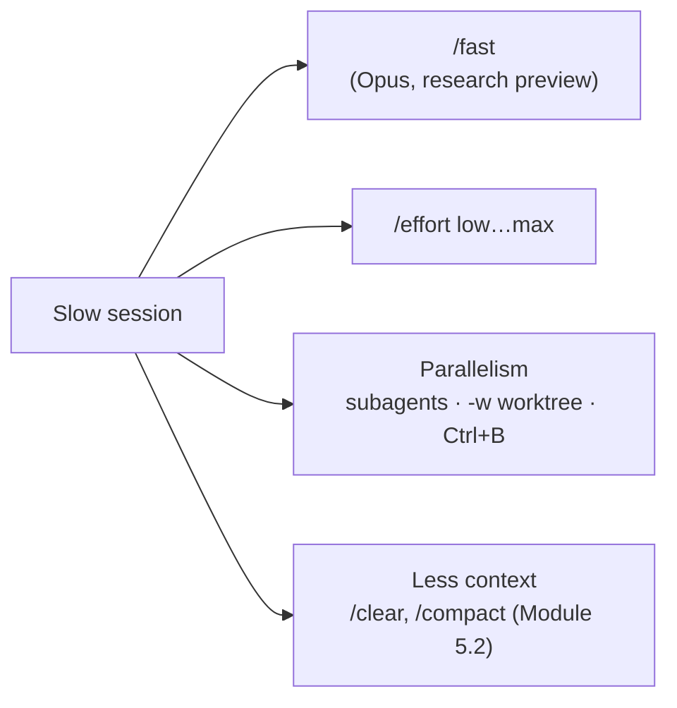

# Module 14.2: Speed Optimization

> **Estimated time**: ~30 minutes
>
> **Prerequisite**: Module 14.1 (Task Optimization)
>
> **Outcome**: After this module, you reach for `/fast`, `/effort`, subagents, worktrees, and
> backgrounded commands — the things that actually change wall-clock time — instead of "Opus is
> slow, use a faster model" folklore.

---

## 1. WHY — Why This Matters

You ask a one-file question and watch the model think for ten seconds on something trivial. Or
you run three unrelated migrations one after another in the same session, when nothing stopped
them from happening at the same time. Neither of those is a "which model is fastest" problem —
Opus itself ships a documented 2.5x-faster mode, and most real wait time comes from serializing
work that didn't need to be serial.

---

## 2. CONCEPT — Core Ideas

Four levers actually move wall-clock time. Everything else — "Haiku is the speed model," a
Speed/Quality/Cost bar chart with made-up scores — is not something the docs support.



**`/fast`** is a research preview: "a high-speed configuration for Claude Opus, making the model
up to 2.5x faster at a higher cost per token." It only exists for **Opus 5.5, Opus 5, and Opus
4.8** — Sonnet, Haiku, and Opus 4.7 don't support it. Toggle it with `/fast` (Space to flip,
Enter to confirm) or `Option+O` / `Alt+O`. The first time you turn it on in a conversation you
pay the full uncached input price for the whole context so far — enabling it early is cheapest.
That cost applies once per conversation; toggling it off and back on later doesn't repeat it.
`CLAUDE_CODE_DISABLE_FAST_MODE=1` turns it off entirely for scripted or shared machines.

**`/effort`** trades reasoning depth for speed on every model, not just Opus: `low`, `medium`,
`high`, `xhigh`, `max` (plus `auto` to clear, `ultracode` for `xhigh` with ultracode on). Opus
5.5/5/4.8 and Sonnet 5 support all five; Opus 4.6 and Sonnet 4.6 lack `xhigh`. Lower is faster;
defaults differ by model — Opus 5.5 defaults to `medium` ("one level below other models"), most
others default to `high`. `--effort` is session-only and doesn't persist.

**Real parallelism** beats any single-session speedup: a subagent (natural language — "use a
subagent to…") runs its own context window alongside yours, up to 20 concurrent
(`CLAUDE_CODE_MAX_CONCURRENT_SUBAGENTS`); `claude -w <name>` (`--worktree`) starts a second
Claude in an isolated git worktree at `<repo>/.claude/worktrees/<name>` — the repo needs at least
one commit first; and `Ctrl+B` backgrounds a Bash command that would otherwise block your session
(tmux: press twice), with `/tasks` to check on or stop it.

**Less context** is Module 5.2's territory (`/clear`, `/compact`) — smaller prompts process
faster regardless of model or effort level.

---

## 3. DEMO — Step by Step

**Step 1: Open `/fast` without turning it on**

```text
# docs: en/fast-mode
/fast
```

```text
# Output may vary — captured from the TUI, not confirmed (Space/Enter left untouched)
  ↯ Fast mode (research preview)
  High-speed mode for Opus 5.5. Draws from usage credits at a higher rate. Separate rate limits
  apply.

    Fast mode  OFF  $8/$40 per Mtok

  Learn more: https://code.claude.com/docs/en/fast-mode

  Space to toggle · Enter to confirm · Esc to cancel
```

`$8/$40` is the Opus 5.5 fast-mode rate; Opus 5 and Opus 4.8 are `$10/$50`. Pressing `Esc` here
costs nothing — you only pay the cache-reset price once you actually confirm it on.

**Step 2: Compare `/effort low` vs `/effort high` on the same prompt**

```bash
# docs: en/model-config — --effort overrides for one session, doesn't persist
time claude -p "Read src/math.js and describe what it exports in one sentence." \
  --effort low --allowedTools Read --output-format json
```

```text
# Output may vary
duration_api_ms: 5629   (wall: 9.2s total)
```

```bash
time claude -p "Read src/math.js and describe what it exports in one sentence." \
  --effort high --allowedTools Read --output-format json
```

```text
# Output may vary
duration_api_ms: 3647   (wall: 7.2s total)
```

Here `high` beat `low` — noise, not a contradiction. A one-file read is too trivial for effort
level to matter; the lever pays off on real reasoning load, not a one-sentence summary.

**Step 3: Run two Claude sessions in separate worktrees at the same time**

```bash
# docs: en/worktrees, en/cli-reference — -w / --worktree
claude -w speed-a -p "Read src/math.js and reply with just the word done." \
  --allowedTools Read --output-format json &
claude -w speed-b -p "Read tests/math.test.mjs and reply with just the word done." \
  --allowedTools Read --output-format json &
wait
git worktree list
```

```text
# Output may vary
/Users/you/cc-lab                            90c242f [main]
/Users/you/cc-lab/.claude/worktrees/speed-a  90c242f [worktree-speed-a] locked
/Users/you/cc-lab/.claude/worktrees/speed-b  90c242f [worktree-speed-b] locked
```

Both finished without waiting on each other or touching the same working directory — the thing
three `claude -p … &` calls in the *same* checkout can't guarantee (Pitfall below).

**Step 4: Background a command that would otherwise hang the session**

Interactively, ask Claude to run `npm test -- --watch` (it never exits on its own). Claude
recognizes that and moves it to the background itself, the same slot `Ctrl+B` uses for a command
you decide to background yourself:

```text
# Output may vary
⏺ Bash(npm test -- --watch)
  ⎿  Running in the background (↓ to manage)
```

`/tasks` shows it running and lets you pull the latest output or stop it:

```text
# Output may vary
  Shell details

  Status:   running
  Runtime:  5s
  Command:  npm test -- --watch

  Output:
  ╭──────────────────────────────────╮
  │ # tests 1                        │
  │ # pass 1                         │
  │ # fail 0                         │
  ╰──────────────────────────────────╯
  ← to go back · Esc/Enter/Space to close · x to stop
```

With `--permission-mode default`, this exact command normally stops for a yes/no prompt first —
answer it before the run starts.

---

## 4. PRACTICE — Try It Yourself

### Exercise 1: Time `/fast` on a real edit

**Goal**: See the fast-mode trade-off for yourself, without paying to keep it on.

**Instructions**:
1. Pick a task Opus would normally take a while on (a multi-file refactor).
2. Time it once with fast mode off.
3. Open `/fast`, confirm it on, run the same class of task, time it.
4. Compare wall time and check `/usage` for the cost delta.

<details>
<summary>💡 Hint</summary>

The first turn after confirming `/fast` re-prices your whole conversation context at the
fast-mode rate — time the *second* fast-mode turn if you want a clean per-turn comparison.

</details>

<details>
<summary>✅ Solution</summary>

Fast mode is Opus-only and a research preview: expect a real speed difference, and expect a real
cost difference (`$8/$40` vs `$4/$20` per MTok on Opus 5.5). Whether it's worth it depends on
what your time is worth per turn.

</details>

### Exercise 2: Split one sequential task into worktrees

**Goal**: Turn three sequential `claude -p` calls into three that actually overlap.

**Instructions**:
1. Find three independent small tasks in a repo with at least one commit.
2. Run them with `claude -w a`, `claude -w b`, `claude -w c` in the background, then `wait`.
3. Confirm with `git worktree list` that each ran in its own checkout.

<details>
<summary>💡 Hint</summary>

`-w` needs an existing commit; a brand-new repo fails with
`Failed to resolve base branch "HEAD": git rev-parse failed`.

</details>

<details>
<summary>✅ Solution</summary>

Three worktrees finish in roughly the time of the slowest one, not the sum — the win is
overlap, not any single session running faster.

</details>

### Exercise 3: Find your own background threshold

**Goal**: Notice when Claude Code backgrounds a command for you.

**Instructions**:
1. Ask Claude to run something that finishes quickly (`ls`).
2. Ask Claude to run something that doesn't exit (`npm test -- --watch` or a dev server).
3. Compare: which one shows up in `/tasks`?

<details>
<summary>💡 Hint</summary>

A command that hits its timeout (120s default) without finishing is moved to the background
automatically too — you don't have to press `Ctrl+B` for that case.

</details>

<details>
<summary>✅ Solution</summary>

Quick commands never touch `/tasks`. Anything that would block the session — watch mode, a dev
server, a long timeout — ends up backgrounded, whether by your `Ctrl+B` or by the timeout.

</details>

---

## 5. CHEAT SHEET

| Command / Key | Effect |
|---|---|
| `/fast` | ⚠️ Research preview. Opus 5.5/5/4.8 only, up to 2.5x faster, higher $/token |
| `Option+O` / `Alt+O` | Toggle fast mode without opening the menu |
| `/effort low\|medium\|high\|xhigh\|max` | Lower = faster, less reasoning depth |
| `--effort <level>` | Same, one session only, doesn't persist |
| `claude -w <name>` / `--worktree` | Second Claude, isolated git worktree, needs an existing commit |
| `Ctrl+B` | Background a running Bash command (tmux: press twice) |
| `/tasks` | List, inspect, or stop background commands |
| `CLAUDE_CODE_DISABLE_FAST_MODE=1` | Disable fast mode outright |
| `CLAUDE_CODE_MAX_CONCURRENT_SUBAGENTS` | Cap on concurrent subagents (default 20) |

---

## 6. PITFALLS — Common Mistakes

| ❌ Mistake | ✅ Correct Approach |
|---|---|
| `claude -p "task 1" & claude -p "task 2" &` in the same checkout | Same working directory, same git index — races and denied writes. Use `claude -w a`, `claude -w b` |
| Treating `/cost` as a speed gauge | `/cost` is an alias for `/usage` — it shows spend, not latency. Use wall-clock timing instead |
| Leaving fast mode on across a whole workday | It's Opus-only, research preview, and priced higher per token; turn it off between fast-mode-worthy tasks |
| Turning `/fast` on for the first time deep into a long session | That first re-price costs more the further in you are — enable it at the start of a session if you'll want it, not mid-task |
| Assuming a lower `/effort` always finishes faster | On trivial tasks the difference is noise; effort pays off on tasks with real reasoning load |

---

## 7. REAL CASE — Production Story

**Scenario**: A Da Nang team ran three unrelated Sonnet migrations back to back in one Claude
Code session — one script's worth of changes, then the next, all serialized with accumulating
context.

**Problem**: Nothing about any individual migration was slow. The wait was entirely from doing
independent work one at a time in a single, growing session.

**Solution**: Same three migrations, three `claude -w` worktrees started together, each with its
own fresh context and its own checkout of the repo. No `/fast`, no effort tuning — the fix was
running independent work independently.

**Result**: The team now defaults to worktrees for anything that doesn't depend on a previous
step's output, and reserves `/effort` and `/fast` for the individual tasks that are genuinely
reasoning-heavy rather than reaching for either as a first move.

---

> **Next**: [Module 14.3: Quality Optimization](../03-quality-optimization/) →
