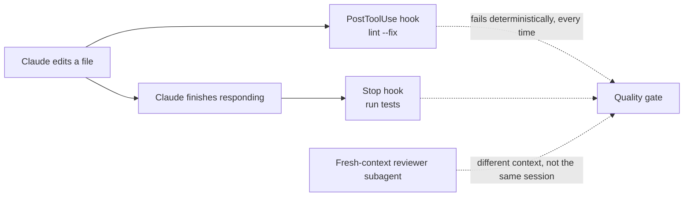

# Module 14.3: Quality Optimization

> **Estimated time**: ~35 minutes
>
> **Prerequisite**: Module 14.2 (Speed Optimization)
>
> **Outcome**: After this module, you can wire a deterministic quality gate — a `PostToolUse`
> lint hook, a `Stop` test hook, and a fresh-context reviewer subagent — instead of asking Claude
> to reason out loud and hoping.

---

## 1. WHY — Why This Matters

Claude ships code fast. It's not quite right: a missing edge case, a lint violation, a design
choice that doesn't survive review. You catch it in code review — after the fact, by hand, every
time. That's not a quality strategy, it's a tax you pay per pull request.

A gate that runs the same way every time, without you asking, beats any prompt phrasing.

---

## 2. CONCEPT — Core Ideas

> "Give Claude a check it can run: tests, a build, a screenshot to compare." (S1)

Verification is one of three kinds: rules-based, visual, or LLM-as-judge (S7). A lint rule is
rules-based; a screenshot diff is visual; a subagent reading a diff is LLM-as-judge — and it only
works with a fresh context, since "the agent that wrote the code has no way to approve it" (S3)
and same-session self-review tends toward "confident praising" over real criticism (S12).



Three real levers, in order of how hard they are to skip:

- **Hooks** — `PostToolUse` after every edit, `Stop` before Claude can end its turn. Deterministic:
  "Unlike CLAUDE.md instructions which are advisory, hooks are deterministic and guarantee the
  action happens" (S1). Module 11.3 covers the mechanics; this module reuses the smallest useful
  pair.
- **A reviewer subagent** — a separate `.claude/agents/reviewer.md` with read-only tools, invoked
  on the diff. It starts with no memory of writing the code, so it reviews it instead of defending
  it.
- **`.claude/rules/` and output styles** — `.claude/rules/` holds coding standards Claude reads
  like any other project file (Module 4.2 covers authoring them); `/output-style
  Explanatory|Learning|Concise|Proactive` changes how much Claude narrates its own reasoning as it
  works, which is a different lever from correctness but shapes how easy a change is to review.

None of this replaces reading the diff yourself. It replaces remembering to ask for a lint pass
and a second opinion on every change.

What doesn't work: telling Claude to reason through it step by step in the prompt. Extended
thinking is already on by default on current models (Module 6.1) — the phrase doesn't add
reasoning budget; it's a leftover habit from models that needed the nudge.

Past "does this look right," a mini-eval beats a vibe: run the same 20-50 real tasks against a
change, read the transcripts, see what actually breaks (S11) — it catches regressions a single
manual review won't.

---

## 3. DEMO — Step by Step

**Step 1: A deterministic lint gate — `PostToolUse`**

```json
// docs: en/hooks — .claude/settings.json
{
  "hooks": {
    "PostToolUse": [
      {
        "matcher": "Edit|Write",
        "hooks": [
          { "type": "command", "command": "jq -r '.tool_input.file_path' | xargs npx eslint --fix" }
        ]
      }
    ]
  }
}
```

Tested directly against the hook's own input, the same way the docs recommend testing a hook
before trusting it (`hooks-guide`):

```bash
echo "{\"tool_input\":{\"file_path\":\"$(pwd)/src/messy.js\"}}" \
  | jq -r '.tool_input.file_path' | xargs npx eslint --fix
```

```text
# Output may vary
/Users/you/cc-lab/src/messy.js
  2:9  error  'unused' is assigned a value but never used  no-unused-vars

✖ 1 problem (1 error, 0 warnings)
```

The missing semicolon got fixed silently; `no-unused-vars` isn't auto-fixable, so it still shows
up — `PostToolUse` can't block (the edit already happened), but its stderr lands next to the tool
result so Claude sees the real problem immediately, not at review time.

**Step 2: A gate Claude can't skip — `Stop`**

```json
// docs: en/hooks
{
  "hooks": {
    "Stop": [
      { "matcher": "*", "hooks": [{ "type": "command", "command": "npm test" }] }
    ]
  }
}
```

```bash
npm test
```

```text
# Output may vary
> cc-lab@1.0.0 test
> node --test
# tests 1
# pass 1
# fail 0
```

A failing `Stop` hook exit-2's and Claude keeps working instead of ending the turn — up to 8
consecutive blocks before Claude Code overrides it, so a genuinely broken test suite can't loop
forever.

**Step 3: A fresh-context reviewer subagent**

```markdown
---
# docs: en/sub-agents — .claude/agents/reviewer.md
name: reviewer
description: Reviews a diff for correctness, style, and missed edge cases. Fresh context — never the session that wrote the code.
tools: Read, Grep, Glob
model: sonnet
---
You are a code reviewer. Read the diff you are given, check it against the
surrounding code, and report concrete, actionable issues. Do not praise; list
problems or state there are none.
```

Invoke it by name so it — not a generic helper — runs the review:

```text
Use the reviewer subagent on the diff of src/messy.js against HEAD
```

{/* AUTHOR-CAPTURE: run
  claude -p "Use the reviewer subagent on the diff of src/messy.js against HEAD
  (git diff HEAD -- src/messy.js)." --allowedTools "Read,Grep,Glob,Bash(git diff*)"
  in a clean ~/cc-lab checkout with no third-party plugins installed. In this author's
  environment, a SubagentStop hook from an installed plugin replaced the reviewer's final
  message with a generic "Task complete," so the captured transcript wasn't representative
  of default behavior — re-run in a plain install to get a real reviewer transcript. */}

The subagent gets the diff and the invoking instruction, plus `CLAUDE.md` and git status — not
your conversation history. Whatever it flags, it flags with no stake in having written the code.

**Step 4: Check the output style**

```text
/output-style
```

```text
# Output may vary
  Output style: default

     Available styles:
     - default (current)
     - Proactive: Claude executes immediately, minimizes interruptions, and prefers action over
       planning
     - Concise: Claude responds tersely, leading with results and skipping preamble and narration
     - Explanatory: Claude explains its implementation choices and codebase patterns
     - Learning: Claude pauses and asks you to write small pieces of code for hands-on practice
```

`Explanatory` is worth the extra text during review-heavy weeks — Claude narrates *why*, which is
exactly what a reviewer needs and a "code only" mode throws away.

---

## 4. PRACTICE — Try It Yourself

### Exercise 1: Wire the two-hook gate

**Goal**: A lint fix and a test run that happen without you asking.

**Instructions**:
1. Add the `PostToolUse` and `Stop` hooks from Step 1–2 to `.claude/settings.local.json`.
2. Ask Claude to make an edit that breaks a test.
3. Confirm the turn doesn't end cleanly until the test passes.

<details>
<summary>💡 Hint</summary>

Check `stop_hook_active` in your own `Stop` hooks if you write more than one — Claude Code
overrides a hook that blocks 8 times in a row without progress.

</details>

<details>
<summary>✅ Solution</summary>

A broken test keeps the `Stop` hook exiting 2 and the turn open; Claude sees the failure and
fixes it before you have to ask — or the 8-block cap kicks in and hands control back to you.

</details>

### Exercise 2: Write your own reviewer

**Goal**: A subagent that reviews your project's most common mistake.

**Instructions**:
1. Pick one recurring review comment from your last few PRs.
2. Write `.claude/agents/reviewer.md` telling it to check specifically for that.
3. Run it on a real diff and see whether it catches what a human reviewer would.

<details>
<summary>💡 Hint</summary>

`tools: Read, Grep, Glob` is enough for a reviewer — it never needs to edit anything.

</details>

<details>
<summary>✅ Solution</summary>

The narrower the reviewer's brief, the more useful it is. "Review everything" produces vague
output; "check every new database call for a missing index" produces a real finding or a clean
bill of health.

</details>

### Exercise 3: Build a 20-task mini-eval

**Goal**: Move past "looks fine to me" for one recurring task type.

**Instructions**:
1. Collect 20 real examples of a task you give Claude often (e.g., "add an endpoint").
2. Run each through the same prompt template.
3. Read every transcript, not just the diffs. Note the pattern in what breaks.

<details>
<summary>💡 Hint</summary>

20-50 real tasks is the range S11 uses — fewer than that and one outlier skews your read.

</details>

<details>
<summary>✅ Solution</summary>

Most teams find one or two recurring failure modes, not twenty different ones. Fix the prompt or
add a hook for those, then re-run the same 20 tasks to confirm it's fixed.

</details>

---

## 5. CHEAT SHEET

| Lever | What it guarantees |
|---|---|
| `PostToolUse` hook (lint `--fix`) | Runs after every edit, every time — advisory prompt text doesn't |
| `Stop` hook (`npm test`) | Blocks the turn from ending until it passes (cap: 8 consecutive blocks) |
| `.claude/agents/reviewer.md` | Fresh-context review — no bias toward code it just wrote |
| `.claude/rules/` | Coding standards Claude reads as project files (Module 4.2) |
| `/output-style Explanatory` | Claude narrates *why*, useful during review-heavy work |
| 20-50 task mini-eval (S11) | Replaces "looks right" with "verified on real cases" |

---

## 6. PITFALLS — Common Mistakes

| ❌ Mistake | ✅ Correct Approach |
|---|---|
| "Think step by step" to raise quality | Extended thinking is already on by default (Module 6.1); the phrase does nothing on current models |
| Letting the same session review its own diff | Spawn a fresh-context reviewer subagent (S3, S12) |
| Coding standards only in a prompt or CLAUDE.md | Advisory, not enforced — back them with a `PostToolUse` hook for anything non-negotiable |
| Accepting the first output with no check to run | Give Claude a test or lint pass it can run against itself (S1) |
| One glance at a diff as your whole quality process | A 20-50 task mini-eval catches patterns a single review misses (S11) |

---

## 7. REAL CASE — Production Story

**Scenario**: A Hanoi team reviewed every Claude-authored pull request the same way they reviewed
human ones — a full manual pass, every time, because nothing ran automatically in between.

**Problem**: The same three issues kept reaching review: an unhandled null case, an inconsistent
error-logging call, a missing test for the new branch. None of them needed a human to catch.

**Solution**: A `PostToolUse` lint hook for the logging convention, a `Stop` hook that fails the
turn if `npm test` doesn't pass on the new file, and a `.claude/agents/reviewer.md` scoped
specifically to null-safety and test coverage, run on every diff before it reached a human.

**Result**: Reviewers stopped re-finding the same three issues and started reviewing design and
naming instead — the things a hook and a scoped subagent can't judge for them.

---

> **Next**: [Module 14.4: Cost Optimization](../04-cost-optimization/) →
