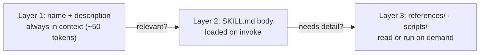

# Module 15.3: Claude Code Skills

> **Estimated time**: ~35 minutes
>
> **Prerequisite**: Module 15.2 (Command & Prompt Templates)
>
> **Outcome**: After this module, you will be able to create a project skill in
> `.claude/skills/<name>/SKILL.md`, invoke it with `/<name>` or let Claude auto-apply it, and
> inspect skills with `/skills`.

---

## 1. WHY — Why This Matters

Every time you ask for tests you paste the same five lines: "use `node:test`, one `test()` per
export, cover the edge case, don't touch the source." Your teammate pastes a different version. So
it went into `CLAUDE.md`, which is now 400 lines Claude reads on every turn.

The docs: "Create a skill when you keep pasting the same instructions, checklist, or multi-step
procedure into chat, or when a section of CLAUDE.md has grown into a procedure rather than a
fact." A skill is that procedure in a folder, loaded only when needed.

---

## 2. CONCEPT — Core Ideas

### A skill is a folder with a `SKILL.md`

```text
.claude/skills/test-file/
├── SKILL.md          # frontmatter (when to use) + instructions (what to do)
├── references/       # optional: long docs, loaded only when Claude opens them
└── scripts/          # optional: helpers Claude runs, never loaded into context
```

The directory name becomes the command (`/test-file`). The `---` must be the file's first line.

### Progressive disclosure: three layers (S8)

Anthropic's Agent Skills post explains why skills are cheap: only name and description are
always in context; the body and linked files load on demand.



Once invoked, the body "stays there across later turns" and is not re-read: write it "as
standing instructions rather than one-time steps".

### Where skills live

| Location | Path | Loads in |
|---|---|---|
| Project | `.claude/skills/<name>/SKILL.md` | This repo; commit it for the team |
| Personal | `~/.claude/skills/<name>/SKILL.md` | All your projects on this machine |
| Plugin | `<plugin>/skills/<name>/SKILL.md` | Where the plugin is enabled, as `/plugin-name:name` |

Enterprise skills ship via managed settings; enterprise beats personal, which beats project.

### Who invokes it

| Frontmatter | You | Claude | In context |
|---|---|---|---|
| (default) | Yes | Yes | Description always; body on invoke |
| `disable-model-invocation: true` | Yes | No | Nothing until you type `/name` |
| `user-invocable: false` | No | Yes | Description always; body on invoke |

Side effects get `disable-model-invocation: true`: "You don't want Claude deciding to deploy
because your code looks ready."

### Dynamic content in the body

| Syntax | What happens |
|---|---|
| `$ARGUMENTS` | Everything typed after `/name` |
| `$0`, `$1` | First, second argument (0-based) |
| `` !`git diff HEAD` `` | Runs **before** Claude sees the skill; output replaces the line |
| `@src/math.js` | Attaches that file's content |
| `${CLAUDE_SKILL_DIR}` | The skill's own directory, for `scripts/` paths |

### Commands vs skills

"Custom commands have been merged into skills." `.claude/commands/deploy.md` and
`.claude/skills/deploy/SKILL.md` both create `/deploy`; command files keep working. Skills add
supporting files, invocation control, and auto-loading; on a name clash the skill runs.

---

## 3. DEMO — Step by Step

Lab: `~/cc-lab` (`src/math.js`, `tests/math.test.mjs`, `npm test`).

**Step 1: Create the skill**

```bash
# docs: skills
mkdir -p .claude/skills/test-file
cat > .claude/skills/test-file/SKILL.md <<'EOF'
---
name: test-file
description: Write a node:test file for a given source file. Use when the user asks to add tests, write tests, or cover a module with tests.
argument-hint: "<path>"
allowed-tools: Read, Write
---

Write a `node:test` test file for the source file `$ARGUMENTS`.

1. Read `$ARGUMENTS` and list every exported function.
2. Write `tests/<basename>.test.mjs` (replace it if it exists) that imports
   `test` from `node:test` and `assert` from `node:assert/strict`.
3. Add one `test()` per exported function plus one edge case
   (for example dividing by zero).
4. Do not modify the source file. Do not run the tests; tell the user to run `npm test`.
EOF
```

Description = trigger phrases; body = procedure; `allowed-tools` pre-approves `Read` and `Write`.

**Step 2: Check the frontmatter parses**

```bash
# docs: skills (Troubleshooting) · requires v2.1.233+
claude plugin validate .claude/skills
```

```text
# Output may vary
Validating components in: /Users/luatnq/cc-lab/.claude/skills

✔ Validation passed
```

**Step 3: Invoke it by name**

In `claude`, type:

```text
/test-file src/math.js
```

```text
# Output may vary
❯ /test-file src/math.js

⏺ Two exports: add and divide. Replacing the existing tests/math.test.mjs.
  ⎿  $ cat > /Users/luatnq/cc-lab/tests/math.test.mjs <<'EOF'
     …
⏺ Wrote tests/math.test.mjs (replaced the existing file). It covers both exports
  from src/math.js:

  - add — sums two numbers
  - divide — returns the quotient
  - edge case — divide(1, 0) is Infinity, divide(0, 0) is NaN

  The source file is untouched. Run npm test to execute them.
```

`$ARGUMENTS` became `src/math.js`. This machine runs in auto mode, so Claude used a heredoc
instead of the pre-approved `Write`; in default mode `Write` runs unprompted and other tools ask.

**Step 4: See it in `/skills`**

Type `/skills`, then `test-file`:

```text
# Output may vary
Skills
  1/196 skills · type to filter · ↓/enter to select · esc to clear

╭──────────────────────────────────────────╮
│ ⌕ test-file                              │
╰──────────────────────────────────────────╯
❯ ✔ on         test-file · project · ~50 tok
```

`~50 tok` is layer 1, paid every turn. `Space` cycles a skill through the states `on`,
`name-only`, `user-only`, `off`; `Esc` clears the filter, a second `Esc` saves to
`.claude/settings.local.json` as `skillOverrides` and closes.

**Step 5: Let Claude trigger it from a plain request**

Restore the test file (`git checkout -- tests/`), then ask without naming the skill:

```bash
# docs: skills, cli-reference
claude -p "add tests for src/math.js" --permission-mode acceptEdits
```

```text
# Output may vary
Wrote `tests/math.test.mjs` (replacing the previous version, which only tested `add`). It covers:

- `add` — positive, negative-cancelling, and float inputs
- `divide` — exact, negative, and fractional results
- **divide by zero** edge case — `Infinity`, `-Infinity`, and `NaN` for `0/0`

`src/math.js` is untouched. Per the skill I didn't run the tests — run `npm test` to verify.
```

"Per the skill" is a hint, not proof. Find the `Skill` tool call in the stream:

```bash
# docs: cli-reference
claude -p "add tests for src/math.js" --permission-mode acceptEdits \
  --output-format stream-json --verbose | grep -o '"name":"Skill","input":{[^}]*}'
```

```text
# Output may vary
"name":"Skill","input":{"skill":"test-file","args":"src/math.js"}
```

**Step 6: Measure what your skills cost**

```bash
# docs: skills (Find unused skills) · requires v2.1.252+
claude -p "/skill-doctor"
```

```text
# Output may vary
Skills loaded this session

  skill                 source            context  7d tokens   uses  last used
  …
  test-file             projectSettings       ~50          -     1×  today
  …
  context = this skill's one-line listing in the system prompt, included every turn
  (dash = not in the current listing, costs nothing; full SKILL.md loads only when it runs)

8 skills synced from claude.ai loaded but never invoked. Each one adds to the system prompt every turn.
```

---

## 4. PRACTICE — Try It Yourself

### Exercise 1: A skill Claude must never run on its own

**Goal**: A user-only `/changelog` that writes `CHANGELOG.md` from git history.

**Instructions**:
1. Create `.claude/skills/changelog/SKILL.md` with `disable-model-invocation: true`.
2. Inject the last 20 commits: `` !`git log --oneline -20` ``.
3. Ask "update the changelog": Claude does **not** run the skill. Then run `/changelog`.

**Expected result**: Only `/changelog` writes the file ("If Claude tries anyway, Claude Code
blocks the call").

<details>
<summary>💡 Hint</summary>
With `disable-model-invocation: true` the description is not in context, so nothing matches.
</details>

<details>
<summary>✅ Solution</summary>

```markdown
---
description: Write CHANGELOG.md from recent commits
disable-model-invocation: true
allowed-tools: Write
---

**Recent commits**

!`git log --oneline -20`

Group the commits above under Added / Changed / Fixed and write them to CHANGELOG.md
under a new "Unreleased" heading. Do not edit any other file.
```

A non-zero exit from the `!` command aborts the invocation; add `|| true` if it may fail.
</details>

### Exercise 2: A skill with a reference file

**Goal**: Keep a long style guide out of context until needed.

**Instructions**:
1. Create `.claude/skills/api-style/references/style.md` with 30+ lines of API conventions.
2. Link it from `SKILL.md` and ask Claude to add an endpoint.

**Expected result**: The Skills row in `/context` stays small; Claude reads `style.md` only when
writing code ("Keep `SKILL.md` under 500 lines").

<details>
<summary>✅ Solution</summary>

```markdown
---
description: API design conventions for this codebase. Use when adding or changing HTTP endpoints.
user-invocable: false
---

When writing endpoints, follow the naming and error-format rules in
[references/style.md](references/style.md). Read it before writing code.
```

`user-invocable: false`: knowledge, not an action.
</details>

### Exercise 3: Convert a command file into a skill

**Goal**: Move `.claude/commands/review-diff.md` to `.claude/skills/review-diff/SKILL.md`.

**Instructions**:
1. Create the command file and confirm `/review-diff` works.
2. `mkdir -p .claude/skills/review-diff && git mv .claude/commands/review-diff.md
   .claude/skills/review-diff/SKILL.md`.
3. Add `context: fork` and `agent: Explore` for a read-only subagent.

**Expected result**: `/review-diff` runs the skill (it beats a same-named command file) in a
background subagent that never sees your conversation; the result arrives when it completes.

<details>
<summary>💡 Hint</summary>
Not `review`: "the bundled alias `/review` never runs your skill".
</details>

<details>
<summary>✅ Solution</summary>

```markdown
---
description: Review the uncommitted diff for bugs and missing tests
context: fork
agent: Explore
allowed-tools: Bash(git diff *)
---

**Diff**

!`git diff HEAD`

Review the diff above. List bugs, missing error handling, and untested paths,
with file and line references. Do not edit files.
```
</details>

---

## 5. CHEAT SHEET

| Frontmatter field | Meaning |
|---|---|
| `name` | Display name; the command comes from the directory name |
| `description` | What it does and when. Claude matches requests against this |
| `argument-hint` | Autocomplete hint, e.g. `[filename] [format]` |
| `disable-model-invocation: true` | Only you can run it |
| `user-invocable: false` | Only Claude can run it |
| `allowed-tools` | Tools pre-approved for the invoking turn only |
| `model` | "Model to use when this skill is active"; applies for the rest of the turn |
| `context: fork` + `agent` | Run as a subagent (`Explore`, `Plan`, `general-purpose`, custom) |

| Command / syntax | Purpose |
|---|---|
| `/<name> args` | Invoke; `/a /b args` stacks up to six |
| `/skills` | List, filter, sort (`t`), cycle visibility (`Space`), save (`Esc`) |
| `/skill-doctor` | Per-skill context cost and usage; text with `-p` |
| `claude plugin validate .claude/skills` | Find `SKILL.md` files that don't parse |
| `"skillOverrides": {"deploy": "off"}` | Hide a skill without editing it |
| `Skill(deploy *)` in `permissions.deny` | Block Claude invoking it |

---

## 6. PITFALLS — Common Mistakes

| ❌ Mistake | ✅ Correct Approach |
|---|---|
| Looking for a `skill install` subcommand | None exists. A skill is a directory: copy it into `.claude/skills/`, commit it, or ship it as a plugin (Module 15.5) |
| `description: Helper for tests` | Brief it like a new hire (S9): what it does **and** when, in the phrases people type |
| A deploy skill with no `allowed-tools` | It works only because you click through prompts. Declare exact tools (`Bash(git push *)`) and set `disable-model-invocation: true` |
| Every workflow in `CLAUDE.md` | (S15) "Aim to keep CLAUDE.md under 200 lines by including only essentials"; procedures go in skills |
| Trusting `allowed-tools` in a repo you did not write | It applies even in an untrusted folder or a `-p` run. Read `SKILL.md` first |
| Treating a skill as a guardrail | "A skill is a control, though an advisory one." (S3) Enforce hard rules with hooks (Module 11.3) or `permissions.deny` |

---

## 7. REAL CASE — Production Story

**Scenario**: A Ho Chi Minh City fintech team integrates a payment gateway with three Vietnamese
banks. Every few months a new engineer reproduces the same bug class: amounts as floating point,
VND with decimals, no idempotency key on retries. The rules lived in a 500-line `CLAUDE.md`.

**Problem**: `CLAUDE.md` loaded every turn, so context filled fast and adherence dropped; review
kept catching the same bugs.

**Solution**: The team moved the rules into `.claude/skills/vn-payment-rules/` with
`user-invocable: false` and a description naming the triggers ("payment", "VNPay", "MoMo",
"refund"). `SKILL.md` holds six non-negotiables; `references/bank-specs.md` holds each bank's
field formats and loads only when Claude touches an adapter. `CLAUDE.md` shrank under 200 lines.
This is Anthropic's own secure-SDLC pattern (S4): "those guidelines are encoded in CLAUDE.md files
and references to org-wide skills so the code follows these best practices the minute it's
generated", and when an agent finds a new bug class, "the relevant file is updated to prevent it
recurring".

**Result**: Rules apply at generation time, not review time; a new bank is a new section in
`bank-specs.md`. A hook (Module 11.3) remains the deterministic backstop for the rule that must
never slip: no `float` under `payments/`.

---

> **Next**: [Module 15.4: Community Ecosystem](../04-community-ecosystem/) →
