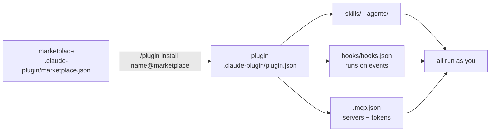

# Module 15.4: Community Ecosystem

> **Estimated time**: ~30 minutes
>
> **Prerequisite**: Module 15.3 (Claude Code Skills)
>
> **Outcome**: After this module, you will be able to add a plugin marketplace, inspect a
> plugin's hooks and MCP config before installing it, install it at project scope so your team
> gets it, and restrict which marketplaces and MCP servers a team may use.

---

## 1. WHY — Why This Matters

Someone on the team pastes "install this plugin, it's great" with a GitHub link. It ships a
`SessionStart` hook, a `Stop` hook and an MCP server that wants a token. Everyone installs it
because it is popular; nobody reads it. Six weeks later those hooks still run at every session start
and every turn end in a repo that holds bank credentials.

The docs are blunt: "Plugins and marketplaces are highly trusted components that can execute
arbitrary code on your machine with your user privileges." So: read before installing, as a team
rule.

---

## 2. CONCEPT — Core Ideas

### Two steps: marketplace, then plugin

A **marketplace** is a git repo (or directory, or URL) with `.claude-plugin/marketplace.json`
listing plugins. Add it once, then install plugins from it as `name@marketplace`.



### Where plugins come from

| Source | Add / install | What is there |
|---|---|---|
| `claude-plugins-official` | Auto-registered; browse in `/plugin` → **Discover** or claude.com/plugins | Anthropic's catalogue, e.g. `/plugin install github@claude-plugins-official` |
| `anthropics/claude-plugins-community` | `/plugin marketplace add anthropics/claude-plugins-community` → `name@claude-community` | Community plugins |
| `anthropics/claude-code` | `/plugin marketplace add anthropics/claude-code` → `claude-code-plugins` | Anthropic's own repo: `commit-commands`, `security-guidance`, `plugin-dev`, `hookify`, … |
| `anthropics/skills` | `/plugin marketplace add anthropics/skills` → `anthropic-agent-skills` | `document-skills` (docx/pdf/pptx/xlsx), `example-skills`, `claude-api`, … many Apache 2.0 |
| Your own repo | `/plugin marketplace add your-org/claude-plugins` | Internal plugins |
| Curated lists | e.g. [awesome-claude-code](https://github.com/hesreallyhim/awesome-claude-code) | A list, not a review |

The docs' warning covers all of them: "Anthropic doesn't control what MCP servers,
files, or other software are included in plugins and can't verify that they work as intended."

### Scopes: who gets the plugin

| Scope | Written to | Use for |
|---|---|---|
| `user` (CLI default) | `~/.claude/settings.json` | Your machine only |
| `project` | `.claude/settings.json`: `extraKnownMarketplaces` + `enabledPlugins` | Commit it; teammates get it after folder trust |
| `local` | `.claude/settings.local.json` | This checkout only |
| `managed` | Managed settings | Org-wide, not overridable |

### The pre-install checklist

Before `/plugin install`, open the source and answer five questions:

1. **Who publishes it?** Org, commit history, known marketplace.
2. **`hooks/hooks.json`**: which events (`UserPromptSubmit` and `Stop` fire every turn,
   `SessionStart` "when a session begins or resumes") and what the scripts do.
3. **`.mcp.json`**: which endpoints, which tokens go into `headers` or `env`.
4. **Skills**: `allowed-tools`, `` !`commands` ``, `disable-model-invocation` on side effects.
5. **Does it need all that?** A commit helper does not need a `Stop` hook.

### Team controls (enforced, not advisory)

| Setting | Scope | Effect |
|---|---|---|
| `enabledPlugins` | any; managed `false` blocks every scope | On/off per plugin; project overrides user |
| `extraKnownMarketplaces` | any; repo settings honored after trust | Auto-add marketplaces for a project |
| `strictKnownMarketplaces` | **managed only** | Allowlist of sources; `[]` locks down everything, official included |
| `blockedMarketplaces` | managed | Denylist |
| `allowedMcpServers` | any; "Deploy it in managed settings to enforce it" | Allowlist by `serverName`, `serverCommand`, `serverUrl`; covers plugin servers |

---

## 3. DEMO — Step by Step

Run in `~/cc-lab`. The steps use the `claude plugin …` shell form so output is reproducible;
`/plugin …` inside a session does the same.

**Step 1: See which marketplaces you already have**

```bash
# docs: plugin-marketplaces
claude plugin marketplace list
```

```text
# Output may vary
Configured marketplaces:

  ❯ claude-plugins-official
    Source: GitHub (anthropics/claude-plugins-official)
  …
```

**Step 2: Add Anthropic's repo marketplace at project scope**

```bash
# docs: plugin-marketplaces, discover-plugins
claude plugin marketplace add anthropics/claude-code --scope project
cat .claude/settings.json
```

```text
# Output may vary
Adding marketplace…Cloning via SSH: git@github.com:anthropics/claude-code.git
Refreshing marketplace cache (timeout: 120s)…
Clone complete, validating marketplace…
✔ Successfully added marketplace: claude-code-plugins (declared in project settings)
{
  "extraKnownMarketplaces": {
    "claude-code-plugins": {
      "source": {
        "source": "github",
        "repo": "anthropics/claude-code"
      }
    }
  }
}
```

The name comes from the marketplace's `marketplace.json`, not the repo.

**Step 3: Read before you install**

The marketplace is a public repo, so read what it will run:

```bash
# docs: plugins-reference (hooks/hooks.json, .mcp.json layout)
curl -s https://raw.githubusercontent.com/anthropics/claude-code/main/plugins/security-guidance/hooks/hooks.json \
  | jq -c '.hooks | keys'
for f in commit commit-push-pr clean_gone; do
  echo "== $f.md"
  curl -s https://raw.githubusercontent.com/anthropics/claude-code/main/plugins/commit-commands/commands/$f.md \
    | grep allowed-tools
done
curl -s https://raw.githubusercontent.com/anthropics/claude-plugins-official/main/external_plugins/github/.mcp.json
```

```text
# Output may vary
["PostToolUse","SessionStart","Stop","UserPromptSubmit"]
== commit.md
allowed-tools: Bash(git add:*), Bash(git status:*), Bash(git commit:*)
== commit-push-pr.md
allowed-tools: Bash(git checkout --branch:*), Bash(git add:*), Bash(git status:*), Bash(git push:*), Bash(git commit:*), Bash(gh pr create:*)
== clean_gone.md
{
  "github": {
    "type": "http",
    "url": "https://api.githubcopilot.com/mcp/",
    "headers": {
      "Authorization": "Bearer ${GITHUB_PERSONAL_ACCESS_TOKEN}"
    }
  }
}
```

`security-guidance` hooks four events, including every prompt and every stop: that is its job, but
know it before it runs on a repo with secrets. `commit-commands` is three command files: `/commit`
can only add, status and commit; `/commit-push-pr` may also push, create branches and open PRs; and
`/clean_gone`, which deletes local branches and worktrees, pre-approves nothing, so every command
prompts. The official `github` plugin is an HTTP MCP server that sends your
`GITHUB_PERSONAL_ACCESS_TOKEN` to `api.githubcopilot.com`. None of this is hidden; it is only
unread.

**Step 4: Install at project scope**

```bash
# docs: discover-plugins, plugins-reference
claude plugin install commit-commands@claude-code-plugins --scope project
cat .claude/settings.json
```

```text
# Output may vary
Installing plugin "commit-commands@claude-code-plugins"...✔ Successfully installed plugin: commit-commands@claude-code-plugins (scope: project)
{
  "extraKnownMarketplaces": { "claude-code-plugins": { … } },
  "enabledPlugins": {
    "commit-commands@claude-code-plugins": true
  }
}
```

**Step 5: List it from inside a session**

Start `claude` and type `/plugin list`:

```text
# Output may vary
❯ /plugin list
  ⎿  Installed plugins:
       • commit-commands@claude-code-plugins (v1.0.0, project) ✔ enabled
       …
```

**Step 6: Remove it cleanly**

```bash
# docs: plugins-reference, plugin-marketplaces
claude plugin uninstall commit-commands@claude-code-plugins --scope project
claude plugin marketplace remove claude-code-plugins
```

```text
# Output may vary
✔ Successfully uninstalled plugin: commit-commands (scope: project)
✔ Successfully removed marketplace: claude-code-plugins
```

Removing a marketplace "also uninstalls any plugins you installed from it".

---

## 4. PRACTICE — Try It Yourself

### Exercise 1: Audit a plugin you did not write

**Goal**: Apply the checklist to `anthropics/skills`.

**Instructions**:
1. `claude plugin marketplace add anthropics/skills --scope local`.
2. Read the repo's `.claude-plugin/marketplace.json` and list the plugin names.
3. For `document-skills`, note the tools each `SKILL.md` needs and whether any hook or
   `.mcp.json` exists. Then `claude plugin marketplace remove anthropic-agent-skills`.

**Expected result**: One sentence saying what the plugin runs and with which tools.

<details>
<summary>✅ Solution</summary>

```bash
curl -s https://raw.githubusercontent.com/anthropics/skills/main/.claude-plugin/marketplace.json \
  | jq -c '.plugins[] | {name, skills, hooks, mcpServers}'
```

```text
# Output may vary
{"name":"document-skills","skills":["./skills/xlsx","./skills/docx","./skills/pptx","./skills/pdf"],"hooks":null,"mcpServers":null}
{"name":"example-skills","skills":["./skills/algorithmic-art",…],"hooks":null,"mcpServers":null}
{"name":"claude-api","skills":["./skills/claude-api"],"hooks":null,"mcpServers":null}
{"name":"academy-guide","skills":["./skills/academy-guide"],"hooks":null,"mcpServers":null}
{"name":"discernment-nudge","skills":["./skills/discernment-nudge"],"hooks":null,"mcpServers":null}
```

`document-skills`: four skills with `scripts/`, no hooks, no MCP servers, no `allowed-tools`, so
each script goes through your normal permission flow. Their `SKILL.md` files say
`license: Proprietary`; the README's Apache 2.0 covers other skills.
</details>

### Exercise 2: Lock a team down

**Goal**: Managed settings that allow only the official marketplace, your org's repo, and one
MCP server.

<details>
<summary>✅ Solution</summary>

```json
{
  "strictKnownMarketplaces": [
    { "source": "github", "repo": "anthropics/claude-plugins-official" },
    { "source": "github", "repo": "your-org/claude-plugins" }
  ],
  "allowedMcpServers": [
    { "serverUrl": "https://mcp.internal.example.com/*" }
  ]
}
```

`strictKnownMarketplaces` is managed-only and gates marketplace sources. `allowedMcpServers`
works in any settings file but is enforced org-wide only from managed settings, and it does cover
servers a plugin ships.
</details>

### Exercise 3: Publish the plugin from Module 15.5 internally

**Goal**: A private marketplace your team adds with one command.

<details>
<summary>✅ Solution</summary>

```json
{
  "name": "acme-tools",
  "owner": { "name": "ACME Platform Team" },
  "plugins": [
    {
      "name": "cc-lab-plugin",
      "source": "./plugins/cc-lab-plugin",
      "description": "Test-writing skill plus post-write test hook"
    }
  ]
}
```

Save as `.claude-plugin/marketplace.json` next to `plugins/cc-lab-plugin/`, run
`claude plugin validate .` (`✔ Validation passed with warnings` until you add a `description`),
push, then `/plugin marketplace add your-org/acme-tools` and
`/plugin install cc-lab-plugin@acme-tools`.
</details>

---

## 5. CHEAT SHEET

| Command / setting | Purpose |
|---|---|
| `/plugin` | Menu: Discover · Installed · Marketplaces · Errors · Stats |
| `/plugin marketplace add owner/repo` (`./dir`, git URL, `owner/repo@ref`) | Register a marketplace |
| `/plugin marketplace list` · `update <name>` · `remove <name>` | Manage marketplaces |
| `/plugin install name@marketplace` | Install; prompts for scope |
| `/plugin install name --marketplace owner/repo` | Add + install in one step (v2.1.275+) |
| `/plugin uninstall name@marketplace` · `enable` · `disable` · `list` | Manage plugins |
| `claude plugin install name@marketplace -s project` | Shell form; user scope unless `-s` |
| `claude plugin validate .` | Check a `marketplace.json` or `plugin.json` |
| `/reload-plugins` | Activate without restarting |
| `"enabledPlugins": {"name@market": true}` | Per-scope on/off; managed `false` blocks everywhere |
| `"extraKnownMarketplaces"` | Auto-add for a project (after folder trust) |
| `"strictKnownMarketplaces": []` | Managed lockdown; list sources to allow |
| `"allowedMcpServers"` | MCP allowlist; enforced from managed settings |

---

## 6. PITFALLS — Common Mistakes

| ❌ Mistake | ✅ Correct Approach |
|---|---|
| Install counts, star counts or awesome-lists as due diligence | They say something exists and is popular. Run the five-question checklist yourself |
| User scope for a team tool | `--scope project` writes `enabledPlugins` to `.claude/settings.json`; commit it |
| "It's an official plugin, so it's safe" | Same warning applies. `github@claude-plugins-official` sends a token to an HTTP server: fine if you meant that |
| Putting `strictKnownMarketplaces` in `.claude/settings.json` | It is managed-only. Project settings get `enabledPlugins` / `extraKnownMarketplaces` |
| Treating a plugin's hook as harmless because it "only reminds" | It runs a script with your privileges on each event; read the script, not the description |

---

## 7. REAL CASE — Production Story

**Scenario**: A Hanoi outsourcing company runs Claude Code across a dozen client repos, some with
banking credentials in CI. Developers added marketplaces freely; nobody could say which hooks ran
where.

**Problem**: A client security review asked "what third-party code executes when your engineers
open our repo?" The honest answer was "we don't know".

**Solution**: Plugins became a reviewed artefact: every proposal is a PR to
`your-org/claude-plugins` copying the plugin in with a filled checklist (events in
`hooks/hooks.json`, endpoints and tokens in `.mcp.json`, `allowed-tools` per skill). Managed
settings set `strictKnownMarketplaces` to the official marketplace plus that repo, and
`allowedMcpServers` to two internal servers. Each project's `.claude/settings.json` carries
`extraKnownMarketplaces` and `enabledPlugins`, so a checkout declares what runs in it. Same rule
Anthropic applies to its agents (S4): "Give every agent a single-purpose identity with the minimum
permissions for its job".

**Result**: The client question now has a file as its answer; a new hook cannot reach a repo
without a PR review. Adding a plugin takes a day, not a minute, which is the point.

---

> **Next**: [Module 15.5: Custom Skill Development](../05-custom-skill-development/) →
