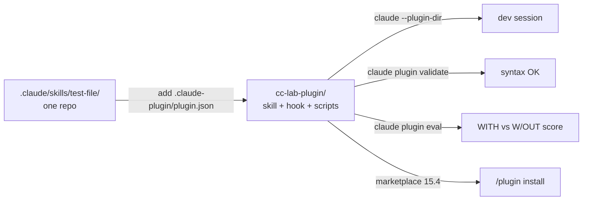

# Module 15.5: Custom Skill Development

> **Estimated time**: ~45 minutes
>
> **Prerequisite**: Module 15.3 (Claude Code Skills), Module 15.4 (Community Ecosystem)
>
> **Outcome**: After this module, you will be able to package a skill together with a hook and
> its scripts as a plugin in `.claude-plugin/plugin.json`, check it with `claude plugin validate`,
> load it with `claude --plugin-dir`, and measure it with `claude plugin eval`.

---

## 1. WHY — Why This Matters

The `test-file` skill from Module 15.3 works in one repo. Three other repos copy-pasted it, each
copy drifted, and the hook that runs the tests after every write lives in three different
`settings.json` files. Nobody knows which copy is current, and nobody has measured whether the
skill actually changes what Claude does.

A plugin fixes both problems: one versioned folder that carries the skill, its scripts and its
hook, that you can validate, load anywhere with a flag, and score with a real eval.

---

## 2. CONCEPT — Core Ideas

### From a skill to a plugin

"Start with standalone configuration in `.claude/` for quick iteration, then convert to a plugin
when you're ready to share." The only new file is the manifest:

```text
cc-lab-plugin/
├── .claude-plugin/
│   └── plugin.json        # manifest: name (required), description, version, author
├── skills/
│   └── test-file/
│       ├── SKILL.md       # < 500 lines; links to references/, calls scripts/
│       ├── references/    # long material, loaded only when Claude opens it
│       └── scripts/       # helpers Claude runs, never loaded into context
├── hooks/
│   └── hooks.json         # same shape as the hooks block in settings.json
├── scripts/               # hook scripts, addressed as ${CLAUDE_PLUGIN_ROOT}/scripts/…
├── agents/                # optional subagents
└── .mcp.json              # optional MCP servers
```

Two rules from the docs: only `plugin.json` goes inside `.claude-plugin/` ("Don't put `commands/`,
`agents/`, `skills/`, or `hooks/` inside the `.claude-plugin/` directory"), and plugin skills are
namespaced: `skills/test-file/SKILL.md` becomes `/cc-lab-plugin:test-file`. Inside the plugin, a
skill's `name` sets the last segment of that command.



### Three ways to load a plugin

| How | Command | Use for |
|---|---|---|
| Directory flag | `claude --plugin-dir ./cc-lab-plugin` (repeatable) | Development; `/reload-plugins` picks up edits |
| Skills directory | `claude plugin init my-tool` → `~/.claude/skills/my-tool/` | Personal plugin, loads as `my-tool@skills-dir` |
| Marketplace | `/plugin install name@marketplace` | Team and public distribution (Module 15.4) |

### Writing a description that triggers

Claude picks a skill from its listing, so the description is the whole interface. Describe it
like a tool for a new hire (S9): what it does, then when. The docs' troubleshooting rule: "Check
the description includes keywords users would naturally say", and put the key use case first
because the listing truncates at 1,536 characters. Too many triggers? Make it more specific, or
set `disable-model-invocation: true`.

### The testing ladder

1. **`claude plugin validate ./plugin`**: manifest and frontmatter parse. Cheap, catches typos,
   catches nothing about behaviour.
2. **Three real prompts** without naming the skill, then `/skill-doctor` (Module 15.3) to see
   whether it fired.
3. **`claude plugin eval .`** (v2.1.269+): each case runs three times with the plugin and three
   times without, and graders score every run. The `Δ` column is what the plugin contributed. Every
   run is a real model call on your account.

---

## 3. DEMO — Step by Step

Run in `~/cc-lab` (git repo, `src/math.js`, `tests/math.test.mjs`, `npm test`). The skill is the
one from Module 15.3; the hook runs the suite after every test-file write and reports back.

**Step 1: Create the plugin**

```bash
# docs: plugins, plugins-reference
mkdir -p cc-lab-plugin/.claude-plugin cc-lab-plugin/skills/test-file \
         cc-lab-plugin/hooks cc-lab-plugin/scripts

cat > cc-lab-plugin/.claude-plugin/plugin.json <<'EOF'
{
  "name": "cc-lab-plugin",
  "description": "Test-writing skill plus a hook that runs the suite after every test file write",
  "version": "0.1.0",
  "author": { "name": "cc-lab" }
}
EOF

cat > cc-lab-plugin/skills/test-file/SKILL.md <<'EOF'
---
name: test-file
description: Write a node:test file for a given source file. Use when the user asks to add tests, write tests, or cover a module with tests.
argument-hint: "<path>"
allowed-tools: Read, Write
---

Write a `node:test` test file for the source file `$ARGUMENTS`.

1. Read `$ARGUMENTS` and list every exported function.
2. Use the Write tool to create `tests/<basename>.test.mjs` (replace it if it exists)
   that imports `test` from `node:test` and `assert` from `node:assert/strict`.
3. Add one `test()` per exported function plus one edge case
   (for example dividing by zero).
4. Do not modify the source file. Do not run the tests yourself: a hook runs them
   after every write and reports the result.
EOF

cat > cc-lab-plugin/hooks/hooks.json <<'EOF'
{
  "hooks": {
    "PostToolUse": [
      {
        "matcher": "Write|Edit",
        "hooks": [
          { "type": "command", "command": "\"${CLAUDE_PLUGIN_ROOT}\"/scripts/run-tests.sh" }
        ]
      }
    ]
  }
}
EOF

cat > cc-lab-plugin/scripts/run-tests.sh <<'EOF'
#!/bin/bash
# PostToolUse: after Claude writes a *.test.mjs file, run the suite,
# log the result, and tell Claude how it went (additionalContext).
file=$(jq -r '.tool_input.file_path // empty')
case "$file" in *.test.mjs) ;; *) exit 0 ;; esac
cd "$CLAUDE_PROJECT_DIR" || exit 0
if npm test --silent >/dev/null 2>&1; then result=PASS; else result=FAIL; fi
echo "$result $file" >> .cc-lab-plugin.log
jq -n --arg msg "cc-lab-plugin hook: npm test = $result for $file" \
  '{hookSpecificOutput:{hookEventName:"PostToolUse",additionalContext:$msg}}'
EOF
chmod +x cc-lab-plugin/scripts/run-tests.sh
```

`${CLAUDE_PLUGIN_ROOT}` is the plugin's install directory, wherever it ends up; never hard-code a
path. The hook receives the tool call as JSON on stdin (Module 11.3).

**Step 2: Validate**

```bash
# docs: plugins
claude plugin validate ./cc-lab-plugin
```

```text
# Output may vary
Validating plugin manifest: /Users/luatnq/cc-lab/cc-lab-plugin/.claude-plugin/plugin.json

✔ Validation passed
```

A broken manifest fails with `✘ Found 1 error: json: Invalid JSON syntax …` and exit code 1.

**Step 3: Load it and look at `/plugin`**

```bash
# docs: plugins
claude --plugin-dir ./cc-lab-plugin
```

Type `/plugin`, press `Tab` to reach **Installed**, then type `cc-lab` to filter:

```text
# Output may vary
   Plugins  Discover   Installed   Marketplaces   Errors   Stats
   ╭──────────────────────────────────────────────────────────────╮
   │ ⌕ cc-lab                                                     │
   ╰──────────────────────────────────────────────────────────────╯
     cc-lab-plugin Plugin · inline · ✔ enabled · 1 skill · 2 uses
    Type to search · Space to toggle · f to favorite · Enter to view · Esc to go back
```

The `inline` label is what v2.1.278 shows for a `--plugin-dir` plugin; the docs only say such
plugins "show in the `/plugin` interface", not in the inline `/plugin list`.

**Step 4: Run the namespaced skill headless**

```bash
# docs: plugins, cli-reference
claude -p "/cc-lab-plugin:test-file src/math.js" --plugin-dir ./cc-lab-plugin \
  --permission-mode acceptEdits
cat .cc-lab-plugin.log
```

```text
# Output may vary
Created `tests/math.test.mjs` covering both exports from `src/math.js`:

- `add` — sum of two numbers (positive and negative cases)
- `divide` — quotient of two numbers
- edge case: `divide` by zero returns `Infinity` / `-Infinity`

The plugin's post-write hook ran `npm test` and reported **PASS**. Source file untouched.
PASS /Users/luatnq/cc-lab/tests/math.test.mjs
```

The skill wrote the file, the hook ran the suite, and the `additionalContext` line reached Claude:
it reports PASS because the hook told it so, not because it guessed.

**Step 5: Measure it with an eval**

From the plugin root, scaffold one case and replace the placeholders:

```bash
# docs: plugin-evals (v2.1.269+)
cd cc-lab-plugin
claude plugin eval init --bare add-tests
rm evals/add-tests/graders/criteria.md

cat > evals/add-tests/prompt.md <<'EOF'
---
max_turns: 10
allowed_tools: [Read, Glob, Grep, Skill]
---

add tests for src/math.js
EOF

cat > evals/add-tests/case.yaml <<'EOF'
schema_version: "1.1"
name: add-tests
context:
  scaffold_script: fixture.sh
EOF

cat > evals/add-tests/fixture.sh <<'EOF'
#!/bin/bash
# Runs in the empty eval workspace before Claude starts (only with --scaffold)
mkdir -p src
printf 'export function add(a, b) { return a + b; }\nexport function divide(a, b) { return a / b; }\n' > src/math.js
EOF

cat > evals/add-tests/graders/skill-fired.md <<'EOF'
---
type: tool_used
tool: Skill
input_match: '"skill"\s*:\s*"(?:[\w-]+:)?test-file"'
---
EOF

cat > evals/add-tests/graders/wrote-test-file.md <<'EOF'
---
type: file_exists
path: tests/*.test.mjs
---
EOF

cat > evals/add-tests/graders/uses-node-test.md <<'EOF'
---
type: regex
pattern: from 'node:test'
target: { source: file, path: tests/math.test.mjs }
---
EOF

claude plugin eval . --scaffold --allow-tools Write --no-publish
```

The prompt never names the skill; that is the point. Each run starts in an empty workspace, so
`fixture.sh` seeds `src/math.js`. `Write` must be granted explicitly: eval runs never ask.

```text
# Output may vary
Plugin under test: "cc-lab-plugin" version "0.1.0" at "/Users/luatnq/cc-lab/cc-lab-plugin"
Ablation: 2 arms × 1 case (6 runs)
  scaffold: /Users/luatnq/cc-lab/cc-lab-plugin/evals/add-tests/fixture.sh
  add-tests run 1/3 [with]: score 1.00  $0.31  error: exit 1: Reached maximum number of turns (10)
    ✓ skill-fired [with-only, not scored]: Skill called 1x (expected 1..∞)
    ✓ uses-node-test (weight 1): matched from 'node:test'
    ✓ wrote-test-file (weight 1): tests/*.test.mjs exists as expected
  …
  add-tests run 1/3 [without]: score 0.00  $0.14
    ✗ uses-node-test (weight 1): grader threw: … path "tests/math.test.mjs" does not exist
    ✗ wrote-test-file (weight 1): tests/*.test.mjs missing (expected present)
  …
✓ add-tests  with 1.00  without 0.00  Δ +1.00  (6 runs)  $1.29

CASE       WITH  W/OUT Δ      RUNS COST    NOTES
add-tests  1.00  0.00  +1.00  6    $1.29   exit 1: Reached maximum number of turns (10)

1 case(s) · mean Δ +1.00 · 231s · $1.29
Report: /Users/luatnq/cc-lab/cc-lab-plugin/evals/results/2026-09-22T06-18-56-614Z/report.html
```

`Δ +1.00`: without the plugin, Claude never produced `tests/math.test.mjs`. `skill-fired` is
"not scored" by design (it can't pass without the plugin). One run hit `max_turns: 10` and still
scored 1.00; raise the cap in `prompt.md` before you trust the number. Add `evals/results/` to
`.gitignore`.

---

## 4. PRACTICE — Try It Yourself

### Exercise 1: A case that must NOT fire the skill

**Goal**: Prove the description is specific, not just broad.

**Instructions**:
1. `claude plugin eval init --bare ignores-unrelated-request`.
2. Prompt: `explain what src/math.js exports` (reuse `fixture.sh` and `case.yaml`).
3. Write a grader that passes only when `Skill` was never called, and run the suite.

**Expected result**: Both cases pass; if the second fails, tighten the description.

<details>
<summary>✅ Solution</summary>

```markdown
---
type: tool_used
tool: Skill
input_match: '"skill"\s*:\s*"(?:[\w-]+:)?test-file"'
min: 0
max: 0
arm: both
---
```

`arm: both` scores it in both arms; the default would exclude a `tool: Skill` grader from the
score.
</details>

### Exercise 2: A deploy skill in the plugin

**Goal**: Add `/cc-lab-plugin:deploy` that only you can trigger and that can only push.

**Instructions**:
1. Create `skills/deploy/SKILL.md` with `disable-model-invocation: true`.
2. Pre-approve exactly the commands it needs; nothing else.
3. Check it: `/plugin` shows 2 skills, and "deploy this" in chat does not run it.

<details>
<summary>✅ Solution</summary>

```markdown
---
description: Push the current branch and open a release PR. Manual only.
disable-model-invocation: true
allowed-tools: Bash(git branch --show-current), Bash(git push origin *), Bash(gh pr create *)
---

**Branch**: !`git branch --show-current`

Push the branch above with `git push origin <branch>`, then run
`gh pr create --fill --base main`. Do nothing else. Do not merge.
```

Narrow `allowed-tools` means a wrong step still hits a permission prompt; manual invocation
means Claude never decides to deploy. Both are needed. The injected `git branch` is listed too:
outside auto mode, an injected command that a rule would ask about aborts the invocation.
</details>

---

## 5. CHEAT SHEET

| Command / file | Purpose |
|---|---|
| `.claude-plugin/plugin.json` | Manifest; `name` required, `description`, `version`, `author` |
| `skills/<name>/SKILL.md` | Skill, invoked as `/plugin-name:name` |
| `hooks/hooks.json` | Same `hooks` object as `settings.json`; scripts via `${CLAUDE_PLUGIN_ROOT}` |
| `claude plugin validate ./p [--strict]` | Manifest + frontmatter check; exit 1 on error |
| `claude --plugin-dir ./p` | Load for this session (repeat for several; `.zip` also works) |
| `/reload-plugins` | Pick up edits without restarting |
| `claude plugin init my-tool` | Scaffold `~/.claude/skills/my-tool/` → `my-tool@skills-dir` |
| `claude plugin eval init --bare <case>` | Blank `prompt.md` + `graders/criteria.md` |
| `claude plugin eval . --scaffold --allow-tools Write --no-publish` | Run suite, WITH / W/OUT / Δ |
| `--runs 1 --ablation none --case <name>` | Cheap single-arm iteration on one case |
| `--trust-plugin --json results.json --threshold 0.8 --max-cost-usd 20` | CI mode; exit 1 below threshold |
| Grader types | `regex`, `tool_used`, `tool_order`, `file_exists` (free); `llm`, `baseline` (judge model) |

---

## 6. PITFALLS — Common Mistakes

| ❌ Mistake | ✅ Correct Approach |
|---|---|
| Installing a third-party skill because "it's just a prompt" | A skill is a prompt **plus** `` !`commands` ``, scripts, hooks and `allowed-tools` that run with your permissions. Read `SKILL.md`, `hooks/` and `.mcp.json` first (Module 15.4) |
| `skills/` inside `.claude-plugin/` | `claude plugin validate` still passes, but `/plugin-name:skill` never appears. Only `plugin.json` goes in `.claude-plugin/` |
| A deploy skill Claude may auto-invoke | `disable-model-invocation: true` plus `allowed-tools` listing exact commands (Exercise 2) |
| Internal-only knowledge cluttering the `/` menu | `user-invocable: false`: Claude applies it, nobody types it by accident |
| Hook script at `./scripts/run-tests.sh` | Relative to what? Use `"${CLAUDE_PLUGIN_ROOT}"/scripts/run-tests.sh` |
| Judging a skill by one run | One run of a non-deterministic agent tells you little. Three runs per arm, `regex`/`file_exists` graders for long output, `llm` graders only for short replies |
| Eval prompt that names the skill | Then you measured `/name`, not triggering. Phrase it the way a user would type it |

---

## 7. REAL CASE — Production Story

**Scenario**: The Ho Chi Minh City fintech team from Module 15.3 has `vn-payment-rules` working in
the gateway repo. Two more repos (merchant dashboard, reconciliation service) need the same rules,
and the "no `float` under `payments/`" hook lives in one repo's `settings.json`.

**Problem**: Copies of `SKILL.md` diverged within a month; the hook was missing in one repo, and
the reviewer caught a float amount there after the fact.

**Solution**: They moved the skill into `vn-payments-plugin/` with `.claude-plugin/plugin.json`,
`skills/vn-payment-rules/` (`user-invocable: false`, `references/bank-specs.md`), and
`hooks/hooks.json` with a `PreToolUse` script under `${CLAUDE_PLUGIN_ROOT}/scripts/` that blocks
float amounts with exit 2. The playbook's split (S3): "A skill is a control, though an advisory
one" and "A hook is the deterministic layer behind it", now shipped as one unit. An `evals/`
suite with two cases (one must fire, one must not) runs in CI with `--trust-plugin --json`, and
the plugin is installed from an internal marketplace (Module 15.4) in all three repos.

**Result**: One version of the rules; the hook can no longer be forgotten because it arrives with
the skill; a description change that stops the skill from triggering fails the eval before it is
merged.

---

> **Next**: [Phase 16: Real-World Mastery](../../phase-16-real-world-mastery/01-case-studies/) →
