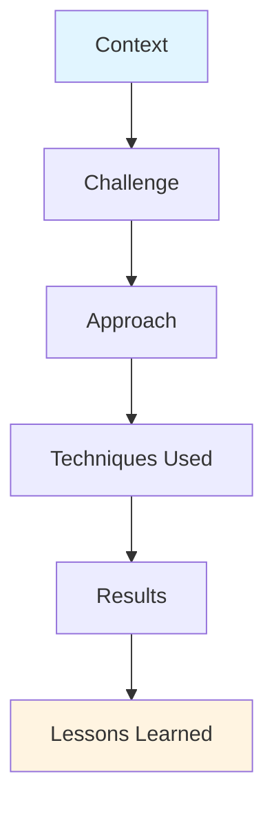

# Module 16.1: Case Studies

> **Estimated time**: ~40 minutes
>
> **Prerequisite**: Phases 1-15 (entire course)
>
> **Outcome**: After this module, you will understand how Claude Code is applied in diverse real-world scenarios and learn from successful implementations.

---

## 1. WHY — Why This Matters

You've completed 15 phases. You know the techniques. But do you know how they fit together in real projects?

Theory teaches principles. Case studies show reality. How do solo developers ship SaaS products in months? How do teams scale from 5 to 50 developers without chaos? How do legacy codebases get modernized without rewrites?

The gap between "knowing techniques" and "applying them effectively" is bridged by studying real implementations. Learn from others' successes AND failures. Shortcut months of trial-and-error by understanding what actually works in production.

---

## 2. CONCEPT — Core Ideas

### The Case Study Framework

Every case study in this module follows the same structure:

**Framework Components**:
- **Context**: Who, what, team size, constraints
- **Challenge**: Specific problems faced
- **Approach**: High-level strategy chosen
- **Techniques**: Which course modules were applied
- **Results**: Measurable outcomes (velocity, quality, time)
- **Lessons**: What worked, what didn't, what they'd change

### Case Study Categories

| Category | Team Size | Primary Focus | Key Constraint |
|----------|-----------|---------------|----------------|
| **Solo/Indie** | 1 developer | Maximum individual output | Time, energy |
| **Startup** | 2-10 developers | Ship fast, maintain quality | Runway, market fit |
| **Agency** | 10-50 developers | Consistency across clients | Context switching |
| **Enterprise** | 50+ developers | Scale, compliance, process | Governance, risk |
| **Open Source** | Distributed | Community, documentation | Volunteer coordination |

### How to Learn from Case Studies

1. **Match context first** — Find cases similar to your situation
2. **Extract principles, not steps** — Adapt, don't copy blindly
3. **Learn from failures** — Mistakes are more valuable than successes
4. **Map to course modules** — Connect real results to techniques you learned
5. **Measure your own results** — Track before/after metrics

---

## 3. DEMO — Step by Step

### Case Study 1: Solo Developer — B2B SaaS Invoice Platform

**Context**: Solo founder (nights/weekends), building invoicing SaaS for Vietnamese freelancers. Budget $500/month, 6-month timeline, 12-15 hours/week.

**Challenge**: Full-stack work (React + Node.js + PostgreSQL) with limited time. Can't afford architectural mistakes.

**Approach**: Invested 8 hours upfront in CLAUDE.md (domain model, templates, 15-min task breakdown). Weekly pattern: Sunday planning with Think mode, weeknights execution, Friday quality review.

**Techniques**: CLAUDE.md as single source of truth (Phase 4.2), Think mode for architecture (Phase 6.1), cost optimization (Phase 14.4), custom templates (Phase 15.1).

**Results**: MVP shipped in 4 months (2 months early), 15K lines of code, 92% test coverage, $2K MRR within 2 months, total cost $380.

**Lesson**: CLAUDE.md investment paid off 10x. Should have added integration tests earlier.

---

### Case Study 2: Startup — Fintech Payment Gateway

**Context**: 5-person Vietnamese fintech team integrating VNPay/MoMo/ZaloPay with regulatory compliance requirements. 3-month runway.

**Challenge**: Complex payment APIs, strict compliance (logging, audit trails), team new to Claude Code, high stakes.

**Approach**: 2-day team training, shared CLAUDE.md with compliance rules, automated quality gates in GitHub Actions.

**Techniques**: Team-synchronized CLAUDE.md (Phase 10.1), GitHub Actions automation (Phase 11.4), report generation (Phase 13.2), quality assessment (Phase 8.4).

**Results**: Launched in 10 weeks (2 weeks early), passed regulatory audit first try, zero payment discrepancies, 2x team velocity, onboarding: 3 days → 1 day.

**Lesson**: Upfront training saved weeks of inconsistency. Automated compliance reports saved 40 hours/month.

---

### Case Study 3: Enterprise — Legacy Java Modernization

**Context**: Large Vietnamese bank with 15-year-old Java monolith (2.5M lines), 50+ developers, regulatory constraints, cannot do big-bang rewrite.

**Challenge**: Understand legacy code (original devs gone), incremental modernization without disrupting production, maintain compliance.

**Approach**: Four-phase plan: Archeology to understand code, custom Skills for banking domain, incremental migration with automated testing, team training.

**Techniques**: Archeology mode (Phase 9.1), legacy test generation (Phase 9.3), custom Skills for compliance (Phase 15.5), security hooks (Phase 11.3).

**Results**: 30% modernized in 6 months, zero security incidents, 45% bug reduction in modernized modules, +35% developer satisfaction, clean regulatory audit.

**Lesson**: Test generation before refactoring prevented regressions. Archeology mode was critical for understanding context.

---

## 4. PRACTICE — Try It Yourself

### Exercise 1: Find Your Match

**Goal**: Identify which case study best matches your context and create an action plan.

**Instructions**:
1. Review the 3 case studies above
2. Identify which one closest matches your situation
3. List 3 techniques you can adopt immediately
4. Identify 1 mistake from that case to avoid

**Expected Result**: A concrete action plan based on proven approaches.

💡 Hint

Consider: team size (solo, small, large), project type (greenfield, legacy), primary constraint (time, quality, scale, compliance), your role (IC, lead, architect).

✅ Solution

**Example for 3-person startup**:

Best match: Case Study 2 (Startup)

**3 techniques**: (1) 2-day team training (Phase 10.1), (2) Shared CLAUDE.md (Phase 4.2), (3) GitHub Actions quality gates (Phase 11.4)

**Avoid**: Don't skip Git conventions — standardize early.

**Adaptation**: Apply automated checks to performance budgets, not just compliance.

---

## 5. CHEAT SHEET

### Case Study Framework

| Component | Questions to Answer |
|-----------|---------------------|
| **Context** | Who? Team size? Stack? Timeline? Budget? |
| **Challenge** | What specific problems? What's at stake? |
| **Approach** | What strategy? What investment upfront? |
| **Techniques** | Which modules? How applied? |
| **Results** | Before → After metrics? Qualitative wins? |
| **Lessons** | What worked? What didn't? What'd you change? |

### Match Your Context

| Your Situation | Focus On | Key Takeaways |
|----------------|----------|---------------|
| **Solo developer** | Case 1 | CLAUDE.md investment, templates, cost optimization |
| **Small team (2-10)** | Case 2 | Team training, shared standards, quality gates |
| **Enterprise/legacy** | Case 3 | Archeology, custom Skills, incremental migration |

---

## 6. PITFALLS — Common Mistakes

| ❌ Mistake | ✅ Correct Approach |
|---|---|
| Copy case study exactly without adaptation | Extract principles, adapt to YOUR context and constraints |
| Focus only on results, skip the approach | Study HOW they got results, not just WHAT results they got |
| No baseline metrics before starting | Track before/after to prove results (time, quality, velocity) |
| Skip team alignment and training | If >1 person, invest in training upfront (saves weeks) |

---

## 7. REAL CASE — Production Story

### Meta-Case: How This Course Was Created

**Scenario**: Senior Android Engineer (12+ years experience, Vietnam-based) creating comprehensive Claude Code course while working full-time.

**Problem**: Massive scope (55 modules, bilingual EN/VI, 44K-82K words total). Must maintain consistency, ensure every technique is real and tested, write in two languages without losing quality.

**Solution**: Created CLAUDE.md defining course standards (7-block structure, quality rules). Created module template. Applied every technique taught in the course to create the course content. Used CLAUDE.md (Phase 4.2), Think mode for curriculum design (Phase 6.1), templates for consistency (Phase 15.1), quality optimization (Phase 14.3).

**Result**: 55 modules following identical structure, bilingual throughout, 100% real examples, practical exercises in every module. Published as open educational resource.

**Key insight**: Eating your own cooking works. This course was built using the exact techniques it teaches. If they didn't work in practice, they wouldn't be in this course.

---

> **Next**: [Module 16.2: Role-Specific Workflows](../02-role-workflows/) →
