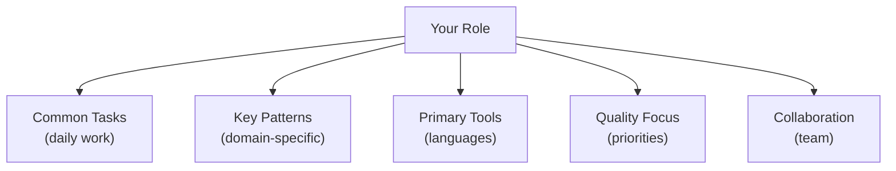

# Module 16.2: Role-Specific Workflows

> **Estimated time**: ~35 minutes
>
> **Prerequisite**: Module 16.1 (Case Studies)
>
> **Outcome**: After this module, you will have a customized Claude Code workflow optimized for your specific role.

---

## 1. WHY — Why This Matters

A frontend developer and a DevOps engineer use Claude Code very differently. Frontend generates React components and CSS. DevOps writes Terraform and GitHub Actions.

Generic workflows waste time. Role-specific workflows maximize impact — focus on YOUR common tasks, use patterns from YOUR domain, leverage tools YOU use daily. Customize Claude Code for YOUR job.

---

## 2. CONCEPT — Core Ideas

### Role-Based Workflow Design



### Role Workflow Matrix

| Role | Primary Tasks | Key Techniques | Priority Phases |
|------|---------------|----------------|-----------------|
| **Frontend** | Components, UI | Templates, image context | 5, 15 |
| **Backend** | APIs, databases | Think mode, testing | 6, 9 |
| **Fullstack** | End-to-end features | Task breakdown | 7, 14 |
| **Tech Lead** | Review, architecture | Quality, team standards | 10, 14 |
| **DevOps** | CI/CD, infrastructure | Automation, hooks | 11, 12 |
| **Data** | Pipelines, analysis | Data analysis | 13 |

### Building Your Workflow

1. List top 10 daily tasks
2. Map each to course techniques
3. Create templates for repeated tasks
4. Define quality criteria for your role
5. Build role-specific CLAUDE.md section

---

## 3. DEMO — Step by Step

### Workflow 1: Frontend Developer

**Daily Tasks**: Components, designs from Figma, styling, state management

**Key Techniques**:
- Phase 5: Image context for design specs
- Phase 15: Component templates
- Phase 3: Reading existing patterns

**CLAUDE.md Section**:
```markdown
## Frontend Standards
- Components: Functional TypeScript
- Styling: Tailwind CSS, no inline
- State: Zustand global, useState local
```

**Templates**: `/component`, `/style`, `/a11y`

---

### Workflow 2: Backend Developer

**Daily Tasks**: APIs, database schemas, auth, performance

**Key Techniques**:
- Phase 6: Think mode for API design
- Phase 9: Legacy code refactoring
- Phase 13: Log analysis

**CLAUDE.md Section**:
```markdown
## Backend Standards
- APIs: REST with OpenAPI spec
- Database: PostgreSQL, migrations required
- Auth: JWT tokens, refresh pattern
```

**Templates**: `/api`, `/schema`, `/query`

---

### Workflow 3: Tech Lead

**Daily Tasks**: Code review, architecture, mentoring, planning

**Key Techniques**:
- Phase 10: Team CLAUDE.md
- Phase 14: Quality optimization
- Phase 6: Think mode for architecture

**CLAUDE.md Section**:
```markdown
## Tech Lead Focus
- Reviews: Security, performance, maintainability
- Architecture: Document decisions in ADRs
- Mentoring: Explain WHY, not just WHAT
```

**Templates**: `/review`, `/arch`, `/mentor`

---

### Workflow 4: DevOps Engineer

**Daily Tasks**: CI/CD, infrastructure as code, monitoring, incidents

**Key Techniques**:
- Phase 11: GitHub Actions, hooks
- Phase 12: n8n automation
- Phase 13: Log analysis

**CLAUDE.md Section**:
```markdown
## DevOps Standards
- CI/CD: GitHub Actions
- Infrastructure: Terraform modules
- Monitoring: Prometheus + Grafana
```

**Templates**: `/pipeline`, `/terraform`, `/incident`

---

## 4. PRACTICE — Try It Yourself

### Exercise 1: Define Your Role Workflow

**Goal**: Create a customized workflow for your role.

**Instructions**:
1. List your top 5 daily tasks
2. Map each to relevant course techniques
3. Identify 3 templates to create
4. Draft your role section for CLAUDE.md

<details>
<summary>💡 Hint</summary>
Start with tasks you do MOST frequently. Map to phases that directly address those tasks.
</details>

<details>
<summary>✅ Solution</summary>

**Example: Mobile Developer**

Top 5 tasks:
1. Build UI screens → Phase 15 templates
2. API integration → Phase 6 Think mode
3. Debug crashes → Phase 13 log analysis
4. Code review → Phase 10 team standards
5. Performance → Phase 14 optimization

Templates: `/screen`, `/api-call`, `/debug`

CLAUDE.md section:
```markdown
## Mobile Standards
- UI: SwiftUI/Jetpack Compose
- Network: async/await patterns
- State: MVVM architecture
```
</details>

---

## 5. CHEAT SHEET

### Role Workflow Template

```markdown
## [Role] Workflow

### Daily Tasks
1. [Most frequent task]
2. [Second task]

### Key Techniques
- Phase X: [Technique]

### Templates
/template — [Description]

### Quality Criteria
- [What "done" means for your role]
```

### Role → Priority Phases

| Role | Focus Phases |
|------|--------------|
| Frontend | 5 (Image), 15 (Templates) |
| Backend | 6 (Think), 9 (Legacy) |
| Fullstack | 7 (Auto), 14 (Task) |
| Tech Lead | 10 (Team), 14 (Quality) |
| DevOps | 11 (Automation), 12 (n8n) |
| Data | 13 (Analysis) |

---

## 6. PITFALLS — Common Mistakes

| ❌ Mistake | ✅ Correct Approach |
|---|---|
| Generic workflow for all roles | Customize for YOUR specific tasks |
| Too many templates (10+) | Focus on top 5 high-frequency tasks |
| Ignoring team context | Align with team CLAUDE.md standards |
| Not measuring impact | Track time saved per task |
| Static workflow forever | Evolve as your role changes |

---

## 7. REAL CASE — Production Story

**Scenario**: Vietnamese tech company, 20 developers across 4 roles. Everyone used Claude Code generically — some loved it, some found it unhelpful.

**Role Workflow Initiative**:
- Week 1: Survey top tasks per role
- Week 2: Build role-specific workflows + templates
- Week 3: Role-specific training sessions
- Week 4: Measure and iterate

**Results (1 month)**:
- Frontend: 40% faster component development
- Backend: 50% faster API implementation
- DevOps: 60% faster pipeline creation
- Tech Lead: 30% faster code reviews

**Quote**: "Generic training was okay. Role-specific workflows made Claude Code essential for MY job."

---

> **Next**: [Module 16.3: Teaching & Workshop Design](../03-teaching-workshop/) →
