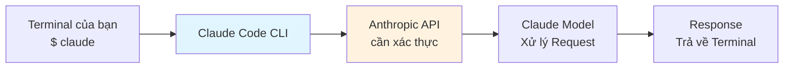

# Module 1.1: Cài đặt & Cấu hình

> **Thời gian học**: ~20 phút
>
> **Yêu cầu trước**: Không có
>
> **Kết quả**: Sau module này, bạn sẽ biết cài đặt Claude Code, xác thực tài
> khoản, và chạy lệnh đầu tiên

---

## 1. WHY — Tại sao cần học cái này?

Cài đặt công cụ phát triển mới lẽ ra phải đơn giản, nhưng nhiều AI coding
assistant tạo ra rắc rối: version lỗi thời, authentication không rõ ràng, tài
liệu cũ, hoặc nhiều cách cài đặt gây nhầm lẫn. Ba tháng sau bạn phát hiện
công cụ không tự cập nhật và đã lỗi thời. Claude Code cung cấp nhiều phương
pháp cài đặt — bạn cần biết phương pháp nào phù hợp với workflow của mình.
Module này giúp bạn "sẵn sàng code" nhanh chóng thay vì vật lộn với package
manager.

---

## 2. CONCEPT — Khái niệm cốt lõi

Claude Code là một command-line interface (CLI) kết nối terminal của bạn với
backend Claude AI của Anthropic. Khi bạn gõ lệnh, Claude Code gửi code context
đến API, xử lý response, và trả kết quả trực tiếp về terminal.

Quy trình cài đặt theo pattern ba bước:

1. **Cài CLI** — Có lệnh `claude` sử dụng được globally
2. **Xác thực** — Kết nối tài khoản Anthropic (OAuth hoặc API key)
3. **Cấu hình** — Thiết lập preferences như model mặc định và project settings

Đây là cách kiến trúc hoạt động:



---

## 3. DEMO — Làm mẫu từng bước

**Bước 0: Kiểm tra version Node.js (Yêu cầu trước)**

Trước khi cài đặt, xác minh bạn có Node.js 18 trở lên:

```bash
$ node --version
```

Output mong đợi:
```
v18.0.0   # hoặc cao hơn
```

Nếu Node.js chưa được cài đặt hoặc version thấp hơn 18, cài đặt từ
https://nodejs.org (khuyến nghị bản LTS).

**Bước 1: Cài đặt Claude Code**

Có nhiều phương pháp cài đặt. Chọn phương pháp phù hợp với hệ thống của bạn.

**Phương án A: npm (cần Node.js)**
```bash
$ npm install -g @anthropic-ai/claude-code
```

Output mong đợi:
```
# Output có thể khác
added 1 package in Xs
```

⚠️ Yêu cầu Node.js 18+. Kiểm tra tài liệu chính thức của Anthropic để biết
phương pháp cài đặt được recommend hiện tại, vì có thể thay đổi.

**Phương án B: Homebrew (macOS)** ⚠️ Cần xác minh
```bash
$ brew install claude-code
```

⚠️ Tên formula Homebrew chính xác cần xác minh. Chạy `brew search claude` để
xem các option có sẵn.

**Phương án C: Native installer** ⚠️ Cần xác minh

Anthropic có thể cung cấp native installer script. Kiểm tra tài liệu Claude
Code chính thức tại https://docs.anthropic.com để biết hướng dẫn cài đặt
hiện tại.

**Bước 2: Xác minh cài đặt**

Kiểm tra lệnh `claude` đã có sẵn chưa:

```bash
$ claude --version
```

Output mong đợi:
```
# Output có thể khác
claude version X.Y.Z
```

Nếu thấy số version, cài đặt đã thành công.

**Bước 3: Chạy Claude Code lần đầu**

Chạy lệnh `claude` không có argument để bắt đầu interactive session:

```bash
$ claude
```

Lần chạy đầu tiên, Claude Code sẽ yêu cầu bạn xác thực. Làm theo hướng dẫn
để kết nối tài khoản Anthropic. Các phương pháp xác thực bao gồm:
- OAuth login (qua trình duyệt)
- API key qua environment variable: `export ANTHROPIC_API_KEY="your-key"`

Bạn cũng có thể khởi động với model cụ thể:
```bash
$ claude --model sonnet    # Nhanh và capable (khuyến nghị cho hầu hết công việc)
$ claude --model opus      # Capable nhất (complex reasoning)
```

**Bước 4: Xác minh xác thực**

Sau khi xác thực, kiểm tra setup bằng cách chạy lệnh help trong session:

```bash
/help
```

Lệnh này hiển thị tất cả slash command có sẵn. Bạn sẽ thấy các lệnh như
`/compact`, `/clear`, `/cost`, và các lệnh khác.

**Bước 5: Chạy query đầu tiên**

Trong Claude Code session, hỏi một câu đơn giản để xác minh mọi thứ hoạt động:

```
> Best practice cho error handling trong Go là gì?
```

Claude sẽ trả lời chi tiết. Bạn đã sẵn sàng code.

---

## 4. PRACTICE — Tự thực hành

### Bài tập 1: Cài đặt và xác minh

**Mục tiêu**: Hoàn thành cài đặt và xác nhận lệnh `claude` hoạt động.

**Hướng dẫn**:
1. Mở terminal
2. Cài bằng npm: `npm install -g @anthropic-ai/claude-code`
3. Xác minh cài đặt: `claude --version`
4. Kiểm tra output hiển thị số version

**Kết quả mong đợi**: Lệnh `claude` có sẵn globally và hiển thị số version
không có lỗi.

<details>
<summary>💡 Gợi ý</summary>

Nếu lệnh không tìm thấy sau khi cài đặt, bạn có thể cần reload shell. Thử
`source ~/.bashrc` (bash) hoặc `source ~/.zshrc` (zsh), hoặc mở terminal
mới.

</details>

<details>
<summary>✅ Đáp án</summary>

```bash
$ npm install -g @anthropic-ai/claude-code
$ claude --version
# Output có thể khác - bạn sẽ thấy số version như X.Y.Z
```

Nếu thấy số version, cài đặt đã thành công.

</details>

---

### Bài tập 2: Xác thực, khám phá commands, và kiểm tra chi phí

**Mục tiêu**: Đăng nhập Claude Code, khám phá các lệnh có sẵn, và theo dõi usage.

**Hướng dẫn**:
1. Chạy `claude` để bắt đầu interactive session
2. Làm theo hướng dẫn xác thực (OAuth hoặc API key)
3. Trong session, gõ `/help` và xem các lệnh có sẵn
4. Hỏi Claude một câu đơn giản: `Dependency injection là gì?`
5. Sau khi nhận response, chạy `/cost` để xem token usage

**Kết quả mong đợi**: Bạn thấy danh sách lệnh từ `/help`, nhận câu trả lời cho
câu hỏi, và `/cost` hiển thị số token đã dùng cho query đó.

<details>
<summary>💡 Gợi ý</summary>

Nếu OAuth không tự mở trình duyệt, bạn có thể set API key thay thế:
`export ANTHROPIC_API_KEY="your-key"` trước khi chạy `claude`.

Lệnh `/cost` hiển thị input tokens, output tokens, và chi phí ước tính cho
session hiện tại.

</details>

<details>
<summary>✅ Đáp án</summary>

```bash
$ claude
# Làm theo hướng dẫn xác thực
# Sau đó trong session:
/help
# Xem danh sách các lệnh

> Dependency injection là gì?
# Claude giải thích khái niệm

/cost
# Output hiển thị token usage, ví dụ:
# Input: 150 tokens, Output: 420 tokens
# Session cost: $0.002 (có thể khác)
```

</details>

---

### Bài tập 3: Chạy query

**Mục tiêu**: Chạy query Claude Code đầu tiên của bạn.

**Hướng dẫn**:
1. Trong Claude Code session, hỏi một câu hỏi
2. Ví dụ: `Sự khác biệt giữa REST và GraphQL là gì?`
3. Chờ response đầy đủ

**Kết quả mong đợi**: Claude trả lời với giải thích chi tiết.

<details>
<summary>💡 Gợi ý</summary>

Nếu bạn chưa trong session, gõ `claude` trước để bắt đầu.

</details>

<details>
<summary>✅ Đáp án</summary>

```bash
$ claude
# Trong session:
> Sự khác biệt giữa REST và GraphQL là gì?

# Claude cung cấp so sánh chi tiết
```

</details>

---

## 5. CHEAT SHEET — Bảng tra cứu nhanh

| Tác vụ | Lệnh | Ghi chú |
|--------|------|---------|
| **Cài (npm)** | `npm install -g @anthropic-ai/claude-code` | Cần Node.js 18+ |
| **Cài (Homebrew)** | `brew install claude-code` | ⚠️ Cần xác minh tên formula |
| **Kiểm tra version** | `claude --version` | Xác minh cài đặt thành công |
| **Bắt đầu session** | `claude` | Mở interactive mode |
| **Chế độ one-shot** | `claude -p "prompt"` | Single query, không session |
| **Xem help** | `/help` | Trong session; liệt kê mọi lệnh |
| **Nén context** | `/compact` | Trong session; giảm token usage |
| **Xóa context** | `/clear` | Trong session; reset conversation |
| **Xem chi phí** | `/cost` | Trong session; hiển thị token usage |
| **Init project** | `/init` | Trong session; tạo CLAUDE.md |
| **Thoát session** | `/exit` hoặc Ctrl+C | Rời Claude Code |
| **Set API Key** | `export ANTHROPIC_API_KEY="sk-..."` | Thay thế cho OAuth |
| **Cấu hình** | `claude config` | Quản lý settings |

**Các lệnh cần xác minh:**
- `/status` — ⚠️ Có thể có hoặc không
- `/model` — ⚠️ Phương pháp chọn model chưa rõ; kiểm tra output `/help`

---

## 6. PITFALLS — Những sai lầm cần tránh

| ❌ Sai lầm | ✅ Cách đúng |
|-----------|-------------|
| Không kiểm tra version Node.js | npm install cần Node.js 18+. Chạy `node --version` trước. |
| Giả định lệnh mà không kiểm tra | Luôn chạy `/help` trong session để xem các lệnh thực sự có sẵn. |
| Không reload shell sau cài đặt | Sau khi cài, chạy `source ~/.zshrc` (hoặc `~/.bashrc`) hoặc mở terminal mới. |
| Đặt API key trong code | Lưu API key trong environment variables: `export ANTHROPIC_API_KEY="..."` trong shell profile, không bao giờ trong source files. |
| Dùng tài liệu cũ | Phương pháp cài đặt có thể thay đổi. Luôn kiểm tra docs Anthropic chính thức để biết hướng dẫn hiện tại. |

---

## 7. REAL CASE — Tình huống thực tế

**Bối cảnh**: Nam, kỹ sư backend tại một startup fintech ở Hà Nội, vừa gia
nhập team mới đang xây dựng dịch vụ payment processing bằng Go. Ngày đầu tiên,
MacBook Pro mới của anh ấy đến và cần cài Claude Code để hỗ trợ code review và
quyết định kiến trúc.

**Vấn đề**: Nam tìm thấy nhiều phương pháp cài đặt khác nhau online nhưng
không chắc phương pháp nào là hiện tại. Anh ấy lo lắng về version drift gây
vấn đề với setup chuẩn của team.

**Giải pháp**: Nam kiểm tra tài liệu Anthropic chính thức trước, sau đó cài
qua npm:
```bash
npm install -g @anthropic-ai/claude-code
```

Anh ấy xác thực bằng tài khoản Anthropic của công ty, sau đó chạy `/help` để
xem tất cả các lệnh có sẵn. Anh ấy tạo file `CLAUDE.md` cho project bằng
`/init` để chuẩn hóa context cho cả team.

**Kết quả**: Trong vòng 15 phút, Nam đã review code Go với Claude Code, nhận
gợi ý kiến trúc cho error handling của payment service, và hỏi về best
practices cho package `context`. Bằng việc document các bước cài đặt chính xác
trong wiki của team, anh ấy đảm bảo mọi người dùng cùng quy trình setup.

---

> **Tiếp theo**: [Module 1.2: Giao diện & Các chế độ](../02-interfaces-modes/) →
