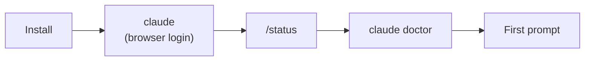

# Module 1.1: Cài đặt & Cấu hình

> **Thời gian học**: ~25 phút
>
> **Yêu cầu trước**: Không có
>
> **Kết quả**: Sau module này, bạn cài được Claude Code bằng native installer (hoặc
> Homebrew/WinGet/apt), đăng nhập bằng subscription, Console key hoặc cloud provider, và xác
> minh bản cài bằng `claude doctor` và `/status`

---

## 1. WHY — Tại sao cần học cái này?

Một senior dev trong team bạn làm theo một bài blog hai năm tuổi: `npm install -g
@anthropic-ai/claude-code`. Node đang là 18, npm in cảnh báo `EBADENGINE` rồi vẫn cài — rơi đúng
vào cái Anthropic giờ gọi là "Advanced installation options", không phải đường mặc định. Vài
tháng sau, máy đồng đội tự auto-update ngầm còn máy này thì không, `which -a claude` liệt kê hai
binary, không ai biết terminal mới mở chạy bản nào. Native installer tránh cả ba vấn đề — miễn
là cài có chủ đích, không phải theo thói quen.

---

## 2. CONCEPT — Khái niệm cốt lõi

Claude Code có bốn kênh cài đặt, cộng npm như một fallback được document (docs: `setup`):

| Kênh | Lệnh | Auto-update |
|---|---|---|
| Native (khuyến nghị) | `curl -fsSL https://claude.ai/install.sh \| bash` (macOS/Linux/WSL) | Ngầm, mỗi lần khởi động |
| Homebrew | `brew install --cask claude-code` (hoặc `claude-code@latest` để lấy bản mới nhất) | Không — tự chạy `brew upgrade` |
| WinGet | `winget install Anthropic.ClaudeCode` | Không — tự chạy `winget upgrade` |
| apt / dnf / apk | Repo ký riêng của Anthropic, rồi `apt`/`dnf install claude-code` hoặc `apk add claude-code` | Qua system upgrade |
| npm ("Advanced installation options") | `npm install -g @anthropic-ai/claude-code` | Thủ công: `npm install -g …@latest` |

Native installer đặt launcher tại `~/.local/bin/claude`, symlink vào
`~/.local/share/claude/versions/` — binary này không đụng Node.js lúc runtime. npm vẫn chạy
được, nhưng "as of v2.1.198, the npm package requires Node.js 22 or later" (Node cũ hơn: cảnh
báo `EBADENGINE`, cài vẫn xong). Yêu cầu hệ thống: macOS 13.0+, Windows 10 1809+, Ubuntu 20.04+,
Debian 10+, hoặc Alpine 3.19+; 4 GB+ RAM, x64/ARM64.


```mermaid
graph LR
    A[Install] --> B["claude<br/>(browser login)"] --> C["/status"] --> D["claude doctor"] --> E[First prompt]
```

Bảy nguồn credential cạnh tranh nhau, được kiểm theo đúng thứ tự này (docs:
`authentication#authentication-precedence`): env var cloud provider
(`CLAUDE_CODE_USE_BEDROCK`/`_VERTEX`/`_FOUNDRY`) → `ANTHROPIC_AUTH_TOKEN` →
`ANTHROPIC_API_KEY` → output của `apiKeyHelper` → `CLAUDE_CODE_OAUTH_TOKEN` → Anthropic
profile/federation credentials → subscription OAuth từ `/login` (mặc định cho
Pro/Max/Team/Enterprise).

| Loại account | Đăng nhập |
|---|---|
| Pro/Max/Team/Enterprise | `claude` → login qua browser, hoặc `/login` |
| Claude Console (billing theo API) | `claude auth login --console` |
| Amazon Bedrock | `CLAUDE_CODE_USE_BEDROCK=1` |
| Google Vertex AI (Google Cloud's Agent Platform) | `CLAUDE_CODE_USE_VERTEX=1` + `CLOUD_ML_REGION` + `ANTHROPIC_VERTEX_PROJECT_ID` |
| Microsoft Foundry | `CLAUDE_CODE_USE_FOUNDRY=1` |

Credential nằm trong macOS Keychain, hoặc `~/.claude/.credentials.json` (mode `0600`) trên
Linux/Windows. `claude update` áp update ngay; `autoUpdatesChannel` trong `settings.json` (hoặc
`/config`) chọn `"latest"` (mặc định) hoặc `"stable"` (chậm ~1 tuần, bỏ qua bản lỗi);
`DISABLE_AUTOUPDATER=1` chỉ tắt check ngầm, `DISABLE_UPDATES` chặn mọi đường update.

---

## 3. DEMO — Làm mẫu từng bước

*Tested with: Claude Max subscription, v2.1.283, macOS 27.0.*

**Bước 1: Tìm mọi `claude` trên PATH**

```bash
# docs: troubleshoot-install#check-for-conflicting-installations
which -a claude
claude --version
```

```text
# Output may vary
/Users/you/.local/bin/claude
/Users/you/.local/bin/claude
/Users/you/.local/bin/claude
2.1.283 (Claude Code)
```

Ba dòng giống hệt thường nghĩa `PATH` có nhiều entry trỏ vào cùng một native binary, không phải
ba bản cài riêng. Kiểm tra thêm `~/.claude/local/` (local npm install kiểu cũ) và
`npm -g ls @anthropic-ai/claude-code` (npm global) trước khi kết luận có bản cũ.

**Bước 2: Cài đặt (native)**

```bash
# docs: setup#install-claude-code
curl -fsSL https://claude.ai/install.sh | bash
```

Windows PowerShell: `irm https://claude.ai/install.ps1 | iex`. Windows CMD:
`curl -fsSL https://claude.ai/install.cmd -o install.cmd && install.cmd && del install.cmd`.
Đúng lệnh này cũng là cách fix chính thức cho lỗi `Raw mode is not supported` mà một số tổ chức
gặp khi cài qua pipe (docs: `troubleshoot-install#raw-mode-is-not-supported-during-install`).
Xác minh bằng lệnh ở **Bước 1**:

```text
# Output may vary
2.1.283 (Claude Code)
```

**Bước 3: Chạy chẩn đoán** — `claude doctor` in chẩn đoán install/settings read-only, không khởi
động session (docs: `cli-reference`).

```bash
# docs: setup#verify-your-installation
claude doctor
```

```text
# Output may vary
Claude Code doctor

Running: native (2.1.283)
Commit: 4631ccd7cfe4
Platform: darwin-arm64
Path: /Users/you/.local/share/claude/versions/2.1.283
Config install method: native
Search: OK (bundled)
Auto-updates: enabled
Auto-update channel: latest
Last update attempt: success → 2.1.283 (2026-09-26)
Managed settings (remote): not fetched — requires an Enterprise or Team subscription
Organization policy: not applicable to Pro and Max accounts

No installation issues found.

For a full setup checkup that can also fix issues, run /doctor in a Claude Code session.
```

**Bước 4: Xem đang đăng nhập bằng gì**

```bash
# docs: cli-reference
claude auth status --text
```

```text
# Output may vary
Login method: Claude Max account
Organization: you@example.com's Organization
Email: you@example.com
```

**Bước 5: Tương tự nhưng trong session** — chạy `/status`, đọc hai dòng **Login** và
**Setting sources**.

```text
# Output may vary
Login method:       Claude Max account
Organization:       …
Email:              you@example.com
Setting sources:    User settings, Project local settings
```

**Bước 6: Update theo yêu cầu**

```bash
# docs: setup#update-manually
claude update
```

```text
# Example from docs: https://code.claude.com/docs/en/setup#update-manually
Successfully updated from <old version> to version <new version>
```

Đã mới nhất: `Claude Code is up to date (<version>)`. Bản Homebrew/WinGet/apk in
`Claude is up to date!` thay vào đó — vì update qua chính package manager của mình.

**Bước 7: Chứng minh nó trả lời được ở chế độ headless**

```bash
# docs: cli-reference
claude -p "Reply with exactly: INSTALL OK" --output-format json | jq -r .result
```

```text
# Output may vary
INSTALL OK
```

**Bề mặt khác** (Module 1.4 có walkthrough đầy đủ): extension **VS Code** bundle riêng CLI cho
chat panel, "does not put `claude` on your shell PATH" — vẫn phải cài thêm CLI standalone.
**JetBrains** (Beta) cần CLI trên `PATH` trước; file reference `Cmd+Option+K`/`Alt+Ctrl+K`. Tab
Code của **Desktop** chạy cùng engine, dùng chung `~/.claude/settings.json`.
`claude --cloud "<task>"` khởi động cloud session do Anthropic quản lý.

---

## 4. PRACTICE — Tự thực hành

### Bài tập 1: Cài trên máy thứ hai bằng kênh khác

**Mục tiêu**: cài trên máy chưa có gì, qua Homebrew (macOS) hoặc WinGet (Windows), rồi xác nhận
bằng `claude doctor`.

**Hướng dẫn**: `brew install --cask claude-code` hoặc `winget install Anthropic.ClaudeCode`, sau
đó `claude --version` và `claude doctor`.

**Kết quả mong đợi**: có số version, và `Config install method` hiện khác `native`.

<details>
<summary>💡 Gợi ý</summary>

Đọc `Config install method` và `Auto-updates`, đừng chỉ nhìn "no issues found."

</details>

<details>
<summary>✅ Đáp án</summary>

```bash
brew install --cask claude-code
claude --version
claude doctor
```

Homebrew và WinGet không bao giờ tự auto-update ngầm — đúng như thiết kế, không phải lỗi. Tự
chạy `brew upgrade claude-code` (hoặc `winget upgrade Anthropic.ClaudeCode`), hoặc set
`CLAUDE_CODE_PACKAGE_MANAGER_AUTO_UPDATE=1` để Claude Code tự làm việc đó.

</details>

---

### Bài tập 2: Chuyển từ npm sang native installer

**Mục tiêu**: gỡ bản cài npm và thay bằng bản native, kết thúc với đúng một `claude` trên `PATH`.

**Hướng dẫn**: `npm uninstall -g @anthropic-ai/claude-code`, sau đó
`curl -fsSL https://claude.ai/install.sh | bash`, sau đó `which -a claude`.

**Kết quả mong đợi**: `which -a claude` in một dòng duy nhất, tại `~/.local/bin/claude`.

<details>
<summary>💡 Gợi ý</summary>

Vẫn thấy hai dòng? Kiểm tra thêm `~/.claude/local/` — local npm install kiểu cũ, tách biệt với
`-g`.

</details>

<details>
<summary>✅ Đáp án</summary>

```bash
npm uninstall -g @anthropic-ai/claude-code
curl -fsSL https://claude.ai/install.sh | bash
which -a claude
```

```text
# Output may vary
/Users/you/.local/bin/claude
```

Một dòng duy nhất xác nhận không còn bản npm nào tranh chấp thứ tự ưu tiên trên `PATH`.

</details>

---

### Bài tập 3: Ghim release channel về stable

**Mục tiêu**: set `autoUpdatesChannel` để máy này chậm hơn bản mới nhất khoảng một tuần, và xác
nhận nó có hiệu lực.

**Hướng dẫn**: thêm `{"autoUpdatesChannel": "stable"}` vào `~/.claude/settings.json`; chạy
`claude`; kiểm tra `/config` → **Auto-update channel**.

**Kết quả mong đợi**: `/config` hiện **Auto-update channel: stable**.

<details>
<summary>✅ Đáp án</summary>

```bash
mkdir -p ~/.claude
cat > ~/.claude/settings.json << 'EOF'
{
  "autoUpdatesChannel": "stable"
}
EOF
claude
# rồi trong session: /config
```

`autoUpdatesChannel` là key cấp cao nhất trong `settings.json`, không nằm trong `permissions`.

</details>

---

## 5. CHEAT SHEET

| Tác vụ | Lệnh |
|---|---|
| Cài (macOS/Linux/WSL) | `curl -fsSL https://claude.ai/install.sh \| bash` |
| Cài (Windows PowerShell) | `irm https://claude.ai/install.ps1 \| iex` |
| Cài (Homebrew) | `brew install --cask claude-code` |
| Cài (WinGet) | `winget install Anthropic.ClaudeCode` |
| Update ngay | `claude update` |
| Chẩn đoán từ shell | `claude doctor` |
| Đăng nhập (Console) | `claude auth login --console` |
| Đăng xuất (shell) | `claude auth logout` |
| Trạng thái auth (JSON / text) | `claude auth status` / `claude auth status --text` |
| Token CI một năm | `claude setup-token` |
| Đăng nhập/xuất (trong session) | `/login` / `/logout` |
| Status đầy đủ (trong session) | `/status` |
| Checkup + tự fix (trong session) | `/doctor` |
| Thoát session | `/exit`, hoặc `Ctrl+D` hai lần |
| Interrupt / rồi thoát | `Ctrl+C` một lần để interrupt (hoặc xóa input); hai lần để thoát |

---

## 6. PITFALLS — Những sai lầm cần tránh

| ❌ Sai lầm | ✅ Cách đúng |
|---|---|
| `sudo npm install -g @anthropic-ai/claude-code` | Dùng native installer; nếu buộc phải dùng npm, đừng bao giờ `sudo` |
| `brew install claude-code` | Thiếu `--cask` — Claude Code là Homebrew cask, không phải formula |
| `npm update -g` để refresh bản npm | Docs khuyên tránh; chạy `npm install -g @anthropic-ai/claude-code@latest` |
| Nghĩ Homebrew/WinGet auto-update như native | Không — chạy `brew upgrade` / `winget upgrade`, hoặc set `CLAUDE_CODE_PACKAGE_MANAGER_AUTO_UPDATE=1` |
| Còn sót `ANTHROPIC_API_KEY` trong shell profile | Thắng subscription login ở chế độ `-p`; kiểm `env \| grep ANTHROPIC` nếu login sai |
| Nhầm `claude doctor` với `/doctor` | `claude doctor`: lệnh shell khi bản cài không khởi động. `/doctor`: trong session, tự fix được |
| Nghĩ extension VS Code đưa `claude` vào `PATH` | Nó bundle CLI riêng cho panel của nó; vẫn phải cài thêm CLI standalone |
| Kỳ vọng `/logout` chạy được trên Bedrock hoặc Vertex | Không có ở đó — auth qua credential AWS/Google Cloud |

---

## 7. REAL CASE — Tình huống thực tế

**Bối cảnh**: một team mobile 6 người ở Việt Nam làm app Kotlin Multiplatform (KMP) — nửa macOS,
nửa Windows — liên tục dính kiểu "chạy được trên máy tôi": người cài npm từ wiki một năm tuổi,
người cài Homebrew thiếu `--cask`.

**Vấn đề**: onboard người mới tốn cả buổi sáng nhắn Slack trước khi Claude Code chạy được — một
bug report có khả năng là bản cài cũ ngang khả năng là lỗi thật.

**Giải pháp**: onboarding giờ bắt buộc native installer trên cả hai nền tảng, một
`~/.claude/settings.json` dùng chung ghim `autoUpdatesChannel: "stable"`, và `claude doctor` là
bước cuối — xong chỉ khi nó in "No installation issues found."

**Kết quả**: `which -a claude` trên mọi máy chỉ ra đúng một binary, mọi người theo cùng release
channel, và "reproduce bug này đi" không còn mở đầu bằng "bạn dùng version nào?"

---

> **Tiếp theo**: [Module 1.2: Giao diện & Các chế độ](../02-interfaces-modes/) →
