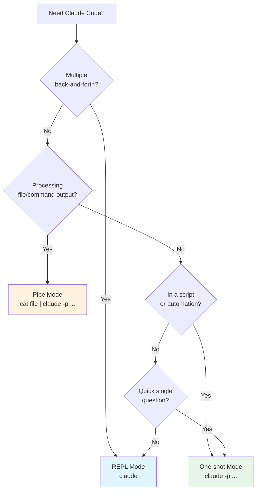

# Module 1.2: Giao diện & Các chế độ

> **Thời gian học**: ~25 phút
>
> **Yêu cầu trước**: Module 1.1 (Cài đặt & Cấu hình)
>
> **Kết quả**: Chọn đúng chế độ tương tác cho mỗi tác vụ và kết hợp các chế độ trong workflow

---

## 1. WHY — Tại sao cần học cái này?

Bạn đã cài Claude Code và chạy query đầu tiên — nhưng đang dùng nó như chatbot, gõ từng câu hỏi
một. Đồng nghiệp thì pipe cả git diff qua Claude để nhận tóm tắt PR tức thì, người khác đã tích hợp
Claude vào CI, bắt bug trước khi merge. Khác biệt nằm ở việc hiểu ba chế độ: interactive, one-shot,
pipe. Chọn đúng, Claude Code không còn là cửa sổ chat mà thành một phần automation.

---

## 2. CONCEPT — Khái niệm cốt lõi

### Ba chế độ chính

| Chế độ | Lệnh | Phù hợp cho | Trạng thái Session |
|--------|------|-------------|-------------------|
| **REPL (Interactive)** | `claude` | Khám phá, debugging, task phức tạp nhiều bước | Conversation liên tục |
| **One-shot** | `claude -p "prompt"` | Câu hỏi nhanh, script, automation | Single request/response |
| **Pipe** | `cat file \| claude -p "prompt"` | Unix pipeline, xử lý nội dung file | Single request với stdin |

### Khác biệt chính

**REPL Mode** giữ context qua nhiều lượt — tinh chỉnh câu hỏi, tham chiếu câu trả lời trước, dùng
slash command. Nghĩ như một phiên làm việc, không phải câu hỏi rời rạc.

**One-shot Mode** chạy một prompt rồi thoát — không lịch sử, mỗi lệnh độc lập. Dành cho script và
automation cần behavior ổn định, không giữ state.

**Pipe Mode** đưa dữ liệu bên ngoài — file, output lệnh khác — vào Claude làm context. Kết hợp với
`-p`, Claude trở thành một công cụ nữa trong pipeline Unix.

### Tiếp tục Session

Claude Code lưu lại conversation. Resume bất kỳ session nào trước đó:

- **`claude --continue`** / **`claude -c`** — tiếp tục conversation gần nhất
- **`claude --resume`** / **`claude -r`** — danh sách session, hoặc resume theo ID/tên
- **`claude --resume "auth-refactor"`** — resume một session cụ thể theo tên
- **`claude -c -p "follow-up"`** — tiếp tục session cuối ở chế độ headless (tiện cho script)

### Chế độ permission khi bắt đầu

REPL và one-shot khởi động khác permission mode. Từ v2.1.283+, **auto mode** (classifier xét duyệt
hành động thay bạn) là mặc định cho session REPL. `claude -p` luôn bắt đầu ở Manual mode — truyền
`--permission-mode acceptEdits|auto|dontAsk` hoặc `--allowedTools "Edit,Write"`, không thì script
sửa file sẽ treo hoặc bị từ chối.

### Phím tắt REPL

- **Input nhiều dòng**: `\` + Enter, hoặc `Shift+Enter` (chạy `/terminal-setup` trước)
- **Ngắt lượt hiện tại**: `Esc` — dừng response/tool call, giữ nguyên session
- **Xóa input / rewind**: `Esc Esc` — xóa draft, hoặc (input rỗng) mở menu rewind
- **Thoát**: `/exit`, hoặc `Ctrl+D` hai lần. `Ctrl+C` hai lần cũng thoát được, nhưng lần đầu chỉ
  xóa input — dùng `Esc` để ngắt lượt đang chạy, không phải `Ctrl+C`
- **Dán ảnh**: `Ctrl+V` (`Cmd+V` trên iTerm2, `Alt+V` trên Windows/WSL)
- **Đổi model**: `Option+P` / `Alt+P`
- **Bật/tắt thinking**: `Option+T` / `Alt+T` — không có tác dụng trên model luôn bật thinking

### Sơ đồ quyết định



---

## 3. DEMO — Làm mẫu từng bước

### Chế độ 1: REPL (Interactive) Mode

**Bước 1: Bắt đầu interactive session**

```bash
$ claude
```

Bạn vào REPL của Claude Code.

**Bước 2: Có conversation nhiều lượt**

```text
> Cách tốt nhất để handle error trong TypeScript là gì?
# Claude giải thích try/catch, Result type, error boundary

> Cho mình ví dụ cụ thể với async/await được không?
# Xây dựng trên câu trả lời trước với code cụ thể

> Giờ refactor cái đó sang dùng Result type
# Refactor ví dụ trước, giữ nguyên context
```

**Bước 3: Kiểm tra context và usage**

Trong REPL, `/context` hiển thị lưới màu. Kiểm tra headless (`claude -p` in bảng thay vì lưới):

```bash
$ claude -p "/context"
```

```markdown
# Output có thể khác — phụ thuộc plugin/skill đã cài
## Context Usage
**Model:** claude-opus-5-5 · **Tokens:** 26.7k / 1m (3%)
| Category | Tokens | Percentage |
|----------|--------|------------|
| System prompt | 2.2k | 0.2% |
| Memory files | 7.1k | 0.7% |
| Free space | 940.3k | 94.0% |
```

Xem chi tiêu: `claude -p "/usage"` (`/cost` là alias):

```text
# Output có thể khác — dạng subscriber; tài khoản API key thấy khối Session cost thay vào đó
You are currently using your subscription to power your Claude Code usage
Current session: 4% used · resets Sep 28 at 8am (Asia/Saigon)
  ...
```

**Bước 4: Resume session trước đó**

```bash
# Tiếp tục session gần nhất
$ claude --continue

# Hiện danh sách session để chọn
$ claude --resume

# Resume session cụ thể theo tên
$ claude --resume "auth-refactor"
```

---

### Chế độ 2: One-shot Mode

**Bước 1: Chạy single query**

```bash
$ claude -p "Sự khác biệt giữa let và const trong JavaScript là gì?"
```

Output mong đợi:
```text
# Output có thể khác
Trong JavaScript, `let` và `const` đều khai báo biến block-scoped, nhưng:

- `const` không thể reassign sau khi khởi tạo
- `let` có thể reassign

Dùng `const` mặc định, `let` khi cần reassign.
```

**Bước 2: Dùng trong script**

```bash
#!/bin/bash
# quick-explain.sh
claude -p "Giải thích error này trong một câu: $1"
```

```bash
$ ./quick-explain.sh "TypeError: Cannot read property 'map' of undefined"
```

**Bước 3: Kết hợp với tính năng shell**

```bash
# Lưu output ra file
$ claude -p "Viết README template cho TypeScript project" > README.md
```

---

### Chế độ 3: Pipe Mode

**Bước 1: Pipe nội dung file**

```bash
$ cat src/utils.ts | claude -p "Review code này tìm bug tiềm ẩn"
```

**Bước 2: Pipe output của lệnh**

```bash
$ git diff HEAD~1 | claude -p "Tóm tắt những thay đổi này"
```

Output mong đợi:
```text
# Output có thể khác
Diff này cho thấy:
1. Thêm error handling cho function fetchUser
2. Cập nhật return type từ Promise<User> sang Promise<User | null>
3. Thêm test case mới cho scenario null
```

**Bước 3: Chain với tool khác**

```bash
$ git log --oneline -10 | claude -p "Commit nào trong số này là bug fix?"
```

---

## 4. PRACTICE — Tự thực hành

### Bài tập 1: Thành thạo REPL Mode

**Mục tiêu**: Dùng REPL mode cho conversation debugging iterative.

**Hướng dẫn**:
1. Bắt đầu Claude Code session với `claude`
2. Mô tả bug: "Mình có function trả về tổng của array, nhưng nó trả về NaN
   với empty array"
3. Hỏi Claude cách fix
4. Hỏi follow-up: "Làm sao thêm TypeScript type vào cái này?"
5. Chạy `/usage` để xem token/cost usage
6. Thoát với `/exit`, hoặc `Ctrl+D` hai lần

**Kết quả mong đợi**: Conversation nhiều lượt xây dựng trên context trước, cùng tổng token/cost
hiện rõ.

<details>
<summary>💡 Gợi ý</summary>

Khác biệt chính với one-shot mode là Claude nhớ message trước của bạn. Bạn có
thể nói "cái function đó" mà không cần giải thích lại function nào.

</details>

<details>
<summary>✅ Đáp án</summary>

```bash
$ claude
> Mình có function trả về tổng của array, nhưng nó trả về NaN với empty array
# Claude giải thích issue (có thể là reduce không có initial value)

> Làm sao thêm TypeScript type vào cái này?
# Claude thêm typing đúng vào solution trước

/usage   # token/cost cho toàn bộ conversation
/exit
```

</details>

---

### Bài tập 2: Thành thạo One-shot Mode

**Mục tiêu**: Dùng one-shot mode trong shell workflow thực tế.

**Hướng dẫn**:
1. Dùng `claude -p` để hỏi: "Flag -r trong lệnh rm làm gì?"
2. Xác minh lệnh thoát ngay (bạn quay lại shell prompt)
3. Tạo shell alias đơn giản:
   `alias explain='claude -p "Giải thích lệnh này:"'`
4. Test: `explain "tar -xzf archive.tar.gz"`

**Kết quả mong đợi**: Mỗi lệnh trả về response rồi thoát ngay lập tức.

<details>
<summary>💡 Gợi ý</summary>

One-shot mode thoát sau mỗi response — một interactive session sẽ để alias kẹt lại.

</details>

<details>
<summary>✅ Đáp án</summary>

```bash
$ claude -p "Flag -r trong lệnh rm làm gì?"
# Giải thích recursive deletion, rồi quay lại shell prompt ngay

$ alias explain='claude -p "Giải thích lệnh này:"'
$ explain "tar -xzf archive.tar.gz"
```

</details>

---

### Bài tập 3: Thành thạo Pipe Mode

**Mục tiêu**: Dùng pipe mode để phân tích code hoặc diff.

**Hướng dẫn**:
1. Navigate đến project có git history
2. Chạy: `git diff HEAD~1 | claude -p "Commit này thay đổi gì?"`
3. Thử với file: `cat package.json | claude -p "Project này dùng dependency
   nào?"`
4. Thử nghiệm các combination khác

**Kết quả mong đợi**: Claude trả lời dựa trên nội dung được pipe làm context.

<details>
<summary>💡 Gợi ý</summary>

Nội dung pipe trở thành context cho prompt — không cần tự paste nội dung file.

</details>

<details>
<summary>✅ Đáp án</summary>

```bash
$ cd my-project
$ git diff HEAD~1 | claude -p "Commit này thay đổi gì?"
$ cat package.json | claude -p "Project này dùng dependency nào?"
```

Piped stdin giới hạn 10MB — với diff lớn, lọc trước:
`git diff HEAD~1 -- src/ | claude -p ...`

</details>

---

## 5. CHEAT SHEET — Bảng tra cứu nhanh

| Tác vụ | Lệnh | Ghi chú |
|--------|------|---------|
| **Bắt đầu interactive session** | `claude` | Multi-turn, có slash commands |
| **One-shot query** | `claude -p "prompt"` | Single response, thoát ngay |
| **Pipe file vào Claude** | `cat file \| claude -p "prompt"` | stdin giới hạn 10MB |
| **Pipe output lệnh** | `cmd \| claude -p "prompt"` | Hành vi core, có tài liệu |
| **Lưu output ra file** | `claude -p "..." > file.md` | Shell redirect response được in |
| **Xóa conversation** | `/clear` | Reset context trong REPL |
| **Nén context** | `/compact` | Tóm tắt và giảm context |
| **Xem context usage** | `/context` | Lưới màu thể hiện thứ chiếm context |
| **Xem token/cost usage** | `/usage` (alias `/cost`) | Chi tiêu và hạn mức session |
| **Thoát REPL** | `/exit`, hoặc `Ctrl+D` hai lần | Kết thúc interactive session |

### Tham chiếu nhanh chọn chế độ

| Tình huống | Chế độ | Lý do |
|------------|--------|-------|
| "Giúp mình debug cái này" | REPL | Cần trao đổi qua lại |
| "X nghĩa là gì?" | One-shot | Trả lời nhanh, không follow-up |
| "Review diff này" | Pipe | Nội dung external làm input |
| "Giải thích log này" | Pipe | Nội dung external làm input |
| Tích hợp CI/CD | One-shot | Stateless, scriptable |
| Học/khám phá | REPL | Conversation iterative |

---

## 6. PITFALLS — Những sai lầm cần tránh

| ❌ Sai lầm | ✅ Cách đúng |
|-----------|-------------|
| Dùng REPL cho câu hỏi one-off | Dùng `claude -p "câu hỏi"` — nhanh hơn, không cần thoát session. |
| Quên `-p` trong script | Không có `-p`, `claude` vào interactive mode, script treo chờ input. |
| Pipe file khổng lồ | Chỉ pipe phần liên quan: `head -100 file \| claude -p "..."`. |
| Không check `/usage` trong session dài | Token tích lũy dần; `/context` cho biết thứ gì đang chiếm context. |
| Tưởng `-p` kế thừa permission mode của REPL | `-p` luôn Manual mode — truyền `--permission-mode acceptEdits` hoặc `--allowedTools` để sửa/ghi file. |
| Mong pipe mode giữ state | Mỗi lệnh pipe độc lập — dùng REPL cho phân tích nhiều bước. |

---

## 7. REAL CASE — Tình huống thực tế

**Bối cảnh**: Huy, mobile developer tại một công ty e-commerce Việt Nam, làm việc trên dự án Kotlin
Multiplatform (KMP) chia sẻ business logic giữa Android và iOS. Senior reviewer thường bận họp nên
PR hay bị đọng lại.

**Vấn đề**: Huy vừa refactor xong shared networking module — diff hơn 400 dòng — và muốn review sơ
bộ trước khi review chính thức, để bắt lỗi rõ ràng sớm.

**Giải pháp**: Pipe mode để nhận feedback tức thì:

```bash
# Review toàn bộ diff
$ git diff main...feature/network-refactor | claude -p "Review thay đổi KMP
code này. Focus vào: 1) Kotlin idiom 2) Coroutine usage 3) Error handling
4) Vấn đề tương thích iOS/Android"
```

Với file cụ thể, anh dùng review có target:

```bash
# Review chỉ shared module
$ git diff main -- shared/src/commonMain/kotlin/network/ | claude -p \
  "Check Kotlin networking code này tìm coroutine scope issue"
```

**Kết quả**: Claude phát hiện ba issue trước khi PR được tạo: thiếu `supervisorScope` (crash iOS
nếu child coroutine fail), chuỗi `if-else` đáng lẽ là `when` expression, và memory leak từ
`HttpClient` không đóng.

Huy fix cả ba trong 10 phút. Review chính thức sau đó chỉ mất 5 phút thay vì 30 phút như thường lệ.
`git diff | claude -p "review"` giờ là một phần workflow của anh, như chạy test vậy.

---

> **Tiếp theo**: [Module 1.3: Context Window cơ bản](../03-context-basics/) →
