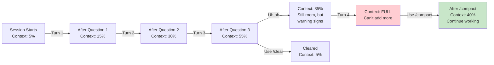

# Module 1.3: Context Window cơ bản

> **Thời gian học**: ~20 phút
>
> **Yêu cầu trước**: Module 1.2 (Giao diện & Các chế độ)
>
> **Kết quả**: Sau module này, bạn sẽ hiểu context window là gì, theo dõi token
> usage, quản lý context hiệu quả, và nhận ra khi context limit ảnh hưởng công
> việc của bạn

---

## 1. WHY — Tại sao cần học cái này?

Bạn đang giữa phiên debug phức tạp. Đã hỏi Claude năm câu follow-up và giải
thích đang ngày càng mơ hồ. Bạn nhắc đến quyết định kiến trúc trước đó, nhưng
Claude dường như không nhớ. Bạn bắt đầu lặp lại mình. Chuyện gì xảy ra?
Context window của bạn đã đầy. Claude Code ngừng "nhớ" message cũ vì mọi
conversation đều có giới hạn bộ nhớ — đó là context window. Hiểu giới hạn này,
theo dõi nó đầy đến đâu, và biết cách giải phóng dung lượng là sự khác biệt
giữa session bực bội xuống cấp giữa chừng và workflow mượt mà giữ được độ sắc
bén trong nhiều giờ.

---

## 2. CONCEPT — Khái niệm cốt lõi

**Context window** là tổng lượng "bộ nhớ" conversation có sẵn cho Claude tại
bất kỳ thời điểm nào. Hãy nghĩ về nó như RAM — context càng nhiều thì Claude
càng có thể xem và tham chiếu nhiều hơn: lịch sử conversation, file code, và
các instruction trước đó. Mọi token đều được tính: prompt của bạn, response
của Claude, nội dung file bạn paste, và cả system instruction.

### Những gì được tính?

Khi bạn trong một Claude Code session, context window bao gồm:

- **Prompt của bạn** — Mọi thứ bạn gõ
- **Response của Claude** — Mọi từ trong mọi câu trả lời
- **Nội dung file** — Code hoặc text bạn paste hoặc cho Claude đọc
- **System instruction** — Project context từ CLAUDE.md
- **Lịch sử conversation** — Tất cả các turn trước trong session
- **Metadata** — Formatting, token cho ký tự đặc biệt

### Dung lượng Context

⚠️ **Kích thước context window phụ thuộc vào model của bạn.** Hầu hết model
Claude hiện đại cung cấp khoảng 200,000 token context, nhưng điều này có thể
thay đổi. Để xác minh giới hạn của model, kiểm tra documentation chính thức
của Anthropic tại https://docs.anthropic.com.

### Token là gì?

**Một token ≈ 4 ký tự tiếng Anh** (trung bình 2 từ). Nếu bạn paste file 10KB,
đó khoảng 2,500 token. Một conversation đầy đủ qua nhiều turn có thể tiêu tốn
30,000–50,000 token trước khi gặp cảnh báo.

### Quan trọng cho developer Việt Nam: Tiếng Việt tốn nhiều token hơn!

Đây là điều nhiều developer Việt không biết: **tiếng Việt tiêu tốn 1.5–2x
token so với tiếng Anh cho cùng nội dung.**

Ví dụ cụ thể:
- Một đoạn văn 1000 từ tiếng Việt tốn ~400 token
- Cùng nội dung bằng tiếng Anh chỉ ~250 token

Điều này có nghĩa: comment tiếng Việt trong code, tên biến tiếng Việt, log
message tiếng Việt — tất cả đều "đắt" hơn tiếng Anh. Nếu bạn paste file Kotlin
với comment tiếng Việt xuyên suốt, context sẽ đầy nhanh hơn so với file cùng
kích thước với comment tiếng Anh.

### Vòng đời Context theo từng Mode

Các mode khác nhau xử lý context khác nhau:

**REPL Mode**: Context tăng với mỗi turn. Lịch sử conversation tích lũy. Cuối
cùng window sẽ đầy. Khi đầy, bạn không thể thêm thông tin mới mà không clear
(mất history) hoặc compact (tóm tắt message cũ).

**One-shot Mode**: Context mới mỗi lần. Bạn gửi prompt, nhận response, và
thoát. Không có tích lũy vì không có session state.

**Pipe Mode**: Context dùng một lần. Input file + prompt tiêu tốn context một
lần. Session kết thúc sau response.

Đây là vòng đời context được hình dung:



---

## 3. DEMO — Làm mẫu từng bước

**Bước 1: Bắt đầu REPL session và theo dõi context tăng**

```bash
$ claude
```

Bạn đang trong interactive session. Hãy xem context tăng với mỗi turn.

**Bước 2: Hỏi câu hỏi và kiểm tra token cost**

```
> Observer pattern trong software design là gì?
```

Claude response với giải thích chi tiết (có thể 300–400 từ).

**Bước 3: Xem token usage**

```
/cost
```

Output mong đợi (output có thể khác):

```
# Output có thể khác
Session tokens used:
  Input tokens: 45
  Output tokens: 380
  Total session: 425 tokens
  Estimated cost: $0.001
```

Ghi nhận tổng số. Đây là lượng context session đã tiêu tốn đến giờ.

**Bước 4: Hỏi câu follow-up**

```
> Cho mình ví dụ cụ thể bằng Python được không?
```

Claude response với Python code implement Observer pattern.

**Bước 5: Kiểm tra cost lại**

```
/cost
```

Output mong đợi:

```
# Output có thể khác
Session tokens used:
  Input tokens: 120
  Output tokens: 820
  Total session: 940 tokens
  Estimated cost: $0.003
```

Để ý cost gần như gấp đôi. Context window giờ đã dùng 940 token. Nếu limit là
200k, bạn đang dùng dưới 1%, nhưng pattern rõ ràng: mỗi turn thêm vào tổng.

**Bước 6: Tiếp tục hỏi thêm**

Hỏi thêm vài câu về topic khác:

```
> Khác biệt giữa design pattern và architectural pattern là gì?
> Làm sao để chọn pattern nào để dùng?
> Giải thích Strategy pattern so với Observer?
```

Chạy `/cost` sau mỗi câu để thấy sự tăng tích lũy.

**Bước 7: Dùng `/compact` để giải phóng dung lượng**

Khi conversation đã đủ nhiều mà context chiếm dung lượng đáng kể, nén lại:

```
/compact
```

Output mong đợi:

```
# Output có thể khác
Compacting context...
Old context: 15,400 tokens
New context: 8,200 tokens
Freed: 7,200 tokens
```

Lệnh `/compact` tóm tắt các turn conversation cũ, giữ lại essence trong khi
giảm token count. Bạn mất granular history nhưng vẫn giữ key decision và
answer.

**Bước 8: Xác minh dung lượng đã giải phóng**

```
/cost
```

Output mong đợi:

```
# Output có thể khác
Session tokens used:
  Input tokens: 45
  Output tokens: 120
  Total session: 8,245 tokens
  Estimated cost: $0.002
```

Tổng giảm từ 15,400 xuống ~8,245. Bạn đã quay lại khoảng nửa context usage và
có thể tiếp tục session mượt mà.

**Bước 9: Thoát**

```
/exit
```

---

## 4. PRACTICE — Tự thực hành

### Bài tập 1: Theo dõi Context tăng qua các Turn

**Mục tiêu**: Quan sát cách context tích lũy trong REPL session và nhận ra dấu
hiệu cảnh báo.

**Hướng dẫn**:

1. Bắt đầu Claude Code REPL session: `claude`
2. Hỏi Claude câu hỏi chi tiết: `"Giải thích khái niệm dependency injection
   trong software architecture"`
3. Chạy `/cost` và ghi lại token count
4. Hỏi follow-up: `"Cho mình ví dụ bằng Java được không?"`
5. Chạy `/cost` lại và so sánh
6. Lặp lại thêm 3 lần với các câu follow-up khác
7. Sau mỗi turn, để ý response có chậm hơn hoặc ít chi tiết hơn không

**Kết quả mong đợi**: Bạn thấy context token tăng với mỗi turn. Sau nhiều turn,
bạn có thể thấy response hơi lâu hơn hoặc ít chi tiết hơn (cảnh báo sớm của
context pressure).

<details>
<summary>💡 Gợi ý</summary>

Nếu response không có vẻ xuống cấp nhiều, không sao — context vẫn còn chỗ. Mục
đích của bài tập là thấy pattern tăng, không nhất thiết phải hit limit. Theo
dõi output `/cost` cẩn thận và để ý effect tích lũy.

</details>

<details>
<summary>✅ Đáp án</summary>

```bash
$ claude

> Giải thích khái niệm dependency injection trong software architecture
/cost
# Check đầu tiên - ghi nhận input/output/total token

> Cho mình ví dụ bằng Java được không?
/cost
# Check thứ hai - tổng cao hơn

> Khác biệt giữa constructor và setter injection là gì?
/cost
# Check thứ ba - tiếp tục tăng

> Framework dependency injection như Spring handle việc này thế nào?
/cost
# Check thứ tư - tăng đáng kể

> Một số best practice là gì?
/cost
# Check thứ năm - context lớn đáng kể rồi

/exit
```

Kết quả điển hình: Query đầu tiên có thể ~400 token tổng, nhưng đến turn 5,
bạn đang ở ~3,000–5,000 token. Tăng trưởng tăng tốc vì mỗi response thêm nhiều
context hơn cho turn tiếp theo tham chiếu.

</details>

---

### Bài tập 2: Làm đầy Context và dùng `/compact`

**Mục tiêu**: Cố ý làm đầy context gần limit và thực hành dùng `/compact` để
recover dung lượng.

**Hướng dẫn**:

1. Bắt đầu REPL session: `claude`
2. Paste một file code lớn (500+ dòng) — ví dụ một Python class với nhiều
   method
3. Yêu cầu Claude review: `"Review code này và gợi ý cải thiện"`
4. Chạy `/cost` để thấy nhảy token (file tiêu tốn nhiều context)
5. Hỏi follow-up: `"Còn error handling thì sao?"`, `"Bạn sẽ refactor method X
   thế nào?"`
6. Check `/cost` sau mỗi câu hỏi
7. Khi context đã tiêu tốn đáng kể (visible trong `/cost`), chạy `/compact`
8. Chạy `/cost` lại và quan sát sự khác biệt

**Kết quả mong đợi**: Sau khi paste file lớn, bạn thấy token nhảy đáng kể
(file tiêu tốn 1–5k token tùy kích thước). Sau `/compact`, tổng giảm đáng kể
trong khi bạn vẫn có thể hỏi follow-up.

<details>
<summary>💡 Gợi ý</summary>

Nếu không có file lớn sẵn, Claude có thể generate cho bạn:

```
> Tạo file Python với class BankAccount có 15 method (deposit, withdraw,
> transfer, tính lãi, v.v.)
```

Sau đó bạn có thể paste lại trong cùng session cho bài tập.

</details>

<details>
<summary>✅ Đáp án</summary>

```bash
$ claude

> Tạo file Python với class BankAccount có 15 method quản lý tài khoản khách
> hàng với nhiều tính năng (deposit, withdraw, transfer, v.v.)
# Claude generate code

# Copy code output và paste lại

> Review class BankAccount này về code quality, security, và best practice
/cost
# Ghi nhận token count cao - có thể 3,000–8,000+ do file

> Những lo ngại security lớn nhất trong code này là gì?
/cost
# Cost tăng thêm

> Bạn sẽ refactor method deposit và withdraw thế nào?
/cost
# Tiếp tục tăng

/compact
# Nén context

/cost
# Giảm đáng kể - có thể 30–50% ít token hơn
```

Sau `/compact`, context có thể giảm từ 12,000 token xuống 5,000–6,000 token,
giải phóng khoảng nửa dung lượng trong khi giữ essence của code review.

</details>

---

### Bài tập 3: So sánh Context Usage giữa REPL và One-shot

**Mục tiêu**: Hiểu rằng one-shot mode luôn bắt đầu với context mới, trong khi
REPL tích lũy.

**Hướng dẫn**:

1. **Phần A (REPL):** Bắt đầu REPL session và hỏi 3 câu, check `/cost` sau mỗi
   câu
2. **Phần B (One-shot):** Thoát, sau đó chạy ba lệnh `claude -p "..."` riêng
   biệt cho cùng các câu hỏi
3. So sánh: Để ý REPL `/cost` tăng, nhưng one-shot command mỗi cái có token
   count tương tự (không tích lũy)

**Kết quả mong đợi**: REPL hiển thị token tích lũy tăng qua các turn (vd: 400,
800, 1,200 token). One-shot run hiển thị token count độc lập tương tự (vd:
400, 400, 400 token mỗi cái) vì mỗi cái là session mới.

<details>
<summary>💡 Gợi ý</summary>

Để nhất quán, dùng cùng ba câu hỏi ở cả hai phần:

1. "Closure trong JavaScript là gì?"
2. "Cho mình ví dụ thực tế được không?"
3. "Closure liên quan đến function scope thế nào?"

Trong REPL, context sẽ tích lũy. Trong one-shot, mỗi run độc lập.

</details>

<details>
<summary>✅ Đáp án</summary>

```bash
# REPL MODE (context tích lũy)
$ claude

> Closure trong JavaScript là gì?
/cost
# Output đầu: ~500 token tổng

> Cho mình ví dụ thực tế được không?
/cost
# Output hai: ~1,000 token tổng (gấp đôi)

> Closure liên quan đến function scope thế nào?
/cost
# Output ba: ~1,500 token tổng (vẫn tăng)

/exit

# ONE-SHOT MODE (mỗi cái mới)
$ claude -p "Closure trong JavaScript là gì?"
# Output: ~500 token

$ claude -p "Cho mình ví dụ thực tế được không?"
# Output: ~500 token (tương tự, không gấp đôi)

$ claude -p "Closure liên quan đến function scope thế nào?"
# Output: ~500 token (tương tự, không gấp đôi)
```

Để ý REPL tăng đến 1,500 token ở turn 3, nhưng one-shot giữ khoảng 500 mỗi
invocation. Đó là khác biệt căn bản.

</details>

---

## 5. CHEAT SHEET — Bảng tra cứu nhanh

### Lệnh Token Usage

| Lệnh | Mục đích | Khi nào dùng |
|------|----------|--------------|
| `/cost` | Hiển thị token usage session hiện tại | Check context trước file lớn hoặc sau nhiều turn |
| `/compact` | Nén conversation cũ, giải phóng dung lượng | Context 50%+ đầy và bạn muốn tiếp tục |
| `/clear` | Reset context hoàn toàn | Bắt đầu mới, bỏ conversation history |
| `/help` | Liệt kê tất cả lệnh có sẵn | Không chắc lệnh nào tồn tại |

### Ước tính Token (Xấp xỉ)

| Loại nội dung | Chi phí ước tính | Ghi chú |
|---------------|------------------|---------|
| Văn xuôi tiếng Anh | ~250 token/1,000 từ | Thay đổi theo độ phức tạp |
| **Văn xuôi tiếng Việt** | **~400 token/1,000 từ** | **1.5-2x tiếng Anh!** |
| Code (trung bình) | ~400 token/1,000 ký tự | Dense, nhiều hơn văn xuôi |
| Code (verbose) | ~300 token/1,000 ký tự | Comment, whitespace giảm density |
| File nhỏ (< 5KB) | 1,000–2,000 token | Nhanh để paste |
| File trung bình (5–20KB) | 2,000–5,000 token | Context usage đáng kể |
| File lớn (> 50KB) | 10,000+ token | Hit context đáng kể |
| JSON data | ~400 token/1,000 ký tự | Structure thêm overhead |

### Dấu hiệu cảnh báo Context đầy

| Dấu hiệu | Giải thích |
|----------|------------|
| `/cost` hiển thị > 80% limit | Đang tiến nhanh đến tường |
| Claude "quên" instruction sớm | Message cũ bị compress hoặc drop |
| Response trở nên lặp lại | Ít "chỗ" hơn để explore ý tưởng mới |
| Tốc độ response giảm | API xử lý chậm hơn với context lớn hơn |
| Chất lượng giảm (hallucination tăng) | Ít context để reasoning; đoán nhiều hơn |
| Slash command behave lạ | Internal state bị ảnh hưởng bởi space chật |

---

## 6. PITFALLS — Những sai lầm cần tránh

| ❌ Sai lầm | ✅ Cách đúng |
|-----------|-------------|
| Paste toàn bộ file lớn khi chỉ cần một function | Dùng `/read path/to/file` hoặc tự extract function liên quan trước. Context đắt — hãy surgical về những gì bạn paste. |
| Bỏ qua `/cost` trong session dài | Check `/cost` mỗi 5–10 turn. Nhiều developer không nhận ra họ đang ở 70%+ context cho đến khi chất lượng xuống cấp rõ rệt. Chạy thường xuyên. |
| **Không biết tiếng Việt tốn nhiều token hơn tiếng Anh** | **Tiếng Việt, tiếng Nhật, tiếng Trung (CJK) dùng 1.5–2x token hơn tiếng Anh. Comment tiếng Việt trong code, tên biến tiếng Việt, log message tiếng Việt — tất cả đều "đắt" hơn. Nếu paste file Kotlin 2000 dòng với comment tiếng Việt xuyên suốt, context sẽ đầy nhanh hơn 40-50% so với cùng file với comment tiếng Anh.** |
| Dùng `/clear` khi `/compact` đủ | `/clear` hủy conversation của bạn. Thử `/compact` trước — nó giữ context trong khi giải phóng 30–50% dung lượng. Chỉ `/clear` nếu bạn thực sự cần bắt đầu lại. |
| Mong đợi context tồn tại sau khi session kết thúc | REPL context chết khi bạn thoát hoặc ngắt kết nối. Nếu bạn sẽ tiếp tục công việc sau, lưu CLAUDE.md hoặc tóm tắt conversation vào file trước khi thoát. |
| Mix file lớn với nhiều conversation turn | Paste file 10KB + 20 conversation turn có thể tiêu tốn 20k+ token nhanh chóng. Hoặc làm việc với excerpt nhỏ hoặc dùng one-shot mode cho file processing thay vì REPL. |

---

## 7. REAL CASE — Tình huống thực tế

**Bối cảnh**: Nam, kỹ sư backend tại Mangala (một công ty fintech Việt Nam
tương tự nền tảng quản lý chi phí), đang refactor Kotlin monorepo để migrate
từ API payment processor 10 năm tuổi sang cái mới. Codebase có hơn 500 file
và nhiều microservice liên quan với nhau. File Kotlin trong project có đặc
điểm: comment tiếng Việt xuyên suốt để team dễ hiểu business logic phức tạp.

**Vấn đề**: Ngày thứ ba của refactoring, Nam đã ở trong một Claude Code REPL
session nhiều giờ, hỏi về các module khác nhau. Anh ấy paste file payment
service 2,000 dòng — file này có comment tiếng Việt chi tiết giải thích từng
business rule. Anh hỏi Claude identify tất cả API-specific code. Claude đưa ra
câu trả lời tốt. Sau đó anh hỏi về error handling. Response hữu ích nhưng ngắn
hơn mong đợi. Anh hỏi về retry logic. Câu trả lời của Claude dường như mâu
thuẫn với điều gì đó từ 20 phút trước. Frustrated, anh hỏi về architectural
decision đã discuss ở đầu session. Claude không nhớ — hoặc chỉ nhớ mơ hồ.

Nam check `/cost` vì tò mò:

```
Session tokens used:
  Input tokens: 89,000
  Output tokens: 72,000
  Total: 161,000 tokens
```

Anh ấy đang ở 80% context limit. File 2,000 dòng với comment tiếng Việt đã
tiêu tốn nhiều token hơn anh tưởng — comment tiếng Việt làm tăng token count
thêm ~40% so với nếu comment bằng tiếng Anh. Session của anh đang ngạt thở.

**Giải pháp**: Nam dùng `/compact` ngay lập tức:

```
/compact
```

Response giải phóng 45,000 token, giảm xuống 116,000 (58% context usage). Anh
có thể tiếp tục an toàn. Nhưng để ngăn việc này lần sau, anh thay đổi cấu trúc:

1. Anh chia công việc thành **nhiều session**, mỗi cái focus vào một service
2. Anh **lưu key decision vào CLAUDE.md của project** thay vì dựa vào session
   memory
3. Anh dùng **one-shot mode** (`claude -p "..."`) cho file analysis task không
   cần conversation history, dành REPL cho iterative design decision
4. Khi cần paste file có nhiều comment tiếng Việt, anh **extract chỉ phần liên
   quan** thay vì paste toàn bộ file

Tuần tiếp theo, refactoring diễn ra mượt mà. Nam hoàn thành API migration
đúng hạn, với ít moment "quên" do context hơn và decision được document tốt
hơn mà team có thể tham khảo.

---

> **Tiếp theo**: [Module 2.1: Mô hình mối đe dọa — Hiểu rủi ro](../../phase-02-security/01-threat-model/) →
