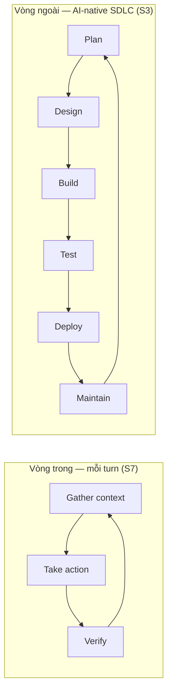

# Module 1.3: Context Window cơ bản

> **Thời gian học**: ~25 phút
>
> **Yêu cầu trước**: Module 1.2 (Giao diện & Các chế độ)
>
> **Kết quả**: Sau module này, bạn đọc được `/context`, tham chiếu file bằng `@`, điều hướng
> compaction bằng `/compact <instructions>`, chọn giữa `/compact`, `/clear`, session mới

---

## 1. WHY — Tại sao cần học cái này?

Bạn đang giữa phiên debug, hỏi Claude năm câu follow-up, rồi nhắc quyết định kiến trúc đã thống
nhất từ đầu — Claude dường như không nhớ. Auto-compact đã chạy và tóm tắt phần conversation cũ.
Đây không phải bug; đó là cách Claude Code giữ session dài trong cửa sổ có giới hạn cố định. Biết
cửa sổ chứa gì, cách kiểm tra, cách điều hướng compaction giữ lại gì là khác biệt giữa một session
âm thầm mất quyết định và một session bạn luôn kiểm soát được.

---

## 2. CONCEPT — Khái niệm cốt lõi

**Context window** là mọi thứ model thấy trong một request: system prompt, định nghĩa tool,
`CLAUDE.md`/memory file, toàn bộ conversation, output mọi tool call. Tool list MCP server lớn,
memory file dài, conversation 500 turn đều cạnh tranh cùng không gian đó.

Đừng ước tính dung lượng bằng tỷ lệ từ-trên-token — tiếng Việt, code, JSON tokenize khác nhau,
tỷ lệ cố định nào bạn nhớ cũng sai với một số nội dung. Đo trên chính file quan tâm:
`@path/to/file`, chạy `/context` (# docs: context, common-workflows) — grid cho biết chính xác
file đó tốn bao nhiêu.

### Tiếng Việt tốn nhiều token hơn — nhưng đo, đừng nhớ con số

Nhiều developer Việt bỏ qua: nội dung tiếng Việt (comment, tài liệu, log) thường tốn nhiều token
hơn tiếng Anh cùng độ dài, vì tokenizer chia chữ có dấu ra nhiều mảnh hơn. Mức chênh lệch tùy nội
dung, không hệ số cố định — `@` file tiếng Việt, chạy `/context`, so với bản tiếng Anh nếu có.

**Kích thước cửa sổ** phụ thuộc model. Sonnet 5 luôn chạy 1M token gốc, không suffix, không cần
usage credit, mọi plan. Model khác cần `[1m]`, ví dụ `/model opus[1m]`.
`CLAUDE_CODE_DISABLE_1M_CONTEXT=1` đưa model 1M-gốc về 200K (# docs: model-config).

**Auto-compact** bật mặc định, nén session 1M-gốc ở khoảng **967K token**; đổi ngưỡng bằng
`/autocompact 500k` hoặc `CLAUDE_CODE_AUTO_COMPACT_WINDOW`. `CLAUDE_AUTOCOMPACT_PCT_OVERRIDE` chỉ
hạ được tỷ lệ — không setting nào tắt hẳn auto-compact (# docs: costs). Sau compaction,
`CLAUDE.md` ở project root đọc lại từ disk, project instruction sống sót dù lịch sử conversation
thì không (# docs: memory).

Ba công cụ, không thay thế cho nhau:

- **`/compact <instructions>`** — tóm tắt ngay, instruction cho Claude biết giữ gì.
- **`/clear`** — bỏ conversation, bắt đầu mới cùng terminal.
- **Session mới** — `claude --continue`/`/resume` mở lại transcript giữ **30 ngày** mặc định;
  đóng terminal không xóa nó (# docs: sessions).

Anthropic gọi đây là tìm "tập token nhỏ nhất, tín hiệu cao nhất, tối đa hóa khả năng đạt được kết
quả bạn mong muốn" (S6) — compaction, `@`, `/clear` là ba công cụ cho mục tiêu đó.

Vòng lặp trong của module — gather context, act, verify (S7) — chạy bên trong một context window,
từng turn một:


```mermaid
graph LR
    subgraph "Vòng trong — mỗi turn (S7)"
        G[Gather context] --> A[Take action] --> V[Verify] --> G
    end
    subgraph "Vòng ngoài — AI-native SDLC (S3)"
        P[Plan] --> D[Design] --> B[Build] --> T[Test] --> Dp[Deploy] --> M[Maintain] --> P
    end
```

Vòng ngoài trải dài nhiều session, được nói từ Phase 6; module này tập trung kiểm soát vòng
trong.

---

## 3. DEMO — Làm mẫu từng bước

Session tương tác thật trong `~/cc-lab`; grid dưới là bản render ô màu thật, chép lại thành text
(`⛁`/`⛀` = đã dùng, `⛶` = trống, `⛝` = buffer dự trữ).

**Bước 1: Bắt đầu session và xem baseline**

```bash
$ claude
```

```text
> /context
```

```text
# Output có thể khác — /context, docs: context
  ⎿  Context Usage
     ⛁ ⛁ ⛁ ⛁ ⛀ ⛀ ⛁ ⛁ ⛁ ⛁ ⛀ ⛶ ⛶ ⛶ ⛶ ⛶ ⛶ ⛶ ⛶ ⛶   Opus 5.5 (1M context)
     ⛶ ⛶ ⛶ ⛶ ⛶ ⛶ ⛶ ⛶ ⛶ ⛶ ⛶ ⛶ ⛶ ⛶ ⛶ ⛶ ⛶ ⛶ ⛶ ⛶   claude-opus-5-5[1m]
     ⛶ ⛶ ⛶ ⛶ ⛶ ⛶ ⛶ ⛶ ⛶ ⛶ ⛶ ⛶ ⛶ ⛶ ⛶ ⛶ ⛶ ⛶ ⛶ ⛶   42.6k/1m tokens (4%)
     ⛶ ⛶ ⛶ ⛶ ⛶ ⛶ ⛶ ⛶ ⛶ ⛶ ⛶ ⛶ ⛶ ⛶ ⛶ ⛶ ⛶ ⛶ ⛶ ⛶
     ⛶ ⛶ ⛶ ⛶ ⛶ ⛶ ⛶ ⛶ ⛶ ⛶ ⛶ ⛶ ⛶ ⛶ ⛶ ⛶ ⛶ ⛶ ⛶ ⛶   Estimated usage by category
     ⛶ ⛶ ⛶ ⛶ ⛶ ⛶ ⛶ ⛶ ⛶ ⛶ ⛶ ⛶ ⛶ ⛶ ⛶ ⛶ ⛶ ⛶ ⛶ ⛶   ⛁ System prompt: 3.8k tokens (0.4%)
     ⛶ ⛶ ⛶ ⛶ ⛶ ⛶ ⛶ ⛶ ⛶ ⛶ ⛶ ⛶ ⛶ ⛶ ⛶ ⛶ ⛶ ⛶ ⛶ ⛶   ⛁ System tools: 14.2k tokens (1.4%)
     ⛶ ⛶ ⛶ ⛶ ⛶ ⛶ ⛶ ⛶ ⛶ ⛶ ⛶ ⛶ ⛶ ⛶ ⛶ ⛶ ⛶ ⛶ ⛶ ⛶   ⛁ MCP tools: 659 tokens (0.1%)
     ⛶ ⛶ ⛶ ⛶ ⛶ ⛶ ⛶ ⛶ ⛶ ⛶ ⛶ ⛶ ⛶ ⛝ ⛝ ⛝ ⛝ ⛝ ⛝ ⛝   ⛁ Custom agents: 4k tokens (0.4%)
                                               ⛁ Memory files: 7.1k tokens (0.7%)
                                               ⛁ Skills: 9.9k tokens (1.0%)
                                               ⛁ Messages: 1.3k tokens (0.1%)
                                               ⛶ Free space: 924.4k (92.4%)
                                               ⛝ Autocompact buffer: 33k tokens (3.3%)
     Auto-compact window: 1m tokens
     MCP tools · /mcp (loaded on-demand)
     └ 248 tools · 659 tokens
     Custom agents · .claude/agents/
     └ 51 agents · 4k tokens
     Memory files · /memory
     └ 1 file · 7.1k tokens
     Skills · /skills
     └ 170 skills · 9.9k tokens
     /context all to expand
```

MCP tool, agent, skill gộp thành một tổng mỗi loại — tên từng cái bên dưới bảng là riêng cho
từng máy, đã lược bớt.

> Trong script hay CI job, `claude -p "/context"` in cùng dữ liệu này dạng bảng Markdown thay vì
> grid — cùng con số, dạng plain-text (# docs: context).

**Bước 2: Tham chiếu file và xem chi phí**

```text
> @src/math.js explain this file in one short paragraph
```

```text
# Output có thể khác
  ⎿  Read src/math.js (3 lines)
⏺ src/math.js is a small ES module that exports two arithmetic helpers. add(a, b) returns a + b,
  and divide(a, b) returns a / b. Neither function checks its inputs. Dividing by zero gives
  Infinity, -Infinity, or NaN without an error.
```

```text
> /context
```

```text
# Output có thể khác — /context, docs: context
     ⛶ ⛶ ⛶ ⛶ ⛶ ⛶ ⛶ ⛶ ⛶ ⛶ ⛶ ⛶ ⛶ ⛶ ⛶ ⛶ ⛶ ⛶ ⛶ ⛶   60.5k/1m tokens (6%)
     …
                                               ⛁ Messages: 19.3k tokens (1.9%)
                                               ⛶ Free space: 906.5k (90.6%)
```

Messages nhảy từ 1.3k lên 19.3k token — thói quen "đo thay vì đoán": `@file` rồi `/context`,
không phải tỷ lệ nhớ sẵn.

**Bước 3: Check `/usage` — và thấy nó không phải cùng một đồng hồ**

```text
> /usage
```

```text
# Output có thể khác — /usage (subscription view), docs: costs
You are currently using your subscription to power your Claude Code usage

Current session: 36% used · resets 5pm (local time)
Current week (all models): 47% used · resets Oct 1
…
```

Docs: *"The Session block in `/usage` shows API token usage… Subscribers see plan usage bars,
activity stats, and a usage breakdown"* (# docs: costs) — subscription hiện % như trên; API key
hiện bảng chi phí đô la. Dù kiểu nào, `/usage` (alias `/cost`) báo chi tiêu, **không** phải độ
đầy context.

**Bước 4: Điều hướng compaction bằng `/compact <instructions>`**

```text
> /compact Keep the decisions about divide() error handling
```

```text
# Output có thể khác — /compact, docs: costs
· Compacting conversation… (9s · ↓ 682 tokens)
  ⎿  Tip: Continue your session in Claude Code Desktop with /desktop
```

`/context` trước/sau xác nhận mức giảm: **62.6k/1m (6%), Messages 21.4k** → **55.2k/1m (6%),
Messages 14.7k**. Conversation quá ít thì in `Not enough messages to compact.`

**Bước 5: `/clear` — không xác nhận, về thẳng baseline**

```text
> /clear
```

```text
# Output có thể khác
```

`/clear` không in, không hỏi gì.

```text
> /context
```

```text
# Output có thể khác — /context, docs: context
                                               42.7k/1m tokens (4%)
…
                                               ⛁ Messages: 1.5k tokens (0.1%)
                                               ⛶ Free space: 924.3k (92.4%)
```

Về baseline — thảo luận divide() biến mất khỏi session này.

**Bước 6: Chứng minh session không "chết" sau khi thoát**

Hai lệnh headless cho thấy điều này — giống hệt đóng rồi mở lại terminal (# docs: sessions):

```bash
$ claude -p "We're discussing src/math.js. I'm leaning toward making divide() throw a RangeError when the divisor is zero, instead of returning Infinity."
```

```bash
$ claude -p --continue "What change were we considering for divide(), and in which file?"
```

```text
# Output có thể khác — claude -p --continue, docs: sessions
We were considering having divide() in src/math.js throw a RangeError when the
divisor is zero, instead of returning Infinity. I haven't made the change yet;
I'm waiting for your go-ahead.
```

Session sống sót qua việc thoát — `/clear` hoặc cửa sổ đầy chưa compact mới mất context, không
phải đóng terminal.

---

## 4. PRACTICE — Tự thực hành

### Bài tập 1: Đo chi phí context của một file thật

**Mục tiêu**: biết file dependency lớn nhất tốn bao nhiêu.

**Hướng dẫn**: trong một project, chạy `claude`, `@package-lock.json` (hoặc file generate lớn
nhất) với prompt ngắn, rồi `/context`. So sánh Messages trước/sau.

**Kết quả**: một con số token cụ thể, không phải đoán.

<details>
<summary>💡 Gợi ý</summary>

File generate (lockfile, migration, bundle minify) thường đắt nhất khi `@`-tham chiếu.

</details>

<details>
<summary>✅ Đáp án</summary>

Dòng Messages trong `/context` trước/sau khi `@` file chính là chi phí thật — không cần ước
lượng.

</details>

---

### Bài tập 2: Viết instruction `/compact` tập trung

**Mục tiêu**: giữ quyết định từ refactor dài, bỏ phần khám phá.

**Hướng dẫn**: bạn mất một giờ khám phá ba cách tiếp cận cho một migration và chọn một. Viết
instruction `/compact` bạn sẽ chạy tiếp theo.

<details>
<summary>✅ Đáp án</summary>

`/compact Keep the decision to use approach B and why we rejected A and C. Drop the exploration
itself.` — nêu rõ giữ gì, không chỉ bỏ gì; mặc định compaction tóm tắt đều nếu không chỉ dẫn.

</details>

---

### Bài tập 3: Compact, clear, hay session mới?

**Mục tiêu**: chọn công cụ cho bốn tình huống.

| Tình huống | Lựa chọn |
|---|---|
| Context sắp đầy, quyết định quan trọng | ? |
| Chuyển việc hoàn toàn không liên quan | ? |
| Thử cách rủi ro mà không mất mạch hiện tại | ? |
| Quay lại ngày mai, đúng task này | ? |

<details>
<summary>✅ Đáp án</summary>

`/compact <instructions>` (giữ quyết định, bỏ khám phá); `/clear` (việc không liên quan, context
cũ chỉ tốn phí); `/branch` (session mới, bản gốc còn nguyên); `claude --continue`/`/resume`
(transcript vẫn trên disk).

</details>

---

## 5. CHEAT SHEET

| Lệnh / Flag | Mục đích |
|---|---|
| `/context` | Grid những gì đang chiếm cửa sổ |
| `/usage` (alias `/cost`) | Chi tiêu, không phải độ đầy |
| `/compact [instructions]` | Tóm tắt ngay; instruction định hướng giữ gì |
| `/autocompact <size>` | Đổi ngưỡng kích hoạt auto-compact |
| `/clear` | Bỏ conversation, session mới, cùng terminal |
| `@path/to/file` | Đưa nội dung file vào |
| `@path/to/dir/` | Chỉ liệt kê thư mục |
| `claude --continue` | Mở lại session gần nhất tại đây |
| `claude --resume [id]` | Mở lại session cụ thể |
| `/resume` | Bảng chọn session |
| `CLAUDE_CODE_AUTO_COMPACT_WINDOW` | Ghi đè số token kích hoạt |
| `CLAUDE_AUTOCOMPACT_PCT_OVERRIDE` | Chỉ hạ (không tăng) tỷ lệ |
| `CLAUDE_CODE_DISABLE_1M_CONTEXT=1` | Đưa model 1M-gốc về 200K |

---

## 6. PITFALLS — Những sai lầm cần tránh

| ❌ Sai lầm | ✅ Cách đúng |
|---|---|
| Check `/cost` khi nghi context đầy | Alias của `/usage` — chi tiêu, không phải độ đầy. Dùng `/context`. |
| Gõ lệnh `/read` | Không tồn tại. Dùng `@path/to/file`. |
| "Cứ 30 phút compact một lần cho chắc" | Auto-compact tự chạy; dùng `/compact <focus>` khi đổi pha, không theo giờ. |
| Mong có biến `DISABLE_AUTO_COMPACT` | Không tồn tại. `CLAUDE_AUTOCOMPACT_PCT_OVERRIDE` chỉ hạ ngưỡng. |
| "Đóng terminal là mất conversation" | Transcript tồn tại ~30 ngày. `claude --continue`/`/resume` tiếp tục đúng chỗ cũ. |
| Nhớ sẵn "1 token ≈ 2 từ" | Tokenize khác nhau theo ngôn ngữ, code, định dạng. Đo bằng `@file` + `/context`. |

---

## 7. REAL CASE — Tình huống thực tế

**Bối cảnh**: một team backend fintech Việt Nam migrate payment service Kotlin — 500+ file, tài
liệu nội bộ tiếng Việt dày đặc.

**Vấn đề**: một kỹ sư ở trong session nhiều giờ, tham chiếu module này đến module khác. Cuối chiều
anh hỏi về quyết định từ sáng. Câu trả lời của Claude mơ hồ — auto-compact đã chạy, giữ context
chung nhưng bỏ mất lý do cụ thể.

**Giải pháp**: không tránh compaction mà điều hướng nó. Trước khi chuyển module, team chạy
`/compact Keep the decisions about <topic>, drop exploration of rejected approaches` tại điểm
dừng tự nhiên, chuyển quyết định đã chốt vào `CLAUDE.md` để sống sót như project instruction thay
vì lịch sử conversation. Họ cũng đo thay vì đoán: tài liệu onboarding tiếng Việt dài `@` tốn nhiều
token hơn dự kiến, xác nhận bằng `/context` — chuyển thành skill (Module 15.3).

**Kết quả**: ít "Claude quên" hơn, `CLAUDE.md` phản ánh đúng điều team quyết định.

---

> `(S3)`, `(S6)`, `(S7)`: `docs/references/anthropic-sources.md`.

> **Tiếp theo**: [Module 2.1: Mô hình mối đe dọa — Hiểu rủi ro](../../phase-02-security/01-threat-model/) →
