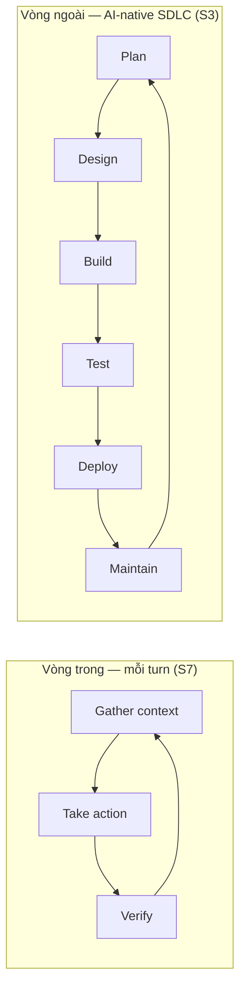

# Module 1.3: Context Window cơ bản

> **Thời gian học**: ~25 phút
>
> **Yêu cầu trước**: Module 1.2 (Giao diện & Các chế độ)
>
> **Kết quả**: Sau module này, bạn có thể đọc `/context`, tham chiếu file bằng `@`, điều hướng
> compaction bằng `/compact <instructions>`, và chọn giữa `/compact`, `/clear`, session mới

---

## 1. WHY — Tại sao cần học cái này?

Bạn đang giữa phiên debug, hỏi Claude năm câu follow-up, rồi nhắc quyết định kiến trúc đã thống
nhất từ đầu — Claude dường như không nhớ. Auto-compact đã chạy và tóm tắt phần conversation cũ.
Đây không phải bug; đó là cách Claude Code giữ session dài trong một cửa sổ có giới hạn cố định.
Biết cửa sổ chứa gì, cách kiểm tra, và cách điều hướng compaction giữ lại gì là khác biệt giữa
một session âm thầm mất quyết định và một session bạn luôn kiểm soát được.

---

## 2. CONCEPT — Khái niệm cốt lõi

**Context window** là mọi thứ model thấy trong một request: system prompt, định nghĩa tool,
`CLAUDE.md`/memory file, toàn bộ conversation, và output mọi tool call. Tool list của một MCP
server lớn, một memory file dài, conversation 500 turn đều cạnh tranh cùng không gian đó.

Đừng ước tính dung lượng bằng tỷ lệ từ-trên-token — tiếng Việt, code, JSON tokenize khác nhau,
nên tỷ lệ cố định nào bạn nhớ cũng sai với một số nội dung. Đo trên chính file bạn quan tâm:
`@path/to/file`, chạy `/context` (# docs: context, common-workflows). Grid cho biết chính xác
file đó tốn bao nhiêu.

### Tiếng Việt tốn nhiều token hơn — nhưng đo, đừng nhớ con số

Nhiều developer Việt bỏ qua: nội dung tiếng Việt (comment, tài liệu, log) thường tốn nhiều token
hơn tiếng Anh cùng độ dài, vì tokenizer chia chữ có dấu ra nhiều mảnh hơn. Mức chênh lệch tùy nội
dung, không có hệ số cố định — `@` file tiếng Việt, chạy `/context`, so với bản tiếng Anh nếu có.

**Kích thước cửa sổ** phụ thuộc model. Sonnet 5 luôn chạy 1M token gốc, không suffix, không cần
usage credit, ở mọi plan. Model khác cần `[1m]`, ví dụ `/model opus[1m]`.
`CLAUDE_CODE_DISABLE_1M_CONTEXT=1` đưa model 1M-gốc về 200K (# docs: model-config).

**Auto-compact** bật mặc định, nén session 1M-gốc ở khoảng **967K token**; đổi ngưỡng bằng
`/autocompact 500k` hoặc `CLAUDE_CODE_AUTO_COMPACT_WINDOW`. `CLAUDE_AUTOCOMPACT_PCT_OVERRIDE` chỉ
hạ được tỷ lệ này — không có setting tắt hẳn auto-compact (# docs: costs). Sau compaction,
`CLAUDE.md` ở project root được đọc lại từ disk, nên project instruction sống sót dù lịch sử
conversation thì không (# docs: memory).

Ba công cụ, không thay thế cho nhau:

- **`/compact <instructions>`** — tóm tắt ngay, instruction cho Claude biết giữ lại gì.
- **`/clear`** — bỏ conversation, bắt đầu mới cùng terminal.
- **Session mới** — `claude --continue` hoặc `/resume` mở lại transcript giữ trên disk **30
  ngày** mặc định; đóng terminal không xóa nó (# docs: sessions).

Anthropic gọi đây là tìm "tập token nhỏ nhất, tín hiệu cao nhất, tối đa hóa khả năng đạt kết quả
mong muốn" (S6) — compaction, `@`, `/clear` là ba công cụ cho mục tiêu đó.

Vòng lặp trong của module — gather context, act, verify (S7) — chạy bên trong một context window,
từng turn một:


```mermaid
graph LR
    subgraph "Vòng trong — mỗi turn (S7)"
        G[Gather context] --> A[Take action] --> V[Verify] --> G
    end
    subgraph "Vòng ngoài — AI-native SDLC (S3)"
        P[Plan] --> D[Design] --> B[Build] --> T[Test] --> Dp[Deploy] --> M[Maintain] --> P
    end
```

Vòng ngoài trải dài nhiều session, được nói từ Phase 6; module này tập trung kiểm soát vòng
trong.

---

## 3. DEMO — Làm mẫu từng bước

**Bước 1: Bắt đầu session và xem baseline**

```bash
$ claude
```

```text
> /context
```

```markdown
# Output có thể khác — /context, docs: context
## Context Usage

**Model:** claude-opus-5-5[1m]
**Tokens:** 26.7k / 1m (3%)

### Estimated usage by category

| Category | Tokens | Percentage |
|----------|--------|------------|
| System prompt | 2.2k | 0.2% |
| System tools (deferred) | 14.1k | 1.4% |
| Memory files | 7.1k | 0.7% |
| Skills | 9.9k | 1.0% |
| Messages | 1.3k | 0.1% |
| Free space | 940.3k | 94.0% |
| Autocompact buffer | 33k | 3.3% |
…
```

`/context` còn liệt kê MCP tool, agent, skill đã load bên dưới bảng — lược bớt (`…`) vì danh sách
riêng cho từng máy.

**Bước 2: Tham chiếu file và xem chi phí**

```text
> @src/math.js explain this file
```

Claude đọc `src/math.js`, giải thích `add()`/`divide()`, gồm chia cho 0 trả về `Infinity`/`NaN`
thay vì throw.

```text
> /context
```

```text
# Output có thể khác — /context, docs: context
**Tokens:** 54.7k / 1m (5%)
…
| Messages | 30k | 3.0% |
| Free space | 912.3k | 91.2% |
…
```

Messages nhảy từ 1.3k lên 30k token — thói quen "đo thay vì đoán": `@file` rồi `/context`, không
phải tỷ lệ nhớ sẵn.

**Bước 3: Check `/usage` — và thấy nó không phải cùng một đồng hồ**

```text
> /usage
```

```text
# Output có thể khác — /usage, docs: costs
You are currently using your subscription to power your Claude Code usage

Current session: 36% used · resets 5pm (local time)
Current week (all models): 47% used · resets Oct 1
…
```

`/usage` (alias `/cost`) báo chi tiêu so với plan/budget — **không** phải độ đầy context. Đó là
việc của `/context`.

**Bước 4: Điều hướng compaction bằng `/compact <instructions>`**

```text
> What would happen if divide() received a string like "10"?
> Should divide() throw on division by zero instead of returning Infinity?
> /compact Keep the decisions about divide() error handling
```

Một session còn ngắn sẽ từ chối thay vì tóm tắt gần như trống rỗng:

```text
# Output có thể khác — /compact, docs: costs
⎿ Not enough messages to compact.
```

Có conversation thật để tóm tắt, `/compact` chạy — headless mode không in thông báo, xác minh
bằng `/context` trước/sau:

```text
# Output có thể khác — /context, docs: context
trước: **Tokens:** 54.7k / 1m (5%)  | Messages 30k
sau:   **Tokens:** 37.9k / 1m (4%)  | Messages 12.6k
```

**Bước 5: `/clear` — không xác nhận, về thẳng baseline**

```text
> /clear
```

`/clear` không in gì, không hỏi gì; bắt đầu session mới cùng terminal.

```text
> /context
```

```text
# Output có thể khác — /context, docs: context
**Tokens:** 26.8k / 1m (3%)
…
| Messages | 1.5k | 0.1% |
| Free space | 940.2k | 94.0% |
…
```

Về baseline — thảo luận divide() đã biến mất khỏi session này.

**Bước 6: Thoát, rồi chứng minh session không "chết"**

```bash
$ claude
```

```text
> We're discussing src/math.js. I'm leaning toward making divide() throw a
> RangeError when the divisor is zero, instead of returning Infinity.
```

Đóng terminal, quay lại sau:

```bash
$ claude --continue
```

```text
> What change were we considering for divide(), and in which file?
```

```text
# Output có thể khác — claude --continue, docs: sessions
We were considering having divide() in src/math.js throw a RangeError when the
divisor is zero, instead of returning Infinity. I haven't made the change yet;
I'm waiting for your go-ahead.
```

Session sống sót qua việc thoát. `/clear` hoặc cửa sổ đầy chưa compact mới làm mất context — không
phải đóng terminal.

---

## 4. PRACTICE — Tự thực hành

### Bài tập 1: Đo chi phí context của một file thật

**Mục tiêu**: biết chính xác file dependency lớn nhất của bạn tốn bao nhiêu.

**Hướng dẫn**: trong một project của bạn, chạy `claude`, `@package-lock.json` (hoặc file generate
lớn nhất) với prompt ngắn, rồi `/context`. So sánh Messages trước/sau.

**Kết quả mong đợi**: một con số token cụ thể, không phải đoán.

<details>
<summary>💡 Gợi ý</summary>

File generate (lockfile, migration, bundle minify) thường đắt nhất khi `@`-tham chiếu. Kiểm tra
trước khi paste vào session dài.

</details>

<details>
<summary>✅ Đáp án</summary>

Dòng Messages trong `/context` trước và sau khi `@` file chính là chi phí thật — không cần ước
lượng.

</details>

---

### Bài tập 2: Viết instruction `/compact` tập trung

**Mục tiêu**: giữ quyết định từ một refactor dài, bỏ phần khám phá.

**Hướng dẫn**: bạn mất một giờ với Claude khám phá ba cách tiếp cận cho một migration và chọn
một. Viết instruction `/compact` bạn sẽ chạy tiếp theo.

<details>
<summary>✅ Đáp án</summary>

`/compact Keep the decision to use approach B and why we rejected A and C. Drop the exploration
of A and C themselves.` — nêu rõ giữ gì, không chỉ bỏ gì; mặc định compaction tóm tắt đều nếu
không được chỉ dẫn.

</details>

---

### Bài tập 3: Compact, clear, hay session mới?

**Mục tiêu**: chọn đúng công cụ cho bốn tình huống.

| Tình huống | Lựa chọn |
|---|---|
| Context sắp đầy, quyết định quan trọng | ? |
| Chuyển việc hoàn toàn không liên quan | ? |
| Thử cách rủi ro mà không mất mạch hiện tại | ? |
| Quay lại ngày mai, đúng task này | ? |

<details>
<summary>✅ Đáp án</summary>

`/compact <instructions>` (giữ quyết định, bỏ khám phá); `/clear` (việc không liên quan, context
cũ chỉ tốn phí); `/branch` (session ID mới, bản gốc còn nguyên); `claude --continue` hoặc
`/resume` (transcript vẫn trên disk).

</details>

---

## 5. CHEAT SHEET

| Lệnh / Flag | Mục đích |
|---|---|
| `/context` | Grid những gì đang chiếm cửa sổ |
| `/usage` (alias `/cost`) | Chi tiêu, không phải độ đầy |
| `/compact [instructions]` | Tóm tắt ngay; instruction định hướng giữ gì |
| `/autocompact <size>` | Đổi ngưỡng kích hoạt auto-compact |
| `/clear` | Bỏ conversation, session mới, cùng terminal |
| `@path/to/file` | Đưa toàn bộ nội dung file vào |
| `@path/to/dir/` | Chỉ liệt kê thư mục |
| `claude --continue` | Mở lại session gần nhất tại đây |
| `claude --resume [id]` | Mở lại session cụ thể |
| `/resume` | Bảng chọn session |
| `CLAUDE_CODE_AUTO_COMPACT_WINDOW` | Ghi đè số token kích hoạt |
| `CLAUDE_AUTOCOMPACT_PCT_OVERRIDE` | Chỉ hạ (không tăng) tỷ lệ kích hoạt |
| `CLAUDE_CODE_DISABLE_1M_CONTEXT=1` | Đưa model 1M-gốc về 200K |

---

## 6. PITFALLS — Những sai lầm cần tránh

| ❌ Sai lầm | ✅ Cách đúng |
|---|---|
| Check `/cost` khi nghi context đầy | Alias của `/usage` — chi tiêu, không phải độ đầy. Dùng `/context`. |
| Gõ lệnh `/read` | Không tồn tại. Dùng `@path/to/file`. |
| "Cứ 30 phút compact một lần cho chắc" | Auto-compact tự chạy; dùng `/compact <focus>` khi đổi pha, không theo giờ. |
| Mong có biến `DISABLE_AUTO_COMPACT` | Không tồn tại. `CLAUDE_AUTOCOMPACT_PCT_OVERRIDE` chỉ hạ được ngưỡng. |
| "Đóng terminal là mất conversation" | Transcript tồn tại ~30 ngày. `claude --continue`/`/resume` tiếp tục đúng chỗ cũ. |
| Nhớ sẵn "1 token ≈ 2 từ" | Tokenize khác nhau theo ngôn ngữ, code, định dạng. Đo bằng `@file` + `/context`. |

---

## 7. REAL CASE — Tình huống thực tế

**Bối cảnh**: một team backend fintech Việt Nam đang migrate payment service Kotlin — 500+ file,
tài liệu nội bộ tiếng Việt dày đặc.

**Vấn đề**: một kỹ sư ở trong session nhiều giờ, tham chiếu hết module này đến module khác. Cuối
chiều anh hỏi về quyết định kiến trúc từ sáng. Câu trả lời của Claude mơ hồ — auto-compact đã
chạy, giữ context chung nhưng bỏ mất lý do cụ thể.

**Giải pháp**: không phải tránh compaction mà là điều hướng nó. Trước khi chuyển module, team chạy
`/compact Keep the decisions about <topic>, drop exploration of rejected approaches` tại điểm
dừng tự nhiên, chuyển quyết định đã chốt vào `CLAUDE.md` để sống sót như project instruction thay
vì lịch sử conversation. Họ cũng đo thay vì đoán: tài liệu onboarding tiếng Việt dài `@` tốn nhiều
token hơn dự kiến, xác nhận bằng `/context` — họ chuyển nó thành skill (Module 15.3).

**Kết quả**: ít khoảnh khắc "Claude quên" hơn, `CLAUDE.md` phản ánh đúng điều team quyết định.

---

> `(S3)`, `(S6)`, `(S7)`: `docs/references/anthropic-sources.md`.

> **Tiếp theo**: [Module 2.1: Mô hình mối đe dọa — Hiểu rủi ro](../../phase-02-security/01-threat-model/) →
