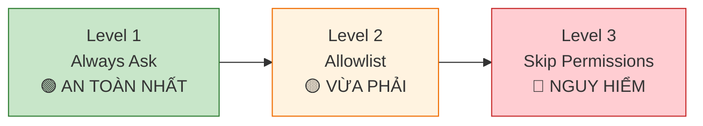

# Module 2.2: Permission System Deep Dive — Hiểu hệ thống an toàn của Claude Code

> **Thời gian học**: ~35 phút
>
> **Yêu cầu trước**: Module 2.1 (Threat Model)
>
> **Kết quả**: Sau module này, bạn sẽ hiểu hệ thống permission của Claude Code, biết cách cấu hình các mức an toàn phù hợp, và nhận biết khi nào nên approve hoặc deny request

---

## 1. WHY — Tại sao cần học cái này?

Bạn đã đọc Module 2.1. Bạn biết Claude Code chạy với quyền của BẠN trên máy của BẠN. Nó có thể đọc SSH key, xóa file, push lên production. Nghe kinh khủng. Nhưng điều này quan trọng: Claude Code không hẳn là liều lĩnh hoàn toàn. Nó có một hệ thống permission hỏi bạn trước khi chạy các lệnh nguy hiểm. Module này chỉ cho bạn hệ thống đó hoạt động như thế nào, nó bảo vệ bạn khỏi cái gì, và — quan trọng nhất — nó THẤT BẠI ở đâu. Permission prompt là phòng tuyến cuối cùng. Hiểu nó không phải là optional.

---

## 2. CONCEPT — Khái niệm cốt lõi

### Cơ chế Permission mặc định

Mặc định, Claude Code yêu cầu quyền trước khi thực thi shell command. Khi nó muốn chạy thứ gì đó như `git push` hay `npm install`, nó hiện một prompt với full command và đợi bạn duyệt. Bạn có thể approve, deny, hoặc approve một lần hay luôn luôn cho loại command đó.

**Cái gì trigger prompt**: ⚠️ Needs verification
- Shell command qua Bash tool
- File write sửa code ngoài safe path
- Network operation (curl, wget, API call)

**Cái gì KHÔNG trigger prompt**: ⚠️ Needs verification
- Đọc file (Claude Code có thể đọc bất cứ thứ gì bạn có quyền truy cập mà không cần hỏi)
- Dùng language tool như `lsp_diagnostics`
- Operation nội bộ như search với Grep

**Luồng approval**: Bạn thấy command, description của nó, và các nút để approve hoặc deny. Nếu deny, Claude Code dừng lại và báo cáo việc từ chối. Nếu approve, nó chạy ngay lập tức.

### Phổ Trust Level

Hệ thống permission hoạt động theo phổ từ "an toàn tối đa" đến "không có an toàn gì cả":



**Level 1 (Always Ask)**: Mọi shell command đều trigger prompt. Đây là mode mặc định và an toàn nhất cho local development. Bạn vẫn nắm quyền kiểm soát.

**Level 2 (Allowlist)**: Bạn pre-approve các lệnh an toàn cụ thể (như `ls`, `cat`, `grep`) để Claude Code không hỏi mỗi lần. Rủi ro trung bình — phụ thuộc hoàn toàn vào cái bạn cho vào allowlist.

**Level 3 (Skip Permissions)**: Chạy Claude Code với flag `--dangerously-skip-permissions`. Không có prompt. Không có safety net. Claude Code thực thi bất cứ thứ gì nó muốn. Rủi ro tối đa.

### Flag --dangerously-skip-permissions

Cái tên của flag này không phải là phóng đại. Nó THỰC SỰ nguy hiểm.

**Nó làm gì**: Loại bỏ TẤT CẢ các permission check. Claude Code chạy mọi command nó tạo ra mà không hỏi bạn. Xóa file, git push, network request, sửa hệ thống — tất cả tự động.

**Khi nào chấp nhận được**:
- Bên trong Docker container (isolated, disposable)
- CI/CD pipeline (ephemeral environment, không có secret)
- Automated testing environment (destroy sau mỗi lần chạy)

**Khi nào KHÔNG chấp nhận**:
- Máy development local của bạn
- Bất kỳ môi trường nào có access tới credential thật
- Shared server hoặc staging environment
- "Chỉ để tiết kiệm thời gian click approve"

**Hậu quả thực tế**:
- Claude Code hiểu nhầm ý định của bạn và chạy `rm -rf src/` thay vì `rm -rf src/temp/`
- Claude Code "giúp đỡ" bằng cách chạy `git push --force origin main` trong lúc refactor
- Claude Code thực thi `curl` với API key của bạn trong URL, log chúng ra third-party service
- Claude Code chạy `npm install malicious-package` sau khi đọc nhầm tên dependency

### Cấu hình Allowlist ⚠️ Needs verification

Bạn có thể cấu hình danh sách các command được pre-approve mà không trigger prompt. Điều này giảm "approval fatigue" cho các operation an toàn thường gặp.

**Allowlist an toàn được khuyến nghị**:
- `ls`, `pwd`, `cat`, `head`, `tail` (read-only file operation)
- `grep`, `find` (search operation)
- `git status`, `git log`, `git diff` (read-only git command)
- `npm list`, `pip list` (read-only package check)

**KHÔNG BAO GIỜ allowlist**:
- `rm` (xóa file)
- `git push`, `git push --force` (sửa remote)
- `curl`, `wget` (network request)
- `npm install`, `pip install` (cài package)
- `chmod`, `chown` (thay đổi permission)
- Bất kỳ command nào ghi vào disk hoặc network

**Cách cấu hình**: ⚠️ Needs verification — Vị trí cấu hình và cú pháp cần verification. Check tài liệu Claude Code để biết method allowlist configuration hiện tại.

### Đọc Permission Prompt

Trước khi click "approve", LUÔN LUÔN kiểm tra:

1. **Full command**: Đọc từng chữ. Tìm các flag như `--force`, `-r`, `-f`
2. **File path**: Nó đang hoạt động trong project directory của bạn? Hay /etc/? Hay ~/.ssh/?
3. **Network target**: Nếu là curl/wget, nó đang gửi dữ liệu đi đâu?
4. **Destructive operation**: Nó có xóa, ghi đè, hay push không?
5. **Description**: Giải thích của Claude Code có khớp với cái mà command thực sự làm không?

**Red flag** — DỪNG lại và điều tra trước khi approve:
- Path ngoài project directory
- Command bạn không nhận ra
- Network operation (trừ khi bạn yêu cầu rõ ràng)
- `rm`, `mv`, `chmod` không có justification rõ ràng
- `git push` khi bạn không yêu cầu publish change
- Bất kỳ command nào hoạt động trên dotfile (`~/.bashrc`, `~/.ssh/config`)

**Approval fatigue là có thật**: Khi Claude Code hỏi quyền 20 lần trong một session, bạn sẽ bị cám dỗ click "yes" mà không đọc. Đây là cách mà lỗi xảy ra. Chống lại nó bằng cách:
- Dùng allowlist cho các command thực sự an toàn ⚠️
- Nghỉ giải lao khi bạn bắt gặp mình đang auto-approve
- Hỏi Claude Code giải thích TẠI SAO nó cần chạy command đó
- Deny các command aggressive và hỏi alternative

---

## 3. DEMO — Làm mẫu từng bước

⚠️ Format chính xác của permission prompt có thể khác nhau tùy version Claude Code. Phần sau demo luồng conceptual.

**Bước 1: Khởi động Claude Code với Permission mặc định**
```bash
$ claude
```
Kết quả mong đợi: Claude Code khởi động ở interactive mode với permission system đang active (default behavior).

**Bước 2: Trigger một Permission Prompt**
Prompt Claude Code với: "Run git status to show me the current repository state"

Kết quả mong đợi (conceptual):
```
Claude Code wants to run a command:

  git status

Description: Show working tree status

[ Approve Once ] [ Approve Always ] [ Deny ]
```

Claude Code tạm dừng và đợi quyết định của bạn.

**Bước 3: Thực hành Approve**
Click "Approve Once" (hoặc tương đương trong interface của bạn).

Kết quả mong đợi: Claude Code chạy `git status` và hiện output cho bạn. Nếu bạn yêu cầu chạy `git status` lại, nó sẽ hỏi quyền lại (vì bạn chọn "once").

**Bước 4: Thực hành Deny**
Prompt: "Delete all files in the src directory"

Permission prompt mong đợi (conceptual):
```
Claude Code wants to run a command:

  rm -rf src/

Description: Remove directory recursively

[ Approve Once ] [ Approve Always ] [ Deny ]
```

Click "Deny".

Kết quả mong đợi: Claude Code dừng lại và trả lời kiểu như "I was unable to complete that action because permission was denied."

**Bước 5: Hiểu "Approve Always"**
Prompt: "Show me the first 10 lines of README.md"

Permission prompt mong đợi:
```
Claude Code wants to run a command:

  head -n 10 README.md

Description: Display first 10 lines of file

[ Approve Once ] [ Approve Always ] [ Deny ]
```

Click "Approve Always" (chỉ để demo thôi — cẩn thận với cái này trong thực tế).

Kết quả mong đợi: Claude Code chạy command. Lần sau nó muốn chạy `head`, nó sẽ không hỏi (bạn đã approve command type này permanently cho session hoặc project này ⚠️ exact scope cần verification).

**Bước 6: Kiểm tra Permission Setting** ⚠️ Needs verification
```bash
$ claude config show
```
Kết quả mong đợi: Configuration output hiển thị current permission setting, allowlist, và trust level. ⚠️ Command chính xác và output format cần verification.

---

## 4. PRACTICE — Tự thực hành

### Exercise 1: Trigger và Deny Permission

**Mục tiêu**: Trải nghiệm permission prompt cho các loại command khác nhau và thực hành đưa ra approval decision.

**Hướng dẫn**:
1. Khởi động Claude Code trong test project
2. Yêu cầu nó thực hiện các action này (từng cái một):
   - Đọc file: "Show me the contents of package.json"
   - Ghi file: "Create a new file called test.txt with the word 'hello'"
   - Chạy shell command: "List all files in the current directory"
   - Chạy network request: "Download the latest version info from npmjs.com" ⚠️
3. Với mỗi prompt, xác định:
   - Command chính xác là gì?
   - Nó đang hoạt động bên trong project directory không?
   - Nó read-only hay modify state?
   - Bạn có approve cái này trong scenario thực không?
4. Deny ít nhất một request và quan sát phản hồi của Claude Code

**Kết quả mong đợi**: Bạn đã thấy permission prompt cho các loại operation khác nhau và thực hành đọc chúng trước khi approve.

<details>
<summary>💡 Gợi ý</summary>

File read operation có thể không trigger prompt (Claude Code có thể đọc file im lặng qua Read tool). Tập trung vào shell command và write operation.

Nếu Claude Code không trigger prompt cho network request, đó là thông tin quan trọng — nghĩa là bạn cần external control (firewall, network monitoring) để bảo vệ khỏi data exfiltration.

</details>

<details>
<summary>✅ Đáp án</summary>

**Đọc file**: Có thể không có prompt — Claude Code dùng Read tool trực tiếp.

**Ghi file**: Nên trigger prompt như:
```
echo 'hello' > test.txt
```
Approve nếu trong project directory.

**List file**: Nên trigger prompt:
```
ls -la
```
An toàn để approve — read-only operation.

**Network request**: ⚠️ Behavior khác nhau. Có thể trigger prompt như:
```
curl https://registry.npmjs.com/...
```
Đây là READ operation nhưng liên quan network. Chỉ approve nếu bạn tin target và yêu cầu action này rõ ràng.

**Bài học chính**: LUÔN đọc full command. "List files" có thể là `ls` (safe) hoặc `ls /etc/passwd` (suspicious). Context quan trọng.

</details>

---

### Exercise 2: Cấu hình Safe Allowlist ⚠️ Needs verification

**Mục tiêu**: Thiết lập pre-approved command cho project của bạn để giảm approval fatigue mà không làm giảm security.

**Hướng dẫn**:
1. Xác định các command bạn chạy thường xuyên qua Claude Code (kiểm tra session history nếu có)
2. Lọc các read-only operation: `ls`, `cat`, `grep`, `git status`, `git log`, `git diff`
3. ⚠️ Tìm allowlist configuration của Claude Code (check documentation để biết method hiện tại)
4. Thêm các safe command này vào allowlist của bạn
5. Test: Yêu cầu Claude Code chạy allowlisted command — nó nên thực thi mà không prompt
6. Test: Yêu cầu Claude Code chạy non-allowlisted command — nó vẫn nên prompt

**Kết quả mong đợi**: Giảm approval fatigue cho safe operation trong khi vẫn duy trì protection cho các operation nguy hiểm.

<details>
<summary>💡 Gợi ý</summary>

Bắt đầu với minimal allowlist: `ls`, `pwd`, `cat`, `git status`. Chỉ mở rộng khi cần. Không bao giờ thêm write operation hoặc network command.

Nếu bạn không tìm thấy allowlist configuration, feature đó có thể chưa tồn tại — dùng Level 1 (Always Ask) và chấp nhận approval overhead.

</details>

<details>
<summary>✅ Đáp án</summary>

⚠️ Configuration method cần verification. Cách tiếp cận conceptual:

**Safe allowlist**:
```json
{
  "allowlist": [
    "ls",
    "ls -la",
    "pwd",
    "cat",
    "head",
    "tail",
    "grep",
    "git status",
    "git log",
    "git diff"
  ]
}
```

**Test**: "Show me git status" → nên chạy mà không có prompt
**Test**: "Delete temp.txt" → vẫn nên prompt (rm không có trong allowlist)

</details>

---

### Exercise 3: Document Team Permission Policy

**Mục tiêu**: Tạo permission policy bằng văn bản để team của bạn tuân theo khi dùng Claude Code.

**Hướng dẫn**:
1. Tạo document: `CLAUDE_PERMISSIONS.md` trong project root
2. Định nghĩa ba approval category:
   - ✅ Auto-approve (an toàn, read-only)
   - ⚠️ Review cẩn thận (phụ thuộc context)
   - ❌ Luôn deny (nguy hiểm)
3. List các command ví dụ cho mỗi category
4. Document approval decision process
5. Chỉ rõ khi nào --dangerously-skip-permissions được phép (gợi ý: hầu như không bao giờ)

**Kết quả mong đợi**: Một tài liệu tham khảo cho team giảm security incident và inconsistent permission decision.

<details>
<summary>💡 Gợi ý</summary>

Nghĩ về worst-case scenario của bạn từ Module 2.1. Command nào có thể gây ra những scenario đó? Đưa chúng vào category "Always deny".

Ngay cả khi bạn là solo developer hoặc team nhỏ, vẫn nên document policy cho team member tương lai.

</details>

<details>
<summary>✅ Đáp án</summary>

**CLAUDE_PERMISSIONS.md**:

```markdown
# Claude Code Permission Policy

## Approval Categories

### ✅ Auto-Approve (An toàn)
- `ls`, `pwd`, `cat`, `head`, `tail`
- `grep`, `find`
- `git status`, `git log`, `git diff`
- `npm list`, `pip list`

### ⚠️ Review Cẩn thận
- `git commit` (kiểm tra commit message)
- `git checkout` (verify branch name)
- `npm install <package>` (verify package name đúng)
- File write trong `src/` (verify path và content)

### ❌ Luôn Deny
- `rm -rf` ở bất cứ đâu
- `git push --force`
- `curl` hoặc `wget` (trừ khi yêu cầu rõ ràng và target đã verify)
- Bất kỳ command nào hoạt động trên `~/.ssh/`, `~/.aws/`, `/etc/`
- `chmod`, `chown` không có justification rõ ràng

## Approval Process
1. Đọc FULL command trước khi approve
2. Kiểm tra file path — phải ở trong project directory
3. Verify command khớp với description của Claude Code
4. Nếu không chắc, DENY và yêu cầu Claude Code giải thích
5. Không bao giờ dùng "Approve Always" cho write operation

## --dangerously-skip-permissions
- ❌ KHÔNG BAO GIỜ dùng trên local development machine
- ✅ CHỈ dùng trong Docker container hoặc CI/CD pipeline
- Document mọi exception trong team chat
```

</details>

---

## 5. CHEAT SHEET

| Permission Level | Rủi ro | Khi nào dùng | Ví dụ |
|---|---|---|---|
| **Always Ask** (mặc định) | 🟢 Thấp | Local development | Mọi command đều prompt để approve |
| **Allowlist** ⚠️ | 🟡 Trung bình | Command an toàn tần suất cao | `ls`, `git status` được pre-approve |
| **--dangerously-skip-permissions** | 🔴 TỐI ĐA | Chỉ CI/CD, Docker | Không có prompt, tất cả command tự chạy |

### Quick Approval Decision Guide

| Loại Command | Approve? | Tại sao |
|---|---|---|
| `ls`, `pwd`, `cat` | ✅ Có | Read-only, an toàn |
| `git status`, `git log`, `git diff` | ✅ Có | Read-only git operation |
| `git commit -m "message"` | ⚠️ Kiểm tra message trước | Verify độ chính xác |
| `git push` | ⚠️ Kiểm tra branch và remote | Đảm bảo target đúng |
| `git push --force` | ❌ DENY | Phá hoại, viết lại history |
| `npm install <package>` | ⚠️ Verify package name | Rủi ro typosquatting |
| `rm <file>` | ⚠️ Verify path | Xóa là vĩnh viễn |
| `rm -rf` | ❌ DENY trừ khi 100% chắc chắn | Thảm họa nếu sai path |
| `curl`, `wget` | ⚠️ Verify target URL | Rủi ro data exfiltration |
| Command trên `~/.ssh/`, `~/.aws/` | ❌ DENY | Rủi ro credential theft |

### Red Flag — Điều tra trước khi Approve

| Red Flag | Tại sao nguy hiểm | Hành động |
|---|---|---|
| Path ngoài project directory | Có thể truy cập secret hoặc system file | Deny và hỏi tại sao |
| Flag: `--force`, `-f`, `-r` | Bypass safety check | Đọc thật kỹ |
| Network command bạn không request | Data exfiltration | Deny và yêu cầu giải thích |
| Operation trên dotfile (`~/.bashrc`, etc.) | System corruption | Deny trừ khi bạn yêu cầu rõ ràng |
| Nhiều `&&` trong một command | Ẩn command thứ hai | Tách thành các prompt riêng |

---

## 6. PITFALLS — Lỗi thường gặp

| ❌ Lỗi | ✅ Cách đúng |
|---|---|
| Click "Approve" mà không đọc command | LUÔN đọc full command. Tìm path, flag, và target. Nếu mất 5 giây để đọc, vẫn nhanh hơn phục hồi sau thảm họa. |
| Dùng `--dangerously-skip-permissions` locally "để tiết kiệm thời gian" | KHÔNG BAO GIỜ skip permission trên máy local. Dùng allowlist ⚠️ cho safe command thay thế. Chỉ dùng --dangerously-skip-permissions cho Docker/CI. |
| Allowlist `rm`, `curl`, `git push` | Allowlist chỉ dành cho operation READ-ONLY. Write, delete, và network operation PHẢI LUÔN yêu cầu approval. |
| Tin description của Claude Code mà không check actual command | Description có thể sai hoặc không đầy đủ. Command mới là ground truth. Nếu description nói "list files" nhưng command là `rm -rf`, thì command thắng. |
| Cho rằng permission prompt sẽ bắt hết mọi thứ | Permission system bảo vệ khỏi SHELL COMMAND. Claude Code vẫn có thể ĐỌC bất kỳ file nào bạn có quyền truy cập mà không cần prompt. Permission không thay thế sandbox. |
| Approve command trên path bạn không nhận ra | Nếu thấy `/etc/`, `~/.ssh/`, hoặc path ngoài project, DỪNG LẠI. Deny và hỏi Claude Code tại sao truy cập location đó. |
| Phát triển "approval fatigue" và auto-click yes | Chống lại bằng: (1) allowlist các command thực sự an toàn ⚠️, (2) nghỉ giải lao, (3) hỏi tại sao Claude Code cần nhiều shell command — có thể prompt của bạn cần cải thiện. |
| Văn hóa "chạy cho nhanh" dẫn đến approve không suy nghĩ | Dừng lại 3 giây trước mỗi approve. Nếu bạn không thể giải thích command đó làm gì, DENY. Nhớ Tùng trong Module 2.1 mất $2,847 vì "nhanh một chút"? |

---

## 7. REAL CASE — Câu chuyện thực tế

**Kịch bản**: Nam, một DevOps engineer Việt Nam ở một fintech startup tại Hà Nội, dùng Claude Code để tự động hóa deployment script. Anh ấy dùng đúng `--dangerously-skip-permissions` trong CI/CD pipeline chạy bên trong Docker container. Điều này hoạt động tuyệt vời — deployment nhanh và đáng tin cậy.

Ở nhiều startup Việt Nam, một người thường làm cả dev lẫn ops (không có team riêng). Điều này tạo áp lực "tự approve cho nhanh" vì không có ai khác review. Nam ở trong tình huống này — anh ấy là DevOps duy nhất của công ty.

**Vấn đề**: Nam bắt đầu dùng `--dangerously-skip-permissions` trên laptop local để "tránh approval popup khó chịu" trong lúc development. Anh ấy quen với việc Claude Code chạy mọi thứ ngay lập tức. Một buổi chiều, anh ấy yêu cầu Claude Code "clean up the feature branches I've been working on."

**Điều gì đã xảy ra**: Claude Code tạo command này:
```bash
git push --force origin main
```

Nó chạy ngay lập tức. Không có prompt. Không có approval. Local main branch của Nam đang đằng sau remote 3 ngày. Force push ghi đè remote bằng local branch lỗi thời của anh ấy. Ba ngày làm việc của team — biến mất.

**Giải pháp**: Nam dành cả ngày phối hợp với team để phục hồi commit từ local clone. Cuối cùng họ khôi phục hầu hết công việc từ máy của teammate. Nam loại bỏ `--dangerously-skip-permissions` khỏi local development workflow. Anh ấy tạo team policy document (như Exercise 3 ở trên) quy định flag này CHỈ dành cho CI/CD và Docker environment.

**Kết quả**: Team thiết lập quy tắc: `--dangerously-skip-permissions` trigger code review discussion. Nếu ai muốn dùng, họ phải document Ở ĐÂU (môi trường nào) và TẠI SAO trong CLAUDE.md file của project. Local development usage bị cấm. Flag được đổi tên trong team documentation thành "the nuclear option" như một lời nhắc nhở.

**Bài học**: Permission system tồn tại vì lý do. Tiện lợi không đáng giá để đánh đổi với data loss thảm khốc. Máy local của bạn không phải disposable.

---

> **Tiếp theo**: [Module 2.3: Sandbox Environments](../03-sandbox/) →
