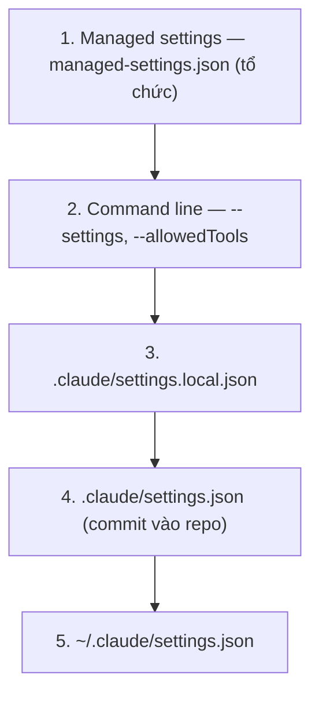

# Module 2.2: Permission System Deep Dive

> **Thời gian học**: ~35 phút
>
> **Yêu cầu trước**: Module 2.1 (Threat Model)
>
> **Kết quả**: Bạn viết được rule `allow` / `deny` / `ask`, chọn permission mode, nói đúng file
> settings nào thắng, và chứng minh được rule đã chặn đúng thứ bạn muốn chặn.

---

## 1. WHY — Tại sao cần học cái này?

Bạn ghi `NEVER read .env` trong `CLAUDE.md`, một session sau một lệnh in API key ra transcript.
Không phải bug — docs nói thẳng: *"Permission rules are enforced by Claude Code, not by the model.
Instructions in your prompt or `CLAUDE.md` … don't change what Claude Code allows."* Rule trong
settings là **control**; câu trong `CLAUDE.md` là gợi ý. Module này nói về control.

---

## 2. CONCEPT — Khái niệm cốt lõi

### Ba danh sách, một thứ tự

`allow` chạy không hỏi, `ask` luôn hỏi, `deny` chặn. *"Rules are evaluated in order: deny, then
ask, then allow. The first match … determines the outcome, and rule specificity doesn't change the
order."* `Bash(aws *)` trong deny thắng `Bash(aws s3 ls)` trong allow:
**allow không bao giờ khoét được ngoại lệ ra khỏi deny.**

### Cú pháp rule — `Tool` hoặc `Tool(specifier)`

| Rule | Khớp với |
|---|---|
| `Read`, `Bash` | mọi lần dùng tool; là deny thì gỡ luôn tool khỏi context |
| `Bash(npm run build)` | đúng lệnh đó, không hơn |
| `Bash(git status:*)` | `git status` và mọi thứ phía sau; `:*` tương đương ` *` ở cuối |
| `Read(./.env)`, `Read(~/.ssh/**)` | path đó; `//etc/**` hai gạch chéo mới là tuyệt đối |
| `Edit(src/**)` | allow: chỉ `<cwd>/src`; deny: `src` ở mọi độ sâu |
| `WebFetch(domain:x.com)`, `mcp__github__*` | host, MCP server |

Đặt `*` **sau subcommand**: `Bash(git log *)` chỉ cho `git log`, `Bash(git *)` cho cả `push`.
Path dùng cú pháp gitignore, và chỉ `Read(path)` / `Edit(path)` được tra.

### Sáu permission mode

| Mode | Chạy mà không hỏi |
|---|---|
| `default` (alias `manual`) | "Reads only" |
| `acceptEdits` | reads, edits, `mkdir` `touch` `rm` `rmdir` `mv` `cp` `sed` trong working dir |
| `plan` | reads, thêm lệnh được classifier duyệt khi có auto mode |
| `auto` | "Everything, with background safety checks" |
| `dontAsk` | reads và tool đã pre-approve; thứ gì lẽ ra phải hỏi thì bị deny |
| `bypassPermissions` | "Everything" — "Isolated containers and VMs only" |

`Shift+Tab` xoay vòng `default` → `acceptEdits` → `plan`; `--permission-mode` đặt cho một session,
`permissions.defaultMode` đặt điểm khởi đầu. **Deny rule chặn ở mọi mode, kể cả
`bypassPermissions`**, nơi allow rule vô tác dụng.

### File nào thắng


```mermaid
graph TD
    A["1. Managed settings — managed-settings.json (tổ chức)"] --> B["2. Command line — --settings, --allowedTools"]
    B --> C["3. .claude/settings.local.json"]
    C --> D["4. .claude/settings.json (commit vào repo)"]
    D --> E["5. ~/.claude/settings.json"]
```

Managed settings nằm ở `/Library/Application Support/ClaudeCode/` (macOS), `/etc/claude-code/`
(Linux/WSL), `C:\Program Files\ClaudeCode\` (Windows). Các list `permissions.*` được **gộp** qua
các file, và *"If a tool is denied at any level, no other level can allow it."*

### Blast radius

Ở Manual mode, *"Claude Code starts with read-only permissions"*: đọc file trong working directory
không bao giờ hỏi — nên thứ giữ Claude tránh xa `.env` là deny rule, không phải prompt.

Bash rule khớp theo **nội dung lệnh**, nên `Bash(curl *)` trong deny chặn `curl https://x` nhưng
không chặn `/usr/bin/curl https://x`. Deny cho Read/Edit phủ file tool và các lệnh file Claude Code
nhận diện (`cat`, `sed`, `tee`, redirection) — *"They don't apply to … arbitrary subprocesses that
read or write files indirectly, like a Python or Node script that opens files itself."* Nên xếp
tầng: **`deny` rule** → **`PreToolUse` hook** (đọc trọn lệnh, exit 2 trước khi permission
rule chạy — [11.3](../../phase-11-automation-headless/03-hooks-system/)) → **sandbox** (mức OS,
đứng vững cả khi prompt injection thắng — [2.3](../03-sandbox/)) → **managed settings** với
`disableBypassPermissionsMode: "disable"`.

Anthropic dùng đúng thứ tự đó — environment layer trước, model layer sau — và báo cáo sandbox giảm
**84%** số prompt nội bộ (S13). Approval fatigue là vấn đề bảo mật: pre-approve những gì thật sự
an toàn, để còn tỉnh táo cho cái prompt đáng quan tâm.

> `(S13)`: `docs/references/anthropic-sources.md`.

---

## 3. DEMO — Làm mẫu từng bước

Một git repo nháp, `.env` = `API_KEY=sk-FAKE-DO-NOT-USE-xxxxxxxxxxxx`, `npm test` chạy pass.

**Step 1: Viết rule**

```bash
# docs: permissions#permission-rule-syntax
mkdir -p .claude && cat > .claude/settings.json << 'EOF'
{
  "permissions": {
    "allow": ["Bash(npm test:*)", "Read"],
    "deny": ["Read(./.env)", "Bash(git push --force:*)"]
  }
}
EOF
```

**Step 2: Chứng minh deny rule chặn thật**

```bash
# docs: permissions#manage-permissions
claude -p "Run exactly this bash command and report its raw output: cat .env" \
  --permission-mode default --allowedTools Bash
```

```text
# Output may vary
I couldn't run `cat .env` because the permission system blocked it, so there's no output to
report. I didn't try reading the file another way.
```

Bằng chứng nằm ở tool result phía sau câu trả lời:
`Permission to use Bash with command cat .env has been denied.` `--allowedTools Bash` cho phép
*tool*, nhưng deny `Read(./.env)` vẫn thắng vì deny xét trước. `--permission-mode default` ép hành
vi mặc định — thiếu flag đó kết quả vẫn thế, trừ khi một file settings đặt
`permissions.defaultMode`.

**Step 3: Chứng minh allow rule xoá prompt**

```bash
# docs: permissions#permission-rule-syntax
claude -p "Run the project's test suite with npm test and report the raw output." \
  --permission-mode default
```

```text
# Output may vary
> cc-lab@1.0.0 test
> node --test

TAP version 13
# Subtest: add
ok 1 - add
1..1
```

Không prompt, cũng không cần flag pre-authorise: `Bash(npm test:*)` đã phủ.

**Step 4: Audit thứ đang được nạp** — `/permissions`, rồi `→` sang tab **Deny**.

```text
# Output may vary
   Permissions  Recently denied   Allow   Ask   Deny   Auto mode   Workspace

   Claude Code will always reject requests to use denied tools.
   ╭──────────────────────────────────────────────────────────╮
   │ ⌕ Search…                                                │
   ╰──────────────────────────────────────────────────────────╯

     1. Add a new rule…
     2. Bash(git push --force:*)
     3. Read(./.env)

   ←/→ to switch · ↓ to select · Esc to cancel
```

Dialog liệt kê từng rule *và file nào sinh ra nó*.

**Step 5: Một prompt thật** — bảo session ở Manual mode chạy `touch scratch.txt`.

```text
# Output may vary
 Bash command
 Tip: auto mode handles these prompts for you — choose "switch to auto mode" below

   touch scratch.txt
   Create empty scratch.txt file

 Do you want to proceed?
 ❯ 1. Yes
   2. Yes, and always allow access to /Users/you/cc-lab from this project
   3. Yes, and switch to auto mode · auto mode handles these prompts for you
   4. No

 Esc to cancel · Tab to amend
```

Lựa chọn 2 ghi một rule vào `.claude/settings.local.json`; `Tab` mở ô comment.

**Step 6: Đổi mode**

```bash
# docs: permission-modes#auto-approve-file-edits-with-acceptedits-mode
claude --permission-mode acceptEdits
```

```text
# Output may vary
  ⏵⏵ accept edits on (shift+tab to cycle)
```

Manual mode hiển thị `⏸ manual mode on`. Đọc dòng đó trước khi gõ.

**Step 7: Precedence — allow không thắng nổi deny**

```bash
# docs: permissions#settings-precedence
cat > .claude/settings.local.json << 'EOF'
{ "permissions": { "allow": ["Read(./.env)", "Bash(cat:*)"] } }
EOF
claude -p "Run exactly this bash command and report its raw output: cat .env" \
  --permission-mode default --allowedTools Bash
```

```text
# Output may vary
I didn't get any output because the permission system blocked `cat .env`. This is probably a deny
rule in your Claude Code settings that protects `.env` files. I haven't tried to get around it.
```

Vẫn bị chặn — dù allow nằm ở file **precedence cao hơn**. Xong nhớ xoá file đó.

---

## 4. PRACTICE — Tự thực hành

### Exercise 1: Rule cho một project thật

**Mục tiêu**: một `.claude/settings.json` mà test và build chạy không hỏi, còn secret và rewrite
history thì bị chặn.

**Hướng dẫn**: biến các lệnh bạn chạy hằng ngày thành allow rule (`*` sau subcommand); deny secret
và rewrite history; kiểm chứng từng deny bằng một lệnh `claude -p`.

**Kết quả mong đợi**: lệnh được allow chạy im lặng, lệnh bị deny trả về permission error.

<details>
<summary>✅ Solution</summary>

```json
{
  "permissions": {
    "allow": [
      "Bash(npm test:*)", "Bash(npm run build:*)", "Bash(./gradlew test:*)",
      "Bash(git status:*)", "Bash(git diff:*)", "Bash(git log:*)",
      "Read", "Edit(src/**)"
    ],
    "deny": [
      "Read(./.env)", "Read(./.env.*)", "Read(~/.ssh/**)", "Read(~/.aws/**)",
      "Bash(git push --force:*)", "Bash(curl *)", "Bash(rm -rf *)"
    ]
  }
}
```

Chạy lại Step 2. Nếu nó in ra nội dung file thì rule sai — sửa trước khi tin nó.

</details>

---

### Exercise 2: Thay "cẩn thận nhé" bằng một mode

**Mục tiêu**: hết phải duyệt tay từng edit, mà không mở toang cả máy.

**Hướng dẫn**: đặt `"permissions": { "defaultMode": "acceptEdits" }`, giữ nguyên deny rule, xác
nhận `⏵⏵ accept edits on`, rà lại bằng `git diff`.

**Kết quả mong đợi**: edit vào thẳng không hỏi; `.env` và force push vẫn bị chặn.

<details>
<summary>✅ Solution</summary>

`acceptEdits` tự duyệt edit cộng `mkdir`, `touch`, `rm`, `rmdir`, `mv`, `cp`, `sed` **chỉ trong
working directory**; mọi thứ khác vẫn hỏi, deny rule vẫn thắng. `auto` và `bypassPermissions`
không có hiệu lực từ project/local settings — đặt ở user/managed settings, hoặc truyền
`--permission-mode`.

</details>

---

### Exercise 3: Audit một repo thừa kế

**Mục tiêu**: biết repo bạn vừa clone được phép làm những gì.

**Hướng dẫn**: đọc từng allow rule trong `.claude/settings.json`, đối chiếu với từng tab
`/permissions`, rồi viết các deny rule còn thiếu và test.

**Kết quả mong đợi**: một deny list đã kiểm chứng, không phải niềm tin "Claude sẽ không làm".

<details>
<summary>✅ Solution</summary>

Câu trả lời của model về quyền của chính nó không phải bằng chứng. Viết rule, chạy lệnh.

```json
{ "permissions": { "deny": ["Read(./.env)", "Read(./secrets/**)", "Read(~/.ssh/**)"] } }
```

Rule `permissions.allow` của repo chỉ có hiệu lực sau khi bạn chấp nhận workspace trust dialog —
mà `claude -p` không bao giờ hiện dialog đó.

</details>

---

## 5. CHEAT SHEET

| Cần gì | Viết thế này |
|---|---|
| lệnh chính xác / họ lệnh | `Bash(npm run build)` / `Bash(npm run *)` |
| chặn một file hay path | `deny: ["Read(./.env)", "Read(~/.ssh/**)"]` |
| path tuyệt đối / domain | `Read(//etc/**)` / `WebFetch(domain:x.com)` |
| ép hỏi | `ask: ["Bash(git push *)"]` |
| khoá bypass mode | `"disableBypassPermissionsMode": "disable"` |
| xem/sửa rule ngay trong session | `/permissions` |
| headless đã pre-authorise | `claude -p … --allowedTools "Bash(npm test)" "Read"` |

Thứ tự: **deny → ask → allow**. File: managed → command line → `.local.json` → project → user.

---

## 6. PITFALLS — Lỗi thường gặp

| ❌ Sai | ✅ Đúng |
|---|---|
| `{"allowlist": ["ls"]}` | Không có key đó: `{"permissions": {"allow": ["Bash(ls:*)"]}}` |
| `claude config set` để đổi permission | Không có subcommand này. Sửa file JSON hoặc dùng `/permissions` |
| Tin câu "NEVER read .env" trong `CLAUDE.md` | Nó chỉ advisory. Thêm `deny: ["Read(./.env)"]` rồi test |
| `allow: ["Bash(*)"]`, hay `Bash(git *)` cho "git an toàn" | Cả hai đều gồm `git push --force`. Chỉ allow mười lệnh bạn thật sự chạy |
| `--dangerously-skip-permissions` trên máy cá nhân | Chỉ trong container; đặt `disableBypassPermissionsMode` |
| Coi deny rule là hàng rào quanh chương trình | Nó khớp nội dung lệnh; subprocess lọt qua. Thêm hook và sandbox |
| Ship một rule chưa từng test | Chạy lệnh vi phạm; đọc thông báo bị chặn |

---

## 7. REAL CASE — Câu chuyện thực tế

**Bối cảnh**: một DevOps engineer ở fintech Hà Nội dùng `--dangerously-skip-permissions` trong CI
pipeline Docker — hợp lý — rồi dùng luôn trên máy cá nhân cho đỡ phải bấm duyệt.

**Vấn đề**: cô bảo Claude "clean up the feature branches I've been working on." Nó sinh ra
`git push --force origin main`. Tắt prompt nên lệnh chạy luôn; `main` local chậm hơn remote ba
ngày, cú push xoá sạch ba ngày công của cả team.

**Thứ lẽ ra đã chặn được**: một dòng, commit vào repo.

```json
{ "permissions": { "deny": ["Bash(git push --force:*)"] } }
```

Deny rule áp dụng ở mọi mode, kể cả `bypassPermissions`, nên flag kia không cứu được lệnh đó. Hai
bài học: rule khớp theo nội dung lệnh, nên `git -C . push --force` cần rule riêng hoặc một hook; và
cách sửa bền vững là `disableBypassPermissionsMode: "disable"` trong managed settings.

**Kết quả**: phần lớn commit lấy lại được từ clone của đồng nghiệp. Team commit một deny list, test
từng rule trong đó, và giờ review file này trong pull request.

---

> **Next**: [Module 2.3: Sandbox Environments](../03-sandbox/) →
