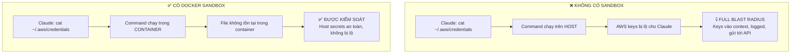

# Module 2.3: Sandbox Environments — Kiểm soát Blast Radius

> **Thời gian học**: ~40 phút
>
> **Yêu cầu trước**: Module 2.2 (Permission System)
>
> **Kết quả**: Sau module này, bạn sẽ có thể chạy Claude Code trong môi trường Docker isolated để giới hạn blast radius của bất kỳ sai lầm hay hành động độc hại nào

---

## 1. WHY — Tại sao cần học cái này?

Bạn đã hiểu blast radius (Module 2.1) và permission prompts (Module 2.2). Nhưng permissions chỉ là phòng thủ phản ứng — bạn phải bắt được TỪNG request nguy hiểm và nói "không". Điều đó đòi hỏi kỷ luật hoàn hảo mọi lúc mọi nơi. Một khoảnh khắc mất tập trung, một prompt khéo léo của Claude, một permission bạn approve vì tưởng rằng an toàn — và thiệt hại đã xảy ra.

Sandboxing là phòng thủ chủ động. Thay vì dựa vào bạn để chặn các hành động xấu, sandboxing khiến các hành động nguy hiểm trở nên bất khả thi ngay từ thiết kế. Permission là dây an toàn. Sandbox là túi khí. Ngay cả khi bạn mắc sai lầm — ngay cả khi Claude lừa bạn approve `rm -rf ~/.ssh` — sandbox vẫn giới hạn blast radius. Hệ thống host vẫn an toàn.

Nếu bạn làm việc với code của client, xử lý dữ liệu nhạy cảm, hoặc đơn giản là coi trọng sự toàn vẹn của máy tính, sandboxing không phải là tùy chọn. Đó là sự khác biệt giữa "tôi hy vọng tôi bắt được mọi sai lầm" và "sai lầm không thể thoát khỏi cái hộp này."

---

## 2. CONCEPT — Khái niệm cốt lõi

### Tại sao Sandbox quan trọng hơn chỉ dùng Permissions

| Cách tiếp cận | Mô hình | Failure Mode |
|---------------|---------|--------------|
| **Chỉ dùng Permissions** | Phản ứng — bạn phải bắt mọi request xấu | Một lần approve nhầm = compromise toàn bộ hệ thống |
| **Sandbox** | Chủ động — request xấu không thể ra khỏi hộp | Thiệt hại chỉ giới hạn trong môi trường sandbox |
| **Cả hai (defense in depth)** | Bảo mật nhiều lớp | Sai lầm phải vượt qua nhiều rào cản |

Permissions đòi hỏi sự cảnh giác của con người. Sandboxes thực thi isolation tự động. Best practice: dùng **cả hai**.

### Sandbox hoạt động như thế nào

Sandbox là một môi trường isolated nơi Claude Code chạy. Nó chỉ có thể truy cập những gì bạn cho phép. Mọi thứ khác — home directory của bạn, SSH keys, AWS credentials, các project khác — không tồn tại từ góc nhìn của Claude.



### Docker là Sandbox chính

Docker containers cung cấp isolation xuất sắc cho công việc development:

- **Mount CHỈ project directory** — Claude chỉ thấy code project của bạn
- **Không có network mặc định** — ngăn chặn data exfiltration (`--network=none`)
- **Resource limits** — ngăn chặn resource exhaustion attacks
- **Disposable** — hủy container sau session (`--rm`)
- **Không persistence** — secrets trong container context biến mất khi thoát

Nguyên tắc quan trọng: **Không bao giờ mount home directory, ~/.ssh, ~/.aws, hoặc bất kỳ parent directory nào chứa secrets.**

### Devcontainers (VS Code Integration)

Devcontainers (`.devcontainer/devcontainer.json`) cung cấp cấu hình sandbox có thể share cho team:

- Cùng isolation như Docker, nhưng tích hợp với VS Code
- Các thành viên team có môi trường giống hệt nhau và an toàn
- Cấu hình nằm trong version control
- Vẫn cần cấu hình mount cẩn thận

### Cloud Sandboxes

⚠️ Needs verification — check current GitHub Codespaces / Gitpod support for Claude Code.

Cloud sandboxes (GitHub Codespaces, Gitpod) cung cấp isolation không cần setup:

- Máy của bạn không bao giờ bị expose — môi trường ở remote
- Credentials được quản lý bởi cloud platform
- Disposable by design
- Đánh đổi: chi phí và phụ thuộc network

### Các cấp độ Sandbox

| Cấp độ | Mô tả | Claude có thể truy cập gì | Khuyến nghị cho |
|--------|-------|---------------------------|-----------------|
| **0** | Không sandbox | Mọi thứ trên hệ thống của bạn | ❌ Không bao giờ khuyến nghị |
| **1** | Chỉ dựa vào kỷ luật | Mọi thứ (dựa vào bạn nói "không") | ❌ Chỉ dùng cho tác vụ nhanh, rủi ro cao |
| **2** | Docker + project mount | Chỉ project files | ✅ Development hàng ngày |
| **3** | Docker + no network + project mount | Project files, không internet | ✅ Sensitive projects |
| **4** | Cloud sandbox | Không có gì trên máy bạn | ✅ Client work, untrusted code |

---

## 3. DEMO — Làm mẫu từng bước

Hãy cùng xây dựng Docker sandbox cho Claude Code từ đầu. Sandbox này sẽ isolation Claude vào một project directory duy nhất không có network access.

### Bước 1: Tạo Dockerfile

Tạo file tên `Dockerfile` trong một empty directory:

```dockerfile
# Dockerfile for Claude Code sandbox
FROM node:20-slim

# Install system dependencies
RUN apt-get update && apt-get install -y \
    git \
    curl \
    build-essential \
    && rm -rf /var/lib/apt/lists/*

# ⚠️ Needs verification - actual Claude Code installation method may differ
# This is a placeholder - check official docs for correct installation
RUN npm install -g @anthropic-ai/claude-code || echo "Installation method needs verification"

# Create non-root user for additional safety
RUN useradd -m -s /bin/bash developer
USER developer
WORKDIR /workspace

# Default command
CMD ["bash"]
```

**Tại sao điều này quan trọng**: Chúng ta dùng minimal base image (node:20-slim), tạo non-root user, và set /workspace làm working directory. Đây là nơi chúng ta sẽ mount project.

Output mong đợi khi build:
```
Successfully built abc123def456
Successfully tagged claude-sandbox:latest
```

### Bước 2: Build the Image

```bash
docker build -t claude-sandbox .
```

**Tại sao điều này quan trọng**: Flag `-t` gắn tag cho image với một tên bạn có thể reference sau này. Building mất 2-5 phút lần đầu chạy.

Output mong đợi:
```
[+] Building 145.2s (8/8) FINISHED
 => [internal] load build definition from Dockerfile
 => => transferring dockerfile: 512B
 => [internal] load .dockerignore
 => ...
 => exporting to image
 => => naming to docker.io/library/claude-sandbox
```

### Bước 3: Chạy với Mounts đúng (QUAN TRỌNG)

Đây là bước quan trọng nhất về mặt bảo mật. Flag `-v` kiểm soát những gì Claude có thể truy cập.

```bash
docker run -it --rm \
  -v "$(pwd)":/workspace \
  --network=none \
  --memory=4g \
  --cpus=2 \
  claude-sandbox
```

**Phân tích từng flag**:
- `-it` — interactive terminal
- `--rm` — **QUAN TRỌNG** — hủy container khi thoát (không có secret persistence)
- `-v "$(pwd)":/workspace` — mount CHỈ current directory, không phải home hoặc parent
- `--network=none` — **QUAN TRỌNG** — không internet = không data exfiltration
- `--memory=4g` — giới hạn memory usage
- `--cpus=2` — giới hạn CPU usage

Output mong đợi:
```
developer@a1b2c3d4e5f6:/workspace$
```

Bạn đang ở trong container. Prompt của bạn hiển thị bạn là user `developer` trong `/workspace`.

### Bước 4: Xác minh Isolation — Thử truy cập Host Secrets

Trong container, thử truy cập các vị trí secret phổ biến:

```bash
# Thử đọc AWS credentials
cat ~/.aws/credentials
```

Output mong đợi:
```
cat: /home/developer/.aws/credentials: No such file or directory
```

```bash
# Thử đọc SSH keys
cat ~/.ssh/id_rsa
```

Output mong đợi:
```
cat: /home/developer/.ssh/id_rsa: No such file or directory
```

```bash
# List home directory
ls -la ~
```

Output mong đợi:
```
total 8
drwxr-xr-x 1 developer developer 4096 Feb  1 12:00 .
drwxr-xr-x 1 root      root      4096 Feb  1 12:00 ..
-rw-r--r-- 1 developer developer  220 Feb  1 12:00 .bash_logout
-rw-r--r-- 1 developer developer 3526 Feb  1 12:00 .bashrc
-rw-r--r-- 1 developer developer  807 Feb  1 12:00 .profile
```

**Tại sao điều này quan trọng**: Không có `.aws`, không có `.ssh`, không có secrets. Container home directory trống ngoại trừ các shell configs mặc định. Host secrets hoàn toàn vô hình.

### Bước 5: Xác minh Network Isolation

Thử kết nối internet:

```bash
curl https://google.com
```

Output mong đợi:
```
curl: (6) Could not resolve host: google.com
```

**Tại sao điều này quan trọng**: Ngay cả khi Claude thành công execute một command độc hại cố gắng exfiltrate data qua HTTP, nó vẫn thất bại. Không network = không data rời khỏi container.

### Bước 6: Xác minh Project Access

Project files của bạn nên hiển thị:

```bash
ls /workspace
```

Output mong đợi:
```
Dockerfile  README.md  src/  package.json
```

**Tại sao điều này quan trọng**: Claude có thể đọc và sửa project files (như dự định), nhưng không gì khác. Blast radius được giới hạn trong project này thôi.

### Bước 7: Thoát và Xác minh Cleanup

```bash
exit
```

Container bị hủy (vì có `--rm`). Bất kỳ secrets nào vào context của Claude trong session đều biến mất. Bắt đầu lại lần sau với môi trường sạch.

---

## 4. PRACTICE — Tự thực hành

### Bài tập 1: Build Sandbox đầu tiên của bạn

**Mục tiêu**: Tạo Docker sandbox hoạt động cho Claude Code và xác minh nó chạy được.

**Hướng dẫn**:
1. Tạo directory mới: `mkdir ~/claude-sandbox-test && cd ~/claude-sandbox-test`
2. Tạo Dockerfile từ Bước 1 của phần DEMO
3. Build image: `docker build -t my-claude-sandbox .`
4. Chạy container: `docker run -it --rm -v "$(pwd)":/workspace my-claude-sandbox`
5. Trong container, chạy: `pwd` và `ls -la ~`

**Kết quả mong đợi**: Bạn nên thấy `/workspace` là working directory, và home directory chỉ chứa các shell config files mặc định (không có `.aws`, `.ssh`, v.v.).

<details>
<summary>💡 Gợi ý</summary>

Nếu build thất bại, kiểm tra:
- Docker đã cài đặt và đang chạy chưa? (`docker --version`)
- Bạn đang ở trong directory có Dockerfile không?
- Dockerfile có syntax đúng không (không có tabs, indentation đúng)?

</details>

<details>
<summary>✅ Giải pháp</summary>

```bash
# Giải pháp từng bước
mkdir ~/claude-sandbox-test
cd ~/claude-sandbox-test

# Tạo Dockerfile (copy từ phần DEMO ở trên)
cat > Dockerfile << 'EOF'
FROM node:20-slim

RUN apt-get update && apt-get install -y \
    git \
    curl \
    build-essential \
    && rm -rf /var/lib/apt/lists/*

RUN useradd -m -s /bin/bash developer
USER developer
WORKDIR /workspace

CMD ["bash"]
EOF

# Build
docker build -t my-claude-sandbox .

# Chạy
docker run -it --rm -v "$(pwd)":/workspace my-claude-sandbox

# Trong container, xác minh:
pwd                  # Nên hiển thị: /workspace
ls -la ~             # Nên hiển thị: chỉ .bashrc, .profile, .bash_logout
cat ~/.ssh/id_rsa    # Nên thất bại: No such file or directory
```

Thành công trông như thế này:
- Build hoàn thành không lỗi
- Container khởi động và đưa bạn vào bash prompt
- `pwd` hiển thị `/workspace`
- Không có secrets trong home directory

</details>

---

### Bài tập 2: Kiểm tra Blast Radius

**Mục tiêu**: Chứng minh rằng secrets trên host của bạn vô hình với container.

**Hướng dẫn**:
1. Trên máy HOST, tạo fake secret: `echo "SECRET_KEY=fake-api-key-12345" > ~/.fake-secret`
2. Khởi động sandbox container: `docker run -it --rm -v "$(pwd)":/workspace my-claude-sandbox`
3. Trong container, thử đọc secret: `cat ~/.fake-secret`
4. Thoát container
5. Xác minh secret vẫn tồn tại trên host: `cat ~/.fake-secret`

**Kết quả mong đợi**: Bước 3 nên thất bại với "No such file or directory". Bước 5 nên thành công và hiển thị secret. Điều này chứng minh container không thể truy cập host files ngoài mount.

<details>
<summary>💡 Gợi ý</summary>

Home directory của container (`~` trong container) là `/home/developer`, riêng biệt với host home directory của bạn. Files trong host `~` của bạn KHÔNG hiển thị trừ khi bạn mount chúng với `-v`.

</details>

<details>
<summary>✅ Giải pháp</summary>

```bash
# Trên HOST
echo "SECRET_KEY=fake-api-key-12345" > ~/.fake-secret

# Khởi động container
docker run -it --rm -v "$(pwd)":/workspace my-claude-sandbox

# TRONG CONTAINER - điều này nên THẤT BẠI
cat ~/.fake-secret
# Output: cat: /home/developer/.fake-secret: No such file or directory

# Thoát container
exit

# Trở lại HOST - điều này nên THÀNH CÔNG
cat ~/.fake-secret
# Output: SECRET_KEY=fake-api-key-12345
```

**Điều này chứng minh gì**: `~/.fake-secret` của container là file khác với `~/.fake-secret` của host. Container home (`/home/developer`) bị isolated khỏi host home. Secrets an toàn.

</details>

---

### Bài tập 3: Xác minh Network Isolation

**Mục tiêu**: Xác nhận rằng `--network=none` thực sự ngăn chặn network access.

**Hướng dẫn**:
1. Chạy container CÓ network: `docker run -it --rm -v "$(pwd)":/workspace my-claude-sandbox`
2. Trong container, test network: `curl -I https://google.com`
3. Thoát container
4. Chạy container KHÔNG CÓ network: `docker run -it --rm -v "$(pwd)":/workspace --network=none my-claude-sandbox`
5. Trong container, test network lại: `curl -I https://google.com`

**Kết quả mong đợi**: Bước 2 nên thành công (bạn sẽ thấy HTTP headers). Bước 5 nên thất bại với "Could not resolve host". Điều này chứng minh `--network=none` hoạt động.

<details>
<summary>💡 Gợi ý</summary>

Flag `-I` khiến curl chỉ fetch HTTP headers (test nhanh hơn). Nếu curl chưa cài đặt trong container, cài đặt trước: `apt-get update && apt-get install -y curl` (yêu cầu chạy container với root hoặc rebuild Dockerfile).

</details>

<details>
<summary>✅ Giải pháp</summary>

```bash
# CÓ network (mặc định)
docker run -it --rm -v "$(pwd)":/workspace my-claude-sandbox

# Trong container
curl -I https://google.com
# Output: HTTP/2 200 (thành công - network hoạt động)

exit

# KHÔNG CÓ network
docker run -it --rm -v "$(pwd)":/workspace --network=none my-claude-sandbox

# Trong container
curl -I https://google.com
# Output: curl: (6) Could not resolve host: google.com (THẤT BẠI - network bị chặn)

exit
```

**Điều này chứng minh gì**: `--network=none` thực sự chặn network access. Ngay cả khi Claude Code (hoặc malicious code) cố gắng exfiltrate data qua HTTP, nó thất bại im lặng.

</details>

---

## 5. CHEAT SHEET

### Các lệnh Docker Sandbox thiết yếu

| Lệnh | Mục đích | Lưu ý bảo mật |
|------|----------|---------------|
| `docker build -t name .` | Build sandbox image | Setup một lần |
| `docker run -it --rm` | Chạy interactive, tự động cleanup | `--rm` ngăn secret persistence |
| `-v "$(pwd)":/workspace` | Mount current directory | ⚠️ CHỈ mount project, không bao giờ `~` |
| `--network=none` | Tắt networking | Ngăn data exfiltration |
| `--memory=4g` | Giới hạn RAM 4GB | Ngăn resource exhaustion |
| `--cpus=2` | Giới hạn 2 CPU cores | Ngăn resource exhaustion |
| `-u $(id -u):$(id -g)` | Match host user UID/GID | Sửa file permission issues |

### Mount gì vs. KHÔNG BAO GIỜ Mount gì

| Path | Mount? | Lý do |
|------|--------|-------|
| `$(pwd)` (current project) | ✅ CÓ | Đây là working directory của bạn |
| `~/project-name` (specific project) | ✅ CÓ | Explicit, isolated project |
| `~` (home directory) | ❌ KHÔNG | Chứa toàn bộ secrets của bạn |
| `~/.ssh` | ❌ KHÔNG | SSH keys bị lộ |
| `~/.aws` | ❌ KHÔNG | AWS credentials bị lộ |
| `~/.config` | ❌ KHÔNG | Chứa API keys, tokens |
| `/var/run/docker.sock` | ❌ KHÔNG | Docker socket = root trên host |
| Parent directory có secrets | ❌ KHÔNG | Siblings có thể có `.env` files |

### Tham chiếu nhanh các cấp độ Sandbox

| Use Case | Lệnh |
|----------|------|
| **Dev hàng ngày** (Level 2) | `docker run -it --rm -v "$(pwd)":/workspace sandbox` |
| **Sensitive project** (Level 3) | `docker run -it --rm -v "$(pwd)":/workspace --network=none sandbox` |
| **Client work** (Level 4) | Dùng GitHub Codespaces hoặc Gitpod (không expose host) |

---

## 6. PITFALLS — Lỗi thường gặp

| ❌ Sai lầm | ✅ Cách đúng |
|------------|--------------|
| Mount home directory: `-v ~:/home` | Mount CHỈ project: `-v "$(pwd)":/workspace` — home chứa toàn bộ secrets |
| Quên flag `--rm` | Luôn dùng `--rm` — ngăn containers có secrets persist trên disk |
| Dùng flag `--privileged` | KHÔNG BAO GIỜ dùng `--privileged` — cho container quyền root trên host, phá hủy mọi isolation |
| Mount Docker socket: `-v /var/run/docker.sock:/var/run/docker.sock` | KHÔNG BAO GIỜ mount Docker socket — tương đương root access trên host |
| Quên `--network=none` cho sensitive work | Luôn dùng `--network=none` cho client work hoặc sensitive data — ngăn exfiltration |
| Mount parent directory: `-v ~/projects:/workspace` | Mount chỉ project cụ thể: `-v ~/projects/client-a:/workspace` — siblings có thể có secrets |
| Chạy với root user trong container | Tạo non-root user trong Dockerfile (xem DEMO) — giới hạn thiệt hại từ container escape |
| Hardcode secrets trong Dockerfile | KHÔNG BAO GIỜ đặt secrets trong Dockerfile — chúng persist trong image layers mãi mãi |
| Cho rằng `--rm` xóa image layers | `--rm` xóa container, không phải image — rebuild image nếu secrets leak trong build |
| Developer Việt Nam với máy cấu hình thấp (8GB RAM) thấy Docker overhead quá nặng | Nếu máy không đủ mạnh cho Docker, dùng Level 1 (project directory discipline) làm minimum viable security. Tuy nhiên, nếu làm việc với client data, hãy cân nhắc nâng cấp RAM hoặc dùng cloud sandbox. Bảo mật không nên là thứ bạn cắt giảm vì thiếu tài nguyên. Nhớ Nam trong Module 2.1 mất $2,847 AWS? Sandbox sẽ ngăn Claude Code đọc ~/.aws/credentials. Nhớ Nam trong Module 2.2 bị force-push? Sandbox với --network=none sẽ ngăn mọi push. |

---

## 7. REAL CASE — Câu chuyện thực tế

**Scenario**: TechViet Solutions (công ty outsourcing kiểu FPT Software, TMA Solutions) tại TP.HCM. Họ xử lý 5-10 client projects đồng thời trên cùng một máy developer. Clients có cả Japanese và Korean — những khách hàng CỰC KỲ nghiêm túc về NDA. Cấu trúc team có developers làm việc trên 2-3 client projects mỗi tuần. Mỗi client có repositories riêng, `.env` files riêng, và yêu cầu NDA nghiêm ngặt.

**Problem**: Developer Nam đang làm việc trên banking app của Client A (ngân hàng Nhật) trong `~/projects/client-a/`. Anh ấy hỏi Claude Code: "Tìm tất cả API endpoints không dùng authentication middleware." Claude Code, rất nhiệt tình, search rộng. Nó đọc không chỉ code của Client A, mà vô tình traverse lên `~/projects/` và đọc file `.env` của Client B trong sibling directory (`~/projects/client-b/.env`).

`.env` của Client B (công ty Hàn Quốc, e-commerce) chứa payment gateway API key. Key này giờ đã vào context của Claude Code. Nó có thể:
- Logged tới servers của Anthropic (cho debugging)
- Include trong response của Claude nếu nó nghĩ là relevant
- Cached trong terminal scrollback
- Hiển thị trong screenshots Nam chụp cho documentation

Đây là **vi phạm NDA**. NDA violation với cả hai clients vì:
- Client A: lo ngại AI system đọc competitor data
- Client B: credentials bị exposed cho third-party AI

TechViet phải báo cáo cho Client B rằng credentials của họ đã bị exposed cho AI system và third-party servers. Client B yêu cầu full security audit và đe dọa chấm dứt hợp đồng.

**Sandbox đã ngăn chặn như thế nào**:

Nếu Nam dùng Docker sandbox:

```bash
# Client A work session
cd ~/projects/client-a
docker run -it --rm \
  -v "$(pwd)":/workspace \
  --network=none \
  claude-sandbox
```

Từ trong container này:
- Working directory là `/workspace` (chỉ là code của Client A)
- `~/projects/client-b/` không tồn tại trong container
- Các lệnh search của Claude Code (`find`, `grep`, `cat`) chỉ thấy files của Client A
- Ngay cả khi Claude thử `cat ~/projects/client-b/.env`, nó thất bại: "No such file or directory"

Blast radius **được giới hạn chỉ trong Client A**. Cross-contamination bất khả thi by design, không phải by discipline.

**Giải pháp đã triển khai**:

TechViet Solutions bắt buộc Docker sandboxes cho mọi client work:

1. Mỗi client project có pre-built sandbox image (Dockerfile trong repo)
2. Developers phải dùng script `./scripts/sandbox.sh` để enforce correct mounts
3. Mỗi client project được isolated hoàn toàn
4. Script `./sandbox.sh` bắt buộc trước khi dùng Claude Code
5. CI/CD checks xác minh không có `.env` files được commit
6. Weekly audit: `docker ps -a` để kiểm tra containers không có `--rm` flag
7. Training về "AI-safe development" cho toàn team

**Result**: Không có cross-client contamination incidents trong 6 tháng. Developers ban đầu phàn nàn về "extra steps," nhưng sau một audit nơi đối thủ bị breach do AI-assisted coding exposure, team chấp nhận nó. Đạt ISO 27001 re-certification. Japanese client đặc biệt impressed với quy trình "AI governance". TechViet dùng điều này làm competitive advantage và marketing "AI-safe development practices" như một lợi thế cạnh tranh.

**Bài học quan trọng**: Sandboxing không phải paranoia. Đó là thực hành chuyên nghiệp khi xử lý client data. 30 giây để khởi động container đáng giá để tránh sai lầm kết thúc sự nghiệp khi leak client secrets. Đối với các developer Việt Nam làm outsourcing, điều này đặc biệt quan trọng vì uy tín với client nước ngoài là tài sản quý nhất.

---

> **Tiếp theo**: [Module 2.4: Secret Management](../04-secret-management/) →
