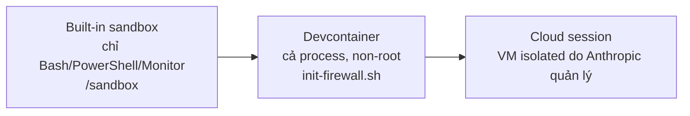

# Module 2.3: Sandbox Environments — Kiểm soát Blast Radius

> **Thời gian học**: ~35 phút
>
> **Yêu cầu trước**: Module 2.2 (Permission System)
>
> **Kết quả**: Bật được built-in sandbox, giới hạn Bash filesystem/network bằng `sandbox.*`
> settings, chạy Claude Code trong devcontainer chính thức với firewall egress, và verify từng
> control thật sự chặn.

---

## 1. WHY — Tại sao cần học cái này?

Deny rule ở Module 2.2 khớp theo **command text** — nó không chặn được subprocess mà một script tự
spawn ra, và hoàn toàn không phủ Read/Edit/Write. Một script bị prompt-injected mà tự shell out,
hay một tool đọc thẳng `~/.aws/credentials`, sẽ lách qua rule vốn không được thiết kế để bắt nó.

Sandboxing đẩy containment xuống một lớp thấp hơn: hệ điều hành enforce những gì một process được
chạm vào, bất kể model quyết định chạy gì. Chính công trình containment của Anthropic đặt thứ tự
này rất rõ — environment layer trước, model layer sau (S13). Module này bàn ba lựa chọn ở
environment layer mà Claude Code có: built-in sandbox, devcontainer chính thức, và cloud session.

---

## 2. CONCEPT — Khái niệm cốt lõi

### VERIFIED vs. RECOMMENDED vs. ASSUMED RISK

| Trạng thái | Khẳng định |
|---|---|
| **VERIFIED** | Sandbox chạy trên macOS (Seatbelt), Linux/WSL2 (bubblewrap); **"Native Windows is not supported. On Windows, run Claude Code inside a WSL2 distribution."** |
| **VERIFIED** | "Applies only to Bash, PowerShell, and Monitor commands and their child processes" — Read, Edit, Write, WebFetch, MCP server, hooks **không** nằm trong phạm vi; chúng dùng permission system bình thường |
| **VERIFIED** | Mặc định đọc được "the entire computer, except certain denied directories… this default still allows reading credential files such as `~/.aws/credentials` and `~/.ssh/`" trừ khi bạn thêm `denyRead` |
| **RECOMMENDED** | Dùng cả filesystem *và* network restriction cùng lúc — xem quote bên dưới |
| **ASSUMED RISK** | Môi trường nào còn egress vẫn có thể leak bất cứ thứ gì agent đọc được; sandbox thu nhỏ blast radius, không xoá bỏ nó |

### Sandbox cần cả hai lớp

> "Effective sandboxing requires both filesystem and network isolation. Without network isolation,
> a compromised agent could exfiltrate sensitive files like SSH keys. Without filesystem
> isolation… a compromised agent could backdoor system resources to gain network access."

### Ba lớp containment


```mermaid
graph LR
    A["Built-in sandbox\nchỉ Bash/PowerShell/Monitor\n/sandbox"] --> B["Devcontainer\ncả process, non-root\ninit-firewall.sh"] --> C["Cloud session\nVM isolated do Anthropic quản lý"]
```

1. **Built-in sandbox** (`/sandbox`) — OS enforce, chỉ Bash, không cần cài gì trên macOS.
   **Auto-allow** bỏ qua prompt; **regular permissions** vẫn hỏi. Cả hai vẫn tôn trọng deny rule
   tường minh và `rm`/`rmdir` trên critical path.
2. **Devcontainer** — cả process, MCP server, hooks chạy trong Docker với user non-root. Container
   tham chiếu (reference) có thêm firewall default-deny.
3. **Cloud session** (`claude --cloud`) — VM isolated do Anthropic quản lý; network access "limited
   by default and can be disabled."

### Giới hạn đã tài liệu hoá (trích nguyên văn, không giảm nhẹ)

- **TLS không bị inspect mặc định**: proxy "does not terminate or inspect TLS traffic," nên
  "allowing broad domains such as `github.com` can create paths for data exfiltration… via domain
  fronting."
- **Unix socket có thể vượt boundary**: "allowing access to `/var/run/docker.sock` effectively
  grants access to the host system through the Docker socket."
- **Escape hatch có thể tắt được**: Claude "may retry the command with the
  `dangerouslyDisableSandbox` parameter," chạy "outside the sandbox." Đặt
  `"allowUnsandboxedCommands": false` thì Claude Code "ignores" tham số đó.
- **Devcontainer + `--dangerously-skip-permissions` vẫn exfiltrate được**: "dev containers do not
  prevent a malicious project from exfiltrating anything accessible inside the container,
  including the Claude Code credentials stored in `~/.claude`."

### Data handling — không overclaim

Isolation không phải retention control: "the files Claude reads are transmitted to the Anthropic
API … with or without a sandbox." Sau đó tuỳ loại tài khoản: commercial (Team, Enterprise, API)
không train model trừ khi opt in (giữ 30 ngày); consumer tự chọn, 5 năm nếu opt in, 30 ngày nếu
không.

---

## 3. DEMO — Làm mẫu từng bước

Lab: macOS, Claude Code v2.1.283, project `~/cc-lab`. Merge đoạn này vào
`.claude/settings.local.json` để nó không rời khỏi lab:

```json
// docs: sandboxing#configure-sandboxing
{
  "permissions": { "defaultMode": "default" },
  "sandbox": {
    "enabled": true,
    "allowUnsandboxedCommands": false,
    "network": { "allowedDomains": ["registry.npmjs.org"] },
    "filesystem": { "denyRead": ["~/cc-lab-fake-ssh"] }
  }
}
```

`denyRead` trỏ vào `~/cc-lab-fake-ssh/config` — file bỏ đi (fake string
`sk-FAKE-DO-NOT-USE-xxxxxxxxxxxx`), không phải `~/.ssh` thật. Trong settings của bạn, hãy liệt kê
`~/.ssh` và `~/.aws` ở đó.

**Bước 1 — xem panel**: chạy `/sandbox`.

```text
# Output may vary
  Sandbox  Mode   Overrides   Config
  Configure mode
    1. Sandbox BashTool, with auto-allow ✔
    2. Sandbox BashTool, with regular permissions
    3. No Sandbox
  ←/→ to switch · ↑/↓ to navigate · Enter to select · Esc to close
```

Tab Overrides xác nhận `allowUnsandboxedCommands: false` là **"Strict sandbox mode (current)"**;
tab Config liệt kê `Network Restrictions: Allowed: registry.npmjs.org` và `Filesystem Read
Restrictions: Denied: … ~/cc-lab-fake-ssh` (cộng các protected path nội bộ — tuỳ hệ điều hành).

**Bước 2 — chặn network**: nhờ Claude chạy `curl -sI --max-time 5 https://example.com`.

```text
# Output may vary
⏺ Bash(curl -sI --max-time 5 https://example.com)
  ⎿  Error: Exit code 28
```

Exit 28 là timeout của chính curl: sandbox proxy không forward connection vì `example.com` chưa
được allowlist.

**Bước 3 — cho phép network**: nhờ chạy `npm view left-pad version --cache
"$TMPDIR/npm-cache-demo"` (`npm view` bản thường sẽ fail trước vì một restriction *ghi* không liên
quan của sandbox — chỉ working directory và `$TMPDIR` ghi được, không phải `~/.npm/_cacache` mặc
định của npm).

```text
# Output may vary
⏺ Bash(npm view left-pad version --cache "$TMPDIR/npm-cache-demo")
  ⎿  1.3.0
```

Cùng một sandbox cho lệnh này đi qua: `registry.npmjs.org` đã được allowlist.

**Bước 4 — chặn filesystem**: `cat ~/cc-lab-fake-ssh/config`.

```text
# Output may vary
⏺ Bash(cat ~/cc-lab-fake-ssh/config)
  ⎿  Error: Exit code 1
     cat: /Users/you/cc-lab-fake-ssh/config: Operation not permitted
```

**Bước 5 — chứng minh ranh giới**: nhờ Claude dùng **Read tool** (không phải Bash) trên cùng file.

```text
# Output may vary
 Read file
  Read(/Users/you/cc-lab-fake-ssh/config)
 Do you want to proceed?
 ❯ 1. Yes
   2. Yes, allow reading from /Users/you/cc-lab-fake-ssh during this session
   3. No
```

Approve — Claude đọc được file và tự giải thích: "This session's sandbox blocks Bash from reading
that directory... The Read tool isn't covered by that sandbox rule." Bằng chứng sống cho phạm vi
của sandbox: chỉ Bash.

**Bước 6 — firewall của devcontainer**. Không có Docker? Đọc phần này như docs output. Có Docker
thì build image tham chiếu và chạy firewall của nó:

```bash
# docs: devcontainer#restrict-network-egress
git clone --depth 1 https://github.com/anthropics/claude-code /tmp/cc && cd /tmp/cc/.devcontainer
docker build -t cc-devcontainer-demo .
docker run --rm --cap-add=NET_ADMIN --cap-add=NET_RAW cc-devcontainer-demo bash -c \
  'sudo /usr/local/bin/init-firewall.sh; claude --version; curl -sI --max-time 5 https://example.com; echo exit:$?'
```

```text
# Output may vary
Firewall verification passed - unable to reach https://example.com as expected
Firewall verification passed - able to reach https://api.github.com as expected
2.1.283 (Claude Code)
exit:7
```

Self-test của script xác nhận việc chặn; `claude --version` chứng minh CLI vẫn chạy được. Allowlist
cố định: `registry.npmjs.org`, `api.anthropic.com`, `sentry.io`, `statsig.com`,
`marketplace.visualstudio.com`, `vscode.blob.core.windows.net`, `update.code.visualstudio.com`,
cộng dải IP GitHub fetch trực tiếp và `/24` của host.

Dọn dẹp: `docker rmi cc-devcontainer-demo`, xoá `~/cc-lab-fake-ssh`, khôi phục
`.claude/settings.local.json` về `{"permissions": {"defaultMode": "default"}}`.

---

## 4. PRACTICE — Tự thực hành

### Bài tập 1: Allowlist cho project Android

**Mục tiêu**: cho Gradle/Maven resolve được, mọi thứ khác vẫn bị chặn.

**Hướng dẫn**: thêm `allowedDomains` cho `dl.google.com`, `repo.maven.apache.org`,
`*.gradle.org`; verify bằng một lần Gradle sync và một domain bị chặn.

<details>
<summary>✅ Giải pháp</summary>

```json
{ "sandbox": { "enabled": true, "network": { "allowedDomains":
  ["dl.google.com", "repo.maven.apache.org", "*.gradle.org"] } } }
```

Xác nhận bằng lệnh phải fail: `curl -sI https://example.com` vẫn timeout; `./gradlew dependencies`
vẫn resolve được repository.

</details>

---

### Bài tập 2: Chặn AWS credentials

**Mục tiêu**: ngăn Bash trong sandbox đọc `~/.aws/credentials` (chính sách đọc mặc định vẫn cho
phép).

<details>
<summary>✅ Giải pháp</summary>

```json
{ "sandbox": { "enabled": true, "credentials": {
  "files": [{ "path": "~/.aws/credentials", "mode": "deny" }] } } }
```

`denyRead: ["~/.aws"]` cũng được; `credentials.files` gom riêng rule liên quan credential. Verify:
`cat ~/.aws/credentials` qua Bash bị chặn; Read tool trên cùng path vẫn chỉ là permission prompt,
không phải sandbox block (giống bài học ở Bước 5).

</details>

---

### Bài tập 3: Enforcement bằng managed settings

**Mục tiêu**: bắt buộc sandbox toàn tổ chức, không cho opt-out cục bộ.

<details>
<summary>✅ Giải pháp</summary>

```json
{ "sandbox": { "enabled": true, "failIfUnavailable": true, "allowUnsandboxedCommands": false } }
```

Triển khai qua managed settings — `/Library/Application Support/ClaudeCode/managed-settings.json`
(macOS) hoặc `/etc/claude-code/managed-settings.json` (Linux/WSL), không phải file project:
`enabled` từ managed settings đè lên bất cứ gì set cục bộ (Module 10.5).

</details>

---

## 5. CHEAT SHEET

| Key / lệnh | Tác dụng | Verify |
|---|---|---|
| `/sandbox` | Mở panel (Mode/Overrides/Config) | Tab Config hiện rule đã resolve |
| `sandbox.enabled` | Bật sandbox | Tab Config không rỗng |
| `allowUnsandboxedCommands: false` | Tắt escape hatch | Overrides → "Strict sandbox mode" |
| `network.allowedDomains` | Allowlist egress cho Bash | Domain được phép thì đi qua; domain khác timeout |
| `filesystem.denyRead` / `credentials.files` | Chặn đọc một path | `cat <path>` → `Operation not permitted` |
| `failIfUnavailable` | Từ chối chạy nếu không sandbox được | Thiếu dependency trên Linux thì chặn khởi động |
| `init-firewall.sh` | iptables default-deny + allowlist | Self-test in ra "verification passed" |
| `permissions.disableBypassPermissionsMode` | Chặn `--dangerously-skip-permissions` | `/status` → nguồn managed settings |

---

## 6. PITFALLS — Lỗi thường gặp

| ❌ Sai lầm | ✅ Cách đúng |
|---|---|
| Cắt network Docker (`--network` đặt `none`) rồi chạy `claude` | Claude Code cần `api.anthropic.com`; kiểu này làm hỏng session |
| Tưởng sandbox phủ luôn Read/Edit | Chỉ Bash, PowerShell, Monitor — Read/Edit/Write/WebFetch/MCP dùng permission system |
| Allowlist `github.com` rộng cho "tiện" | Không inspect TLS, nên domain rộng "can create paths for data exfiltration" qua domain fronting |
| Thêm `/var/run/docker.sock` vào `allowUnixSockets` | "Effectively grants access to the host system through the Docker socket" |
| Mount `~/.ssh` vào devcontainer | Docs: "prefer repository-scoped or short-lived tokens" thay vào đó |
| "Anthropic log và train trên code của bạn" | Tuỳ loại tài khoản: commercial không train trừ khi opt in. Trích data-usage, không khẳng định chung chung |

---

## 7. REAL CASE — Câu chuyện thực tế

Một fintech Việt Nam chạy agent qua đêm (bump dependency, soạn changelog) trong devcontainer tham
chiếu với `--dangerously-skip-permissions`, vì container chạy bằng user non-root. Allowlist
`init-firewall.sh` của họ chỉ thêm `registry.npmjs.org` và một host GitHub Enterprise nội bộ.

**Blast radius nếu firewall hỏng**: "dev containers do not prevent a malicious project from
exfiltrating anything accessible inside the container, including the Claude Code credentials
stored in `~/.claude`." Một dependency bị compromise chạm tới host chưa allowlist sẽ làm lộ
workspace đã mount và mọi credential container thấy được — firewall là thứ duy nhất đứng giữa
"chỉ giới hạn trong repo này" và "chạm được tới host." Team này pin `NET_ADMIN`/`NET_RAW` qua
`runArgs`, review `init-firewall.sh` mỗi lần đổi base image, và không mount `~/.ssh` — credential
cloud đưa vào dưới dạng biến môi trường scoped, sống ngắn hạn.

**Kết quả**: job chạy qua đêm; review allowlist và volume mount hàng tháng mới là control thật sự,
không phải niềm tin rằng agent "sẽ không làm vậy."

---

> **Tiếp theo**: [Module 2.4: Secret Management](../04-secret-management/) →
