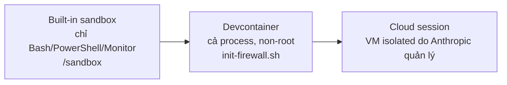

# Module 2.3: Sandbox Environments — Kiểm soát Blast Radius

> **Thời gian học**: ~35 phút
>
> **Yêu cầu trước**: Module 2.2 (Permission System)
>
> **Kết quả**: Bật built-in sandbox, giới hạn Bash filesystem/network bằng `sandbox.*` settings,
> chạy firewall của devcontainer, và verify từng control thật sự chặn.

---

## 1. WHY — Tại sao cần học cái này?

Deny rule ở Module 2.2 khớp theo **command text** — không chặn được subprocess mà một script tự
spawn, và không phủ Read/Edit/Write. Một tool đọc thẳng `~/.aws/credentials` sẽ lách qua rule vốn
không được thiết kế để bắt nó.

Sandboxing đẩy containment xuống một lớp thấp hơn: hệ điều hành enforce những gì một process được
chạm vào, bất kể model quyết định chạy gì — environment layer trước, model layer sau (S13). Module
này bàn ba lựa chọn: sandbox, devcontainer, cloud session.

---

## 2. CONCEPT — Khái niệm cốt lõi

### VERIFIED vs. RECOMMENDED vs. ASSUMED RISK

| Trạng thái | Khẳng định |
|---|---|
| **VERIFIED** | Sandbox: macOS (Seatbelt), Linux/WSL2 (bubblewrap); **"Native Windows is not supported. On Windows, run Claude Code inside a WSL2 distribution."** |
| **VERIFIED** | "Applies only to Bash, PowerShell, and Monitor commands." Read/Edit/WebFetch dùng permission rules; MCP server và hooks "run unconstrained on the host" |
| **VERIFIED** | Mặc định đọc được "the entire computer, except certain denied directories… this default still allows reading credential files such as `~/.aws/credentials` and `~/.ssh/`" trừ khi thêm `denyRead` |
| **VERIFIED** | `network.allowedDomains` một mình không deny: "the first time a command needs a new domain, Claude Code prompts for approval." Deny cứng cần `strictAllowlist: true` (chỉ user/managed/`--settings`, v2.1.219+) |
| **RECOMMENDED** | Filesystem *và* network restriction cùng lúc — xem bên dưới |
| **ASSUMED RISK** | Egress nào cũng có thể leak thứ agent đọc được; sandbox thu nhỏ blast radius, không xoá bỏ nó |

### Sandbox cần cả hai lớp

> "Effective sandboxing requires both filesystem and network isolation. Without network isolation,
> a compromised agent could exfiltrate sensitive files like SSH keys. Without filesystem
> isolation… a compromised agent could backdoor system resources to gain network access."

### Ba lớp containment


```mermaid
graph LR
    A["Built-in sandbox<br/>chỉ Bash/PowerShell/Monitor<br/>/sandbox"] --> B["Devcontainer<br/>cả process, non-root<br/>init-firewall.sh"] --> C["Cloud session<br/>VM isolated do Anthropic quản lý"]
```

1. **Built-in sandbox** (`/sandbox`) — OS enforce, chỉ Bash, không cần cài gì trên macOS.
2. **Devcontainer** — cả process, MCP server, hooks chạy trong Docker với user non-root; container
   tham chiếu có thêm firewall default-deny.
3. **Cloud session** (`claude --cloud`) — VM isolated do Anthropic quản lý; "network access is
   limited by default and can be configured to be disabled or allow only specific domains."

### Giới hạn đã tài liệu hoá

- **Không inspect TLS**: domain rộng "can create paths for data exfiltration… via domain
  fronting"; `allowUnixSockets` + `/var/run/docker.sock` "effectively grants access to the host
  system through the Docker socket."
- **Escape hatch**: Claude có thể retry lệnh bị chặn "outside the sandbox" qua
  `dangerouslyDisableSandbox`; `"allowUnsandboxedCommands": false` khiến Claude Code bỏ qua nó.
- **Devcontainer + `--dangerously-skip-permissions`**: vẫn exfiltrate được "the Claude Code
  credentials stored in `~/.claude`."

### Data handling — không overclaim

Isolation không phải retention: file Claude đọc "are transmitted to the Anthropic API … with or
without a sandbox." Sau đó: gói commercial không train model trừ khi opt in (giữ 30 ngày); gói
consumer tự chọn — 5 năm nếu opt in, 30 ngày nếu không.

---

## 3. DEMO — Làm mẫu từng bước

Lab: macOS, Claude Code v2.1.283, `~/cc-lab`. Merge vào `.claude/settings.local.json`:

```json
// docs: sandboxing#configure-sandboxing
{
  "permissions": { "defaultMode": "default" },
  "sandbox": {
    "enabled": true,
    "allowUnsandboxedCommands": false,
    "network": { "allowedDomains": ["registry.npmjs.org"] },
    "filesystem": { "denyRead": ["~/cc-lab-fake-ssh"] }
  }
}
```

`denyRead` trỏ vào `~/cc-lab-fake-ssh/config` bỏ đi (fake string
`sk-FAKE-DO-NOT-USE-xxxxxxxxxxxx`), không phải `~/.ssh` thật — settings của bạn nên liệt kê
`~/.ssh` và `~/.aws` ở đó.

**Bước 1**: chạy `/sandbox`.

```text
# Output may vary
  Sandbox  Mode   Overrides   Config
  Configure mode
    1. Sandbox BashTool, with auto-allow ✔
    2. Sandbox BashTool, with regular permissions
    3. No Sandbox
  ←/→ to switch · ↑/↓ to navigate · Enter to select · Esc to close
```

Tab Overrides xác nhận `allowUnsandboxedCommands: false` là **"Strict sandbox mode (current)"**;
tab Config liệt kê `Network Restrictions: Allowed: registry.npmjs.org` và `Filesystem Read
Restrictions: Denied: … ~/cc-lab-fake-ssh` (cộng các protected path nội bộ).

**Bước 2 — chặn network**: `allowedDomains` một mình chỉ pre-approve domain đã liệt kê — domain
chưa liệt kê vẫn prompt, nên một lần chạy tự động sẽ treo. Muốn deny chắc chắn, khởi động bằng
`--settings` (không có tác dụng từ `.claude/settings.local.json`):

```bash
# docs: sandboxing#network-isolation
claude --settings '{"sandbox": {"network": {"strictAllowlist": true}}}'
```

Rồi nhờ Claude chạy `curl -sI --max-time 5 https://example.com`.

```text
# Output may vary
⏺ Bash(curl -sI --max-time 5 https://example.com)
  ⎿  Error: Exit code 56
     HTTP/1.1 403 Forbidden
     X-Proxy-Error: blocked-by-allowlist
The sandbox also reported this violation:
deny network-outbound example.com:443 (host is not on the allow list)
```

Proxy deny thẳng thay vì curl timeout.

**Bước 3 — cho phép network**: nhờ chạy `npm view left-pad version --cache
"$TMPDIR/npm-cache-demo"` (`npm view` bản thường fail trước vì một restriction *ghi* không liên
quan — chỉ working dir và `$TMPDIR` ghi được, không phải `~/.npm/_cacache`).

```text
# Output may vary
⏺ Bash(npm view left-pad version --cache "$TMPDIR/npm-cache-demo")
  ⎿  1.3.0
```

Cùng session: `registry.npmjs.org` đã liệt kê nên đi qua.

**Bước 4 — chặn filesystem**: `cat ~/cc-lab-fake-ssh/config`.

```text
# Output may vary
⏺ Bash(cat ~/cc-lab-fake-ssh/config)
  ⎿  Error: Exit code 1
     cat: /Users/you/cc-lab-fake-ssh/config: Operation not permitted
```

**Bước 5 — chứng minh ranh giới**: nhờ Claude dùng **Read tool** (không phải Bash) trên cùng file.

```text
# Output may vary
 Read file
  Read(/Users/you/cc-lab-fake-ssh/config)
 Do you want to proceed?
 ❯ 1. Yes
   2. Yes, allow reading from /Users/you/cc-lab-fake-ssh during this session
   3. No
```

Approve — Claude giải thích: "This session's sandbox blocks Bash from reading that directory...
The Read tool isn't covered by that sandbox rule." Bằng chứng sống cho phạm vi: chỉ Bash. (Prompt
này xuất hiện vì lab pin Manual mode; ở auto mode — mặc định từ v2.1.283 — classifier tự quyết.)

Đóng khoảng trống bằng permission rule của 2.2 trên cùng path — "paths and domains from both
sandbox settings and permission rules are merged":

```json
{ "permissions": { "deny": ["Read(~/cc-lab-fake-ssh/**)"] } }
```

Hỏi lại: Read bị từ chối thẳng, "File is in a directory that is denied by your permission
settings."

**Bước 6 — firewall của devcontainer** (chạy thật, Docker có sẵn cho lab này):

```bash
# docs: devcontainer#restrict-network-egress
git clone --depth 1 https://github.com/anthropics/claude-code /tmp/cc && cd /tmp/cc/.devcontainer
docker build -t cc-devcontainer-demo .
docker run --rm --cap-add=NET_ADMIN --cap-add=NET_RAW cc-devcontainer-demo bash -c \
  'sudo /usr/local/bin/init-firewall.sh; claude --version; curl -sI --max-time 5 https://example.com; echo exit:$?'
```

```text
# Output may vary
Firewall verification passed - unable to reach https://example.com as expected
Firewall verification passed - able to reach https://api.github.com as expected
2.1.283 (Claude Code)
exit:7
```

Self-test của script xác nhận việc chặn; `claude --version` chỉ chứng minh binary chạy được — nó
không gọi API nên không chứng minh allowlist chạm được `api.anthropic.com`. Allowlist cố định:
`registry.npmjs.org`, `api.anthropic.com`, năm domain khác, cộng dải IP GitHub và `/24` của host.

Dọn dẹp: `docker rmi cc-devcontainer-demo`, `rm -rf /tmp/cc`, xoá `~/cc-lab-fake-ssh`, khôi phục
`.claude/settings.local.json` về `{"permissions": {"defaultMode": "default"}}`.

---

## 4. PRACTICE — Tự thực hành

### Bài tập 1: Allowlist cho project Android

**Mục tiêu**: Gradle/Maven resolve được, deny thẳng mọi thứ khác.

**Hướng dẫn**: thêm `allowedDomains` cho `dl.google.com`, `repo.maven.apache.org`,
`*.gradle.org`, một write grant cho cache của Gradle, và `strictAllowlist` (project settings không
set được — dùng `--settings` hoặc user settings). Kỳ vọng: `./gradlew dependencies` thành công;
`curl -sI https://example.com` nhận 403.

<details>
<summary>✅ Giải pháp</summary>

```json
{ "sandbox": { "enabled": true, "network": {
  "allowedDomains": ["dl.google.com", "repo.maven.apache.org", "*.gradle.org"],
  "strictAllowlist": true },
  "filesystem": { "allowWrite": ["~/.gradle"] } } }
```

Cache của Gradle nằm ở `~/.gradle`, cần write grant.

</details>

---

### Bài tập 2: Chặn AWS credentials

**Mục tiêu**: ngăn cả Bash trong sandbox lẫn Read tool đọc `~/.aws/credentials` (chính sách đọc
mặc định vẫn cho phép). Kỳ vọng: `cat ~/.aws/credentials` fail qua Bash; Read trên cùng path bị
từ chối thẳng, không chỉ prompt.

<details>
<summary>✅ Giải pháp</summary>

```json
{ "sandbox": { "enabled": true, "credentials": {
  "files": [{ "path": "~/.aws/credentials", "mode": "deny" }] } },
  "permissions": { "deny": ["Read(~/.aws/credentials)"] } }
```

Thiếu nửa `permissions.deny`, Read vẫn dừng ở prompt — một lần "Yes" mất tập trung là key vào
context và transcript.

</details>

---

### Bài tập 3: Enforcement bằng managed settings

**Mục tiêu**: bắt buộc sandbox toàn tổ chức.

<details>
<summary>✅ Giải pháp</summary>

```json
{ "sandbox": { "enabled": true, "failIfUnavailable": true, "allowUnsandboxedCommands": false } }
```

Triển khai qua managed settings (macOS:
`/Library/Application Support/ClaudeCode/managed-settings.json`; Linux/WSL:
`/etc/claude-code/managed-settings.json`), không phải file project — `enabled` từ managed settings
đè lên setting cục bộ (Module 10.5).

</details>

---

## 5. CHEAT SHEET

| Key / lệnh | Tác dụng | Verify |
|---|---|---|
| `/sandbox` | Mở panel (Mode/Overrides/Config) | Tab Config hiện rule đã resolve |
| `sandbox.enabled` | Bật sandbox | Tab Config không rỗng |
| `allowUnsandboxedCommands: false` | Tắt escape hatch | Overrides → "Strict sandbox mode" |
| `network.allowedDomains` | Pre-approve domain; còn lại vẫn prompt | Domain được phép đi qua; còn lại prompt |
| `network.strictAllowlist: true` | Deny cứng domain chưa liệt kê (user/managed/`--settings`) | `403` / `blocked-by-allowlist` |
| `filesystem.denyRead` + `permissions.deny: ["Read(path/**)"]` | Chặn một path cho cả Bash *và* Read | `Operation not permitted`; Read bị từ chối, không prompt |
| `failIfUnavailable` | Từ chối chạy nếu không sandbox được | Thiếu dependency trên Linux thì chặn khởi động |
| `init-firewall.sh` | iptables default-deny + allowlist | Self-test in "verification passed" |
| `disableBypassPermissionsMode: "disable"` | Chặn `--dangerously-skip-permissions` | `/status` → nguồn managed |

---

## 6. PITFALLS — Lỗi thường gặp

| ❌ Sai lầm | ✅ Cách đúng |
|---|---|
| Cắt network Docker (`--network` đặt `none`) | Claude Code cần `api.anthropic.com` — dùng egress allowlist thay vào đó |
| Tưởng `allowedDomains` deny được domain chưa liệt kê, hay sandbox phủ luôn Read/Edit | Nó chỉ pre-approve; thêm `strictAllowlist` để deny thật. Sandbox = Bash/PowerShell/Monitor — Read/Edit/WebFetch dùng permission rules, MCP/hooks chạy unconstrained |
| Allowlist `github.com` rộng, hay thêm `/var/run/docker.sock` vào `allowUnixSockets` | Không inspect TLS nên domain fronting khả thi; socket "effectively grants access to the host system" |
| Mount `~/.ssh` vào devcontainer | Docs: "prefer repository-scoped or short-lived tokens" thay vào đó |
| "Anthropic log và train trên code của bạn" | Tuỳ tài khoản: commercial không train trừ khi opt in |

---

## 7. REAL CASE — Câu chuyện thực tế

Một fintech Việt Nam chạy agent qua đêm (bump dependency, soạn changelog) trong devcontainer tham
chiếu với `--dangerously-skip-permissions`, được phép chỉ vì chạy non-root — CLI từ chối flag này
nếu chạy bằng root. Allowlist firewall của họ là mặc định cộng một host GitHub Enterprise nội bộ.

**Blast radius, và firewall không cần hỏng**: "Only use dev containers when developing with
trusted repositories, and monitor Claude's activities" — vì "dev containers do not prevent a
malicious project from exfiltrating anything accessible inside the container, including the
Claude Code credentials stored in `~/.claude`." Allowlist tự resolve mọi dải IP GitHub, nên một
firewall *đang hoạt động đúng* vẫn để một dependency bị compromise đẩy dữ liệu tới bất kỳ repo hay
gist công khai nào trên `github.com` — đó là đường exfiltration, không phải lỗi cấu hình. Team này
review script mỗi lần đổi base image và không bao giờ mount `~/.ssh` — credential cloud đưa vào
dưới dạng biến môi trường scoped, sống ngắn hạn.

**Kết quả**: job chạy qua đêm trên repo tin cậy; review allowlist hàng tháng là control, không phải
niềm tin agent "sẽ không làm vậy."

---

> **Tiếp theo**: [Module 2.4: Secret Management](../04-secret-management/) →
