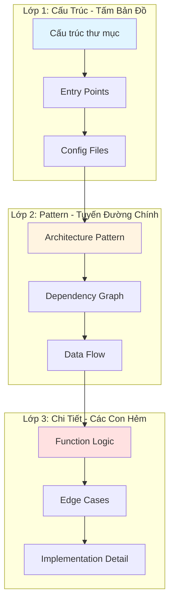

<!-- Note: Module này vượt word count tiêu chuẩn (3512 vs 800-1500) do cần
     DEMO 8 bước đầy đủ để minh họa chiến lược đọc 3 lớp. Mỗi bước hiển thị
     output thực tế từ Claude. Đã được architect review phê duyệt 2026-02-01. -->

# Module 3.1: Đọc & Hiểu Codebase

> **Thời gian học**: ~30 phút
>
> **Yêu cầu trước**: Module 1.3 (Context Window cơ bản)
>
> **Kết quả**: Sau module này, bạn sẽ biết dùng Claude Code để nhanh chóng hiểu bất kỳ codebase lạ nào — kiến trúc, file quan trọng, pattern, và dependency.

---

## 1. WHY — Tại Sao Cần Học?

Bạn vừa join công ty mới. Ngày đầu tiên, tech lead chỉ vào màn hình: "Đây là codebase chính, 200.000 dòng code, documentation... ừm... có đấy nhưng đang outdated. Tuần sau bạn cần ship feature mới nhé." Hoặc tệ hơn: team outsource vừa nhận bàn giao project từ client, lead dev cũ đã nghỉ, handover doc chỉ có 3 trang PowerPoint mơ hồ, deadline thứ Sáu tuần này. Đọc từng file? Không kịp. Hỏi đồng nghiệp? Họ cũng đang bối rối. Đây chính xác là lúc Claude Code trở thành "hoa tiêu" dẫn bạn qua biển code lạ — nhưng bạn phải biết hỏi đúng cách.

---

## 2. CONCEPT — Khái Niệm Cốt Lõi

### Chiến Lược Đọc 3 Lớp

Ví von như bạn đến một thành phố lạ lần đầu tiên. Bạn không đi lung tung vào từng con hẻm ngay — thay vào đó, bạn xem bản đồ tổng thể trước (đâu là trung tâm, sân bay, khu thương mại), rồi đi theo các tuyến đường chính (metro, đại lộ), cuối cùng mới khám phá từng khu phố nhỏ.

Đọc codebase cũng vậy. Chia làm 3 lớp:

**Lớp 1: Cấu Trúc (Tấm Bản Đồ)**
Cấu trúc thư mục, entry point, config file. Mục tiêu: biết cái gì nằm ở đâu trước khi hiểu nó làm gì. Giống như biết bưu điện ở đường Lê Lợi, ngân hàng ở đường Trần Hưng Đạo — có cần dùng mới vào.

**Lớp 2: Pattern (Các Tuyến Đường Chính)**
Architecture pattern, dependency graph, data flow. Đây là "đường cao tốc" mà dữ liệu đi qua hệ thống. Ví dụ: request vào controller → qua middleware auth → xuống service layer → gọi database. Hiểu flow này, bạn biết được sửa ở đâu khi có bug.

**Lớp 3: Chi Tiết (Các Con Hẻm)**
Logic function cụ thể, edge case, implementation detail. Đây là lúc bạn zoom vào code từng dòng. Nhưng chỉ đào sâu SAU KHI đã có bản đồ — đừng lạc vào chi tiết khi chưa hiểu big picture.

### Ngân Sách Context

Context window của Claude lớn nhưng hữu hạn. Đừng phí vào file không liên quan. Chiến lược:

- **Lớp 1**: Breadth-first (quét rộng) — xem tổng quan trước
- **Lớp 3**: Depth-first (đào sâu) — chỉ khi cần thiết



**Nguyên tắc vàng**: Luôn thiết lập context trước khi đào sâu. Đừng hỏi "Hàm login hoạt động thế nào?" khi bạn chưa biết auth module nằm ở đâu trong project.

---

## 3. DEMO — Làm Mẫu Từng Bước

Giả sử bạn vừa clone một REST API project Node.js/Express từ team khác. Chưa từng thấy code này bao giờ. Hãy áp dụng chiến lược 3 lớp.

**Bước 1: Khởi động Claude Code session**

```bash
$ cd my-ecommerce-api
$ claude
```

Expected output:

```
Starting Claude Code session...
Context: /Users/you/my-ecommerce-api
Type /help for commands
```

**Tại sao quan trọng**: Bạn đã vào đúng thư mục project — Claude sẽ tự động có context về cấu trúc file.

---

**Bước 2: Tổng quan project (Lớp 1 bắt đầu)**

```
What does this project do? Explain the directory structure.
```

Expected output:

```
This is a Node.js/Express REST API for managing e-commerce orders and inventory.

Directory structure:
├── src/
│   ├── controllers/   # HTTP request handlers
│   ├── models/        # Mongoose schemas (MongoDB)
│   ├── routes/        # API endpoint definitions
│   ├── middleware/    # Auth, validation, error handling
│   ├── services/      # Business logic layer
│   ├── utils/         # Helper functions
│   └── index.js       # Entry point
├── tests/             # Jest test suites
├── config/            # Environment configs
├── docs/              # API documentation
└── package.json

Tech stack:
- Express 4.x
- MongoDB with Mongoose
- JWT authentication
- Jest for testing
```

**Tại sao quan trọng**: Giờ bạn có bản đồ. Biết có services layer riêng (business logic tách khỏi controller), dùng MongoDB, có tests, có auth. Chưa cần đọc code gì cả, đã biết kiến trúc tổng thể.

---

**Bước 3: Xác định entry point (Lớp 1 tiếp tục)**

```
Where is the main entry point? Trace the startup flow.
```

Expected output:

```
Entry point: src/index.js

Startup flow:
1. index.js loads environment variables from .env
2. Connects to MongoDB via mongoose.connect()
3. Initializes Express app
4. Registers middleware (CORS, body-parser, auth)
5. Mounts routes from src/routes/
6. Starts HTTP server on port 3000

Key files in startup sequence:
- src/index.js (main)
- config/database.js (MongoDB connection)
- src/middleware/auth.js (JWT middleware)
- src/routes/index.js (route aggregator)
```

**Tại sao quan trọng**: Bạn biết app khởi động như thế nào. Nếu server crash khi start, bạn biết trace từ `index.js`. Nếu cần thêm middleware mới, bạn biết chỗ đăng ký.

---

**Bước 4: Map dependencies chính (Lớp 1 kết thúc)**

```
What are the key dependencies and their roles?
```

Expected output:

```
Production dependencies:
- express: Web framework
- mongoose: MongoDB ODM
- jsonwebtoken: JWT auth
- bcrypt: Password hashing
- dotenv: Environment variable management
- express-validator: Input validation

Dev dependencies:
- jest: Testing framework
- supertest: API testing
- nodemon: Auto-restart during development
```

**Tại sao quan trọng**: Bạn biết tech stack. Nếu gặp bug liên quan auth, bạn biết tìm trong `jsonwebtoken` và `bcrypt`. Nếu cần viết test, bạn biết dùng Jest + Supertest.

---

**Bước 5: Nhận diện architecture pattern (Lớp 2 bắt đầu)**

```
What architecture pattern is used here? How is code organized?
```

Expected output:

```
Architecture: Layered/MVC variant with service layer

Layers:
1. Routes (src/routes/) - Define HTTP endpoints
2. Controllers (src/controllers/) - Handle requests/responses
3. Services (src/services/) - Business logic
4. Models (src/models/) - Data schemas and DB interaction

Example flow for "Create Order":
POST /api/orders
  → routes/orders.js routes to orderController.createOrder
  → orderController validates input, calls orderService.create()
  → orderService applies business rules, calls Order.create() (model)
  → Model saves to MongoDB
  → Response flows back up through controller

This pattern separates concerns: controllers handle HTTP, services handle business logic, models handle data.
```

**Tại sao quan trọng**: Giờ bạn hiểu flow tổng thể. Khi cần thêm feature "Apply discount to order", bạn biết logic phải vào `orderService`, không phải trong controller.

---

**Bước 6: Trace một feature cụ thể (Lớp 2 tiếp tục)**

```
Trace the data flow for "User Login". Show all files involved.
```

Expected output:

```
Login flow:

1. POST /api/auth/login
   → src/routes/auth.js

2. Route calls authController.login()
   → src/controllers/authController.js

3. Controller validates email/password format
   → Uses express-validator

4. Controller calls authService.authenticate(email, password)
   → src/services/authService.js

5. Service queries User model by email
   → src/models/User.js

6. Service compares password with bcrypt
   → Returns error if mismatch

7. If valid, service generates JWT token
   → Uses jsonwebtoken library

8. Controller returns token + user data
   → Response: { token, user: { id, email, name } }

Files involved (in order):
- src/routes/auth.js
- src/controllers/authController.js
- src/services/authService.js
- src/models/User.js
```

**Tại sao quan trọng**: Bạn vừa trace end-to-end một feature quan trọng mà chưa cần đọc code chi tiết. Nếu bug "login fails with correct password", bạn biết check `authService.js` line so sánh bcrypt. Nếu cần thêm "login with Google", bạn biết phải sửa `authService` và thêm route mới.

---

**Bước 7: Đào sâu vào module cụ thể (Lớp 3 — khi cần thiết)**

```
Explain the authService module end to end. Show the key functions.
```

Expected output:

```
File: src/services/authService.js

Key functions:

1. authenticate(email, password)
   - Finds user by email
   - Compares password hash using bcrypt.compare()
   - Returns user object if valid, throws error if not

2. generateToken(userId)
   - Creates JWT with payload { userId }
   - Signs with secret from .env (JWT_SECRET)
   - Sets expiration to 7 days

3. verifyToken(token)
   - Decodes JWT
   - Checks expiration
   - Returns userId if valid

4. hashPassword(plainPassword)
   - Generates salt
   - Hashes password with bcrypt
   - Used during user registration

Dependencies:
- bcrypt (password hashing)
- jsonwebtoken (JWT operations)
- User model (database queries)

Security notes:
- Passwords never stored in plain text
- JWT secret must be strong (from environment variable)
- Token expiration prevents indefinite sessions
```

**Tại sao quan trọng**: Giờ bạn đã hiểu chi tiết một module quan trọng. Chỉ đào sâu ở Lớp 3 khi thực sự cần sửa code module đó — không phí context vào những thứ không cần biết ngay.

---

**Bước 8: Tạo mental model (Tùy chọn)**

Sau khi đã đi qua 3 lớp, bạn có thể yêu cầu Claude tạo documentation để ghi nhớ:

```
Generate a concise onboarding doc for this codebase covering architecture, key modules, and data flows.
```

Claude sẽ tạo ra document markdown bạn có thể lưu vào `docs/ONBOARDING.md` — cực kỳ hữu ích cho thành viên mới join sau này.

---

## 4. PRACTICE — Tự Thực Hành

### Bài Tập 1: Codebase Speed Run

**Mục tiêu**: Map một codebase lạ trong dưới 10 phút.

**Hướng dẫn**:

1. Clone một open-source project bạn chưa từng thấy:
   ```bash
   $ git clone https://github.com/fastify/fastify.git
   $ cd fastify
   $ claude
   ```

2. Dùng Claude Code trả lời 5 câu hỏi này:
   - Project này làm gì? (1 câu tóm tắt)
   - Architecture pattern là gì?
   - Nếu muốn thêm plugin mới, sửa file nào?
   - Testing framework nào được dùng?
   - Module phức tạp nhất là gì?

3. Bấm giờ. Dừng lại ở phút thứ 10.

**Kết quả mong đợi**: Bạn có 5 câu trả lời chắc chắn trong 10 phút — không cần đọc code chi tiết.

<details>
<summary>💡 Gợi ý</summary>

Bắt đầu từ Lớp 1. Hỏi tổng quan và cấu trúc thư mục trước, đừng vội đào vào code. Dùng prompt như:

```
What does this project do? Explain the directory structure.
```

Sau đó mới hỏi pattern và flow.

</details>

<details>
<summary>✅ Đáp án mẫu</summary>

**Prompt sequence gợi ý**:

```
1. What does this project do? Explain the directory structure.
2. What architecture pattern is used?
3. How do I add a new plugin? Show the process.
4. What testing framework is used? Where are tests located?
5. Which module has the most complexity? Why?
```

**Expected answers** (Fastify example):

1. Fastify is a fast web framework for Node.js, focused on performance. Directory: `lib/` (core), `test/` (tests), `docs/` (documentation).
2. Plugin-based architecture — everything is a plugin.
3. Create plugin in `lib/plugins/`, register via `fastify.register()`.
4. `tap` testing framework, tests in `test/` directory.
5. `lib/request.js` and `lib/reply.js` — handle HTTP request/response lifecycle with many edge cases.

**Thời gian**: 7-10 phút nếu hỏi đúng sequence.

</details>

---

### Bài Tập 2: Tài Liệu Onboarding Thành Viên Mới

**Mục tiêu**: Tạo onboarding doc có thể tái sử dụng cho team.

**Hướng dẫn**:

1. Chọn một project hiện tại bạn đang làm (hoặc project cũ bạn từng làm).

2. Dùng Claude Code tạo tài liệu onboarding gồm các section:
   - **Overview**: Project làm gì? Tech stack?
   - **Architecture**: Pattern nào? Layers nào?
   - **Key Modules**: Modules quan trọng và trách nhiệm của chúng
   - **Data Flows**: 2-3 flows chính (vd: login, checkout, upload file)
   - **Testing**: Chạy test như thế nào?
   - **Common Tasks**: Thêm feature mới, fix bug, deploy

3. Lưu document vào `docs/ONBOARDING.md` trong project.

4. Share với đồng nghiệp và thu thập feedback.

**Kết quả mong đợi**: Document 2-3 trang, đọc xong trong 15 phút, giúp developer mới join team hiểu project nhanh gấp 10 lần.

<details>
<summary>💡 Gợi ý</summary>

Prompt gợi ý:

```
Generate a comprehensive onboarding document for this codebase. Include:
- Project overview and tech stack
- Architecture pattern and layers
- Key modules and their responsibilities
- Main data flows (with examples)
- How to run tests
- Common tasks (add feature, fix bug, deploy)

Make it concise, suitable for a new developer joining the team.
```

</details>

<details>
<summary>✅ Solution</summary>

**Quy trình**:

1. Start Claude Code session:
   ```bash
   $ cd your-project
   $ claude
   ```

2. Request documentation:
   ```
   Generate a comprehensive onboarding document for this codebase. Include:
   - Project overview and tech stack
   - Architecture pattern and layers
   - Key modules and their responsibilities
   - Main data flows (with examples: login, checkout)
   - How to run tests
   - Common tasks (add feature, fix bug, deploy)

   Make it concise, suitable for a new developer joining the team. Use markdown format.
   ```

3. Review output, refine if needed:
   ```
   Add a "Troubleshooting" section covering common setup issues.
   ```

4. Save to file:
   ```
   Save this to docs/ONBOARDING.md
   ```

5. Test với đồng nghiệp — cho 1-2 người chưa quen project đọc và feedback.

**Thời gian**: 10-15 phút tạo document, 5 phút refine.

</details>

---

## 5. CHEAT SHEET

| Prompt | Chức năng | Khi nào dùng |
|--------|-----------|--------------|
| `What does this project do? Explain the directory structure.` | Tổng quan + cấu trúc file | Đầu tiên khi explore codebase mới |
| `Where is the main entry point? Trace the startup flow.` | Xác định bootstrap sequence | Hiểu cách app khởi động |
| `What are the key dependencies and their roles?` | Map thư viện external | Đánh giá tech stack |
| `What architecture pattern is used here?` | Nhận diện MVC, Clean, Layered, etc. | Hiểu thiết kế trước khi thêm feature |
| `Trace the data flow for [feature]` | Hiển thị request → response flow | Hiểu feature end-to-end |
| `Explain the [module] module end to end` | Deep dive một module cụ thể | Trước khi sửa code module đó |
| `What conventions does this project follow?` | Phát hiện naming, structure patterns | Trước khi viết code mới |
| `What are potential issues or code smells?` | Nhận diện tech debt | Đánh giá chất lượng code |
| `Generate an onboarding doc for this codebase` | Tạo documentation tự động | Chia sẻ kiến thức cho team |
| `Show me tests for [feature]` | Xem test coverage | Test là documentation sống |
| `/compact` | Nén conversation history | Khi context gần đầy |

**Tips**:
- Bắt đầu với prompts tổng quát (Lớp 1), sau đó specific (Lớp 2, 3)
- Dùng tiếng Anh cho prompts kỹ thuật — kết quả chính xác hơn
- Chạy `/compact` định kỳ để giải phóng context window

---

## 6. PITFALLS — Sai Lầm Cần Tránh

| ❌ Sai lầm | ✅ Cách đúng |
|-----------|-------------|
| Hỏi "Giải thích đoạn code này" mà không có context | Thiết lập context trước: "Project này làm gì?" → "Module X có trách nhiệm gì?" → RỒI mới hỏi code cụ thể |
| Nhồi toàn bộ repo vào context một lúc (đọc 50 file) | Bắt đầu từ Lớp 1 (cấu trúc), Lớp 2 (pattern), Lớp 3 (chi tiết) — từng bước một |
| Tin Claude 100% mà không verify | Cross-check bằng cách yêu cầu: "Show me the file path and code snippet" để tự verify |
| Đọc file tuần tự từng file một (file1.js, file2.js, file3.js...) | Theo data flow — trace một request đi qua hệ thống, nhảy theo logic không theo alphabet |
| Bỏ qua test file | Test là documentation sống — hỏi "Show me tests for login feature" hiểu nhanh hơn đọc code |
| Hỏi mơ hồ: "Auth hoạt động thế nào?" | Cụ thể: "Trace login flow từ POST /login endpoint đến JWT generation" |
| Bỏ qua Lớp 2, nhảy thẳng vào code chi tiết | Luôn nhận diện architecture pattern trước — biết MVC hay Clean Architecture giúp bạn predict code structure |
| Không dùng `/compact` khi context đầy | Chạy `/compact` định kỳ để nén history, giải phóng context cho queries mới |
| **Hỏi bằng tiếng Việt cho lệnh kỹ thuật** | **Prompt tiếng Anh cho kết quả chính xác hơn** (Claude được train nhiều trên English technical content) |
| Đọc code cũ không có tests | Yêu cầu Claude: "Generate tests for this module" — viết test giúp hiểu code nhanh hơn |

---

## 7. REAL CASE — Tình Huống Thực Tế

**Bối cảnh**: Nam, senior Android developer ở TP.HCM, vừa join một startup fintech đang xây dựng app mobile banking bằng Kotlin Multiplatform (KMP). Codebase 3 năm tuổi, khoảng 150.000 dòng code trải qua shared Kotlin logic, Android-specific module, và iOS-specific module. Lead developer cũ nghỉ việc đột ngột — không handover, không có architecture document, chỉ có vài file README lỗi thời. CEO cần Nam ship một bug fix quan trọng trước thứ Sáu tuần này (còn 4 ngày). Onboarding truyền thống cần 2 tuần.

**Vấn đề**: Làm sao hiểu codebase 150K dòng trong 4 ngày khi chưa bao giờ thấy Kotlin Multiplatform trước đây?

**Giải pháp**: Nam dùng chiến lược đọc 3 lớp với Claude Code.

**Ngày 1 — Lớp 1 (Cấu trúc)**:

Nam mở Claude Code:

```
What does this project do? Explain the module structure of this KMP project.
```

Claude trả lời: Project có 47 module được tổ chức theo feature (payments, accounts, loans, notifications...). Shared business logic nằm trong `shared/src/commonMain/kotlin/`, platform-specific code trong `androidApp/` và `iosApp/`.

Nam tiếp tục:

```
Where is the payment feature? Show directory structure.
```

Claude chỉ ra: `shared/src/commonMain/kotlin/payments/` chứa core payment logic, `androidApp/src/main/java/payments/` có Android UI, `iosApp/payments/` có iOS UI.

**Ngày 1 — Lớp 2 (Pattern)**:

```
What architecture pattern is used? How does data flow in this app?
```

Claude: Clean Architecture + MVVM. Flow tiêu biểu:
UI Layer (Activity/ViewController) → ViewModel → UseCase → Repository → Network/Database.

```
Trace the payment flow from user tapping 'Pay Now' button to transaction completion.
```

Claude map toàn bộ flow qua 12 file: `PayButton.kt` → `PaymentViewModel.kt` → `ProcessPaymentUseCase.kt` → `PaymentRepository.kt` → `PaymentApiService.kt` → backend API.

**Ngày 2 — Lớp 3 (Chi tiết)**:

Bug report nói: "Payment sometimes fails silently without error message." Nam deep-dive:

```
Explain PaymentRepository class. What does processPayment() function do?
```

Claude show code chi tiết. Nam thấy logic error handling.

```
What are potential race conditions in the payment queue?
```

Claude phát hiện: `PaymentQueue.enqueue()` không có synchronization — nếu user tap "Pay" nhiều lần nhanh, có thể duplicate transaction hoặc crash.

**Ngày 3 — Fix Bug**:

```
Add thread-safe queueing to PaymentQueue using Kotlin coroutines and Mutex. Show the fix.
```

Claude generate code fix. Nam review, test trên local simulator. Bug biến mất.

**Ngày 4 — Documentation**:

```
Generate comprehensive architecture document for the payment module, including class diagram and data flow.
```

Claude tạo document 15 trang với Mermaid diagrams, giải thích từng layer, dependency injection setup, error handling strategy.

**Kết quả**:

- **Map toàn bộ codebase trong 2 tiếng** thay vì 2 tuần đọc code thủ công
- **47 module được document** với responsibilities và dependencies rõ ràng
- **Bug traced và fixed** trong 3 ngày — ship trước deadline 1 ngày
- **Onboarding doc được lưu lại** — team dùng cho tất cả new hires sau này, giảm onboarding time từ 2 tuần xuống 3 ngày
- **Team velocity tăng đáng kể** — các developer khác bắt đầu áp dụng technique này khi explore module mới

**Bài học rút ra**: Chiến lược 3 lớp hiệu quả vì nó phản ánh cách developer có kinh nghiệm thực sự học codebase — cấu trúc trước, pattern sau, chi tiết cuối cùng. Claude Code tăng tốc mỗi lớp từ hàng giờ xuống vài phút. Không phải thay thế kỹ năng đọc code, mà là công cụ giúp bạn focus đúng chỗ, đúng lúc.

**Thực tế Việt Nam**: Đây là tình huống cực kỳ phổ biến ở các công ty outsource Việt Nam (FPT, TMA, Rikkeisoft...) khi nhận maintain project từ client nước ngoài, hoặc khi có người nghỉ việc đột ngột trong team startup. Khả năng map nhanh codebase lạ là kỹ năng sống còn.

---

> **Tiếp theo**: [Module 3.2: Viết & Sửa Code](../02-writing-code/) →
