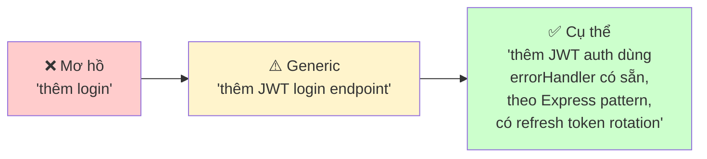

# Module 3.2: Viết & Sửa Code

> **Thời gian học**: ~35 phút
>
> **Yêu cầu trước**: Module 3.1 (Đọc & Hiểu Codebase)
>
> **Kết quả**: Sau module này, bạn sẽ biết dùng Claude Code để viết code mới, sửa code hiện tại, và refactor tự tin — trong khi vẫn giữ đúng convention và chất lượng của project.

---

## 1. WHY — Tại Sao Cần Học?

Bạn đã hiểu codebase (Module 3.1), giờ đến phần viết code. Bẫy phổ biến nhất: bảo Claude "viết function X" rồi nhận về code generic không khớp với style project của bạn — sai naming convention, không dùng utility có sẵn, không theo error handling pattern team đã thống nhất. Kỹ năng thật sự không phải "nhờ AI viết code," mà là "chỉ dẫn AI viết code THUỘC VỀ project của bạn" — đúng convention, reuse code có sẵn, maintain consistency. Đây là khác biệt giữa "copy-paste nhờ AI" với "phát triển với sức mạnh AI." Trong bối cảnh deadline gấp ở startup Việt Nam, kỹ năng này quyết định bạn ship nhanh mà không tạo tech debt.

---

## 2. CONCEPT — Khái Niệm Cốt Lõi

### Phổ Specification (Từ Mơ Hồ Đến Cụ Thể)

Chất lượng code được tạo tỷ lệ thuận với mức độ cụ thể của prompt:



**Ví von**: Giống như đặt phở — nói "cho tô phở" thì được tô mặc định. Nói "phở tái, nhiều hành, ít béo, thêm giá" thì đúng ý bạn. Code cũng vậy — càng cụ thể càng đúng ý.

### 3 Chế Độ Viết Code

1. **Generate**: Tạo file/function mới từ đầu
2. **Edit-in-place**: Sửa code hiện tại mà giữ nguyên context xung quanh
3. **Refactor**: Tái cấu trúc mà không đổi behavior

Mỗi chế độ cần chiến lược prompt khác nhau.

### Context Sandwich (Bánh Mì Kẹp Context)

Prompt hiệu quả có 3 lớp:

| Lớp | Chứa gì | Ví dụ |
|-----|---------|-------|
| **TRÊN** | Project context + convention | "Đây là Express API TypeScript, theo Clean Architecture" |
| **GIỮA** | Task cụ thể với ràng buộc | "Thêm POST /auth/forgot-password dùng emailService có sẵn" |
| **DƯỚI** | Ví dụ code tương tự trong project | "Theo pattern trong src/routes/auth/login.ts" |

**Pro tip**: File CLAUDE.md của bạn nên lo phần TRÊN tự động. Bạn chỉ cần lo phần GIỮA và DƯỚI.

### Iterative Refinement

Không bao giờ nhận code ở lần đầu là xong:

1. **Bản nháp** → Generate code ban đầu
2. **Review** → Bảo Claude tự review
3. **Tinh chỉnh** → Fix vấn đề phát hiện được
4. **Verify** → Đảm bảo hoạt động với code hiện tại

Chu trình này thường mất 2-3 vòng, nhưng kết quả production-ready.

---

## 3. DEMO — Làm Mẫu Từng Bước

**Kịch bản**: Thêm endpoint "quên mật khẩu" vào auth module Express/TypeScript có sẵn.

### Bước 1: Set context trước

```
Xem src/routes/auth/login.ts và src/middleware/errorHandler.ts. Tôi cần thêm flow quên mật khẩu theo cùng pattern.
```

Expected response:
```
Tôi đã phân tích pattern:
- Route dùng asyncHandler wrapper để xử lý error
- Response theo format { success: boolean, data?: T, error?: string }
- Validation dùng express-validator middleware
- Service được inject qua req.services

Sẵn sàng generate endpoint forgot-password theo convention này.
```

**Tại sao quan trọng**: Claude giờ biết pattern CỦA BẠN, không phải pattern generic từ internet.

---

### Bước 2: Generate code mới với ràng buộc

```
Tạo POST /auth/forgot-password. Yêu cầu:
- Dùng emailService có sẵn từ src/services/email.ts
- Theo error handling như route login
- Trả format API response chuẩn
- Thêm rate limiting: tối đa 3 request mỗi email mỗi giờ
```

Expected output:
```typescript
// src/routes/auth/forgotPassword.ts
import { asyncHandler } from '../../middleware/errorHandler';
import { body, validationResult } from 'express-validator';

export const forgotPasswordValidation = [
  body('email').isEmail().normalizeEmail()
];

export const forgotPassword = asyncHandler(async (req, res) => {
  const errors = validationResult(req);
  if (!errors.isEmpty()) {
    return res.status(400).json({
      success: false,
      error: 'Email không hợp lệ'
    });
  }

  const { email } = req.body;
  const { emailService, userService } = req.services;

  // Không tiết lộ user có tồn tại hay không (security)
  const user = await userService.findByEmail(email);
  if (user) {
    const resetToken = await userService.generateResetToken(user.id);
    await emailService.sendPasswordReset(email, resetToken);
  }

  return res.json({
    success: true,
    data: { message: 'Nếu email tồn tại, link reset đã được gửi.' }
  });
});
```

**Tại sao quan trọng**: Code dùng service CỦA BẠN, pattern CỦA BẠN, format CỦA BẠN. Không có import random package hay pattern lạ.

---

### Bước 3: Edit code hiện tại

```
Thêm route forgot-password vào src/routes/auth/index.ts theo pattern đăng ký route có sẵn.
```

Expected output:
```typescript
// Thêm vào src/routes/auth/index.ts
import { forgotPassword, forgotPasswordValidation } from './forgotPassword';

// Thêm cùng với các route khác:
router.post('/forgot-password',
  rateLimiter({ max: 3, windowMs: 60 * 60 * 1000 }),
  forgotPasswordValidation,
  forgotPassword
);
```

**Lưu ý**: Claude biết chính xác vị trí thêm code trong file hiện tại, không làm mess structure.

---

### Bước 4: Refactor trong khi thêm feature

```
Các route auth hiện tại có logic validate email trùng lặp. Tách validateEmail middleware dùng chung cho cả login và forgot-password.
```

Expected output:
```typescript
// src/middleware/validators.ts
export const validateEmail = [
  body('email')
    .isEmail()
    .withMessage('Email hợp lệ là bắt buộc')
    .normalizeEmail()
];

// Sau đó update cả 2 route dùng validateEmail thay vì validation inline
```

**Pro move**: Refactor ngay khi phát hiện duplication — đừng để "sẽ làm sau."

---

### Bước 5: Generate test

```
Viết test cho forgot-password theo structure của login.test.ts. Dùng test helper và mock pattern có sẵn.
```

Expected output:
```typescript
// src/routes/auth/__tests__/forgotPassword.test.ts
import { createTestApp, mockServices } from '../../../test/helpers';

describe('POST /auth/forgot-password', () => {
  it('trả success kể cả email không tồn tại (security)', async () => {
    const app = createTestApp();
    mockServices.userService.findByEmail.mockResolvedValue(null);

    const res = await request(app)
      .post('/auth/forgot-password')
      .send({ email: 'khongtontai@example.com' });

    expect(res.status).toBe(200);
    expect(res.body.success).toBe(true);
    expect(mockServices.emailService.sendPasswordReset).not.toHaveBeenCalled();
  });

  it('gửi email reset khi user tồn tại', async () => {
    const mockUser = { id: 1, email: 'user@example.com' };
    mockServices.userService.findByEmail.mockResolvedValue(mockUser);
    mockServices.userService.generateResetToken.mockResolvedValue('token123');

    const res = await request(app)
      .post('/auth/forgot-password')
      .send({ email: mockUser.email });

    expect(res.status).toBe(200);
    expect(mockServices.emailService.sendPasswordReset).toHaveBeenCalledWith(
      mockUser.email,
      'token123'
    );
  });
});
```

---

### Bước 6: Tự review

```
Review code bạn vừa viết. Có đúng convention project không? Thiếu edge case nào? Có concern về security không?
```

Expected response:
```
Kết quả review:
✅ Đúng asyncHandler pattern
✅ Dùng format response chuẩn
✅ Không leak thông tin user tồn tại (security)
✅ Test coverage cho cả happy path và edge case
⚠️ Thiếu: Kiểm tra token expiration trong reset flow
⚠️ Thiếu: Logging cho audit trail
⚠️ Nên xem xét: Thêm CSRF protection cho endpoint này

Bạn muốn tôi thêm các cải thiện này không?
```

**Golden rule**: Luôn bảo Claude review code của chính nó. Nó sẽ bắt được lỗi bạn bỏ qua.

---

## 4. PRACTICE — Tự Thực Hành

### Bài Tập 1: Convention-Aware Coding

**Mục tiêu**: Generate code khớp hoàn hảo với style project.

**Hướng dẫn**:
1. Mở project bất kỳ bạn đang làm
2. Khởi động Claude Code:
   ```bash
   $ cd your-project
   $ claude
   ```
3. Bảo Claude nhận diện convention:
   ```
   Phân tích coding convention của project này. Xem:
   - Naming pattern (camelCase, snake_case?)
   - Cách xử lý error
   - Cấu trúc file/folder
   - Tổ chức import
   - Style comment
   ```
4. Bảo Claude generate module mới:
   ```
   Tạo module UserPreferences mới theo đúng convention vừa nhận diện.
   ```
5. So sánh code được tạo với module có sẵn. Có "thuộc về" project không?

**Tiêu chí pass**: Code mới không phân biệt được với code cũ về mặt style.

<details>
<summary>💡 Gợi ý</summary>

Cụ thể hóa file nào Claude nên tham chiếu. Thay vì "theo convention," nói "theo đúng pattern trong src/services/UserService.ts."

</details>

<details>
<summary>✅ Đáp án</summary>

**Chuỗi prompt hiệu quả**:

1. "Phân tích coding convention trong src/services/. Cho ví dụ về: naming, error handling, logging, và exports."

2. "Dùng đúng convention đó, tạo src/services/PreferencesService.ts với method: getPreferences(userId), updatePreferences(userId, prefs), resetToDefaults(userId)."

3. "So sánh code vừa viết với UserService.ts. Liệt kê khác biệt về style."

4. "Fix các inconsistency về style."

**Tại sao hiệu quả**:
- Bước phân tích buộc Claude học pattern CỦA BẠN
- Bước so sánh bắt được deviation
- Bước fix đảm bảo consistency

Bước so sánh là chìa khóa — nó bắt được những sai lệch nhỏ.

</details>

---

### Bài Tập 2: Refactor Relay

**Mục tiêu**: Refactor function phức tạp an toàn mà giữ nguyên behavior.

**Hướng dẫn**:
1. Tìm function 50+ dòng trong project của bạn
2. Bảo Claude phân tích:
   ```
   Phân tích function này. Nó làm gì? Có bao nhiêu responsibility?
   ```
3. Yêu cầu kế hoạch refactor:
   ```
   Function này có quá nhiều responsibility. Đề xuất kế hoạch refactor từng bước.
   ```
4. Thực thi từng bước một
5. Sau mỗi bước, verify: "Thay đổi này có giữ nguyên behavior gốc không?"

**Tiêu chí pass**: Tất cả test ban đầu vẫn pass sau khi refactor xong.

<details>
<summary>💡 Gợi ý</summary>

Trước khi refactor, bảo Claude generate test cho behavior hiện tại. Đây là lưới an toàn — nếu refactor break gì, test sẽ bắt.

</details>

<details>
<summary>✅ Đáp án</summary>

**Workflow refactor an toàn**:

1. "Generate test cho function này dựa trên behavior hiện tại." (Lưới an toàn)

2. "Phân tích: Function này có bao nhiêu responsibility riêng biệt?"

3. "Refactor bước 1: Tách validation logic thành function riêng. Show thay đổi."

4. "Chạy test. Test có pass với thay đổi này không?"

5. "Refactor bước 2: Tách data transformation logic..."

6. "Chạy test lại."

7. Tiếp tục cho đến khi mỗi responsibility nằm trong function riêng.

**Tại sao hiệu quả**:
- Test trước refactor = lưới an toàn
- Từng bước nhỏ = dễ rollback nếu sai
- Verify sau mỗi bước = bắt lỗi sớm

Không bao giờ bỏ qua bước "test có pass" giữa các bước.

</details>

---

## 5. CHEAT SHEET

| Prompt Pattern | Chức năng | Ví dụ |
|---------------|-----------|-------|
| `Theo pattern trong [file]` | Match convention có sẵn | "Theo pattern trong src/services/UserService.ts" |
| `Tạo [X] dùng [Y] có sẵn` | Reuse utility của project | "Tạo upload handler dùng fileService có sẵn" |
| `Thêm [feature] vào [file]` | Edit-in-place | "Thêm caching vào method getUser trong UserService" |
| `Refactor [X] thành [Y]` | Tái cấu trúc code | "Refactor function 100 dòng này thành các unit nhỏ" |
| `Tách [X] từ [Y]` | Tạo code reusable | "Tách validation logic thành shared middleware" |
| `Generate test theo [file]` | Test match convention | "Generate test theo structure auth.test.ts" |
| `Review về [concern]` | Tự review có target | "Review về security issue và edge case" |
| `Edge case nào cần handle?` | Phát hiện logic thiếu | Prompt Claude identify gap |
| `Giải thích tại sao chọn [approach]` | Hiểu decision | Tránh copy-paste mù quáng |
| `Update tất cả file import [X]` | Thay đổi đồng bộ | "Update tất cả file import validateEmail cũ" |

**Nguyên tắc vàng**: Càng cụ thể về context project, càng ít phải sửa code sau.

---

## 6. PITFALLS — Sai Lầm Cần Tránh

| ❌ Sai lầm | ✅ Cách đúng | Tại sao |
|-----------|-------------|---------|
| "Viết function login" (không context) | "Viết function login theo pattern trong src/auth/register.ts" | Không context = code generic không khớp |
| Nhận code không review | Luôn bảo Claude tự review, rồi BẠN review | Self-review bắt được nhiều bug |
| Generate cả file một lúc | Generate dần: skeleton → logic → error handling → test | Từng phần dễ verify |
| Không mention utility có sẵn | "Dùng logger có sẵn trong src/utils/logger.ts" | Tránh reinvent wheel |
| Để Claude tự nghĩ pattern mới | "Theo pattern có sẵn, không introduce approach mới" | Consistency > clever code |
| Quên edge case | "Function này cần handle edge case gì? Thêm vào." | Edge case = production bug |
| Copy-paste mà không hiểu | Hỏi Claude giải thích TẠI SAO mỗi design decision | Hiểu code = maintain được |
| Không dùng `/compact` khi session dài | Chạy `/compact` định kỳ để giải phóng context | Context đầy = code quality giảm |
| Refactor nhiều thứ cùng lúc | Refactor từng concern một, verify giữa mỗi bước | Dễ rollback khi sai |
| Không test trước khi refactor | Generate test cho behavior hiện tại trước | Test = lưới an toàn |

**Sai lầm #1 ở Việt Nam**: Vì deadline gấp nên bỏ qua bước review và test. Kết quả: bug production, mất thời gian fix nhiều hơn.

---

## 7. REAL CASE — Tình Huống Thực Tế

**Bối cảnh**: Team startup fintech ở Hà Nội đang build app quản lý chi tiêu bằng KMP (Kotlin Multiplatform). Cần thêm tính năng scan hóa đơn để tự động nhập chi tiêu. Developer duy nhất — Nam — chưa quen OCR library nhưng phải ship trước thứ Sáu (còn 3 ngày).

**Ngày 1 — Hiểu (Module 3.1)**:
```
$ claude

> Phân tích pattern của module camera có sẵn. Tôi cần làm tính năng scan hóa đơn tương tự.

Claude: Tôi thấy:
- MVVM architecture, ViewModel manage state
- Repository pattern cho data layer
- Có sẵn ImageProcessor utility trong shared/utils/
- Camera feature dùng expect/actual cho platform-specific code
- Error handling dùng sealed Result class

Tính năng scan hóa đơn nên follow pattern này.
```

**Ngày 1 — Generate ViewModel**:
```
> Tạo ReceiptScannerViewModel theo pattern trong CameraViewModel.kt.
> Dùng ImageProcessor có sẵn cho preprocessing.
> State cần có: scanning, processing, result, error.

Claude: [Generated ReceiptScannerViewModel.kt với đúng pattern MVVM, reuse ImageProcessor]
```

**Ngày 2 — Generate data models**:
```
> Thêm OCR result data class vào shared/models/ theo pattern Receipt.kt có sẵn.
> Include: rawText, extractedAmount, extractedDate, confidence score.

Claude: [Generated OcrResult.kt match naming convention và serialization pattern]
```

**Ngày 2 — Refactor để reuse code**:
```
> Image processing pipeline trong CameraViewModel có compression logic trùng lặp.
> Tách thành ImageProcessor.prepareForOCR() và dùng cho cả camera lẫn receipt scanner.

Claude: Tôi sẽ:
1. Extract compression logic thành ImageProcessor.prepareForOCR()
2. Update CameraViewModel dùng method mới
3. ReceiptScannerViewModel cũng dùng method này
4. Viết test cho prepareForOCR() đảm bảo behavior không đổi

[Executed refactor, tất cả test pass]
```

**Ngày 3 — Platform-specific implementation**:
```
> Generate iOS implementation của ReceiptScanner theo pattern expect/actual có sẵn
> trong shared/platform/. Dùng Vision framework cho OCR.

Claude: [Generated expect/actual pair, iOS code dùng VNRecognizeTextRequest đúng pattern]
```

**Kết quả**:
- **Feature hoàn thành trong 3 ngày** thay vì dự kiến 5 ngày
- **Code review pass ngay lần đầu** — mọi file đều match convention có sẵn
- **Zero rework** — Claude được chỉ dẫn follow pattern, không invent cái mới
- **Shared utility tăng** — refactoring tạo ra ImageProcessor method reusable cho future features
- **Test coverage 85%** — test được generate cùng code

**Bài học của Nam**:
> "Trước đây tôi sẽ Google OCR library, đọc docs, thử-sai 2 ngày. Giờ tôi chỉ việc point Claude đến pattern có sẵn, nó generate code khớp hoàn hảo với project. Thời gian tiết kiệm được dùng để polish UX và viết test kỹ hơn."

**Thực tế Việt Nam**: Đây là tình huống rất phổ biến ở startup Việt, nơi tốc độ ra feature quyết định sống còn. Claude Code giúp dev solo ship nhanh mà không hy sinh code quality — miễn là biết cách chỉ dẫn Claude follow convention. Key insight: Tốc độ không đến từ Claude viết nhiều code hơn, mà từ Claude viết code ĐÚNG — code khớp hoàn hảo với project vì được cho pattern reference cụ thể.

---

> **Tiếp theo**: [Module 3.3: Tích hợp Git](../03-git-integration/) →
