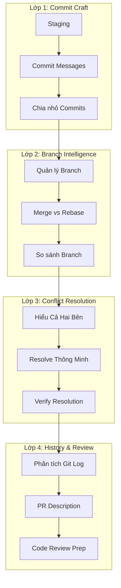

# Module 3.3: Tích Hợp Git

> **Thời gian học**: ~30 phút
>
> **Yêu cầu trước**: Module 3.2 (Viết & Sửa Code)
>
> **Kết quả**: Sau module này, bạn sẽ biết dùng Claude Code để streamline toàn bộ Git workflow — từ viết commit message đến resolve merge conflict, review diff, và quản lý branch thông minh.

---

## 1. WHY — Tại Sao Cần Học?

Bạn vừa hoàn thành session code 2 tiếng với Claude Code. Thay đổi trải qua 15 file. Feature mới, bug fix, refactor, update test. Giờ đến phần mà nhiều developer ngại nhất: git workflow. Stage đúng file. Viết commit message có nghĩa. Xử lý merge conflict từ branch của đồng nghiệp. Chuẩn bị PR sạch sẽ.

Đa số developer chọn một trong hai con đường: nhồi tất cả vào một commit ("fix stuff và thêm feature") hoặc mất 30 phút viết git history bằng tay. Cả hai đều không tốt. Claude Code xử lý được toàn bộ git workflow — viết commit message chính xác, chia thay đổi thành commit logic, resolve merge conflict với full code context — nếu bạn biết cách chỉ dẫn.

**Thực tế Việt Nam**: Team outsource thường maintain nhiều project client cùng lúc. Merge conflict là "cơm bữa" mỗi thứ Sáu khi 8 developer cùng merge feature branch vào develop.

---

## 2. CONCEPT — Khái Niệm Cốt Lõi

### Claude Code Như Git Co-pilot

Claude Code không chỉ generate commit message từ template. Nó hiểu CÁI GÌ thay đổi và TẠI SAO vì có code context của bạn. Khi bạn hỏi commit message, Claude đọc actual diff, hiểu mục đích mỗi thay đổi, và viết message mà future developer (kể cả bạn) sẽ cảm ơn.

### 4 Lớp Git Workflow



### Atomic Commits Với AI

Changeset lớn khó review và khó revert. Claude Code phân tích thay đổi và gợi ý cách chia thành commit atomic — mỗi commit có mục đích rõ ràng. "Add payment validation" là một commit. "Refactor error handling" là commit khác. "Update tests" là commit thứ ba.

### Convention Enforcement

Thêm commit format vào CLAUDE.md:

```markdown
## Git Conventions
- Dùng Conventional Commits: feat:, fix:, chore:, docs:, refactor:
- Format: <type>(<scope>): <description>
- Ví dụ: feat(payment): thêm Stripe webhook handler
```

Giờ mọi commit message Claude generate sẽ theo chuẩn team.

**Ví von**: Git workflow không có Claude Code giống giao thông Sài Gòn giờ cao điểm — ai cũng merge theo kiểu của mình, conflict khắp nơi. Có Claude Code giống có đèn giao thông thông minh — mọi thứ flow theo trật tự.

---

## 3. DEMO — Làm Mẫu Từng Bước

**Kịch bản**: Bạn đang làm feature branch `feature/payment-processing`. Đã thêm payment validation, refactor error handling, update config, và thêm test. Giờ commit và chuẩn bị PR.

---

### Bước 1: Review thay đổi

```
Tôi đã thay đổi những file nào? Tóm tắt mỗi thay đổi làm gì.
```

Expected output:
```
File đã thay đổi (7):

1. src/payment/validator.ts
   - Thêm credit card validation dùng Luhn algorithm
   - Thêm expiry date validation

2. src/payment/processor.ts
   - Refactor error handling sang Result type
   - Tách retry logic thành function riêng

3. src/payment/types.ts
   - Thêm PaymentError enum
   - Thêm ValidationResult interface

4. src/config/payment.ts
   - Thêm Stripe API configuration
   - Thêm retry limits và timeout settings

5. tests/payment/validator.test.ts
   - Thêm 12 test case cho card validation

6. tests/payment/processor.test.ts
   - Update test cho Result type error handling mới

7. package.json
   - Thêm stripe dependency
```

---

### Bước 2: Chia thành commit logic

```
Giúp tôi chia các thay đổi này thành các commit logic. Group related changes lại.
```

Expected output:
```
Đề xuất cấu trúc commit:

Commit 1: Add payment validation
- src/payment/validator.ts
- src/payment/types.ts (ValidationResult interface)
- tests/payment/validator.test.ts

Commit 2: Refactor payment processor error handling
- src/payment/processor.ts
- src/payment/types.ts (PaymentError enum)
- tests/payment/processor.test.ts

Commit 3: Add Stripe configuration
- src/config/payment.ts
- package.json

Bạn muốn tôi stage và commit từng group không?
```

---

### Bước 3: Generate commit message

Sau khi stage nhóm đầu tiên:
```bash
$ git add src/payment/validator.ts src/payment/types.ts tests/payment/validator.test.ts
```

Hỏi Claude:
```
Viết commit message cho staged changes. Dùng format Conventional Commits.
```

Expected output:
```
feat(payment): add credit card validation với Luhn algorithm

- Implement card number validation dùng Luhn checksum
- Add expiry date validation với future date check
- Add CVV format validation (3-4 digits)
- Tạo ValidationResult type cho structured error reporting
- Add 12 test case covering valid/invalid card scenarios

Refs: PAY-123
```

---

### Bước 4: Xử lý merge conflict

Sau khi pull, có conflict:
```bash
$ git merge origin/develop
CONFLICT (content): Merge conflict in src/payment/processor.ts
```

Hỏi Claude:
```
Tôi có merge conflict ở src/payment/processor.ts. Show cả hai bên và giúp resolve. Giữ Result type error handling mới của tôi nhưng integrate PaymentGateway interface cập nhật từ họ.
```

Expected output:
```
Phân tích conflict:

BÊN MÌNH (feature/payment-processing):
- Dùng Result<PaymentResult, PaymentError> return type
- Có retry logic đã tách thành retryWithBackoff()

BÊN HỌ (develop):
- Update PaymentGateway interface với timeout parameter mới
- Thêm gateway.setConfig() call trong initialization

Chiến lược resolve:
Giữ Result type pattern CỦA MÌNH VÀ integrate interface update CỦA HỌ.

[Show resolved code merge cả hai changes]

Chạy test verify: npm test src/payment/
```

---

### Bước 5: Pre-push review

```
Review tất cả commit trên branch này so với main. History có clean không? Commit nào nên squash?
```

Expected output:
```
Branch: feature/payment-processing (3 commits ahead of main)

Commit history:
1. feat(payment): add credit card validation với Luhn algorithm
2. refactor(payment): migrate processor sang Result type error handling
3. chore(payment): add Stripe configuration và dependency

Đánh giá:
✅ Mỗi commit atomic và focused
✅ Commit message theo Conventional Commits
✅ Progression hợp lý: validation → error handling → config
✅ Không có fixup commit hay WIP commit cần squash

Sẵn sàng cho PR.
```

---

### Bước 6: Generate PR description

```
Viết PR description cho branch này. Gồm: summary, changes breakdown, testing đã làm, và deployment notes.
```

Expected output:
```markdown
## Tóm tắt
Thêm payment processing foundation với credit card validation, improved error handling, và Stripe integration.

## Thay đổi
- **Validation**: Luhn algorithm cho card numbers, expiry date validation, CVV format check
- **Error Handling**: Migrate sang Result type pattern cho type-safe error handling
- **Configuration**: Thêm Stripe API config với retry và timeout settings

## Testing
- 12 unit test mới cho card validation (100% coverage)
- Update processor tests cho Result type
- Manual testing với Stripe test cards

## Deployment Notes
- Cần STRIPE_API_KEY environment variable
- Không có database migration
- Backwards compatible — không có breaking changes

## Checklist
- [x] Tests pass
- [x] Linting pass
- [x] Documentation updated
```

---

## 4. PRACTICE — Tự Thực Hành

### Bài Tập 1: Commit Surgeon

**Mục tiêu**: Chia changeset lớn thành clean atomic commits.

**Hướng dẫn**:
1. Thay đổi 5+ file trong project bất kỳ (add feature, fix bug, update test)
2. Khởi động Claude Code: `$ claude`
3. Bảo Claude phân tích thay đổi
4. Bảo Claude chia thành 3+ commit logic
5. Generate Conventional Commits message cho mỗi commit
6. Chạy `git log --oneline` — history có kể một câu chuyện không?

<details>
<summary>💡 Gợi ý</summary>

Hỏi Claude: "Group các thay đổi này theo mục đích, không theo file. Có bao nhiêu unit of work riêng biệt?"

</details>

<details>
<summary>✅ Đáp án</summary>

**Chuỗi prompt hiệu quả**:

1. `git status` — xem tất cả file đã thay đổi
2. Hỏi: "Phân tích thay đổi và group theo mục đích thành atomic commits"
3. Với mỗi group, stage chỉ những file đó: `git add [specific files]`
4. Hỏi: "Viết Conventional Commits message cho staged changes này"
5. Commit: `git commit -m "[message]"`
6. Lặp lại cho mỗi group
7. Verify: `git log --oneline -5`

**Tiêu chí thành công**: Mỗi commit có thể revert độc lập mà không break các commit khác.

</details>

---

### Bài Tập 2: Conflict Commander

**Mục tiêu**: Resolve merge conflict thông minh dùng Claude Code.

**Hướng dẫn**:
1. Tạo test branch: `git checkout -b conflict-test`
2. Sửa một function trong file bất kỳ, commit
3. Checkout main/develop, sửa CÙNG function khác đi, commit
4. Merge conflict-test vào branch hiện tại: `git merge conflict-test`
5. Dùng Claude Code để hiểu cả hai bên và resolve

<details>
<summary>💡 Gợi ý</summary>

Cụ thể hóa: "Giữ algorithm từ bên mình nhưng dùng function signature từ bên họ."

</details>

<details>
<summary>✅ Đáp án</summary>

**Chuỗi resolve conflict**:

1. `git merge conflict-test` — trigger conflict
2. Hỏi Claude: "Show merge conflict trong [file]. Giải thích mỗi bên thay đổi gì."
3. Chỉ định ý định: "Resolve bằng cách giữ [X] của mình nhưng dùng [Y] của họ"
4. Review resolution của Claude
5. Test: `npm test` hoặc compile
6. Stage: `git add [file]`
7. Commit: `git commit` (dùng auto-generated merge commit message)

**Tiêu chí thành công**: Cả hai intended changes được preserved, code compile, tests pass.

</details>

---

## 5. CHEAT SHEET

| Prompt | Chức năng | Khi nào dùng |
|--------|-----------|--------------|
| `Tôi đã thay đổi file nào? Tóm tắt mỗi thay đổi.` | Phân tích diff hiện tại | Trước khi commit |
| `Chia các thay đổi này thành commit atomic logic` | Group changes theo mục đích | Changeset lớn |
| `Viết Conventional Commits message cho staged changes` | Generate commit message | Sau khi stage |
| `Show merge conflict trong [file]. Giải thích cả hai bên.` | Phân tích conflict | Sau khi merge fail |
| `Resolve conflict: giữ X của mình, integrate Y của họ` | Intelligent merge | Trong lúc resolve |
| `Review commits trên branch này vs main` | Phân tích history | Trước PR |
| `Viết PR description cho branch này` | Generate PR summary | Trước khi submit PR |
| `Nếu rebase lên main thì sẽ xảy ra gì?` | Preview rebase | Trước khi rebase |
| `Cần undo commit cuối nhưng giữ changes` | Soft reset guidance | Sau commit sai |
| `Cần thêm gì vào .gitignore cho [framework]?` | Gợi ý ignore file | Setup project |
| `Show commits đã touch [file] trong tháng qua` | File history | Debug/archaeology |
| `Squash 3 commit cuối với message mới` | Cleanup history | Trước PR |

---

## 6. PITFALLS — Sai Lầm Cần Tránh

| ❌ Sai lầm | ✅ Cách đúng |
|-----------|-------------|
| Để Claude commit mà không review message | Luôn đọc message được generate trước khi confirm |
| Một commit khổng lồ cho tất cả thay đổi | Bảo Claude chia thành atomic commits theo mục đích |
| "Fix merge conflict" không có hướng dẫn | Chỉ rõ: "Giữ X của mình nhưng integrate Y của họ" |
| Chấp nhận conflict resolution mù quáng | Luôn compile và chạy test sau khi resolve |
| Không encode convention vào CLAUDE.md | Thêm commit format của team: `feat:`, `fix:`, etc. |
| Force push mà không hiểu | Hỏi Claude giải thích trước khi chạy lệnh destructive |
| Bỏ qua bước review diff | Luôn bảo Claude review changes trước khi commit |
| Commit generated code mà không test | Chạy test giữa staging và committing |

**Sai lầm #1 ở Việt Nam**: Vì deadline gấp, commit bừa "wip", "fix", "update" — kết quả là không ai hiểu history, debug mất gấp đôi thời gian.

---

## 7. REAL CASE — Tình Huống Thực Tế

**Bối cảnh**: Một công ty outsourcing ở Đà Nẵng maintain 3 project client cùng lúc. 8 developer làm việc trên feature branch suốt tuần. Mỗi thứ Sáu là "merge hell" — 3-4 tiếng resolve conflict thủ công, commit message lộn xộn ("fix", "update", "wip"), và PR mất mãi mới review xong.

**Trước Claude Code**:
- Commit message: "fix bug", "update", "wip", "asdf"
- Merge conflict: resolve từng dòng thủ công mà không hiểu context
- PR description: copy-paste từ Jira ticket
- Thứ Sáu merge: 3-4 tiếng, thường cần senior dev can thiệp

**Sau khi adopt Claude Code Git workflow**:
1. **Trong tuần**: Mỗi developer dùng Claude Code viết Conventional Commits. Message rõ ràng: `fix(auth): prevent session timeout during OAuth flow`
2. **Trước merge**: Claude Code review branch vs develop, flag file có khả năng conflict
3. **Khi conflict**: Claude resolve với full context — biết changes nào là bug fix vs feature
4. **PR generation**: Auto-generate description với change summary chính xác

**Kết quả**:
- **Merge thứ Sáu**: 3-4 tiếng → 45 phút
- **PR review time**: Giảm 60% (reviewer hiểu changes nhanh hơn)
- **Onboarding**: Developer mới hiểu project history mà không cần hỏi senior
- **Rollback**: Atomic commits làm việc revert specific changes trở nên trivial

**Quote từ Team Lead**: "Git log của team từng như tiểu thuyết trinh thám — ai cũng chết mà không ai biết tại sao. Giờ nó đọc như documentation."

**Thực tế Việt Nam**: Đây là workflow thực tế mà FPT Software, TMA Solutions, Rikkeisoft có thể áp dụng ngay. Merge conflict không còn là nỗi sợ thứ Sáu.

---

> **Tiếp theo**: [Module 3.4: Terminal & Shell Operations](../04-terminal-shell/) →
