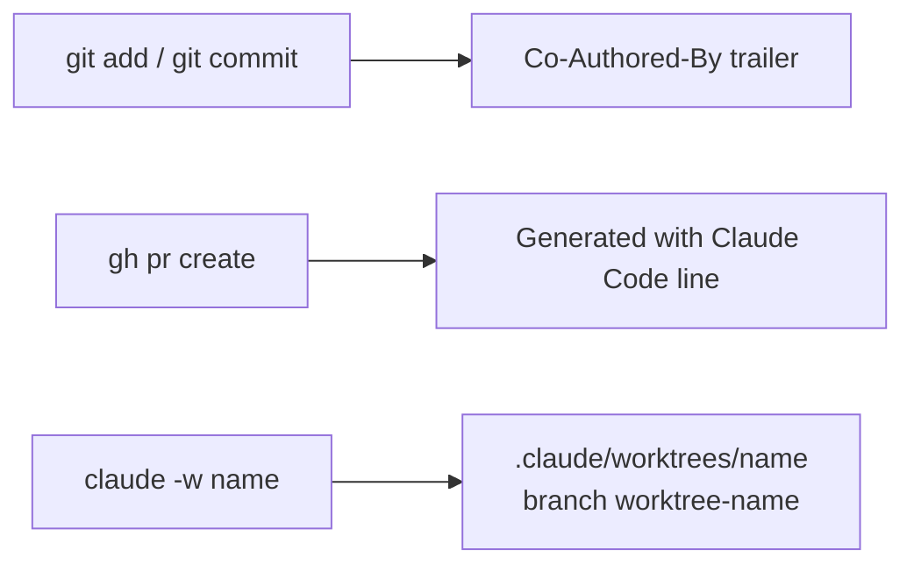

# Module 3.3: Tích Hợp Git

> **Thời gian học**: ~30 phút
>
> **Yêu cầu trước**: Module 3.2 (Viết & Sửa Code)
>
> **Kết quả**: Sau module này, bạn sẽ biết cách để Claude Code tự commit và tự mở pull request với
> attribution đúng, tìm PR review comment mà không cần `/pr-comments`, và chạy branch song song
> trong worktree cách ly.

---

## 1. WHY — Tại Sao Cần Học?

Bạn vừa hoàn thành session code 2 tiếng với Claude Code. Thay đổi trải qua 7 file. Giờ đến phần mà
nhiều developer ngại nhất: stage đúng file, viết commit message không phải kiểu "fix stuff", và
mở PR sạch sẽ. Đa số chọn nhồi tất cả vào một commit hoặc mất 30 phút viết git history bằng tay.

Claude Code không chỉ soạn message để bạn paste — nó tự chạy `git commit` và `gh pr create`, gắn
nhãn ai thật sự viết ra commit đó, và mở worktree để branch thứ hai không đụng checkout chính.
Module này cho xem cơ chế thật, không phải lý thuyết.

**Thực tế Việt Nam**: Team outsource thường maintain nhiều project client. Merge conflict là "cơm
bữa" mỗi thứ Sáu khi 8 developer cùng merge feature branch vào develop.

---

## 2. CONCEPT — Khái Niệm Cốt Lõi

### Claude tự commit và tự mở PR

Hỏi thẳng — `create a pr for my changes` — Claude soạn summary, chạy `gh pr create` (hoặc
`glab mr create` trên GitLab), và in ra URL. Claude Code sau đó link session với PR đó, nên
`claude --from-pr 1234` mở lại session picker đã filter theo PR này.


```mermaid
graph LR
    A[git add / git commit] --> B[Co-Authored-By trailer]
    C[gh pr create] --> D["Generated with Claude Code" line]
    E[claude -w name] --> F[.claude/worktrees/name<br/>branch worktree-name]
```

### Attribution là default, không phải Claude bịa

Mỗi commit Claude tạo có trailer; mỗi PR có footer. Cả hai đều là **default có thể đổi**, không
phải Claude tự nghĩ ra mỗi lần:

- Commit trailer: `Co-Authored-By: <model> <noreply@anthropic.com>` — "tên là model đang chạy khi
  commit được tạo, ví dụ `Claude Sonnet 5`."
- PR footer: `🤖 Generated with [Claude Code](https://claude.com/claude-code)`.
- `attribution.commit` / `attribution.pr` trong settings override từng dòng; `attribution: false`
  (v2.1.281+) ẩn cả hai. `includeCoAuthoredBy` đã **deprecated từ v2.0.62** — vẫn được tôn trọng
  tới khi bạn set `attribution.commit` hoặc `attribution.pr`, sau đó bị bỏ qua.

Claude Code nói với Claude rằng chỉ dẫn của bạn trong CLAUDE.md hoặc memory về attribution có ưu
tiên cao hơn — **trừ khi** admin đã fix cứng trong managed settings. Đây là quy tắc chung cho mọi
convention trong CLAUDE.md: advisory (gợi ý), không enforced (bắt buộc). Rule cần đúng 100% mọi
lần phải nằm trong hook hoặc managed settings (Module 2.2), không phải prose.

### Atomic commit, qua prompt

Changeset lớn khó review và khó revert. Bảo Claude chia diff thành commit atomic — "add payment
validation" là một, "refactor error handling" là commit khác. Encode format của team một lần, mọi
message generate sau đó theo đúng chuẩn:

```markdown
## Git Conventions
- Conventional Commits: feat:, fix:, chore:, docs:, refactor:
- Format: <type>(<scope>): <description>
```

### Tìm PR comment mà không cần `/pr-comments`

`/pr-comments` đã **bị xóa từ v2.1.91**. Hỏi Claude trực tiếp thay vào đó — "reviewer nói gì trên
PR 42" — hoặc mở lại session đã link bằng `claude --from-pr 42`, nhận cả PR number lẫn URL đầy đủ
của GitHub/GitLab/Bitbucket.

### Worktree cho branch song song

`claude --worktree <name>` (hoặc `-w`) tạo checkout cách ly tại `.claude/worktrees/<name>/` trên
branch mới `worktree-<name>`, chia sẻ history với repo chính. Cần **ít nhất một commit** để resolve
base branch — repo trống fail với `Failed to resolve base branch "HEAD": git rev-parse failed`.
File `.worktreeinclude` (cú pháp gitignore) copy file gitignored như `.env` vào mỗi worktree mới tự
động. Dùng `/install-github-app` (Module 11.4) khi muốn Claude phản hồi mention `@claude` trên PR
thật, không chỉ chạy local.

---

## 3. DEMO — Làm Mẫu Từng Bước

### Bước 1: Nhờ Claude commit giúp bạn

```bash
# docs: en/common-workflows — "create a pr for my changes"
claude -p "Stage src/math.js and commit it with a conventional commit message." \
  --permission-mode acceptEdits \
  --allowedTools "Bash(git add:*),Bash(git commit:*),Bash(git status:*),Bash(git diff:*)"
```

```text
# Output may vary
I committed `src/math.js` as `2967e45`:

fix(math): throw on division by zero

The change makes `divide(a, b)` throw `Error('divide by zero')` when `b === 0` instead of
returning `Infinity` or `NaN`.
```

### Bước 2: Check trailer Claude thật sự viết

```bash
git log -1
```

```text
# Output may vary
commit 2967e45db706822654d3dfa844ba81f61b8d082e
Author: … <…>
Date:   Sun Sep 27 23:48:05 2026 +0700

    fix(math): throw on division by zero

    Co-Authored-By: Claude Opus 5.5 <noreply@anthropic.com>
```

Tên khớp với model đang chạy session — nếu bạn dùng Sonnet thì trailer sẽ là `Claude Sonnet 5`.

### Bước 3: Nhờ tạo PR (không cần repo thật để thấy pattern)

```bash
# docs: en/common-workflows — Claude links the session when it runs gh pr create/glab mr create
claude -p "Summarize my changes, then create a pr." --permission-mode acceptEdits
```

Không có remote đã push, `gh pr create` — kể cả với flag `--dry-run` thật (verify bằng
`gh pr create --help`) — sẽ từ chối với `no git remotes found`. Trên repo thật, bạn sẽ nhận URL
PR, và `claude --from-pr <number>` mở lại session này về sau.

### Bước 4: Mở worktree cách ly, non-interactive

```bash
# docs: en/worktrees — non-interactive runs with -p skip the trust check
claude -p --worktree fix-divide "What is your current working directory? Just the path." \
  --permission-mode acceptEdits
```

```text
# Output may vary
`/Users/you/cc-lab/.claude/worktrees/fix-divide`
```

```bash
git worktree list
```

```text
# Output may vary
/Users/you/cc-lab                              2967e45 [main]
/Users/you/cc-lab/.claude/worktrees/fix-divide  2967e45 [worktree-fix-divide] locked
```

### Bước 5: Dọn dẹp — session `-p` không có exit prompt, worktree vẫn bị locked tới khi bạn xóa

```bash
# docs: en/worktrees — "To remove one, run git worktree remove"
git worktree unlock .claude/worktrees/fix-divide
git worktree remove .claude/worktrees/fix-divide
git branch -D worktree-fix-divide
```

---

## 4. PRACTICE — Tự Thực Hành

### Bài Tập 1: Commit Surgeon

**Mục tiêu**: Chia changeset lớn thành commit atomic sạch, attribution đúng.

**Hướng dẫn**:
1. Thay đổi 3+ file trong repo thử nghiệm.
2. Hỏi Claude: "Group các thay đổi theo mục đích, rồi stage và commit từng group với Conventional
   Commits message."
3. Chạy `git log --oneline -5` và `git log -1 --format=%B` trên commit cuối.

**Kết quả mong đợi**: Mỗi unit logic một commit, mỗi commit có trailer `Co-Authored-By`.

<details>
<summary>💡 Gợi ý</summary>

Hỏi kế hoạch trước ("có bao nhiêu unit of work riêng biệt ở đây?") trước khi bảo Claude stage và
commit — review cách chia không tốn gì cả và bắt lỗi group sai sớm.

</details>

<details>
<summary>✅ Đáp án</summary>

1. `git status` — xem tất cả file đã đổi.
2. Hỏi: "Phân tích thay đổi và group theo mục đích thành atomic commit."
3. Với mỗi group: "Stage và commit với Conventional Commits message."
4. Verify: `git log --oneline -5`, rồi `git log -1 --format=%B` để check trailer.

**Tiêu chí thành công**: mỗi commit revert độc lập được; commit nào cũng có trailer attribution,
không phải co-author viết tay.

</details>

---

### Bài Tập 2: Tìm PR Comment Kiểu Mới

**Mục tiêu**: Luyện tập cách thay thế `/pr-comments` trên một PR thật bạn có quyền truy cập.

**Hướng dẫn**:
1. Chọn một PR number mở mà bạn `gh pr view` được local.
2. Hỏi Claude: "Reviewer nói gì trên PR &lt;number&gt;?"
3. Chạy `claude --from-pr <number>` ở terminal thứ hai.

**Kết quả mong đợi**: Claude trả lời từ `gh pr view --comments` hoặc tương đương, và `--from-pr`
mở session picker đã filter theo PR đó.

<details>
<summary>💡 Gợi ý</summary>

Nếu Claude chưa từng làm việc trên PR đó, `--from-pr` không tìm thấy gì để filter — bình thường.

</details>

<details>
<summary>✅ Đáp án</summary>

Claude đọc comment qua `gh`/`glab`, cùng CLI đã dùng để mở PR — không có API comment riêng.
`--from-pr` chỉ show session Claude Code đã link với PR đó từ trước.

</details>

---

## 5. CHEAT SHEET

| Command / Prompt | Chức năng |
|---|---|
| `create a pr for my changes` | Claude chạy `gh pr create` / `glab mr create` |
| `claude --from-pr <n>` | Mở lại session đã link với PR/MR `<n>` |
| `reviewer nói gì trên PR <n>` | Thay thế `/pr-comments` đã bị xóa |
| `claude --worktree <name>` / `-w` | Checkout cách ly tại `.claude/worktrees/<name>/` |
| `.worktreeinclude` | Copy file gitignored (`.env`) vào worktree mới |
| `attribution.commit` / `attribution.pr` | Đổi hoặc để rỗng dòng commit/PR |
| `attribution: false` | Ẩn toàn bộ attribution (v2.1.281+) |
| `git reset --soft HEAD~N` + nhờ Claude soạn message | Squash không cần editor interactive |
| `git worktree remove` / `git worktree unlock` | Dọn worktree tạo bởi session `-p` |

---

## 6. PITFALLS — Sai Lầm Cần Tránh

| ❌ Sai lầm | ✅ Cách đúng |
|---|---|
| Để Claude commit mà không đọc message | Luôn đọc message được generate trước prompt tiếp theo |
| Nghĩ commit convention trong CLAUDE.md được enforce | Nó chỉ advisory; rule cứng đặt vào hook hoặc managed settings |
| Bảo Claude `git rebase -i` để squash | Interactive rebase cần editor Claude không điều khiển được — dùng `git reset --soft HEAD~N` rồi nhờ Claude viết một message |
| Mong `/pr-comments` vẫn hoạt động | Đã xóa từ v2.1.91 — hỏi Claude trực tiếp, hoặc `claude --from-pr <n>` |
| Chạy `claude --worktree` trong repo chưa có commit nào | Tạo một commit trước, nếu không base-branch lookup sẽ fail |
| Quên rằng session `-p --worktree` để lại worktree bị locked | `git worktree unlock` rồi `git worktree remove` |
| Tin tưởng mù quáng PR "Generated with Claude Code" | Nhờ Claude highlight risk trước khi submit |

**Sai lầm #1 ở Việt Nam**: Deadline gấp, commit bừa "wip", "fix" — không ai hiểu history, debug
mất gấp đôi thời gian.

---

## 7. REAL CASE — Tình Huống Thực Tế

**Bối cảnh**: Một công ty outsourcing ở Đà Nẵng maintain 3 project client. 8 developer push feature
branch suốt tuần; thứ Sáu từng là 3-4 tiếng resolve conflict thủ công, commit kiểu "fix", "wip".

**Giải pháp**: Mỗi developer nhờ Claude stage, group, commit với Conventional Commits; trailer
`Co-Authored-By` cho biết ngay commit nào đi qua Claude. Trước merge, ai đó chạy `claude -w` để
test merge trong worktree cách ly, không đụng branch đang làm dở. PR tạo bằng
`create a pr for my changes`, rồi người thật đọc lại trước khi submit.

**Kết quả**: Merge thứ Sáu giảm từ 3-4 tiếng xuống 45 phút; review PR giảm khoảng 60% vì reviewer
tin summary generate đủ để lướt thay vì tự suy luận lại ý đồ.

**Quote từ Team Lead**: "Git log của team từng như tiểu thuyết trinh thám — ai cũng chết mà không
ai biết tại sao. Giờ nó đọc như documentation — và tôi biết ngay commit nào cần xem kỹ hơn nhờ
trailer."

**Thực tế Việt Nam**: Workflow này FPT Software, TMA Solutions, Rikkeisoft có thể áp dụng ngay.
Merge conflict không còn là nỗi sợ thứ Sáu.

---

> **Tiếp theo**: [Module 3.4: Terminal & Shell Operations](../04-terminal-shell/) →
