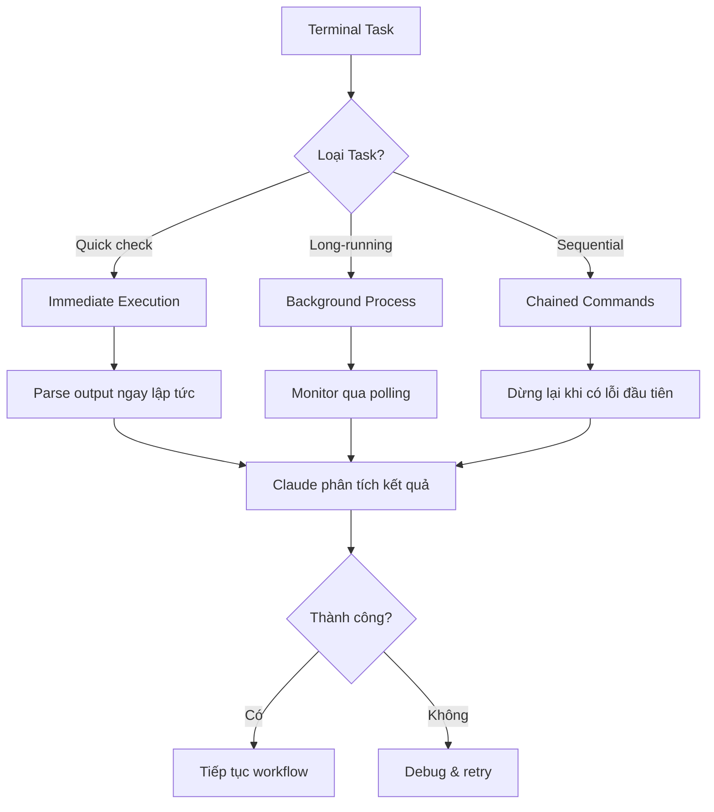

# Module 3.4: Terminal & Hoạt Động Shell

> **Thời gian ước tính**: ~30 phút
>
> **Yêu cầu trước**: Module 3.3 (Tích Hợp Git)
>
> **Kết quả**: Sau module này, bạn sẽ thực thi, giám sát và nối chuỗi các lệnh terminal thông qua Claude Code một cách thông minh

---

## 1. WHY — Tại Sao Điều Này Quan Trọng

Bạn đang deploy một microservice Node.js. Bạn cần build Docker image, chạy test trong container, push lên registry, update deployment config, và verify pod có healthy không. Đó là ít nhất 8 lệnh terminal, mỗi lệnh có output khác nhau cần parse, điều kiện lỗi khác nhau cần xử lý, một số phải chạy tuần tự còn một số có thể chạy song song.

Gõ từng lệnh thủ công, đợi từng lệnh chạy xong, copy error log, paste vào context của Claude để debug — cái này chết dần chết mòn vì phải chuyển qua chuyển lại giữa các terminal. Claude Code có thể execute command trực tiếp, parse output của chúng, detect lỗi, chain các operation một cách thông minh, thậm chí chạy các process dài hạn ở background trong khi tiếp tục làm việc khác. Bạn chỉ cần ở trong chế độ conversation. Claude xử lý phần shell.

---

## 2. CONCEPT — Các Ý Tưởng Cốt Lõi

Claude Code có **quyền truy cập terminal trực tiếp** thông qua công cụ Bash của nó. Đây không chỉ là một wrapper tiện lợi — đây là khả năng cơ bản giúp biến đổi cách bạn tương tác với môi trường development.

### Mental Model: Claude như Terminal Orchestrator

Hãy nghĩ Claude Code có ba chế độ tương tác với terminal:



### Các Khái Niệm Chính

1. **Command Execution Context**: Claude Code chạy các lệnh trong một **working directory bền vững** nhưng **trạng thái shell không bền vững**. `cd` vào một thư mục? Nó sẽ giữ nguyên. Export một biến môi trường? Nó biến mất sau khi lệnh hoàn thành. Dùng `&&` để chain các lệnh cần chia sẻ trạng thái.

2. **Output Parsing**: Claude không chỉ chạy lệnh một cách mù quáng — nó đọc stdout/stderr, phát hiện các pattern lỗi, và có thể trích xuất thông tin cụ thể (số phiên bản, đường dẫn file, số lượng test) từ output.

3. **Background vs Foreground**: Các task chạy lâu (build, test, install) nên chạy ở background. Các lệnh nhanh (status check, list file) chạy blocking. Claude tự quản lý sự khác biệt này nhưng bạn có thể override.

4. **Error Propagation**: Khi một lệnh thất bại, Claude thấy cả exit code VÀ error output. Nó có thể tự động đề xuất cách fix hoặc chạy lại với các điều chỉnh.

5. **Interactive Command Limitation**: Các lệnh yêu cầu user input (interactive prompt, nhập password, TUI interface) sẽ không hoạt động. Claude Code cần các operation non-interactive, có thể script được.

---

## 3. DEMO — Từng Bước Một

Chúng ta sẽ đi qua một tình huống thực tế: setup và test một microservice mới.

**Context**: Bạn đang bắt đầu một Express.js API service mới. Bạn cần khởi tạo nó, cài dependencies, thêm test, và verify mọi thứ hoạt động.

**Bước 1: Tạo cấu trúc project**

Hỏi Claude:
```
"Tạo một Express API project mới tên user-service với TypeScript,
cài dependencies, và show package.json cho tôi"
```

Claude sẽ execute:
```bash
mkdir -p user-service && cd user-service && npm init -y
```

Output mong đợi:
```
Wrote to /Users/you/projects/user-service/package.json:
{
  "name": "user-service",
  "version": "1.0.0",
  ...
}
```

Tại sao quan trọng: Claude dùng `&&` để chain các lệnh vì các lệnh sau phụ thuộc vào việc thư mục phải tồn tại. Execution trong một lệnh duy nhất.

---

**Bước 2: Cài dependencies ở background**

Claude tự động phát hiện đây là task chạy lâu:
```bash
npm install express typescript @types/express @types/node ts-node
```

Lệnh này chạy ở **chế độ background**. Claude tiếp tục conversation trong khi npm đang download package. Bạn sẽ thấy:
```
⏳ Running in background: npm install...
```

Tại sao quan trọng: Bạn không cần đợi npm. Claude có thể tiếp tục trả lời câu hỏi hoặc chuẩn bị các bước tiếp theo trong khi installation đang diễn ra.

---

**Bước 3: Check trạng thái installation**

Trong khi install đang chạy, hỏi Claude:
```
"Installation đã xong chưa? Show tôi các package đã cài."
```

Claude check trạng thái background task, sau đó chạy:
```bash
npm list --depth=0
```

Output mong đợi:
```
user-service@1.0.0
├── express@4.18.2
├── typescript@5.3.3
├── @types/express@4.17.21
├── @types/node@20.10.4
└── ts-node@10.9.2
```

Tại sao quan trọng: Claude có thể query trạng thái trung gian mà không block workflow.

---

**Bước 4: Tạo và chạy test**

Hỏi Claude:
```
"Tạo một test đơn giản cho endpoint /health và chạy nó với jest"
```

Claude execute nhiều lệnh theo trình tự:
```bash
npm install --save-dev jest @types/jest ts-jest && \
npx ts-jest config:init && \
npm test
```

Output mong đợi:
```
> user-service@1.0.0 test
> jest

 PASS  src/__tests__/health.test.ts
  ✓ GET /health returns 200 (15 ms)

Test Suites: 1 passed, 1 total
Tests:       1 passed, 1 total
```

Tại sao quan trọng: Các operation tuần tự với `&&` đảm bảo mỗi bước hoàn thành trước khi bước tiếp theo chạy. Nếu test fail, Claude thấy failure output ngay lập tức và có thể debug.

---

**Bước 5: Chạy development server ở background**

Hỏi Claude:
```
"Start dev server và verify nó đang respond"
```

Claude chạy:
```bash
npm run dev &
```

Sau đó verify ngay:
```bash
sleep 2 && curl http://localhost:3000/health
```

Output mong đợi:
```
{"status":"ok","timestamp":"2026-02-02T10:30:00.000Z"}
```

Tại sao quan trọng: Background process (`&`) + lệnh verification. Claude chain chúng một cách thông minh.

---

**Bước 6: Parse log để tìm lỗi**

Hỏi Claude:
```
"Check 20 dòng cuối của application log xem có lỗi không"
```

Claude chạy:
```bash
tail -n 20 logs/app.log | grep -i error
```

Output mong đợi (nếu clean):
```
(không có output = không có lỗi)
```

Tại sao quan trọng: Claude có thể parse structured output, trích xuất pattern, và hiểu "không có output" nghĩa là thành công.

---

**Bước 7: Các lệnh nhận biết môi trường**

Hỏi Claude:
```
"Build Docker image cho production"
```

Claude phát hiện context của môi trường và chạy:
```bash
docker build -t user-service:latest \
  --build-arg NODE_ENV=production \
  --build-arg BUILD_DATE=$(date -u +'%Y-%m-%dT%H:%M:%SZ') \
  .
```

Output mong đợi:
```
[+] Building 45.2s (12/12) FINISHED
 => [internal] load build definition from Dockerfile
 => => transferring dockerfile: 432B
 => [stage-1 3/5] COPY package*.json ./
 => [stage-1 4/5] RUN npm ci --only=production
 => exporting to image
 => => naming to docker.io/library/user-service:latest
```

Tại sao quan trọng: Claude xây dựng lệnh với các flag và argument phù hợp dựa trên context. Lưu ý `$(date)` subshell — Claude xử lý command substitution một cách chính xác.

---

**Bước 8: Pipeline nhiều giai đoạn**

Hỏi Claude:
```
"Chạy toàn bộ CI pipeline: lint, test, build, và verify Docker image có chạy được không"
```

Claude execute một pipeline phức tạp:
```bash
npm run lint && \
npm test && \
docker build -t user-service:test . && \
docker run --rm -d -p 3001:3000 --name user-service-test user-service:test && \
sleep 3 && \
curl http://localhost:3001/health && \
docker stop user-service-test
```

Output mong đợi (rút gọn):
```
> eslint . --ext .ts
✓ No linting errors

> jest
Tests: 5 passed, 5 total

[+] Building 12.3s (12/12) FINISHED
=> exporting to image

a3f9c8d1e0b2
{"status":"ok"}
user-service-test
```

Tại sao quan trọng: Điều này thể hiện **chained command với error handling đúng đắn**. Nếu bất kỳ bước nào fail (lint error, test failure, build error), chuỗi sẽ dừng lại. Claude biết chính xác nó fail ở đâu.

---

**Bước 9: Phục hồi lỗi**

Giả sử test fail ở bước 8. Claude thấy:
```
FAIL src/__tests__/auth.test.ts
  ✕ POST /login validates credentials (23 ms)

Expected: 200
Received: 401
```

Claude tự động:
1. Xác định test nào đang fail
2. Đọc test file
3. Đọc route handler
4. Đề xuất cách fix
5. Hỏi: "Tôi nên update auth middleware để fix cái này không?"

Tại sao quan trọng: Claude không chỉ execute — nó **giám sát, phát hiện lỗi, và khởi động quá trình debugging** mà bạn không cần copy-paste error log.

---

**Bước 10: Cleanup và verification**

Hỏi Claude:
```
"Dọn dẹp tất cả test container và verify không còn cái gì đang chạy"
```

Claude chạy:
```bash
docker ps -a --filter "name=user-service-test" --format "{{.Names}}" | \
xargs -r docker rm -f && \
docker ps --filter "name=user-service"
```

Output mong đợi:
```
user-service-test
CONTAINER ID   IMAGE   COMMAND   CREATED   STATUS   PORTS   NAMES
(empty = cleanup thành công)
```

Tại sao quan trọng: Claude có thể xây dựng pipeline phức tạp với `xargs`, filter, và format string. Nó verify cleanup bằng cách check kết quả là rỗng.

---

## 4. PRACTICE — Tự Thực Hành

### Bài Tập 1: Quản Lý Background Process
**Mục tiêu**: Luyện tập chạy các task dài hạn ở background trong khi tiếp tục làm việc

**Hướng dẫn**:
1. Tạo một thư mục Python project mới
2. Yêu cầu Claude cài dependencies từ `requirements.txt` (với ít nhất 5 package) ở background
3. Trong khi installation đang chạy, yêu cầu Claude tạo skeleton của FastAPI app
4. Verify installation đã hoàn thành thành công
5. Chạy FastAPI dev server và test endpoint `/docs`

**Kết quả mong đợi**: Bạn nên thấy Swagger UI JSON response từ `/docs` trong khi installation đã chạy ở background

<details>
<summary>💡 Gợi Ý</summary>

Dùng ngôn ngữ rõ ràng: "Cài những cái này ở background" hoặc "chạy ở background trong khi bạn...". Claude sẽ tự động phát hiện các lệnh chạy lâu như `pip install`, nhưng nói rõ ràng sẽ giúp ích hơn.

Với FastAPI dev server, lệnh là `uvicorn main:app --reload`. Bạn có thể test với `curl http://localhost:8000/docs`.

</details>

<details>
<summary>✅ Giải Pháp</summary>

**Luồng conversation**:

Bạn: "Tạo một Python project tên api-service với requirements.txt chứa fastapi, uvicorn, pydantic, sqlalchemy, và pytest. Cài dependencies ở background."

Claude chạy:
```bash
mkdir api-service && cd api-service
echo -e "fastapi\nuvicorn\npydantic\nsqlalchemy\npytest" > requirements.txt
pip install -r requirements.txt  # (chạy ở background)
```

Bạn: "Trong khi đang cài, tạo một FastAPI app cơ bản với health check endpoint"

Claude tạo `main.py` trong khi pip đang chạy ở background.

Bạn: "Pip đã xong chưa? Start dev server và test endpoint /docs"

Claude:
```bash
# Check nếu background task đã xong
ps aux | grep "pip install"  # (empty = xong)

# Start server ở background
uvicorn main:app --reload &

# Đợi startup và test
sleep 2 && curl http://localhost:8000/docs
```

Output:
```json
{"openapi":"3.1.0","info":{"title":"FastAPI","version":"0.1.0"},...}
```

</details>

---

### Bài Tập 2: Phát Hiện Lỗi và Phục Hồi
**Mục tiêu**: Luyện tập để Claude phát hiện và fix lỗi command

**Hướng dẫn**:
1. Yêu cầu Claude chạy một Docker build cố ý bị lỗi (viết sai instruction trong Dockerfile hoặc tham chiếu file không tồn tại)
2. Quan sát cách Claude phát hiện lỗi
3. Yêu cầu Claude fix nó
4. Verify build thành công

**Kết quả mong đợi**: Claude nên xác định dòng lỗi chính xác, giải thích cái gì sai, đề xuất cách fix, và chạy lại build

<details>
<summary>💡 Gợi Ý</summary>

Tạo một Dockerfile với lỗi như `FRON node:18` (viết sai FROM) hoặc `COPY nonexistent.txt /app/`. Claude sẽ thấy Docker build error output và có thể xác định syntax hoặc file issue.

</details>

<details>
<summary>✅ Giải Pháp</summary>

**Conversation**:

Bạn: "Tạo một Dockerfile cho Node app nhưng cố tình làm nó bị lỗi — tôi muốn luyện debugging"

Claude tạo:
```dockerfile
FRON node:18
WORKDIR /app
COPY package.json .
RUN npm install
```

Bạn: "Thử build cái này"

Claude chạy:
```bash
docker build -t test-app .
```

Output:
```
Error response from daemon: Dockerfile parse error line 1: unknown instruction: FRON
```

Claude phản hồi:
"Build thất bại vì dòng 1 có lỗi chính tả: `FRON` phải là `FROM`. Đây là instruction cho base image. Tôi nên fix cái này không?"

Bạn: "Ừ"

Claude fix Dockerfile và chạy lại:
```bash
docker build -t test-app .
```

Output:
```
[+] Building 8.2s (8/8) FINISHED
=> exporting to image
```

**Insight quan trọng**: Bạn không cần copy-paste lỗi. Claude thấy nó, chẩn đoán nó, và đề xuất cách fix.

</details>

---

### Bài Tập 3: Xây Dựng Pipeline Phức Tạp
**Mục tiêu**: Luyện tập xây dựng pipeline nhiều lệnh với error handling đúng đắn

**Hướng dẫn**:
1. Tạo một tình huống bạn cần: clone một repo, checkout một branch cụ thể, cài dependencies, chạy test, và tạo coverage report
2. Yêu cầu Claude làm điều này trong **một chuỗi lệnh duy nhất** dừng lại khi có lỗi đầu tiên
3. Cố tình tạo một lỗi (ví dụ: branch không tồn tại) và quan sát Claude xử lý nó như thế nào
4. Fix issue và chạy lại

**Kết quả mong đợi**: Một pipeline được xây dựng đúng cách dùng `&&`, xác định lỗi rõ ràng khi một bước fail, và hoàn thành thành công sau khi fix

<details>
<summary>💡 Gợi Ý</summary>

Dùng `&&` để chain lệnh. Chuỗi sẽ dừng lại ở lệnh thất bại đầu tiên. Ví dụ:
```bash
git clone URL && cd repo && git checkout branch && npm install && npm test && npm run coverage
```

Nếu `git checkout branch` fail (branch không tồn tại), chuỗi sẽ dừng ở đó. Claude sẽ thấy lỗi "branch not found".

</details>

<details>
<summary>✅ Giải Pháp</summary>

Bạn: "Clone repo https://github.com/example/demo-api, checkout branch 'feature/auth', cài dependencies, chạy test, và tạo coverage. Làm cái này trong một chuỗi lệnh."

Claude chạy:
```bash
git clone https://github.com/example/demo-api && \
cd demo-api && \
git checkout feature/auth && \
npm install && \
npm test && \
npm run coverage
```

Nếu branch không tồn tại, output hiển thị:
```
Cloning into 'demo-api'...
error: pathspec 'feature/auth' did not match any file(s) known to git
```

Claude phản hồi:
"Checkout thất bại vì branch 'feature/auth' không tồn tại. Để tôi check các branch có sẵn."

Claude chạy:
```bash
cd demo-api && git branch -r
```

Output:
```
origin/main
origin/develop
origin/feature/authentication
```

Claude: "Branch có tên là 'feature/authentication', không phải 'feature/auth'. Tôi nên chạy lại với tên branch đúng không?"

Bạn: "Ừ"

Claude chạy lại toàn bộ chuỗi với tên branch đúng. Tất cả các bước hoàn thành thành công.

</details>

---

## 5. CHEAT SHEET

| Task | Command Pattern | Ghi Chú |
|------|----------------|---------|
| **Sequential command** | `cmd1 && cmd2 && cmd3` | Dừng lại khi có lỗi đầu tiên |
| **Background process** | `cmd &` | Trả về ngay lập tức |
| **Background với verification** | `cmd & sleep 2 && verify-cmd` | Đợi rồi check |
| **Conditional execution** | `cmd1 \|\| cmd2` | Chạy cmd2 nếu cmd1 fail |
| **Ignore error** | `cmd1 ; cmd2` | Luôn chạy cmd2 |
| **Capture output** | `result=$(cmd)` | Dùng trong các lệnh khác |
| **Suppress output** | `cmd > /dev/null 2>&1` | Execute im lặng |
| **Check exit code** | `cmd && echo "success" \|\| echo "fail"` | Success/fail rõ ràng |
| **Timeout command** | `timeout 30s cmd` | Kill sau 30 giây |
| **Retry on failure** | `cmd \|\| cmd \|\| cmd` | Thử 3 lần |
| **Parse JSON output** | `cmd \| jq '.key'` | Trích xuất JSON field |
| **Filter log** | `tail -n 100 log \| grep ERROR` | Tìm lỗi trong log |
| **Count result** | `cmd \| wc -l` | Đếm số dòng output |
| **Multi-line command** | `cmd1 && \`<br>`cmd2 && \`<br>`cmd3` | Chain dễ đọc |
| **Environment variable** | `VAR=value cmd` | Set cho một lệnh duy nhất |
| **Shared env state** | `export VAR=value && cmd` | Persist trong chain |
| **Check process running** | `ps aux \| grep process-name` | Tìm process đang chạy |
| **Kill background task** | `pkill -f process-name` | Dừng theo tên |
| **Docker cleanup** | `docker ps -aq \| xargs docker rm -f` | Xóa tất cả container |
| **Port check** | `lsof -i :3000` | Xem cái gì đang ở port 3000 |

**Tham Chiếu Nhanh Các Operator**:
- `&&` = AND (chạy tiếp chỉ khi lệnh trước thành công)
- `||` = OR (chạy tiếp chỉ khi lệnh trước thất bại)
- `;` = SEQUENCE (luôn chạy tiếp, bỏ qua exit code trước)
- `&` = BACKGROUND (chạy ở background, trả về ngay)
- `|` = PIPE (gửi output của cmd1 vào input của cmd2)

---

## 6. PITFALLS — Các Lỗi Thường Gặp

| ❌ Lỗi | ✅ Cách Đúng |
|---|---|
| Dùng `cd` một mình và mong nó persist cho lệnh tiếp theo | Chain với `&&`: `cd dir && npm install` |
| Chạy build/install dài hạn ở foreground, block conversation | Yêu cầu background rõ ràng: "cài ở background" |
| Thử chạy interactive command (`vim`, `top`, `npm init` không có `-y`) | Dùng alternative non-interactive: `npm init -y`, `echo "text" > file` |
| Giả định biến môi trường persist giữa các lệnh | Dùng `export VAR=value && cmd1 && cmd2` để chia sẻ state |
| Không check xem background process đã xong chưa trước bước tiếp | Hỏi Claude: "Build đã xong chưa?" hoặc dùng lệnh `wait` |
| Chain với `;` khi bạn cần detect lỗi | Dùng `&&` để dừng lại khi có lỗi đầu tiên |
| Quên cleanup background process | Yêu cầu Claude dừng/kill process khi xong |
| Không quote đường dẫn có khoảng trắng | Luôn quote: `cd "/path/with spaces"` |
| Dùng lệnh `sudo` mà không setup permission | Claude không thể nhập password; config passwordless sudo hoặc dùng Docker |
| Chạy lệnh yêu cầu GUI | Dùng alternative headless/CLI: `chrome` → `curl`, git GUI → git CLI |
| Mong đợi streaming output thời gian thực từ lệnh dài | Claude thấy output sau khi lệnh hoàn thành; dùng periodic check cho task dài |
| Không chỉ định timeout cho lệnh có thể bị treo | Dùng wrapper `timeout`: `timeout 60s long-running-cmd` |

**Trường Hợp Đặc Biệt — Docker Compose**:

❌ Sai:
```bash
docker-compose up
# Cái này block mãi mãi
```

✅ Đúng:
```bash
docker-compose up -d  # Detached mode
sleep 3
docker-compose ps     # Verify container đã start
```

**Trường Hợp Đặc Biệt — npm/yarn Script**:

❌ Sai:
```bash
npm run dev
# Block ở foreground
```

✅ Đúng:
```bash
npm run dev &        # Background
sleep 2
curl http://localhost:3000  # Verify đang chạy
```

---

## 7. REAL CASE — Câu Chuyện Production

**Tình huống**: Deploy một bản cập nhật microservice lên Kubernetes staging cluster lúc 2 giờ sáng (cửa sổ deploy production). Deployment yêu cầu build Docker image mới, chạy smoke test trong temp container, push lên registry, update K8s deployment, và verify pod health. Bình thường việc này mất 15 phút làm thủ công trên terminal.

**Vấn đề**: Trong quá trình deploy, smoke test thất bại với một lỗi khó hiểu:
```
Error: connect ECONNREFUSED 10.0.0.45:5432
```

Developer (làm việc một mình lúc 2 giờ sáng) cần:
1. Xác định service nào không thể kết nối (database connection)
2. Check xem database pod có đang chạy không
3. Verify network policy
4. Check service DNS resolution
5. Kiểm tra các config change gần đây

Bình thường việc này đòi hỏi phải chuyển qua chuyển lại giữa terminal, kubectl command, log file, và Slack/Notion để check deployment doc.

**Giải pháp**: Developer dùng Claude Code để orchestrate toàn bộ quá trình debug:

**Conversation**:

Dev: "Smoke test fail với ECONNREFUSED tới 10.0.0.45:5432. Debug cái này."

Claude tự động execute:
```bash
# Check xem database pod có đang chạy không
kubectl get pods -l app=postgres -n staging

# Check service endpoint
kubectl get endpoints postgres-service -n staging

# Check network policy
kubectl get networkpolicies -n staging

# Test DNS resolution từ app pod
kubectl exec -it $(kubectl get pod -l app=user-service -n staging -o jsonpath='{.items[0].metadata.name}') \
  -- nslookup postgres-service

# Check config change gần đây
kubectl rollout history deployment/user-service -n staging
```

Output tiết lộ:
```
NAME                        READY   STATUS    RESTARTS   AGE
postgres-6d8f9c4b5b-7x2n4   0/1     Pending   0          45s
```

Claude: "Database pod đang ở trạng thái Pending. Để tôi check tại sao."

```bash
kubectl describe pod postgres-6d8f9c4b5b-7x2n4 -n staging | grep -A 5 Events
```

Output:
```
Events:
  Warning  FailedScheduling  30s   default-scheduler  0/3 nodes available:
  insufficient memory.
```

Claude: "Database pod không thể schedule vì thiếu memory. Các deployment gần đây có thể đã tăng memory usage. Để tôi check resource request."

```bash
kubectl top nodes
kubectl get pods -n staging -o jsonpath='{range .items[*]}{.metadata.name}{"\t"}{.spec.containers[*].resources.requests.memory}{"\n"}{end}'
```

Claude xác định rằng một deployment gần đây đã tăng memory request, không còn chỗ cho database pod.

**Kết quả**: Claude xây dựng một pipeline chẩn đoán hoàn chỉnh, execute 8 kubectl command khác nhau, parse output, tương quan thông tin giữa các lệnh, và xác định nguyên nhân gốc rễ trong **dưới 2 phút**. Developer không cần nhớ kubectl syntax, grep pattern, hoặc jsonpath query. Họ chỉ cần ở trong ngôn ngữ tự nhiên, hỏi các câu hỏi follow-up khi Claude cung cấp thông tin.

Cách fix: tạm thời giảm memory request cho một service không quan trọng, để database pod schedule, hoàn thành deployment, sau đó cân bằng lại resource. Tổng thời gian deploy: 12 phút thay vì 15 phút thông thường, mặc dù gặp phải issue nghiêm trọng. Nếu không có Claude Code, việc debug một mình sẽ mất 30+ phút làm thủ công với kubectl/grep/jq.

**Bài Học Quan Trọng**: Terminal operation thông qua Claude Code không chỉ là chạy lệnh — đó là **orchestration thông minh, phát hiện lỗi tự động, và debugging theo context**. Claude không chỉ execute; nó giám sát, phân tích, và hướng dẫn bạn qua các chuỗi lệnh phức tạp.

---

> **Tiếp theo**: [Module 4.1: Kỹ Thuật Prompting](../../phase-04-prompt-memory/01-prompting-techniques/) →
