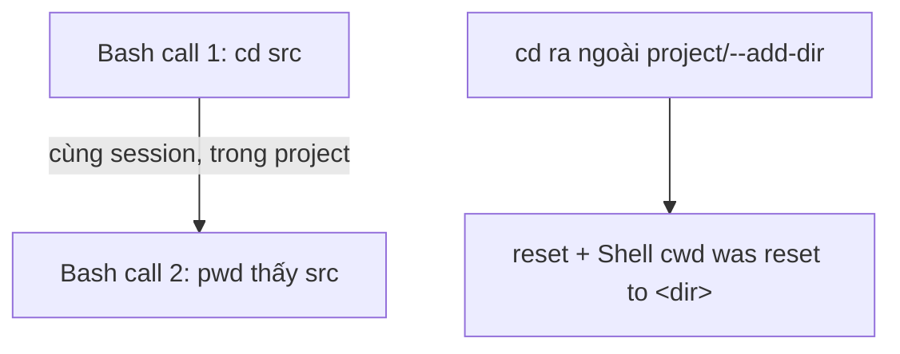

# Module 3.4: Terminal & Hoạt Động Shell

> **Thời gian ước tính**: ~30 phút
>
> **Yêu cầu trước**: Module 3.3 (Tích Hợp Git)
>
> **Kết quả**: Sau module này, bạn sẽ biết chính xác cái gì persist giữa các Bash call, Claude
> Code quyết định chạy nền một lệnh khi nào, và cách viết permission rule thật sự có tác dụng.

---

## 1. WHY — Tại Sao Điều Này Quan Trọng

Bạn nhờ Claude cài dependencies, chạy build, rồi start dev server để check. Có lệnh mất vài giây,
có lệnh mất vài phút, server thì không bao giờ trả về. Không biết Bash tool thật sự làm gì với
lệnh chậm — đợi, timeout, chạy nền — bạn hoặc ngồi chờ vô ích, hoặc lặp lại hiểu lầm về chạy nền.

Module này thay giả định bằng cơ chế đã document: timeout, giới hạn output, `run_in_background`,
`/tasks`, và permission rule quyết định lệnh nào chạy không cần hỏi.

---

## 2. CONCEPT — Các Ý Tưởng Cốt Lõi

### Cái gì persist giữa các lệnh, cái gì không

`cd` **có** carry over sang các Bash call sau trong cùng session đang chạy — nhưng chỉ khi nó vẫn
nằm trong project directory hoặc một `--add-dir` path, và chỉ trong một process đó. Ra ngoài phạm
vi đó sẽ bị reset và Claude Code thêm dòng `Shell cwd was reset to <dir>`. **Session subagent không
bao giờ carry over thay đổi working directory** — mỗi session bắt đầu lại từ đầu. Set
`CLAUDE_BASH_MAINTAIN_PROJECT_WORKING_DIR=1` để buộc quay lại thư mục ban đầu sau mỗi lệnh. `export
VAR=value` **không** persist, nhưng alias/function shell từ `~/.zshrc`/`~/.bashrc`/`~/.profile`
load một lần lúc session bắt đầu và áp dụng cho mọi lệnh.


```mermaid
graph TD
    A[Bash call 1: cd src] -->|cùng session, trong project| B[Bash call 2: pwd thấy src]
    C[cd ra ngoài project/--add-dir] --> D["reset + Shell cwd was reset to &lt;dir&gt;"]
```

### Timeout và chạy nền là ở cấp tool, không phải `&`

Claude set `timeout` cho call khi dự đoán lệnh sẽ chạy lâu; default **120.000 ms**, xin tối đa
**600.000 ms** (`BASH_DEFAULT_TIMEOUT_MS`, `BASH_MAX_TIMEOUT_MS`). Nếu lệnh chạy quá timeout mà
không có estimate trước, Claude Code tự chuyển nó sang chạy nền, trừ khi lệnh bắt đầu bằng `sleep`.
Không còn tool `BashOutput`/`KillShell`: lệnh chạy nền quản lý bằng `run_in_background: true` trên
call, xem/dừng qua `/tasks` (alias `/bashes`), hoặc nhấn **Ctrl+B** trên lệnh đang chạy (tmux: hai
lần). `cmd &` thô ở shell vẫn chạy nền trong một OS shell — không phải task nền do Claude quản lý.

### Giới hạn output

Lệnh thành công đọc lại khoảng **30.000 ký tự** inline theo mặc định (`BASH_MAX_OUTPUT_LENGTH`,
tối đa 150.000; `bashOutputMaxChars` thay thế, tối đa 128.000) — quá mức đó, Claude nhận đường dẫn
file đã lưu và preview 2.000 ký tự. Lệnh fail đọc lại khoảng 10.000 ký tự dạng head-and-tail.
Vượt 5 GB bị kill ngay.

### Shell mode `!` chạy ngoài sandbox

Gõ `!command` chạy lệnh trực tiếp và đưa output vào context — nhưng chạy **ngoài** sandbox của
Claude Code kể cả khi sandbox đang bật, vì sandbox chỉ bọc lệnh Claude tự chạy, không phải lệnh bạn
gõ. Claude tự respond như một turn bình thường, trừ khi `respondToBashCommands: false`.

### Permission rule cho Bash không phải security boundary

`Bash(npm run build)` chỉ match đúng chuỗi literal đó. `Bash(npm run test *)` ≡
`Bash(npm run test:*)` — cả hai match mọi thứ bắt đầu bằng `npm run test `; khoảng trắng trước
wildcard là một phần của rule, nên `Bash(ls *)` không match `lsof` nhưng `Bash(ls*)` thì có.
Wrapper như `timeout`, `time`, `nice`,
`nohup` bị strip trước khi match, nên `Bash(npm test *)` vẫn bắt được `timeout 30 npm test`. Nhưng
**deny** rule `Bash(rm *)` không chặn được `/bin/rm -rf` hay `bash -c 'rm -rf ...'` — Claude Code
nói thẳng điều này "isn't a security boundary around the program". Coi deny rule như gờ giảm tốc;
enforcement thật đặt vào `PreToolUse` hook hoặc sandbox (Module 2.3).

---

## 3. DEMO — Làm Mẫu Từng Bước

### Bước 1: `cd` persist qua các Bash call trong một session

```bash
# docs: en/tools-reference — "carries over to later Bash commands"
claude -p "First, run 'cd src && ls -la' as one Bash call. Then, as a SEPARATE Bash call, run \
'pwd'. Show both outputs." --permission-mode acceptEdits
```

```text
# Output may vary
**1. `cd src && ls -la`**
total 8
drwxr-xr-x@ 4 you staff 128 … .
-rw-r--r--@ 1 you staff 143 … math.js

**2. `pwd`** (separate call)
/Users/you/cc-lab/src

The `cd src` from the first call carried over to the second.
```

### Bước 2: Shell mode (`!`) đưa output thật vào context

```text
# Output may vary — chụp từ session interactive, gõ prefix ! ở prompt
! git status
  ⎿  On branch main
     nothing to commit, working tree clean

⏺ Your working tree is clean on main. What would you like to work on?
```

### Bước 3: Lệnh Claude dự đoán chạy lâu tự chuyển sang nền

```text
# Output may vary — auto permission mode
❯ Run this in the background: node -e "setTimeout(()=>{},200000)". Do not wait for it.

⏺ Bash(node -e "setTimeout(()=>{},200000)")
  ⎿  Running in the background (↓ to manage)
  ⎿  Allowed by auto mode classifier

⏺ The Node process is running in the background as task bs75gee9e. It will sit idle for about
  200 seconds and then exit. I'm not waiting on it, but I'll get a notification when it finishes.
```

Khi Claude không estimate thời gian và lệnh chạm timeout mà không được hỗ trợ trước, message khác
đi:

```text
# Example from docs: https://code.claude.com/docs/en/tools-reference
Command did not complete within its 120s timeout and was moved to the background
```

### Bước 4: Check bằng `/tasks`

```text
# Output may vary
  Shell details

  Status:   running
  Runtime:  28s
  Command:  node -e "setTimeout(()=>{},200000)"

  Output:
  No output available

  ← to go back · Esc/Enter/Space to close · x to stop
```

### Bước 5: Ctrl+B chạy nền lệnh đang chạy. Giữa lúc chạy, hint xuất hiện trên status line

```text
# Output may vary
⏺ Bash(npm test 2>&1 | tail -40)
  ⎿  Running… (7s · timeout 5m)
     (ctrl+b to run in background)
```

<!-- AUTHOR-CAPTURE: nhấn Ctrl+B một lần (tmux: hai lần) khi đang ở trạng thái "Running…" đó trong
     một TTY thật và chụp lại frame kế tiếp — session pexpect lồng nhau dùng cho các capture khác
     của module này không gửi được raw Ctrl+B keystroke một cách đáng tin cậy. -->

### Bước 6: Một permission rule trông an toàn nhưng không phải

```json
{ "permissions": { "deny": ["Bash(rm *)"] } }
```

```bash
bash -c 'rm -rf /tmp/scratch'   # không bị chặn — deny rule không thấy "rm" là tên lệnh
```

Dùng hook (Module 2.3) nếu `rm` cần thật sự bị chặn.

---

## 4. PRACTICE — Tự Thực Hành

### Bài Tập 1: Quan Sát Một Timeout Thật

**Mục tiêu**: Trigger việc chuyển sang chạy nền và verify bằng `/tasks`.

**Hướng dẫn**:
1. Nhờ Claude chạy lệnh ~3 phút mà không nói trước mất bao lâu (một script, không phải `sleep`).
2. Quan sát điều gì xảy ra sau khoảng 120 giây.
3. Chạy `/tasks` và đọc status của shell.

**Kết quả mong đợi**: Claude tự set timeout dài hơn và chủ động chạy nền, hoặc lệnh tự chuyển nền
với message "moved to the background" — cả hai đều đúng.

<details>
<summary>💡 Gợi ý</summary>

Đừng dùng `sleep` — bị loại trừ khỏi auto-backgrounding.

</details>

<details>
<summary>✅ Đáp án</summary>

`node -e "setTimeout(()=>{}, 180000)"` hoạt động tốt. Check message: Claude tự set `timeout`, hay
120 giây trigger chuyển nền?

</details>

---

### Bài Tập 2: Viết Rule, Rồi Phá Nó

**Mục tiêu**: Verify deny rule cho Bash chỉ là gờ giảm tốc, không phải bức tường.

**Hướng dẫn**:
1. Thêm `{"permissions": {"deny": ["Bash(rm *)"]}}` vào `.claude/settings.local.json`.
2. Nhờ Claude chạy `rm somefile` — verify bị chặn.
3. Nhờ Claude chạy `bash -c "rm somefile"` thay vào đó.

**Kết quả mong đợi**: bước 2 bị deny; bước 3 chạy được, vì rule match command text, không phải ý
định.

<details>
<summary>✅ Đáp án</summary>

Đây là limitation đã document, không phải bug. Enforcement thật cần `PreToolUse` hook kiểm tra
command string thật, không phải Bash allow/deny rule.

</details>

---

## 5. CHEAT SHEET

| Task | Cách làm | Ghi chú |
|---|---|---|
| Chạy task dài không block | "chạy nó ở background" | Set `run_in_background: true` |
| Check background task | `/tasks` (`/bashes`) | Thay thế `BashOutput`/`KillShell` đã retired |
| Chạy nền lệnh hiện tại | `Ctrl+B` | Tmux: nhấn hai lần |
| Chạy ngoài sandbox | `!command` | Không qua classifier check |
| Timeout mặc định | `BASH_DEFAULT_TIMEOUT_MS` | 120000 ms |
| Timeout tối đa Claude xin được | `BASH_MAX_TIMEOUT_MS` | 600000 ms |
| Đọc lại nhiều output hơn | `BASH_MAX_OUTPUT_LENGTH` / `bashOutputMaxChars` | Mặc định ~30.000; tối đa 150.000 / 128.000 |
| Luôn quay về thư mục ban đầu | `CLAUDE_BASH_MAINTAIN_PROJECT_WORKING_DIR=1` | Ngược với carry-over mặc định |
| Rule exact-match | `Bash(npm run build)` | Chỉ đúng lệnh literal đó |
| Rule wildcard | `Bash(npm run *)` ≡ `Bash(npm run:*)` | Khoảng trắng trước `*` quan trọng |

**Toán tử shell** (vẫn là syntax thật — chỉ không phải cách Claude Code chạy nền một *tool call*):

- `&&` = chạy tiếp chỉ khi lệnh trước thành công · `||` = chạy tiếp chỉ khi lệnh trước fail
- `;` = luôn chạy tiếp · `|` = pipe · `cmd &` = chạy nền trong một OS shell, không phải task được
  Claude quản lý

---

## 6. PITFALLS — Sai Lầm Thường Gặp

| ❌ Sai lầm | ✅ Cách đúng |
|---|---|
| Dạy `npm run dev &` như "cách Claude chạy nền" | Nhờ Claude chạy ở background — nó set `run_in_background` trên call |
| Tìm tool `BashOutput`/`KillShell` | Đã retired — dùng `/tasks` (`/bashes`) |
| Nghĩ deny rule cho Bash chặn `rm` mọi nơi | Chỉ match command text; `bash -c`, `/bin/rm` bypass được — dùng hook thay thế |
| Nghĩ `cd` sống sót qua một process `--continue` mới | Chỉ persist trong một session đang chạy, không qua process restart |
| Dùng `--only=production` khi install | Flag này đã bỏ; dùng `npm ci --omit=dev` |
| Base image trên `node:18` | Chuyển sang LTS còn maintain, ví dụ `node:22` |
| Viết `docker-compose` (binary standalone cũ) | Dùng `docker compose` (plugin v2) |
| Nghĩ `sleep 300` tự chuyển nền ở giây 120 | `sleep` bị loại trừ rõ ràng — nó chỉ block |

---

## 7. REAL CASE — Câu Chuyện Production

**Tình huống**: Deploy bản cập nhật microservice lên Kubernetes staging cluster lúc 2 giờ sáng —
image mới, smoke test trong temp container, push registry, update deployment, check pod health.
Bình thường mất 15 phút làm thủ công trên terminal.

**Vấn đề**: Smoke test fail:

```text
Error: connect ECONNREFUSED 10.0.0.45:5432
```

**Giải pháp**: Một mình, developer nhờ Claude debug. Claude chạy chuỗi chẩn đoán —
`kubectl get pods`, `kubectl get endpoints`, `kubectl get networkpolicies`, `nslookup` từ trong app
pod, `kubectl rollout history` — và phát hiện database pod bị kẹt `Pending`.
`kubectl describe pod … | grep -A 5 Events` cho thấy `FailedScheduling: insufficient memory`; một
deployment gần đây đã tăng memory request ở nơi khác.

**Kết quả**: Xác định nguyên nhân gốc dưới 2 phút, qua 8 lệnh kubectl không cần nhớ syntax. Giảm
memory request một service không quan trọng để database pod schedule được; tổng deploy 12 phút dù
gặp sự cố.

**Bài Học Quan Trọng**: Làm terminal qua Claude Code không phải chuyện gõ nhanh hơn — đó là đọc
đúng exit code và stderr, và biết khi nào nên chạy nền thay vì block.

---

> **Tiếp theo**: [Module 4.1: Kỹ Thuật Prompting](../../phase-04-prompt-memory/01-prompting-techniques/) →
