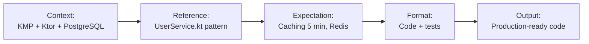

# Module 4.1: Kỹ Thuật Prompting

> **Thời gian học**: ~35 phút
>
> **Yêu cầu trước**: Module 3.4 (Terminal & Shell Operations)
>
> **Kết quả**: Sau module này, bạn sẽ master nghệ thuật viết prompt khiến Claude Code tạo ra chính xác cái bạn muốn — ngay lần đầu, mọi lần — bằng cách tận dụng context, constraint, reference, và iterative refinement.

---

## 1. WHY — Tại Sao Kỹ Thuật Prompting Quan Trọng

Bạn gõ "thêm auth vào project" → Claude Code tạo JWT generic không khớp với stack của bạn. Đồng nghiệp gõ 3 câu prompt → code production-ready. Sự khác biệt? Kỹ thuật prompting.

Trong Claude Code, prompt mơ hồ không chỉ cho câu trả lời văn bản tệ — nó TẠO CODE TỆ vào trong project thật của bạn. File lộn xộn, pattern sai, dependencies dư thừa. Undo tốn nhiều thời gian hơn viết lại từ đầu.

Ví von: prompt cho Claude Code giống brief cho developer — brief tệ thì code tệ. Học viết prompt tốt = force multiply skill coding của bạn 10 lần. Master prompt = làm trong 5 phút cái mà trước cần 1 giờ.

---

## 2. CONCEPT — Khái Niệm Cốt Lõi

### Framework CREF

Mọi prompt tốt đều có 4 thành phần **CREF**:

- **C**ontext (Ngữ cảnh): Project đang làm gì, stack hiện tại, constraints
- **R**eference (Tham chiếu): Chỉ đến code có sẵn, pattern đã dùng, file cụ thể
- **E**xpectation (Kỳ vọng): Thành công trông như thế nào, behavior cụ thể
- **F**ormat (Định dạng): Output nên ra sao (code only, với comment, hay với explanation)



### Các Kỹ Thuật Chính

**1. Constraint Stacking**
Thêm constraint đẩy chất lượng lên. Mỗi constraint loại bỏ 1 lớp output tệ:
- Constraint 1: "Dùng existing pattern"
- Constraint 2: "KHÔNG thêm dependency mới"
- Constraint 3: "PHẢI có error handling"
- Constraint 4: "Follow code style trong CLAUDE.md"

**2. Reference-Driven Prompting**
"Làm giống X" là pattern mạnh nhất. Claude Code giỏi pattern matching hơn imagination.

**3. Iterative Refinement**
4 vòng hiệu quả nhất:
1. Skeleton (structure, function signature)
2. Logic (core implementation)
3. Error handling (edge cases)
4. Tests (verification)

**4. Negative Constraints**
"KHÔNG làm X" thường chính xác hơn "Làm Y". Negative constraint rất mạnh trong ngăn hallucination.

**Ví von Việt**: CREF giống đặt hàng thiết kế nội thất. Nói "làm đẹp lên" thì thợ random — có khi đẹp nhưng không hợp gu. Nói cụ thể: "phong cách tối giản Nhật, giống mẫu X, kệ sách ở tường này, KHÔNG dùng nhựa" thì ra đúng ý ngay lần đầu.

---

## 3. DEMO — Từng Bước Nâng Cấp Prompt

**Task**: Thêm caching layer vào API service.

### Bước 1: Prompt tệ (generic)

```bash
$ claude -p "Add caching to the API"
```

**Kết quả**: Claude Code tạo:
- Generic in-memory cache (không phù hợp production)
- Hardcoded 60s TTL
- Không có invalidation strategy
- Không test

**Vấn đề**: Không có context, reference, expectation, format — Claude hallucinate tất cả.

---

### Bước 2: Prompt khá (có context + reference)

```bash
$ claude
```

Trong session:

```
Context: KMP backend, Ktor framework, PostgreSQL database.
Reference: Check UserService.kt — we use dependency injection pattern.

Task: Add caching layer to ProductService.kt, similar to how UserRepository handles connections.

Expectation: Cache GET /products for 5 minutes, invalidate on POST/PUT/DELETE.
```

**Kết quả**: Tốt hơn nhiều:
- Dùng Redis (nhận diện production context)
- Follow DI pattern từ UserService
- Có invalidation logic

**Nhưng còn thiếu**:
- Chưa có error handling khi Redis down
- Format không rõ (có test không?)
- Edge case: cache stampede khi expired

---

### Bước 3: Prompt xuất sắc (full CREF)

```bash
$ claude
```

```
**Context**:
- KMP backend: Ktor 2.3, Koin DI, PostgreSQL + Exposed ORM
- Existing: Redis already configured in build.gradle.kts
- Load: 1000 req/min peak, read-heavy (80% GET)

**Reference**:
- File: src/services/UserService.kt — shows DI pattern
- File: src/repository/CacheRepository.kt — shows Redis client setup
- CLAUDE.md section 3.2: "Error handling must degrade gracefully"

**Expectation**:
1. Cache GET /products with 5-minute TTL
2. Invalidate on POST/PUT/DELETE to /products/*
3. If Redis down → fallback to DB (log warning, don't crash)
4. Handle cache stampede (lock pattern)
5. Unit tests for cache hit/miss/invalidation

**Format**:
- Code only, with inline comments explaining Redis keys
- Separate file: ProductCacheService.kt
- Test file: ProductCacheServiceTest.kt

**Constraints**:
- Do NOT add new dependencies (use existing Lettuce client)
- Do NOT change ProductController signatures
- MUST follow existing logging pattern (Logback + structured JSON)
```

**Kết quả**: Production-ready code:
- Tất cả 5 requirements đều có
- Follow mọi pattern existing
- Tests cover 4 scenarios
- Error handling robust
- Code đúng style

---

### Bước 4: Iterative Refinement (review edge case)

Sau khi Claude tạo code, review output:

```
Good! Now review for edge cases:
1. What if cache key collision occurs?
2. What if product list is empty — do we cache empty result?
3. Memory limit — should we cap cache size?

Refine the implementation to handle these.
```

Claude sẽ update code với:
- Namespaced cache keys
- Empty list caching strategy
- LRU eviction policy

---

### Bước 5: Negative Constraint

```
Final check: Do NOT cache user-specific data in shared cache.
Review ProductCacheService.kt — ensure no userId in cache key.
```

Claude scan lại, confirm không có leak.

**Total time**: 8 phút (so với 45 phút code thủ công + review).

---

## 4. PRACTICE — Thử Ngay

### Bài Tập 1: Nâng Cấp Prompt Mơ Hồ

Upgrade 3 prompt sau thành CREF-quality:

**A. "Fix the login bug"**

**B. "Add validation"**

**C. "Optimize the database queries"**

<details>
<summary>💡 Gợi ý</summary>

Mỗi prompt cần:
1. Context: Project gì? Stack gì?
2. Reference: File nào? Pattern nào?
3. Expectation: Bug là gì? Validation cho field nào? Optimize như thế nào?
4. Format: Fix only? Hay cả test?

</details>

<details>
<summary>✅ Đáp Án Mẫu</summary>

**A. CREF Version:**
```
Context: Next.js app, NextAuth.js, PostgreSQL
Reference: Check src/auth/LoginForm.tsx and api/auth/[...nextauth].ts
Bug: User can login with wrong password if caps lock on
Expectation: Fix case-sensitive password check, add test for caps lock scenario
Format: Code fix + unit test
Constraint: Do NOT change existing session logic
```

**B. CREF Version:**
```
Context: REST API, Express.js, Joi validation library
Reference: Check validators/userValidator.js for pattern
Task: Add validation to POST /products endpoint
Expectation: Validate name (required, max 100 chars), price (positive number), category (enum)
Format: New file validators/productValidator.js + integration test
Constraint: Use existing Joi setup, do NOT install new library
```

**C. CREF Version:**
```
Context: Django app, PostgreSQL, 50k products table, slow list view
Reference: Check models.py (Product model) and views/ProductListView
Issue: N+1 query on category foreign key
Expectation: Use select_related to optimize, query count < 3, response time < 200ms
Format: Code fix + Django Debug Toolbar screenshot proof
Constraint: Do NOT change API response structure
```

</details>

---

### Bài Tập 2: Reference Olympics

Viết prompt CHỈ dùng reference (không giải thích gì thêm):

**Goal**: Tạo API endpoint mới `/orders` giống hệt pattern của `/products`.

Viết prompt chỉ với reference đến existing code.

<details>
<summary>💡 Gợi ý</summary>

Liệt kê tất cả files liên quan đến `/products` — từ route, controller, service, repository, model, validator, test.

</details>

<details>
<summary>✅ Đáp Án Mẫu</summary>

```
Create /orders endpoint following these references exactly:

Structure:
- src/routes/productRoutes.ts → src/routes/orderRoutes.ts
- src/controllers/ProductController.ts → src/controllers/OrderController.ts
- src/services/ProductService.ts → src/services/OrderService.ts
- src/models/Product.ts → src/models/Order.ts
- src/validators/productValidator.ts → src/validators/orderValidator.ts
- tests/products.test.ts → tests/orders.test.ts

Copy pattern:
- DI setup from productRoutes.ts
- Error handling from ProductController.ts
- Transaction logic from ProductService.ts
- Joi schema structure from productValidator.ts
- Test structure from products.test.ts

Replace: "product" → "order", "Product" → "Order", "/products" → "/orders"

Schema: Order has {id, userId, productId, quantity, status, createdAt}
```

Claude sẽ tạo đúng 6 files với pattern 100% consistent.

</details>

---

## 5. CHEAT SHEET

| Kỹ Thuật | Template | Ví Dụ |
|----------|----------|-------|
| **Basic CREF** | Context: [stack]<br/>Reference: [file]<br/>Expectation: [behavior]<br/>Format: [output type] | Context: React + TypeScript<br/>Reference: UserCard.tsx<br/>Expectation: ProductCard component<br/>Format: Code + Storybook story |
| **Constraint Stacking** | Do X, but:<br/>- Constraint 1<br/>- Constraint 2<br/>- Constraint 3 | Add auth, but:<br/>- Use existing JWT lib<br/>- Do NOT modify database<br/>- Follow CLAUDE.md security rules |
| **Negative Constraint** | Do X, but do NOT Y | Add logging, but do NOT log sensitive data (passwords, tokens, PII) |
| **Reference-Driven** | Create X similar to Y | Create AdminDashboard.tsx similar to UserDashboard.tsx, but with role checks |
| **Iterative Refinement** | Step 1: Structure<br/>Step 2: Logic<br/>Step 3: Error handling<br/>Step 4: Tests | Implement payment:<br/>1. Scaffold PaymentService<br/>2. Add Stripe logic<br/>3. Handle failures<br/>4. Add integration test |
| **Format Specification** | Code only / Code + explanation / Code + tests / Explanation only | "Explain how caching works in this codebase (explanation only, no code)" |
| **Edge Case Probing** | Review for:<br/>1. Null values<br/>2. Empty arrays<br/>3. Network failures | Review AuthService for:<br/>1. Token expired<br/>2. User not found<br/>3. Network timeout |

---

## 6. PITFALLS — Lỗi Thường Gặp

| ❌ Sai Lầm | ✅ Cách Đúng |
|------------|--------------|
| "Add error handling" (mơ hồ) | "Add try-catch for network errors, return 503 on timeout, log error with request ID" |
| "Make it faster" (không đo được) | "Optimize query to < 100ms, use indexing on user_id column, verify with EXPLAIN ANALYZE" |
| "Follow best practices" (không cụ thể) | "Follow CLAUDE.md section 2.1: use async/await, no callbacks, handle errors with Result type" |
| Không reference existing code | Reference 2-3 files existing để Claude học pattern của bạn, không phải pattern generic |
| Một prompt khổng lồ cho 10 tasks | Chia thành 4 prompts iterative: structure → logic → polish → tests |
| Quên specify format | Nêu rõ: "code only" / "code + comment" / "code + tests + explanation" |
| Không dùng negative constraint cho security | "Add API key auth, but do NOT log API keys, do NOT store in localStorage, do NOT commit to git" |

---

## 7. REAL CASE — Tình Huống Thực Tế

**Scenario**: Team KMP Việt Nam (5 developers, startup fintech) build mobile banking app. Claude Code được adopt tháng 1/2025.

**Problem**: 2 tuần đầu, code quality không ổn định. Một dev tạo code tốt, dev khác tạo code cần rewrite. PR review tốn nhiều thời gian sửa pattern lệch.

**Root cause**: Mỗi dev prompt theo style khác nhau. Không có prompt discipline.

**Solution**:
1. Tech lead track prompt quality 2 tuần:
   - **Tuần 1** (prompting tự do): 35% success rate first try, trung bình 3.4 iterations, 0% reject
   - **Tuần 2** (CREF mandatory): 78% success rate, trung bình 1.6 iterations, 12% reject (dev biết prompt tệ, viết lại)

2. CLAUDE.md được update với 15 prompt recipes cho các tasks thường gặp:
   - "Add API endpoint" recipe
   - "Add validation" recipe
   - "Add caching" recipe
   - "Refactor for testing" recipe

3. Onboarding mới: Junior dev bắt buộc học CREF trước khi được access Claude Code.

**Result**:
- Code consistency tăng (PR review time giảm 40%)
- Junior dev ramp-up nhanh hơn (3 ngày thay vì 2 tuần)
- Tech debt giảm (ít code pattern lệch hơn)
- Team confidence cao hơn (biết prompt tốt = output tốt)

**Key lesson**: Prompting là kỹ năng, không phải talent. Có framework + practice = ai cũng master được.

---

> **Tiếp theo**: [Module 4.2: CLAUDE.md — Bộ nhớ dự án](../02-claude-md/) →
