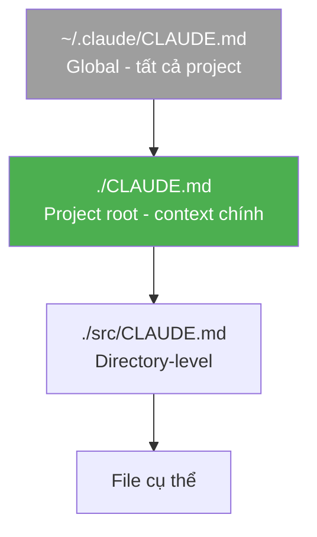

# Module 4.2: CLAUDE.md — Bộ Nhớ Dự Án

> **Thời gian học**: ~40 phút
>
> **Yêu cầu trước**: Module 4.1 (Kỹ thuật Prompting)
>
> **Kết quả**: Sau module này, bạn sẽ biết viết file CLAUDE.md khiến Claude Code hành xử như senior team member hiểu sâu project — kiến trúc, convention, constraint, và tribal knowledge.

---

## 1. WHY — Tại Sao Cần CLAUDE.md

Bạn bắt đầu session mới. Claude Code hỏi: "Tech stack gì?". Bạn giải thích. "Convention nào?". Bạn giải thích tiếp. "Database schema?". Lại giải thích. Mỗi session = onboarding dev mới từ đầu. Nhân với 10-20 session/ngày = 2-3 tiếng lãng phí.

CLAUDE.md giải quyết vĩnh viễn. Một file ở root, được đọc tự động mỗi session, chứa mọi thứ Claude Code cần biết: kiến trúc, rules, commands, gotcha. Giống bảng nội quy công ty — nhân viên mới đọc một lần là biết cách làm việc. Không cần giải thích lại.

CLAUDE.md loại bỏ 80% prompt lặp. Biến Claude Code từ assistant generic thành team member hiểu sâu project.

---

## 2. CONCEPT — Khái Niệm Cốt Lõi

CLAUDE.md là **file instruction cho Claude Code** — KHÔNG phải documentation cho con người. Mục tiêu: cung cấp context tối thiểu để Claude Code đưa ra quyết định đúng mà không cần hỏi lại.

### Hierarchy — Thứ Tự Ưu Tiên



- **Global** (`~/.claude/CLAUDE.md`): Preferences cá nhân, style chung. Ví dụ: "Luôn viết TypeScript strict mode".
- **Project** (`./CLAUDE.md`): Nguồn context chính. 90% thông tin ở đây.
- **Directory-level**: Context cụ thể cho module lớn. ⚠️ Cần verify — không chắc Claude Code hỗ trợ.
- File cụ thể override hierarchy trên.

### 6 Section Thiết Yếu

| # | Section | Mục Đích | Ví Dụ |
|---|---------|----------|-------|
| 1 | **Project Overview** | Tech stack, architecture tổng quan | "Node.js/Express API, PostgreSQL, Redis cache" |
| 2 | **Architecture Rules** | Directory structure, ranh giới module | "Database logic chỉ trong `src/db/`" |
| 3 | **Coding Conventions** | Naming, pattern, error handling | "Functions dùng camelCase, constants UPPER_SNAKE_CASE" |
| 4 | **Commands** | Build, test, lint, deploy | "`npm run test` = Jest với coverage" |
| 5 | **Constraints** | Cái KHÔNG ĐƯỢC làm | "KHÔNG dùng `any` trong TypeScript" |
| 6 | **Context** | Tribal knowledge, business rule, gotcha | "VND không có decimal, format DD/MM/YYYY" |

### Token Budget

CLAUDE.md tính vào context window. Mục tiêu: **dưới 800 từ** (~1,200 tokens). Nếu quá dài:
- Gộp sections
- Link đến docs thay vì copy
- Focus vào cái Claude Code thường hỏi

---

## 3. DEMO — Xây CLAUDE.md Từng Bước

**Kịch bản**: Node.js/Express API với TypeScript, PostgreSQL, Redis. Banking domain, thị trường VN.

### Bước 1: Tạo CLAUDE.md Với `/init`

```bash
$ claude
```

Trong session:

```
/init
```

**Output**:
```
Created CLAUDE.md with basic template.
```

File `CLAUDE.md` được tạo với template cơ bản. Giờ chúng ta sẽ điền content production-grade.

### Bước 2-7: Điền 6 Section

Mở `CLAUDE.md` và viết:

```markdown
# Banking API — CLAUDE.md

## Project Overview

Node.js/Express REST API for retail banking operations.

**Tech Stack**:
- Runtime: Node.js 20 LTS, TypeScript 5.x (strict mode)
- Framework: Express 4.x
- Database: PostgreSQL 16 (primary), Redis 7 (cache + sessions)
- ORM: Prisma 5.x
- Validation: Zod
- Testing: Jest + Supertest
- Deployment: Docker on AWS ECS

**Architecture**: Layered (Controller → Service → Repository).

---

## Architecture Rules

src/
├── controllers/     # HTTP handlers, thin layer
├── services/        # Business logic
├── repositories/    # Database queries (Prisma)
├── models/          # Zod schemas
├── middleware/      # Express middleware
├── utils/           # Helpers
└── config/          # Environment config

**Rules**:
- Controllers NEVER access database directly — always via services
- Services NEVER handle HTTP concerns — return data/errors
- Repositories NEVER contain business logic — pure CRUD
- Each layer imports only the layer below

---

## Coding Conventions

**Naming**:
- Files: kebab-case (`user-service.ts`)
- Functions/variables: camelCase (`getUserById`)
- Classes: PascalCase (`UserService`)
- Constants: UPPER_SNAKE_CASE (`MAX_RETRY_COUNT`)

**TypeScript**:
- Enable `strict: true` in tsconfig.json
- NEVER use `any` — use `unknown` or proper types
- Export types alongside functions

**Error Handling**:
// Preferred pattern
throw new AppError('User not found', 404);

// NOT this
throw new Error('User not found');

**Async/Await**:
- Always handle errors with try/catch
- Use `Promise.all()` for parallel operations

---

## Commands

| Command | Purpose |
|---------|---------|
| `npm run dev` | Start dev server (nodemon + ts-node) |
| `npm run build` | Compile TypeScript → `dist/` |
| `npm test` | Run Jest tests with coverage |
| `npm run lint` | ESLint + Prettier check |
| `npm run db:migrate` | Run Prisma migrations |
| `npm run db:seed` | Seed test data |

**Before commit**: Run `npm run lint && npm test`.

---

## Constraints — KHÔNG ĐƯỢC

- ❌ KHÔNG commit `.env` file (secrets in environment variables only)
- ❌ KHÔNG dùng `SELECT *` trong raw SQL (explicit columns)
- ❌ KHÔNG hardcode config (use `src/config/`)
- ❌ KHÔNG bypass validation layer (all input via Zod)
- ❌ KHÔNG dùng `console.log` trong production code (use Winston logger)
- ❌ KHÔNG tạo migration thủ công (always `npx prisma migrate`)

---

## Context — Tribal Knowledge

**Vietnamese Banking Specifics**:
- **VND không có decimal**: Luôn dùng integer (đơn vị: đồng). KHÔNG dùng `DECIMAL` hoặc `FLOAT`.
- **Date format**: DD/MM/YYYY cho user-facing, ISO-8601 cho API internal.
- **Phone format**: +84 prefix, 9-10 digits. Validate với regex `/^(\+84|84|0)(3|5|7|8|9)[0-9]{8}$/`.
- **Business hours**: 8:00-17:00 GMT+7 (Asia/Ho_Chi_Minh timezone).

**Database**:
- Primary key: UUID v4 (NOT auto-increment integer).
- Timestamps: `created_at`, `updated_at` (tự động via Prisma).
- Soft delete: `deleted_at` column (nullable).

**Redis**:
- Session TTL: 30 minutes.
- Cache TTL: 5 minutes (user data), 1 hour (static data).

**API Versioning**: `/api/v1/...` (version in path).

---

## References

- API Docs: `docs/api.md`
- Prisma Schema: `prisma/schema.prisma`
- ENV Template: `.env.example`
```

### Bước 8: Verify — Test CLAUDE.md

Đóng session hiện tại, mở session mới:

```bash
$ claude
```

Prompt:

```
Add validation for phone number in UserService
```

**Expected behavior**: Claude Code tự động:
- Dùng regex `/^(\+84|84|0)(3|5|7|8|9)[0-9]{8}$/` từ Context
- Đặt code vào `src/services/user-service.ts`
- Dùng Zod cho validation
- Follow naming convention camelCase

KHÔNG cần giải thích tech stack hoặc nhắc regex.

---

## 4. PRACTICE — Tự Thực Hành

### Bài Tập 1: Viết CLAUDE.md Từ Đầu

**Mục tiêu**: Tạo CLAUDE.md cho project của bạn (hoặc project giả định).

**Hướng dẫn**:
1. Chọn project (hoặc tưởng tượng: React/Next.js e-commerce app)
2. Chạy `claude` → `/init`
3. Điền 6 section theo template trên
4. Test: đóng session, mở lại, gửi task kiểm tra context

**Kết quả mong đợi**: Claude Code không hỏi lại tech stack, tự follow convention.

<details>
<summary>💡 Gợi Ý</summary>

Bắt đầu với Project Overview và Commands — 2 section dễ nhất. Sau đó thêm Conventions (coi lại code hiện tại để extract pattern). Constraints và Context thường là nơi chứa "vàng" — cái dev mới hay quên.

</details>

<details>
<summary>✅ Giải Pháp (Ví Dụ Next.js)</summary>

```markdown
# E-Commerce Frontend — CLAUDE.md

## Project Overview

Next.js 14 (App Router) + TypeScript + Tailwind CSS + Zustand.

**Stack**: React 18, Zustand (state), React Query (data fetching), Zod (validation).

---

## Architecture Rules

src/
├── app/              # Next.js App Router pages
├── components/       # React components (UI + business)
├── stores/           # Zustand stores
├── hooks/            # Custom React hooks
├── lib/              # Utilities, API client
└── types/            # TypeScript types

**Rules**: Components trong `components/ui/` là presentational (no business logic).

---

## Coding Conventions

- Components: PascalCase (`ProductCard.tsx`)
- Hooks: camelCase với prefix `use` (`useCart.ts`)
- CSS: Tailwind utility classes (NO custom CSS modules)

---

## Commands

- `npm run dev` — Dev server (localhost:3000)
- `npm run build` — Production build
- `npm run lint` — ESLint + Prettier

---

## Constraints

- ❌ KHÔNG dùng `` (use `next/image`)
- ❌ KHÔNG fetch trong component (use React Query)

---

## Context

- Price format: "₫" symbol, thousand separator (VND)
- Images: WebP format, lazy load
```

</details>

---

### Bài Tập 2: Audit CLAUDE.md Có Sẵn

**Mục tiêu**: Tìm gap trong CLAUDE.md hiện tại.

**Hướng dẫn**:
1. Mở CLAUDE.md của project (nếu có)
2. Check 6 section — thiếu section nào?
3. Test: gửi task, xem Claude Code có hỏi lại không?
4. Bổ sung thông tin thiếu

**Kết quả mong đợi**: CLAUDE.md đầy đủ hơn, ít friction hơn.

<details>
<summary>💡 Gợi Ý</summary>

Thường thiếu: **Constraints** (cái KHÔNG được làm) và **Context** (tribal knowledge). Đây là 2 section tạo ra sự khác biệt lớn nhất.

</details>

---

## 5. CHEAT SHEET

### Checklist 6 Section

| Section | Nên Ghi Gì | Ví Dụ |
|---------|------------|-------|
| **Project Overview** | Tech stack chính, architecture pattern | "Express API + PostgreSQL + Redis" |
| **Architecture Rules** | Directory structure, layer boundaries | "Controllers không gọi DB trực tiếp" |
| **Coding Conventions** | Naming, formatting, code style | "camelCase functions, PascalCase classes" |
| **Commands** | Build, test, lint, deploy commands | "`npm test` = Jest với coverage" |
| **Constraints** | Cái KHÔNG ĐƯỢC làm (negative rules) | "KHÔNG commit .env file" |
| **Context** | Domain knowledge, gotcha, business rules | "VND không có decimal" |

### Hierarchy Ưu Tiên

```
~/.claude/CLAUDE.md        # Global (1 lần setup)
       ↓
./CLAUDE.md                # Project — 90% context ở đây
       ↓
./module/CLAUDE.md         # ⚠️ Cần verify
```

### Token Budget Tips

| Kích Thước CLAUDE.md | Đánh Giá |
|---------------------|----------|
| < 500 từ | Tốt — gọn, focused |
| 500-800 từ | OK — sweet spot |
| 800-1200 từ | Chấp nhận được — cân nhắc refactor |
| > 1200 từ | Quá dài — split hoặc link docs |

---

## 6. PITFALLS — Sai Lầm Thường Gặp

| ❌ Sai Lầm | ✅ Cách Đúng |
|-----------|-------------|
| Copy toàn bộ README.md vào CLAUDE.md | Viết instruction ngắn gọn, reference README khi cần: "See README.md for setup" |
| Chỉ liệt kê rule positive ("Làm X") | Thêm negative constraint ("KHÔNG làm Y") — đây là phần tạo sự khác biệt |
| CLAUDE.md 2000+ từ, chứa hết documentation | Giữ dưới 800 từ, focus vào cái Claude Code thường nhầm |
| Viết xong không bao giờ update | Coi CLAUDE.md như code — update khi convention thay đổi |
| Không test CLAUDE.md với task thật | Sau khi viết: đóng session, mở lại, gửi task kiểm tra behavior |
| Để API key, DB password trong CLAUDE.md | KHÔNG BAO GIỜ — credential thuộc về `.env`. CLAUDE.md chỉ chứa instruction |
| CLAUDE.md giống documentation cho dev mới | CLAUDE.md là instruction cho AI — tối ưu cho context, không phải readability |

---

## 7. REAL CASE — Câu Chuyện Thực Tế

**Kịch bản**: Team KMP mobile banking (Kotlin Multiplatform), 5 dev, Việt Nam.

**Vấn đề**: Mỗi dev làm việc với Claude Code ~15 session/ngày. Mỗi session mới = giải thích lại:
- Tech stack: KMP + Compose Multiplatform + Ktor
- Convention: `expect/actual` pattern, naming convention cho shared code
- Gotcha: VND không decimal, date format DD/MM/YYYY, Vietnamese phone regex

**Thời gian lãng phí**: ~10 phút/session × 15 session = 2.5 tiếng/dev/ngày. Nhân 5 dev = **12.5 tiếng team/ngày** chỉ để repeat context.

**Giải pháp**: Viết CLAUDE.md gồm:
- KMP architecture rules (`commonMain`, `androidMain`, `iosMain`)
- Naming convention (`ViewModelImpl` suffix cho `actual` implementation)
- Vietnamese banking quirk: VND integer-only, phone format, business hours GMT+7
- Command: `./gradlew build`, `./gradlew test`, `./gradlew linkPodDebugFrameworkIosSimulatorArm64`
- Constraint: KHÔNG dùng platform-specific code trong `commonMain`

**Kết quả**:
- Context repetition → gần zero
- Onboarding member mới: từ 2 ngày xuống còn **4 giờ** (đọc CLAUDE.md + chạy vài task)
- Team lead review CLAUDE.md 1 lần/tuần thay vì giải thích 15 lần/ngày

**Metric**: Team tiết kiệm ~10 tiếng/ngày = **50 tiếng/tuần** = capacity của 1+ senior dev.

---

> **Tiếp theo**: [Module 4.3: Slash Commands](../03-slash-commands/) →
