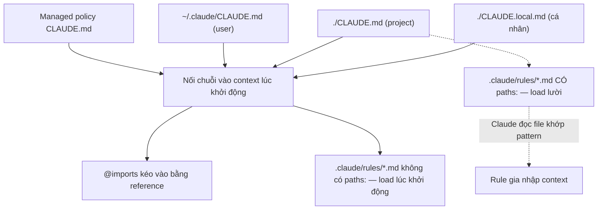

# Module 4.2: CLAUDE.md — Bộ Nhớ Dự Án

> **Thời gian học**: ~35 phút
>
> **Yêu cầu trước**: Module 4.1 (Kỹ thuật Prompting)
>
> **Kết quả**: Sau module này, bạn viết được CLAUDE.md gọn nhẹ bằng `/init`, tách nhỏ bằng
> `@imports` và `.claude/rules/` (kèm `paths:`), rồi xác nhận thứ gì đã load bằng `/memory`
> và `/context`.

---

## 1. WHY — Tại Sao Cần Quan Tâm

Bạn mở session mới, Claude lại hỏi câu đáng lẽ nó phải biết: "Dùng ORM nào?" "Route nằm ở đâu?"
Một CLAUDE.md 600 dòng không giải quyết việc này — nó còn làm mọi thứ tệ hơn. Mỗi dòng đều load
vào **mọi** session dù liên quan hay không, và qua một ngưỡng nào đó Claude bắt đầu bỏ qua chính
instruction quan trọng nhất. Anthropic nói thẳng: "Bloated CLAUDE.md files cause Claude to ignore
your actual instructions!" (S1). Giải pháp không phải file to hơn — mà là đúng file, cộng hai cơ
chế ít người dùng tới: `@imports` và `.claude/rules/`.

---

## 2. CONCEPT — Khái Niệm Cốt Lõi

### Hierarchy — nối chuỗi (concatenate), không phải ghi đè

Claude Code đọc **mọi** CLAUDE.md tìm thấy và **nối chuỗi (concatenate) hết vào context — không
file nào thay thế file nào**. Thứ tự từ rộng đến hẹp, file càng gần thư mục làm việc càng đọc sau:

| Cấp | Đường dẫn | Ghi chú |
|---|---|---|
| Managed policy | Đường dẫn theo OS (vd macOS `/Library/Application Support/ClaudeCode/CLAUDE.md`) hoặc key `claudeMd` trong `managed-settings.json` | Load đầu tiên; chỉ admin cấu hình; `claudeMdExcludes` không đụng được vào |
| User | `~/.claude/CLAUDE.md` | Áp dụng cho mọi project bạn mở |
| Project | `./CLAUDE.md` hoặc `./.claude/CLAUDE.md` | Checked in, chia sẻ cho cả team |
| Local | `./CLAUDE.local.md` | Cá nhân, gitignored — vẫn được hỗ trợ đầy đủ |
| Thư mục con | Bất kỳ `CLAUDE.md`/`CLAUDE.local.md` nào dưới thư mục làm việc | Load lười (lazy), chỉ "khi Claude đọc file trong thư mục đó" |

Hai file mâu thuẫn là lỗi cần sửa tại gốc — hierarchy không tự "phân xử" giúp bạn.

### Ba cách giữ CLAUDE.md gọn (progressive disclosure, S8)

1. **CLAUDE.md** — load mỗi session. Chỉ giữ cái áp dụng rộng rãi; mục tiêu dưới 200 dòng/file
   (docs costs, S15).
2. **`@path/to/file` imports** — kéo doc vào bằng reference thay vì copy-paste. Resolve tương đối
   theo *file đang import*, đệ quy tối đa 4 hop, bỏ qua nội dung trong code block. Import ra ngoài
   thư mục làm việc có dialog approve một lần.
3. **`.claude/rules/*.md`** — mỗi file một chủ đề, scope theo `paths:` frontmatter (field duy nhất
   được đọc). Rule *không có* `paths:` load ngay lúc khởi động như CLAUDE.md; rule *có* `paths:`
   "kích hoạt khi Claude đọc file khớp pattern, không phải mỗi lần gọi tool."


```mermaid
graph TD
    A[Managed policy CLAUDE.md] --> E[Nối chuỗi vào context lúc khởi động]
    B["~/.claude/CLAUDE.md (user)"] --> E
    C["./CLAUDE.md (project)"] --> E
    D["./CLAUDE.local.md (cá nhân)"] --> E
    E --> F["@imports kéo vào bằng reference"]
    E --> G[".claude/rules/*.md không có paths: — load lúc khởi động"]
    C -.-> H[".claude/rules/*.md CÓ paths: — load lười"]
    H -. "Claude đọc file khớp pattern" .-> I[Rule gia nhập context]
```

Nếu repo đã có sẵn `AGENTS.md` (từ coding agent khác) và không có file CLAUDE.md nào, Claude Code
v2.1.277+ mặc định đọc `AGENTS.md` thay thế — `/config` cho phép đổi mode này.

---

## 3. DEMO — Xây Từng Bước

Lab: repo Node.js nhỏ (`src/math.js`, `tests/math.test.mjs`), chưa có CLAUDE.md.

**Bước 1: Tạo file khởi điểm bằng `/init`**

```bash
$ claude
```
```text
> /init
```

Output thật (session interactive, đã rút gọn):
```text
# Output may vary
⏺ Write(CLAUDE.md)
  ⎿  Wrote 22 lines to CLAUDE.md
      1 # CLAUDE.md
      ...
      5 ## Overview
      7 A minimal Node.js scratch/lab project (ESM)...
      9 ## Commands
     11 - Run all tests: `npm test`
     ...
⏺ I created CLAUDE.md at the repo root... covers commands, a Node 22
  `node --test` gotcha pulled from your commit history, and test conventions.
```

`/init` tự khám phá repo rồi ghi file trực tiếp — không cần `-p`, lệnh này chỉ chạy interactive.
Kiểm tra: `wc -l CLAUDE.md` → `22`. Nếu CLAUDE.md đã tồn tại, `/init` đề xuất chỉnh sửa thay vì ghi
đè.

**Bước 2: Tách rule theo path và thêm import**

```bash
mkdir -p .claude/rules docs
cat > .claude/rules/tests.md <<'EOF'
---
paths: ["tests/**"]
---
# Test conventions
- Use `node:test` + `node:assert/strict`; no other test runner.
EOF
cat > docs/architecture.md <<'EOF'
# Architecture
`src/` holds pure functions. `tests/` mirrors `src/` one-to-one.
EOF
printf '\n## Architecture\n\n@docs/architecture.md\n' >> CLAUDE.md
```

**Bước 3: Xác nhận bằng `/memory`**

```text
> /memory
```
```text
# Output may vary
Memory
❯ Auto-memory  true
❯ User instructions   Saved in ~/.claude/CLAUDE.md
  Project instructions   Checked in at ./CLAUDE.md
  L docs/architecture.md   @-imported
  Open auto-memory folder
```

`/memory` liệt kê nhóm CLAUDE.md và xác nhận import đã resolve — nó KHÔNG liệt kê
`.claude/rules/`, thứ này chỉ xuất hiện trong `/context`.

**Bước 4: Xem rule theo path load lười qua `/context`**

```text
> /context
```
```text
# Output may vary — số lượng MCP/agent/skill phụ thuộc vào máy bạn cài gì
⎿  Context Usage
   43k/1m tokens (4%)
   Estimated usage by category
   ⛁ Memory files: 7.5k tokens (0.8%)
   ...
   Memory files · /memory
   └ 3 files · 7.5k tokens
```

Giờ bảo Claude đọc file test, rồi chạy `/context` lần nữa:
```text
> Read tests/math.test.mjs and reply with one sentence about what it tests.
```
```text
# Output may vary
  Read 1 file
  ⎿  Loaded .claude/rules/tests.md
⏺ It checks that add(1, 2) from src/math.js returns 3.
```

`⎿ Loaded .claude/rules/tests.md` là bằng chứng: rule không nằm trong context tới khi có file khớp
được mở. Con số "Memory files" ở `/context` không đổi (bảng tổng quan không tách riêng rules) —
việc load lười thể hiện qua tool transcript, và một chút tăng nhẹ ở dòng "System tools".

**Bước 5: Ghi chú cá nhân với `CLAUDE.local.md`**

```bash
echo "- I prefer verbose commit messages on this machine." > CLAUDE.local.md
echo "CLAUDE.local.md" >> .gitignore
git check-ignore -v CLAUDE.local.md
```
```text
.gitignore:4:CLAUDE.local.md	CLAUDE.local.md
```
`CLAUDE.local.md` vẫn được load (nối sau `CLAUDE.md`) nhưng không bao giờ bị commit.

**Bước 6: Dọn lab**

```bash
git checkout -- . && git clean -fd
```

---

## 4. PRACTICE — Tự Thực Hành

### Bài Tập 1: Prune một CLAUDE.md phình to

**Mục tiêu**: Áp dụng prune test của S1 lên một "thủ phạm" thật (dù hơi cường điệu).

Một `CLAUDE.md` 120 dòng — toàn văn ở
[`templates/claude-md-project-example.md`](/templates/claude-md-project-example.md) — mở đầu bằng
lời chào "Welcome to our project!" và dành hẳn từng section giải thích Express hay PostgreSQL là
gì. Trích đoạn:

```markdown
## About Express
Express is the most popular Node.js web framework. It was created by TJ Holowaychuk
and is now maintained by the OpenJS Foundation. It provides a thin layer of
fundamental web application features, without obscuring Node.js features...
```

**Hướng dẫn**:
1. Với mỗi section, tự hỏi: *"Would removing this cause Claude to make mistakes?"* (S1)
2. Xóa mọi thứ Claude vốn đã biết, hoặc con người chỉ đọc một lần rồi không cần lại.
3. Chuyển convention style/test chỉ đúng ở thư mục cụ thể vào `.claude/rules/*.md` kèm `paths:`.
4. Mục tiêu: phần còn lại trong `CLAUDE.md` dưới 200 dòng.

**Kết quả mong đợi**: CLAUDE.md còn 1/3 kích thước ban đầu, Claude follow instruction tốt bằng
hoặc hơn trước.

<details>
<summary>💡 Gợi Ý</summary>

"About Express", "About PostgreSQL", và đoạn cổ vũ dùng AI-tools sống sót được 0 dòng — Claude
không cần biết lịch sử một thư viện để dùng nó đúng cách.
</details>

<details>
<summary>✅ Giải Pháp</summary>

Bản before/after đầy đủ cùng 2 file rule tách ra nằm ở
[`templates/claude-md-project-example.md`](/templates/claude-md-project-example.md). Kết quả:
`CLAUDE.md` còn 28 dòng (stack, structure, commands, git, constraints, context) cộng
`.claude/rules/style.md` (`paths: ["src/**/*.ts", "src/**/*.tsx"]`) và `.claude/rules/tests.md`
(`paths: ["tests/**"]`) — tổng 45 dòng, không dòng nào load trừ khi đúng file khớp được mở.
</details>

---

### Bài Tập 2: Layering trong Monorepo

**Mục tiêu**: Scope instruction cho đúng một package mà không làm ô nhiễm các package khác.

**Hướng dẫn**:
1. Trong monorepo có `apps/web/` và `apps/api/`, đặt convention dùng chung ở `CLAUDE.md` gốc.
2. Cho `apps/web/` một `CLAUDE.md` riêng chứa convention chỉ dành cho frontend.
3. Thêm `.claude/rules/api.md` với `paths: ["apps/api/**"]` cho rule backend.
4. Mở một file trong `apps/web/` — rule `api.md` có load không?

**Kết quả mong đợi**: `apps/web/CLAUDE.md` load (nằm trên đường dẫn tới file vừa mở); rule
`api.md` KHÔNG load, vì `paths:` của nó không khớp gì dưới `apps/web/`.

<details>
<summary>✅ Giải Pháp</summary>

`CLAUDE.md` gốc chỉ giữ cái cả hai app cùng dùng (command chung, git workflow).
`apps/web/CLAUDE.md` giữ convention frontend, load lười ngay khi Claude chạm vào file trong đó.
`.claude/rules/api.md` im lặng cho tới khi Claude mở thứ gì đó dưới `apps/api/` — nhờ vậy một
session làm frontend không bao giờ phải "trả phí context" cho instruction backend.
</details>

---

## 5. CHEAT SHEET

| Command / Setting | Chức Năng |
|---|---|
| `/init` | Khám phá repo, tạo/cập nhật `CLAUDE.md` (chỉ interactive) |
| `/memory` | Liệt kê nhóm CLAUDE.md + auto-memory, bật/tắt auto-memory |
| `/context` | Cho xem thứ gì thật sự đã load, có mục `Memory files` |
| `@path/to/file` | Import bằng reference, tối đa 4 hop, bỏ qua code block |
| `.claude/rules/*.md` | Có `paths:` = load lười; không có `paths:` = load lúc khởi động |
| `CLAUDE.local.md` | Cá nhân, gitignored, vẫn được nối chuỗi vào context |
| `claudeMdExcludes` | Bỏ qua CLAUDE.md tổ tiên cụ thể (monorepo) |
| `CLAUDE_CODE_NEW_INIT=1` | `/init` interactive nhiều bước (chọn CLAUDE.md/skills/hooks) |

---

## 6. PITFALLS — Sai Lầm Thường Gặp

| ❌ Sai Lầm | ✅ Cách Đúng |
|---|---|
| Nghĩ CLAUDE.md ở thư mục con **override** file ở project gốc | Nó nối chuỗi (concatenate), không phải override — sửa mâu thuẫn tại gốc, đừng trông chờ một file "thắng" |
| Chạy `/init` qua headless mode bằng `-p` | `/init` chỉ chạy interactive; chạy trong session bình thường, không headless |
| Copy nguyên style guide vào `CLAUDE.md` | Đưa vào `.claude/rules/` kèm `paths:`, hoặc thành skill, để chỉ load khi liên quan |
| Tin CLAUDE.md chặn được hành vi nguy hiểm | Nó chỉ mang tính khuyến nghị (Nguyên tắc 2) — dùng `permissions.deny` hoặc hook (Module 2.2, 11.3) cho thứ tuyệt đối không được xảy ra |
| Gõ `#` ở prompt mong thêm memory nhanh | Docs hiện tại chưa xác nhận — sửa trực tiếp file hoặc dùng `/memory` |

---

## 7. REAL CASE — Câu Chuyện Thực Tế

Team KMP mobile-banking 5 dev giữ một `CLAUDE.md` duy nhất 600 dòng: kiến trúc, mọi naming
convention, cả API reference đầy đủ. Session khởi động chậm, và Claude thường xuyên bỏ sót đúng
rule quan trọng nhất — audit logging trong `SecurityManager.kt` — nằm tận dòng 400. Chạy prune test
S1 từng dòng, file gốc rút xuống dưới 150 dòng: stack, layering, và constraint bảo mật thật sự
ngăn được sự cố. Naming convention cho `commonMain`/`androidMain`/`iosMain` chuyển vào 3 file
`.claude/rules/*.md` scope bằng `paths:`, nên session chỉ làm iOS không còn load naming rule của
Android. Team xác nhận bằng `/context` trước/sau: token "Memory files" giảm, Claude bắt lại được
constraint `SecurityManager.kt` — vì không còn cạnh tranh với 450 dòng thứ nó vốn đã biết.

---

> **Tiếp theo**: [Module 4.3: Slash Commands](../03-slash-commands/) →
