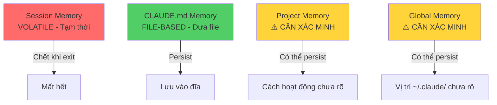

# Module 4.4: Hệ Thống Memory

> **Thời gian học**: ~30 phút
>
> **Yêu cầu trước**: Module 4.3 (Slash Commands)
>
> **Kết quả**: Sau module này, bạn sẽ hiểu toàn bộ kiến trúc memory của Claude Code — cái gì persist, cái gì không, và cách thiết kế workflow để Claude Code giữ đúng knowledge xuyên session, project, và team member.

---

## 1. WHY — Tại Sao Cần Biết Điều Này

Bạn dùng Claude Code được ba tuần. Có hôm nó nhớ mọi thứ về project của bạn. Có hôm bạn phải giải thích lại kiến trúc lần thứ năm. Bạn tự hỏi: "Claude Code thực sự nhớ gì giữa các session? Tại sao đôi khi nó biết convention của mình, đôi khi lại quên sạch?" Hiểu kiến trúc memory của Claude Code là ranh giới giữa việc dùng nó như công cụ stateless phải train đi train lại, versus một coding partner bền vững học được workflow của bạn.

---

## 2. CONCEPT — Ý Tưởng Cốt Lõi

Memory của Claude Code không phải là một hệ thống thống nhất — nó là một **stack nhiều lớp**, mỗi lớp có tính persistence khác nhau. Hiểu stack này là then chốt để làm việc hiệu quả.

### Memory Stack (4 Lớp)



**Lớp 1: Session Memory (Tạm thời)**
Mọi thứ trong context cuộc hội thoại hiện tại. Quản lý bằng `/compact` và `/clear`. Chết khi bạn thoát session. Bao gồm: prompt gần đây, response của Claude, nội dung file nó đã đọc, và mental model nó đã xây dựng.

**Lớp 2: CLAUDE.md Memory (Dựa file)**
Nội dung lưu trong `CLAUDE.md` (global hoặc project-specific). Đây là **lớp persistent duy nhất có bảo đảm**. Sống dưới dạng file thường trên đĩa. Load lại mới mỗi session. Đã đề cập ở Module 4.2.

**Lớp 3: Project Memory** ⚠️ Cần xác minh
Claude Code có thể duy trì memory persistent cho project ngoài những gì có trong `CLAUDE.md`. Chi tiết cách hoạt động chưa rõ. Coi như không chắc chắn cho đến khi verify trong môi trường của bạn.

**Lớp 4: Global User Memory** ⚠️ Cần xác minh
Thư mục `~/.claude/` có thể chứa persistent memory ngoài `CLAUDE.md` global. File config chắc chắn persist, nhưng việc Claude Code có duy trì learned patterns hay user preferences ngoài config hay không thì chưa được xác minh.

### Ma Trận Persistence

| Loại Memory | Persist Qua Sessions? | Cách Quản Lý |
|-------------|----------------------|--------------|
| Session context | ❌ Không | `/compact`, `/clear` |
| Nội dung CLAUDE.md | ✅ Có | Edit file |
| Conversation history | ⚠️ Xác minh | Chưa rõ |
| Config preferences | ✅ Có | `claude config` |
| Learned patterns | ⚠️ Xác minh | Chưa rõ |
| Nội dung file đã đọc | ❌ Không | Đọc lại mỗi session |

**Điểm mấu chốt**: Memory duy nhất bạn có thể *bảo đảm* là CLAUDE.md. Mọi thứ khác hoặc là volatile hoặc không chắc chắn. Thiết kế workflow xung quanh thực tế này.

### Ví Dụ Hình Ảnh

Giống như đi khám bác sĩ:
- **Session Memory** = Cuộc trò chuyện trong phòng khám (xong khám là quên)
- **CLAUDE.md** = Hồ sơ bệnh án (lưu vĩnh viễn, lần sau khám vẫn đọc được)
- **Project Memory** = Có thể bác sĩ nhớ mặt bạn? (Không chắc)
- **Global Memory** = Có thể bệnh viện có database tập trung? (Không chắc)

Bạn chỉ tin tưởng được **hồ sơ bệnh án** (CLAUDE.md). Còn lại đừng trông chờ.

---

## 3. DEMO — Từng Bước Cụ Thể

Hãy test ranh giới memory và verify cái gì persist.

**Bước 1: Start fresh và check baseline knowledge**
```bash
$ claude
```
Tương tác mong đợi:
```
Claude: Hello! How can I help you today?

Bạn: Bạn biết gì về project này?

Claude: I can see we're in /Users/you/myproject. [Có thể hoặc không nhắc đến nội dung CLAUDE.md tùy vào hành vi auto-loading]
```

**Bước 2: Build session memory qua công việc**
```
Bạn: Đọc src/auth.ts và nhớ: chúng ta dùng JWT với expiry 24 giờ

Claude: [Đọc file, xác nhận pattern]

Bạn: API base URL của chúng ta là https://api.example.com/v2

Claude: Noted. I'll use that URL for API-related code.
```
Bây giờ session context của Claude bao gồm: nội dung file, JWT pattern, API URL.

**Bước 3: Dùng /compact và quan sát**
```
Bạn: /compact
```
Output mong đợi:
```
Context compacted. Reduced from 45,000 to 12,000 tokens.
Preserved: Recent conversation, file contents, key facts.
```
Test: Hỏi Claude "JWT expiry của chúng ta là bao lâu?" — nó vẫn phải biết.

**Bước 4: Kết thúc session, start session mới**
```bash
$ exit
$ claude
```
Kết quả mong đợi:
```
Claude: Hello! How can I help you today?

Bạn: JWT expiry time của chúng ta là bao lâu?

Claude: I don't have that information in the current context. Could you remind me?
```
❌ Session memory ĐÃ MẤT. Claude không nhớ chi tiết JWT.

**Bước 5: Update CLAUDE.md với những phát hiện từ session**
Edit `CLAUDE.md`:
```markdown
## Authentication

- JWT tokens với 24-hour expiry
- API base: https://api.example.com/v2
- Refresh tokens lưu trong httpOnly cookies
```

**Bước 6: Verify CLAUDE.md memory trong session mới**
Start session mới:
```bash
$ claude
```
```
Bạn: JWT expiry time của chúng ta là bao lâu?

Claude: According to CLAUDE.md, your JWT tokens have a 24-hour expiry.
```
✅ CLAUDE.md memory PERSIST.

**Bước 7: Check persistent memory ngoài CLAUDE.md** ⚠️
```bash
$ ls -la ~/.claude/
```
Output mong đợi:
```
# Output có thể khác — cách hoạt động chưa rõ
drwxr-xr-x  5 you  staff   160 Jan 15 10:30 .
-rw-r--r--  1 you  staff  1234 Jan 15 10:30 config.json
-rw-r--r--  1 you  staff   456 Jan 10 09:15 CLAUDE.md
# Có thể có file khác — verify trong môi trường của bạn
```

Trong một Claude session:
```
Bạn: Bạn có duy trì persistent memory nào về tôi hoặc project của tôi ngoài CLAUDE.md không?

Claude: [Response sẽ làm rõ cách hoạt động — quan sát kỹ]
```

⚠️ Nếu Claude nhắc đến persistent learning hoặc conversation history, ghi chú lại cơ chế. Nếu không, giả định chỉ có CLAUDE.md persist.

---

## 4. PRACTICE — Thử Tự Làm

### Bài Tập 1: Memory Audit

**Mục tiêu**: Lập bản đồ ranh giới persistence chính xác trong Claude Code installation của bạn.

**Hướng dẫn**:
1. Start Claude Code trong thư mục trống (không có `CLAUDE.md`)
2. Nói với Claude: "Code style tôi thích: single quotes, 2-space indent, arrow functions"
3. Nhờ nó viết một TypeScript function nhỏ
4. Verify nó dùng style của bạn
5. Exit và restart Claude trong CÙNG thư mục
6. Nhờ nó viết function khác MÀ KHÔNG nhắc lại style preferences
7. Quan sát: Nó có nhớ style của bạn không?
8. Giờ tạo `CLAUDE.md` với style rules của bạn
9. Exit và restart lần nữa
10. Nhờ function thứ ba — giờ nó có dùng style của bạn chưa?

**Kết quả mong đợi**:
- Bước 1-6: Claude quên style của bạn (chứng minh session memory là volatile)
- Bước 7-10: Claude nhớ qua CLAUDE.md (chứng minh file-based persistence hoạt động)

<details>
<summary>💡 Gợi Ý</summary>
Chú ý xem Claude Code có auto-load CLAUDE.md khi start session hay bạn cần reference nó rõ ràng không. Hành vi có thể khác nhau theo version.
</details>

<details>
<summary>✅ Giải Pháp</summary>

**Điều bạn nên quan sát được**:
- **Không có CLAUDE.md**: Claude Code có ZERO memory giữa các session. Mỗi restart là tờ giấy trắng.
- **Có CLAUDE.md**: Claude Code load project rules khi start session (hoặc ở file operation đầu tiên). Memory persist hoàn hảo.

**Điểm mấu chốt**: Nếu muốn Claude nhớ điều gì, ĐƯA VÀO CLAUDE.md. Session memory vô dụng cho persistence.

**Điều ngạc nhiên thường gặp**: Nhiều người kỳ vọng Claude Code sẽ "học" style của họ theo thời gian. Nó không làm vậy. Nó stateless giữa các session. CLAUDE.md là lớp persistence duy nhất.
</details>

### Bài Tập 2: Thiết Kế Memory Architecture

**Mục tiêu**: Thiết kế setup memory lý tưởng cho một project thực của bạn.

**Hướng dẫn**:
1. Chọn một project bạn đang làm
2. Xác định 3 loại knowledge Claude cần:
   - **Session-level**: Context tạm thời (debugging session hiện tại, thay đổi gần đây)
   - **Project-level**: Project rules persistent (kiến trúc, conventions, APIs)
   - **Global-level**: Preferences cá nhân của bạn (coding style, workflow habits)
3. Thiết kế memory strategy:
   - Cái gì vào project `CLAUDE.md`?
   - Cái gì vào global `~/.claude/CLAUDE.md`?
   - Cái gì chỉ ở session memory?
4. Thực thi strategy và test trong một tuần

**Kết quả mong đợi**: Phân tách rõ ràng giữa ephemeral (session), project-persistent (CLAUDE.md), và global-persistent (global CLAUDE.md) knowledge.

<details>
<summary>💡 Gợi Ý</summary>
Global CLAUDE.md chỉ nên chứa preferences áp dụng cho TẤT CẢ projects của bạn. Project CLAUDE.md chỉ nên chứa rules cụ thể cho codebase đó. Session memory cho mọi thứ trở nên irrelevant sau khi task hoàn thành.
</details>

<details>
<summary>✅ Giải Pháp</summary>

**Ví Dụ Memory Strategy** (cho project Next.js + TypeScript):

**Global `~/.claude/CLAUDE.md`**:
```markdown
# Coding Preferences Của Tôi

- TypeScript strict mode luôn bật
- Ưu tiên functional programming patterns
- Dùng Prettier defaults, single quotes
- Test framework: Vitest (không phải Jest)
```

**Project `CLAUDE.md`**:
```markdown
# Project: E-commerce Dashboard

## Stack
- Next.js 14 (App Router)
- Prisma ORM với PostgreSQL
- Tailwind CSS cho styling

## Architecture Rules
- Server components by default
- Client components đánh dấu 'use client'
- API routes trong app/api/
- Database schema định nghĩa trong prisma/schema.prisma
```

**Session Memory** (không bao giờ viết xuống):
- "Đang debug checkout flow"
- "User báo lỗi với Safari browser"
- "Test payment webhook locally"

**Tại sao cách này hiệu quả**:
- Global rules áp dụng cho tất cả 15 projects của bạn
- Project rules cụ thể cho codebase này
- Session context bị quên sau khi bạn giải quyết bug — và điều đó ổn

**Sai lầm thường gặp**: Đưa temporary debugging context vào CLAUDE.md. Đừng làm bẩn project memory với chi tiết ephemeral.
</details>

---

## 5. CHEAT SHEET

### Bảng Tham Chiếu Memory Layer

| Loại Memory | Lưu Ở Đâu | Persist? | Quản Lý Qua | Tốt Nhất Cho |
|-------------|-----------|----------|-------------|--------------|
| Session context | In-memory | ❌ Không | `/compact`, `/clear` | Focus task hiện tại |
| CLAUDE.md (project) | `./CLAUDE.md` | ✅ Có | Edit file | Rules cụ thể project |
| CLAUDE.md (global) | `~/.claude/CLAUDE.md` | ✅ Có | Edit file | Preferences cá nhân |
| Config settings | `~/.claude/config.json` ⚠️ | ✅ Có | `claude config` | CLI preferences |
| Conversation history | Chưa rõ ⚠️ | ⚠️ Xác minh | Chưa rõ | Chưa rõ |

### Test Memory Nhanh

Để verify cái gì persist trong Claude Code installation CỦA BẠN:

```bash
# Test 1: Session memory (sẽ fail)
$ claude -p "Nhớ nhé: màu yêu thích của tôi là xanh dương"
$ claude -p "Màu yêu thích của tôi là gì?"
# Mong đợi: "I don't have that information" (không persist)

# Test 2: CLAUDE.md memory (sẽ work)
$ echo "# User thích màu xanh dương" > CLAUDE.md
$ claude -p "Tôi thích màu gì?"
# Mong đợi: "According to CLAUDE.md, you prefer blue" (persist)
```

### Workflow Session → Permanent

```
1. Làm việc trong session → build context
2. Dùng /compact → giữ lại phần quan trọng
3. Xác định patterns đáng giữ
4. Update CLAUDE.md với patterns đó
5. Exit session
6. Session tiếp theo → Claude loads CLAUDE.md → knowledge persist
```

### Config Preferences (Verified Persistent)

```bash
# Các settings này persist qua tất cả sessions
$ claude config --help  # Xem các config options có sẵn

# Ví dụ: Set preferred model (nếu được hỗ trợ)
$ claude config set model sonnet  # ⚠️ Cần xác minh

# Config lưu trong ~/.claude/config.json (hoặc tương tự)
```

---

## 6. PITFALLS — Sai Lầm Thường Gặp

| ❌ Sai Lầm | ✅ Cách Đúng |
|------------|--------------|
| **Giả định Claude "học" style của bạn theo thời gian** | Claude Code là stateless giữa các session. Nếu muốn nó nhớ, đưa vào CLAUDE.md. |
| **Giải thích lại kiến trúc mỗi session** | Viết kiến trúc vào CLAUDE.md một lần. Reference mãi mãi. Session memory KHÔNG thiết kế cho persistence. |
| **Nhét CLAUDE.md đầy context tạm thời** | Chi tiết session-level ("đang debug X") nên ở trong session memory. CLAUDE.md chỉ cho project rules *persistent*. |
| **Quên update CLAUDE.md sau khi phát hiện patterns** | Khi bạn dạy Claude điều quan trọng giữa session, thêm vào CLAUDE.md trước khi exit. Nếu không ngày mai phải dạy lại. |
| **Kỳ vọng /compact persist qua sessions** | `/compact` chỉ ảnh hưởng session HIỆN TẠI. Nó không ghi gì vào đĩa. Session kết thúc = compacted context mất luôn. |
| **Không test ranh giới persistence** | Chạy memory audit (Bài Tập 1) ít nhất một lần. Đừng giả định — verify cái version Claude Code của bạn thực sự persist. |

---

## 7. REAL CASE — Câu Chuyện Thực Tế

**Tình huống**: Nam, một freelance developer Việt Nam ở TP.HCM, quản lý bốn project client cùng lúc:
- Client A: App ngân hàng KMP (Kotlin Multiplatform)
- Client B: Next.js e-commerce cho Shopee Affiliate
- Client C: Python data pipeline cho logistics
- Client D: Flutter social app cho startup Việt

**Vấn đề**: Trước khi hiểu memory system của Claude Code, Nam bắt đầu mỗi coding session với nghi thức "re-onboarding" 10 phút. Anh gõ ra project stack, architecture rules, và task hiện tại. Rồi làm việc 2 tiếng. Ngày hôm sau? Cùng nghi thức 10 phút. Bốn projects = 40 phút lặp lại context mỗi ngày. Frustrating và lãng phí.

**Giải pháp**: Nam thực thi kiến trúc memory hai tầng:

1. **Global `~/.claude/CLAUDE.md`** (style cá nhân):
   ```markdown
   # Coding Preferences Của Nam
   - Luôn dùng TypeScript khi có thể
   - Ưu tiên React hooks hơn class components
   - Follow Airbnb style guide
   - Comments bằng tiếng Anh, commit messages bằng tiếng Việt
   ```

2. **Per-project `CLAUDE.md`** (cụ thể client):
   - Client A: KMP conventions, shared code structure, iOS/Android specifics
   - Client B: Next.js App Router patterns, Shopee API integration, affiliate tracking
   - Client C: Python virtual env, data sources, cron schedule, legacy quirks
   - Client D: Flutter navigation setup, Firebase collections, push notification flow

**Workflow**:
```bash
# Switch sang project Client A
$ cd ~/clients/clientA-banking-kmp
$ claude  # Auto-loads global + project CLAUDE.md

# Claude biết ngay:
# - Preferences cá nhân của Nam (global)
# - Setup KMP của Client A (project)
# - Không cần giải thích lại

# Làm việc 2 tiếng, phát hiện pattern mới
# Trước khi exit:
Bạn: Update CLAUDE.md — chúng ta đã chuẩn hóa dùng Ktor cho networking, không dùng Retrofit

# Ngày hôm sau:
$ claude
Claude: [Biết về Ktor standard từ CLAUDE.md]
```

**Kết quả**:
- **Trước**: 10 phút/ngày/project × 4 projects = 40 phút lãng phí mỗi ngày
- **Sau**: Zero re-onboarding. Chuyển context tức thì.
- **Bonus**: Khi Nam đưa junior dev vào giúp Client B, anh chỉ cần gửi file `CLAUDE.md` của project. Claude Code session của junior dev bắt đầu với cùng knowledge Nam có. Team synchronization miễn phí.

**Điểm mấu chốt**: Nam coi CLAUDE.md như "bộ não project" và session memory như "giấy nháp." Bộ não persist. Giấy nháp vứt đi mỗi ngày. Khi anh hiểu rõ sự phân biệt này, workflow nhanh hơn 3 lần.

---

> **Tiếp theo**: [Module 5.1: Kiểm Soát Context](../../phase-05-context-mastery/01-controlling-context/) →
