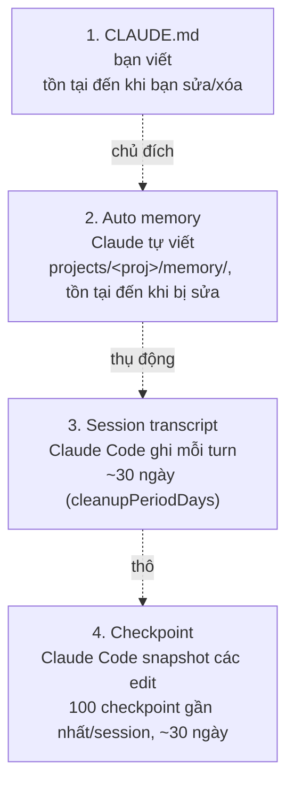

# Module 4.4: Hệ Thống Memory

> **Thời gian học**: ~35 phút
>
> **Yêu cầu trước**: Module 4.3 (Slash Commands)
>
> **Kết quả**: Sau module này, bạn giải thích được bốn loại memory Claude Code duy trì —
> CLAUDE.md, auto memory, session transcript, và checkpoint — resume hoặc branch một session cũ,
> rewind một turn tệ, và tìm từng loại trên đĩa.

---

## 1. WHY — Tại Sao Cần Biết Điều Này

Bạn gập laptop giữa chừng task. Sáng hôm sau gõ `claude`, chuẩn bị tinh thần cho khởi đầu trắng
tinh — nhưng nó đã biết cái quirk JWT bạn nói hôm qua, mà bạn chưa từng ghi vào đâu cả. Rồi Claude
chạy `rm` nhầm file, bạn bấm Esc hai lần mong có undo, và... file vẫn mất. Hai hệ thống, hai kết
quả, và hầu hết mọi người chẳng bao giờ học được cái nào là cái nào. Module này vẽ bản đồ bốn nơi
Claude Code thực sự giữ state, để bạn ngừng đoán mò và dùng đúng nơi có chủ đích.

---

## 2. CONCEPT — Ý Tưởng Cốt Lõi

Claude Code giữ state ở bốn nơi tách biệt. Hai nơi bạn viết, hai nơi nó tự viết cho bạn — và mỗi
nơi tồn tại trong một khoảng thời gian khác nhau.


```mermaid
graph TB
    A["1. CLAUDE.md<br/>bạn viết<br/>tồn tại đến khi bạn sửa/xóa"]
    B["2. Auto memory<br/>Claude tự viết<br/>projects/&lt;proj&gt;/memory/, tồn tại đến khi bị sửa"]
    C["3. Session transcript<br/>Claude Code ghi mỗi turn<br/>~30 ngày (cleanupPeriodDays)"]
    D["4. Checkpoint<br/>Claude Code snapshot các edit<br/>100 checkpoint gần nhất/session, ~30 ngày"]
    A -.chủ đích.-> B -.thụ động.-> C -.thô.-> D
```

**1. CLAUDE.md — ghi chú bạn để lại cho chính mình.** Đã học ở [Module 4.2](../02-claude-md/).
Bạn viết nó, nó nằm ở `./CLAUDE.md` hoặc `~/.claude/CLAUDE.md`, và tồn tại mãi mãi cho đến khi bạn
sửa hoặc xóa.

**2. Auto memory — ghi chú Claude để lại cho chính nó.** Bật mặc định. Claude tự viết file ngắn
vào `~/.claude/projects/<project>/memory/` — index `MEMORY.md` cộng topic file cho mỗi memory,
gắn tag `user`, `feedback`, `project`, hoặc `reference` — không cần bạn yêu cầu. "200 dòng đầu của
`MEMORY.md`, hoặc 25KB đầu, cái nào đến trước, được load khi bắt đầu mỗi conversation"; topic file
chỉ load khi được reference. Không như transcript, nó không bị retention quét dọn. Bật/tắt qua
`/memory`, per-project bằng `{"autoMemoryEnabled": false}`, hoặc toàn cục bằng
`CLAUDE_CODE_DISABLE_AUTO_MEMORY=1` ([docs/en/memory](https://code.claude.com/docs/en/memory)).

**3. Session transcript — bản ghi âm.** Mọi message và tool call bạn trao đổi được append, trực
tiếp, vào `~/.claude/projects/<project>/<session-id>.jsonl`. Đây là thứ `--continue`, `--resume`,
`/resume`, `/branch`, `/rename`, và `/export` đều đọc từ đó. Giữ khoảng 30 ngày mặc định, cấu
hình bằng setting `cleanupPeriodDays`
([docs/en/sessions](https://code.claude.com/docs/en/sessions)).

**4. Checkpoint — lịch sử undo.** Mỗi prompt bắt đầu một turn tạo ra một checkpoint: snapshot file
của bất cứ gì tool của Claude thay đổi. Claude Code "giữ file snapshot cho 100 checkpoint gần nhất
trong một session," restore được bằng `/rewind` hoặc Esc Esc khi prompt trống. **Checkpointing
không track file bị sửa bởi Bash command** — `rm`, `mv`, `cp` vô hình với nó và không thể hoàn tác
qua rewind (S15) — và nó nói rõ "không phải thứ thay thế version control"
([docs/en/checkpointing](https://code.claude.com/docs/en/checkpointing)).

Chỉ lớp 1 và 2 là knowledge Claude *mang theo vào việc mới*. Lớp 3 và 4 chỉ để *quay lại* việc đã
làm.

---

## 3. DEMO — Từng Bước Cụ Thể

Lab: `~/cc-lab` (một git repo nhỏ có `src/math.js`).

**Bước 1: Xem cả bốn lớp nằm ở đâu**
```bash
# docs: en/settings, en/sessions
ls ~/.claude/
```
```text
# Output có thể khác — entry đặc thù của plugin đã cài được thay bằng …
…
backups
cache
…
CLAUDE.md
…
debug
downloads
feedback
file-history
…
history.jsonl
…
jobs
…
mcp-needs-auth-cache.json
paste-cache
plans
plugins
projects
session-env
sessions
settings.json
shell-snapshots
skills
state
stats-cache.json
tasks
…
```
Entry cụ thể tùy version Claude Code và plugin/feature bạn đã cài.

`projects/` chứa lớp 2 và 3, một thư mục cho mỗi repo:
```bash
# docs: en/sessions — <project> = đường dẫn thư mục, ký tự non-alphanumeric thành -
ls ~/.claude/projects | grep cc-lab
```
```text
# Output có thể khác
-Users-you-cc-lab
-Users-you-cc-lab--claude-worktrees-auto-demo
```

**Bước 2: Xem auto memory tự viết**
```bash
$ claude
> Remember that this lab uses node:test, never jest
```
```text
# Output có thể khác
⏺ Directory is empty — no existing memory to update.
  Wrote 2 memories (ctrl+o to expand)
⏺ I've saved this to memory: tests in this lab use node:test with node:assert/strict, and never jest.
```
```text
> /memory
```
```text
# Output có thể khác
  Memory
  ❯ Auto-memory  true
  ❯ User instructions   Saved in ~/.claude/CLAUDE.md
    Project instructions   Checked in at ./CLAUDE.md
    Open auto-memory folder
  Learn more: https://code.claude.com/docs/en/memory
```
Trên đĩa:
```bash
# docs: en/memory — MEMORY.md là index; mỗi memory còn có topic file riêng
cat ~/.claude/projects/-Users-you-cc-lab/memory/MEMORY.md
```
```text
# Output có thể khác
- [Test runner: node:test](test-runner-node-test.md) — cc-lab uses node:test, never jest
```
Topic file mang frontmatter `type: feedback` và giải thích đầy đủ Claude viết.

**Bước 3: Resume một session có tên**
```bash
# docs: en/sessions — claude -n <name> đặt tên; claude --resume <name> mở lại theo tên đó
$ claude -n memory-demo
> The magic word for this session is grapefruit.
> /exit
$ claude --resume memory-demo
> What's the magic word from earlier in this session?
```
```text
# Output có thể khác
⏺ The magic word is grapefruit.
```
`--resume <name>` mở lại transcript theo tên — lớp 3, không phải lớp 2.

**Bước 4: Rewind một edit sai**

Nhờ Claude thêm một function vào `src/math.js`, approve edit, rồi bấm **Esc, Esc** khi prompt
trống:
```text
# Output có thể khác
  Rewind
  Restore the code and/or conversation to the point before…
    Add a subtract(a, b) function to src/math.js that returns a - b
    math.js +1
  ❯ (current)
```
Bấm Up, Enter. Màn hình confirm này (chụp đủ chiều cao, không cắt) chỉ có tối đa 5 lựa chọn khi có
code snapshot để restore — không có dòng "Never mind" ở đây, Esc để hủy thay vào đó; Bài Tập 3 bên
dưới sẽ cho thấy bản 4 lựa chọn dùng khi không có code để restore:
```text
# Output có thể khác
  Confirm you want to restore to the point before you sent this message:
  The conversation will be forked.
  The code will be restored -1 in math.js.
  ❯ 1. Restore code and conversation
    2. Restore conversation
    3. Restore code
    4. Summarize from here
  ↓ 5. Summarize up to here
  ⚠ Rewinding does not affect files edited manually or via bash.
```
Chọn **Restore code and conversation**, rồi kiểm tra:
```bash
# docs: en/checkpointing
git -C ~/cc-lab diff
```
```text
# Output có thể khác — trống, math.js đã trở về nội dung trước khi edit
```

**Bước 5: Branch thay vì ghi đè**
```text
> /branch try-alt
```
```text
# Output có thể khác
⎿  Branched conversation "try-alt". You are now in the new branch (session fd2adace-…). Use
   /resume 1c8dba65-… ("branch-demo") to return to the original, or run claude -r
   1c8dba65-… in a new terminal.
```
Cả hai session chia sẻ history đến điểm branch, rồi rẽ nhánh.

**Bước 6: Dọn dẹp memory bạn vừa tạo**
```bash
# docs: en/memory — file thường, xóa trực tiếp an toàn
rm ~/.claude/projects/-Users-you-cc-lab/memory/MEMORY.md \
   ~/.claude/projects/-Users-you-cc-lab/memory/test-runner-node-test.md
```
Chỉ xóa file *bạn* vừa tạo — auto memory dùng chung cho mọi worktree của repo đó.

---

## 4. PRACTICE — Thử Tự Làm

### Bài Tập 1: Export transcript hôm qua

**Mục tiêu**: Tìm session cũ của thư mục hiện tại và export ra file.

**Hướng dẫn**: Chạy `claude --resume` (không tên) để mở session picker, tìm entry hôm qua,
resume nó, rồi chạy `/export` và chọn "Save to file."

<details>
<summary>💡 Gợi Ý</summary>
Picker còn hỗ trợ `Ctrl+A` để hiện session từ mọi project, không chỉ project hiện tại.
</details>

<details>
<summary>✅ Giải Pháp</summary>

```bash
claude --resume
# chọn session, bấm Enter
> /export
# chọn "2. Save to file"
```
`/export <filename>` bỏ qua menu luôn. File lưu là plain text, không phải `.jsonl` thô — hữu ích
để paste vào ticket, không dùng để script vào được.
</details>

### Bài Tập 2: Tắt auto memory cho một repo nhạy cảm

**Mục tiêu**: Xác nhận auto memory đã tắt bằng `/memory`, không phải bằng cách hỏi Claude.

**Hướng dẫn**: Thêm `{"autoMemoryEnabled": false}` vào `.claude/settings.json` của repo đó, start
`claude`, chạy `/memory`, và kiểm tra dòng "Auto-memory".

<details>
<summary>💡 Gợi Ý</summary>
Setting này per-project; `CLAUDE_CODE_DISABLE_AUTO_MEMORY=1` là bản toàn cục tương đương.
</details>

<details>
<summary>✅ Giải Pháp</summary>

```text
# Output có thể khác
  Memory
  ❯ Auto-memory  false
  ❯ User instructions   Saved in ~/.claude/CLAUDE.md
    Project instructions   Checked in at ./CLAUDE.md
```
Để ý dòng "Open auto-memory folder" cũng biến mất — tắt rồi thì không còn folder nào để mở.
</details>

### Bài Tập 3: Chứng minh rewind không hoàn tác được `rm`

**Mục tiêu**: Tận mắt thấy giới hạn Bash của checkpointing (S15), rồi khôi phục đúng cách.

**Hướng dẫn**: Tạo một file throwaway, nhờ Claude xóa nó bằng Bash `rm`, rồi chạy `/rewind` và
chọn "Restore conversation."

<details>
<summary>💡 Gợi Ý</summary>
Để ý restore option nào còn được đưa ra khi thay đổi đến từ Bash.
</details>

<details>
<summary>✅ Giải Pháp</summary>

```text
# Output có thể khác
  Rewind
  Confirm you want to restore to the point before you sent this message:
  The code will be unchanged.
  ❯ 1. Restore conversation
    2. Summarize from here
    3. Summarize up to here
    4. Never mind
```
Để ý "Restore code" thậm chí không xuất hiện như một lựa chọn — không có snapshot nào để restore.
File vẫn mất. Khôi phục phải đến từ git: `git restore <path>` (nếu tracked) hoặc backup riêng của
bạn (untracked — không có gì mang nó trở lại).
</details>

---

## 5. CHEAT SHEET

| Lớp | Nằm ở | Tồn tại | Quản lý qua |
|---|---|---|---|
| CLAUDE.md | `./CLAUDE.md`, `~/.claude/CLAUDE.md` | Đến khi bạn sửa/xóa | Edit file ([4.2](../02-claude-md/)) |
| Auto memory | `~/.claude/projects/<project>/memory/` | Đến khi bị sửa/xóa | `/memory`, `autoMemoryEnabled` |
| Session transcript | `~/.claude/projects/<project>/<id>.jsonl` | ~30 ngày, `cleanupPeriodDays` | `--continue`, `--resume`, `/export` |
| Checkpoint | File snapshot nội bộ | 100 gần nhất, ~30 ngày | `/rewind`, Esc Esc |

| Lệnh | Tác dụng |
|---|---|
| `claude -n <name>` | Start một session có tên |
| `claude --continue` | Mở lại session gần nhất ở đây |
| `claude --resume [name\|id]` | Mở lại một session cụ thể, hoặc mở picker |
| `claude --continue --fork-session` | Resume vào một session ID *mới*, không kế thừa grant |
| `/branch [name]` | Copy conversation, giữ cả hai, cùng process/grant |
| `/rename <name>` | Đặt/đổi tên session hiện tại |
| `/export [file]` | Copy hoặc lưu transcript dạng plain text |
| `/rewind`, Esc Esc | Mở menu rewind |
| `CLAUDE_CODE_DISABLE_AUTO_MEMORY=1` | Tắt auto memory ở mọi nơi |
| `cleanupPeriodDays` (settings.json) | Đổi retention của transcript/checkpoint |

---

## 6. PITFALLS — Sai Lầm Thường Gặp

| ❌ Sai Lầm | ✅ Cách Đúng |
|---|---|
| Giả định Claude Code là stateless giữa các session | Auto memory và transcript đều sống sót qua `/exit` — check `/memory` và `claude --resume` trước khi giải thích lại |
| `claude config set model sonnet` / sửa `~/.claude/config.json` | Cả hai đều không tồn tại. Settings nằm ở `~/.claude/settings.json` (hoặc `.claude/settings.json` per project) |
| Hỏi Claude "bạn có nhớ tôi không?" như bằng chứng persistence | Hỏi filesystem: `/memory`, hoặc `cat` các file trong `~/.claude/projects/<project>/memory/` |
| Tin `/rewind` sau khi Claude chạy `rm`, `mv`, hoặc `cp` | Checkpointing chưa bao giờ track thay đổi từ Bash (S15) — khôi phục từ git hoặc backup |
| Commit `CLAUDE.local.md` vào repo | Đó là lớp cá nhân, gitignored — commit `CLAUDE.md`, giữ `.local.md` ngoài version control |

---

## 7. REAL CASE — Câu Chuyện Thực Tế

**Tình huống**: Nam, một freelance developer ở TP.HCM, xoay vòng bốn repo client: một app ngân
hàng KMP, một storefront Next.js, một data pipeline Python, và một social app Flutter.

**Vấn đề**: Mỗi sáng anh giải thích lại thread debug hôm trước — branch nào, giả thuyết nào đã
loại, client vừa đổi yêu cầu gì.

**Giải pháp**: Anh ngừng chống lại bốn lớp và dùng đúng chỗ của từng lớp. Quy tắc project vào
`CLAUDE.md` mỗi repo — chủ đích, theo client. Quirk Claude tự nhận ra ("CI repo này reject
`node --test` nếu không chỉ file glob rõ ràng") rơi vào auto memory mà Nam không gõ gì. Mỗi
session debug được đặt tên: `claude -n checkout-bug`. Sáng hôm sau, `claude --resume checkout-bug`
đưa anh về đúng chỗ đã dừng — không cần giải thích lại — và nếu fix sai hướng, Esc Esc chỉ rewind
session đó, không đụng ba client kia.

**Kết quả**: Nghi thức "cập nhật cho tôi" mỗi sáng biến mất. Fix sai giờ chỉ tốn vài giây, không
phải revert tay; Claude xóa file qua Bash đưa anh thẳng tới `git restore`, không bao giờ `/rewind`.
CLAUDE.md là bộ não anh viết có chủ đích; auto memory là cuốn sổ Claude âm thầm giữ; transcript là
cuộn băng anh tua lại hoặc rẽ nhánh.

---

> **Tiếp theo**: [Module 5.1: Kiểm Soát Context](../../phase-05-context-mastery/01-controlling-context/) →
