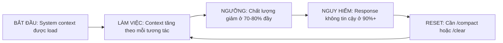

# Module 5.1: Kiểm Soát Context

> **Thời gian học**: ~30 phút
>
> **Yêu cầu trước**: Module 4.4 (Hệ thống Memory)
>
> **Kết quả**: Sau module này, bạn sẽ hiểu chính xác cái gì chiếm context window của Claude Code, cách kiểm soát cái gì đi vào, và cách duy trì output chất lượng cao suốt session dài bằng quản lý context có chủ đích.

---

## 1. WHY — Tại Sao Cần Biết

Bạn code được 40 phút. Hồi đầu, Claude Code đưa solution sắc bén, cụ thể. Giờ thì response mơ hồ, lặp lại, có khi còn vô lý. Chuyện gì xảy ra? Context window của bạn đã đầy. Giống như RAM vậy — bạn có 1 lượng cố định, không mua thêm được, và khi nó đầy thì mọi thứ chậm lại. Sự khác biệt giữa người dùng Claude Code thường và power user không phải kỹ năng. Đó là kỷ luật quản lý context. Cao thủ kiểm soát cái gì đi vào context window. Người mới để nó tràn ngẫu nhiên cho đến khi chất lượng sụp đổ.

---

## 2. CONCEPT — Ý Tưởng Cốt Lõi

### Context Window Là Gì?

**Context window** là bộ nhớ làm việc của Claude Code, đo bằng token (đại khái 4 ký tự = 1 token). Mọi thứ Claude đọc, viết, hay xử lý đều sống ở đây. Nó như 1 tấm bảng trắng có kích thước cố định — khi bạn chạm biên, thì hoặc nội dung cũ bị xóa, hoặc nội dung mới bị từ chối.

Model Claude hiện tại có context window từ 100K đến 200K token. Nghe to đấy. Nhưng thực tế, tour qua 1 codebase vừa phải đốt hết trong 20 phút.

### Cái Gì Chiếm Budget Context Của Bạn?

Nghĩ context như 1 ngân sách bạn chi tiêu qua 5 hạng mục:

| Hạng Mục | Mô Tả | % Budget Thường Thấy |
|----------|-------|----------------------|
| **System context** | CLAUDE.md, config, system instruction | 5-15% |
| **Lịch sử hội thoại** | Mỗi tin nhắn bạn gửi, mỗi response Claude viết | 20-40% |
| **Nội dung file** | Mỗi file Claude đọc (toàn bộ content được lưu) | 30-50% |
| **Output lệnh** | Terminal output từ bash, grep, ls, v.v. | 5-15% |
| **Reasoning của Claude** | Xử lý nội tại (extended thinking mode) | 0-20% |

Vùng nguy hiểm: nội dung file và lịch sử hội thoại tăng không kiểm soát.

### Vòng Đời Context

Đây là điều xảy ra trong 1 session điển hình:



### Đường Cong Chất Lượng-Context

Tác động context lên chất lượng KHÔNG tuyến tính:

- **0-50%**: Chất lượng cao, nhanh, chính xác
- **50-70%**: Vẫn tốt, hơi chậm
- **70-85%**: Giảm rõ rệt — câu trả lời mơ hồ, thiếu chi tiết
- **85-95%**: Chất lượng kém — lặp lại, ảo giác, mất mạch
- **95%+**: Không tin cậy — có thể từ chối task, tạo output vô lý

### Cái Bạn KIỂM SOÁT ĐƯỢC

- **Chọn file**: Chỉ đọc file liên quan, không đọc cả thư mục
- **Lọc output lệnh**: Dùng `head`, `tail`, `grep` để giới hạn output
- **Thời điểm compact**: Dùng `/compact` trước khi chất lượng giảm
- **Prompt gọn**: Prompt ngắn, chính xác thay vì tiểu luận
- **Chia nhỏ file**: Đọc file lớn theo từng đoạn, không đọc hết 1 lúc

---

## 3. DEMO — Từng Bước Cụ Thể

Hãy xem kiểm soát context thực tế với 1 project thật.

**Bước 1: Đo baseline**
```bash
claude
```
Sau khi vào session:
```
/cost
```
Output mong đợi:
```
Session cost: $0.02
Input tokens: 1,247 | Output tokens: 0
Context usage: 1,247 tokens (0.6%)
```
**Tại sao quan trọng**: Xác định điểm xuất phát. System context được load nhưng tối thiểu.

---

**Bước 2: Đọc 1 file và đo tác động**
```
Read src/auth/login.ts
```
Sau đó:
```
/cost
```
Output mong đợi:
```
Session cost: $0.08
Input tokens: 5,834 | Output tokens: 342
Context usage: 6,176 tokens (3.1%)
```
**Tại sao quan trọng**: 1 file vừa (~200 dòng) thêm ~4,500 token. Đó là ~3% budget của bạn.

---

**Bước 3: Cách SAI — làm tràn context**
```
Read all files in src/ recursively
```
```
/cost
```
Output mong đợi:
```
Session cost: $1.47
Input tokens: 87,253 | Output tokens: 1,205
Context usage: 88,458 tokens (44.2%)
```
**Tại sao quan trọng**: 1 lệnh bất cẩn đốt 44% budget của bạn. Bạn đã đi được nửa đường đến ngưỡng giảm chất lượng sau 1 request.

---

**Bước 4: Cách ĐÚNG — đọc có chọn lọc**
Bắt đầu lại:
```
/clear
```
Giờ hỏi chiến lược:
```
Show me only the function signatures in src/auth/ files
```
```
/cost
```
Output mong đợi:
```
Session cost: $0.12
Input tokens: 7,429 | Output tokens: 856
Context usage: 8,285 tokens (4.1%)
```
**Tại sao quan trọng**: Có được cái nhìn kiến trúc dùng ít context gấp 10 lần. Để dành việc đọc toàn bộ file cho khi cần edit.

---

**Bước 5: Kiểm soát output lệnh**
SAI:
```bash
git log --all --oneline
```
Output: 2,500 commit làm tràn context.

ĐÚNG:
```bash
git log --oneline -20
```
Output: Chỉ 20 commit gần nhất.

**Tại sao quan trọng**: Hầu hết lệnh git/grep/find có thể tạo output khổng lồ. Luôn giới hạn.

---

**Bước 6: Dùng /compact chiến lược**
Sau khi làm việc 15 phút:
```
/cost
```
Output mong đợi:
```
Context usage: 62,847 tokens (31.4%)
```
Trước khi tiếp tục:
```
/compact
```
Output mong đợi:
```
✓ Context compacted
Reduced from 62,847 to 38,492 tokens
Preserved: Current task, recent context, key files
```
```
/cost
```
Output mong đợi:
```
Context usage: 38,492 tokens (19.2%)
```
**Tại sao quan trọng**: `/compact` xóa lịch sử hội thoại nhưng giữ context quan trọng. Bạn vừa mua cho mình thêm 30 phút làm việc chất lượng cao.

---

**Bước 7: So sánh session có quản lý vs không quản lý**

**Session không quản lý** (không kiểm soát context):
- 0-20 phút: Tuyệt
- 20-35 phút: Ổn
- 35-45 phút: Đang giảm
- 45+ phút: Buộc phải restart

**Session có quản lý** (kiểm soát kỷ luật):
- 0-30 phút: Tuyệt
- `/compact` ở phút 30
- 30-60 phút: Tuyệt
- `/compact` ở phút 60
- 60-90+ phút: Vẫn tuyệt

---

## 4. PRACTICE — Tự Làm Thử

### Bài Tập 1: Context Budget Tracker
**Mục tiêu**: Theo dõi các thao tác khác nhau tiêu thụ context ra sao
**Hướng dẫn**:
1. Bắt đầu Claude Code session mới trong 1 project thật
2. Chạy `/cost` và ghi baseline
3. Thực hiện các thao tác này, chạy `/cost` sau mỗi lần:
   - Đọc 1 file nhỏ (<100 dòng)
   - Đọc 1 file lớn (500+ dòng)
   - Chạy `git log --oneline -50`
   - Yêu cầu Claude giải thích 1 function
   - Chạy `/compact`
4. Tạo bảng hiển thị token cost cho mỗi thao tác

**Kết quả mong đợi**: 1 bức tranh rõ ràng về cái gì đắt vs rẻ trong budget context của bạn.

<details>
<summary>💡 Gợi Ý</summary>
Đọc file thì đắt. Hội thoại thì vừa. /cost gần như miễn phí.
</details>

<details>
<summary>✅ Đáp Án</summary>

Bảng của bạn nên trông như thế này:

| Thao Tác | Token Thêm Vào | % của Budget 200K |
|----------|----------------|-------------------|
| Baseline | 1,200 | 0.6% |
| File nhỏ (80 dòng) | +2,400 | +1.2% |
| File lớn (600 dòng) | +18,000 | +9.0% |
| git log -50 | +3,200 | +1.6% |
| Giải thích function (hội thoại) | +1,800 | +0.9% |
| /compact | -15,000 | -7.5% |

**Bài học chính**: File lớn đắt gấp 7-8 lần file nhỏ. /compact có thể lấy lại budget đáng kể.
</details>

---

### Bài Tập 2: Selective Reading Challenge
**Mục tiêu**: Hiểu authentication flow dùng dưới 30% context budget
**Hướng dẫn**:
1. Chọn 1 project có auth module (login, JWT, session management)
2. Mục tiêu: Hiểu auth hoạt động ra sao mà không đọc toàn bộ file
3. Dùng chiến lược như:
   - Chỉ đọc type definition trước
   - Dùng grep tìm function signature
   - Yêu cầu Claude tóm tắt dựa trên signature
   - Chỉ đọc implementation đầy đủ cho các function chính
4. Kiểm tra `/cost` — giữ dưới 30%

**Kết quả mong đợi**: Bạn hiểu auth flow và giải thích được, dùng <30% context.

<details>
<summary>💡 Gợi Ý</summary>
Bắt đầu với "Show me the exported functions and types in auth/". Sau đó đào sâu có chọn lọc.
</details>

<details>
<summary>✅ Đáp Án</summary>

**Cách tiếp cận hiệu quả**:
1. `grep -r "export " src/auth/` — xem tất cả export (rẻ)
2. "List all files in src/auth/ with line counts" — hiểu phạm vi
3. "Show me the type definitions for User and Session" — hiểu data model
4. "Explain the flow from login() to token validation based on function signatures" — có overview
5. CHỈ KHI ĐÓ: "Read src/auth/jwt.ts" — đọc file quan trọng

**Kết quả**: Hiểu đầy đủ ở 22% context thay vì 65%.
</details>

---

## 5. CHEAT SHEET

| Kỹ Thuật | Cách Áp Dụng | Tác Động Context |
|----------|--------------|------------------|
| **Đọc file có chọn lọc** | Hỏi signature/type trước, file đầy đủ sau | -60% so với đọc hết |
| **Lọc output lệnh** | Dùng `head -20`, `tail -50`, `grep -A 5` | -80% so với full output |
| **/compact chiến lược** | Compact ở 30%, 60%, 80% trước khi giảm chất lượng | Reset về ~50-60% |
| **/clear vs /compact** | Dùng `/compact` để giữ context; `/clear` chỉ khi bắt đầu lại | `/compact` giữ công việc |
| **Prompt ngắn gọn** | "Fix the bug" không phải "I noticed there's a problem..." | -50% chi phí prompt |
| **Chia nhỏ file** | "Read lines 1-100 of X" cho file lớn | Chỉ đọc phần cần thiết |
| **Theo dõi /cost** | Kiểm tra sau các thao tác lớn | Hệ thống cảnh báo sớm |
| **Tránh đọc lại** | Tin Claude có context từ lần đọc trước | -100% chi phí trùng lặp |

---

## 6. PITFALLS — Sai Lầm Thường Gặp

| ❌ Sai Lầm | ✅ Cách Đúng |
|-----------|-------------|
| "Read all files in src/" khi explore | "Show me the directory structure and file purposes in src/" — hiểu layout trước, đọc có chọn lọc |
| Chạy `git log` không có `-20` hay `--since` | Luôn giới hạn output: `git log --oneline -20` hoặc `git log --since="1 week ago"` |
| Bỏ qua context đến khi Claude bắt đầu ảo giác | Theo dõi `/cost` chủ động — compact ở 60-70%, không phải ở 90% |
| Viết prompt dài như tiểu luận kèm câu chuyện nền | Trực tiếp: "Add error handling to saveUser()" không phải "So I was thinking about how our users..." |
| Đọc lại file Claude đã có trong context | Hỏi trước: "Do you have the current auth.ts in context?" Claude sẽ xác nhận |
| Không bao giờ dùng /compact, chỉ /clear | `/compact` giữ task context hiện tại. Dùng thoải mái. `/clear` là phương án cuối cùng |
| Để lệnh đổ ra hàng ngàn dòng | Pipe qua filter: `npm test \| head -50` hoặc yêu cầu Claude "Run tests and show only failures" |

---

## 7. REAL CASE — Câu Chuyện Thực Tế

**Tình huống**: Refactor checkout flow của 1 trang thương mại điện tử qua 80+ file (payment gateway, cart, inventory, shipping, khuyến mãi). Ước tính 6 giờ.

**Lần thử đầu (không kiểm soát context)**:
- Đọc 30 file ngay lập tức để "hiểu hệ thống"
- Context chạm 85% trong 45 phút
- Claude bắt đầu đưa lời khuyên chung chung thay vì chỉnh sửa cụ thể
- Phải `/clear` và restart — mất hết tiến độ
- Lặp lại 5 lần trong 6 giờ
- Mức độ thất vọng: tối đa

**Lần thử thứ hai (kiểm soát context kỷ luật)**:
- Bắt đầu với: "Show me checkout flow entry points and file dependencies"
- Chỉ đọc đầy đủ 3 file cốt lõi
- Với các file khác, dùng: "Show me the interface and public methods of X"
- Chạy `/compact` mỗi 25 phút, trước khi chạm 70%
- Context không bao giờ vượt 75%
- Hoàn thành trong 3.5 giờ, zero restart bắt buộc
- Chất lượng giữ cao suốt quá trình

**Bài học chính**: "Cách nhanh nhất làm việc với Claude Code là cho nó ÍT hơn — nhưng ít ĐÚNG thứ." Đọc 80 file cho Claude sự rối loạn. Đọc sâu 3 file, cộng interface của 20 file khác, cho Claude sự rõ ràng.

Làm chủ context không phải thuộc lệnh. Đó là suy nghĩ như 1 memory allocator: cái gì PHẢI ở working memory ngay bây giờ vs cái gì có thể để trên ổ cứng?

---

> **Tiếp theo**: [Module 5.2: Tối Ưu Context](../02-context-optimization/) →
