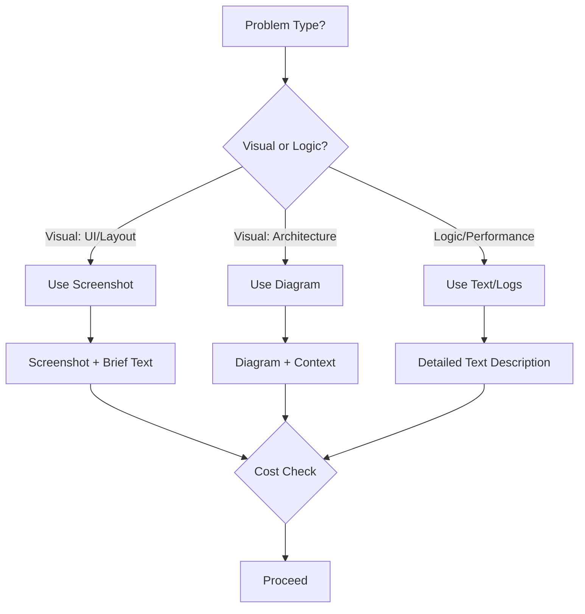

# Module 5.3: Context Hình ảnh & Visual

> **Thời gian học**: ~25 phút
>
> **Yêu cầu trước**: Module 5.2 (Tối ưu Context)
>
> **Kết quả**: Sau module này, bạn sẽ biết cách dùng visual context với Claude Code — cung cấp screenshot, UI mockup, diagram để nhận response chính xác hơn.

---

## 1. WHY — Tại sao cần Visual Context

Bạn đang mô tả UI bug cho Claude Code: "Button màu xanh không align với text field, margin bottom không đều, shadow bị clip...". Năm câu văn. Claude đưa fix. Apply code — không khớp. Vì sao? **Vì Claude không THẤY được issue thật sự**.

Một screenshot bằng ngàn token văn bản. Giống như gọi điện kể bác sĩ triệu chứng — bác sĩ phải đoán. Còn show ảnh X-quang — bác sĩ thấy chính xác ngay. Visual context là capability ít được dùng nhất trong Claude Code, nhưng khi bạn **show thay vì tell**, accuracy nhảy vọt từ 70% lên 95%.

Từ UI bug, architecture diagram, đến error screenshot — visual context biến mô tả mơ hồ thành evidence cụ thể.

---

## 2. CONCEPT — Ý tưởng Nền tảng

### Claude Code "Thấy" được gì

Claude Code có khả năng xử lý hình ảnh (vision capability). Bạn có thể cung cấp:

- **Screenshot UI/UX issue** — Layout lỗi, color không khớp, responsive break
- **Sơ đồ kiến trúc** — System diagram, flowchart, sequence diagram
- **Error screenshot** — Terminal error, browser DevTools, stack trace
- **Wireframe và mockup** — Figma export, sketch, hand-drawn wireframe
- **Database schema diagram** — ERD, table relationships

### Cách cung cấp Image

Claude Code hỗ trợ ba phương pháp đã được xác thực:

**Phương pháp 1: Dán từ Clipboard (Khuyến nghị)**

Cách nhanh nhất. Chụp screenshot rồi dán trực tiếp vào Claude Code:
- **macOS**: `Cmd+Shift+Ctrl+4` chụp vào clipboard, rồi **`Ctrl+V`** (KHÔNG PHẢI `Cmd+V`!) để dán
- **Windows**: `Win+Shift+S` chụp, rồi `Alt+V` để dán
- Đây là phương pháp CHÍNH mà developer nên dùng

**Phương pháp 2: Tham chiếu đường dẫn file**

Chỉ cần nhắc đến đường dẫn file trong prompt — Claude tự đọc file ảnh khi được tham chiếu:
```
Xem screenshot.png và fix layout issue
```
Hỗ trợ: PNG, JPG, GIF, WebP

**Phương pháp 3: Kéo và thả (Drag & Drop)**

Kéo file ảnh trực tiếp vào cửa sổ terminal. Hỗ trợ trên iTerm2, Ghostty, WezTerm, và Kitty.

### Tương thích Terminal

| Terminal | Dán từ Clipboard | Kéo thả | Phím tắt |
|----------|-----------------|---------|----------|
| iTerm2 | Có | Có | `Ctrl+V` |
| Ghostty | Có | Có | `Ctrl+V` |
| WezTerm | Có | Có | `Ctrl+V` |
| Kitty | Có | Có | `Ctrl+V` |
| VS Code Terminal | Có | Hạn chế | `Ctrl+V` |
| macOS Terminal.app | Không | Không | N/A |

### Khi nào Visual > Text



**Visual thắng**:
- UI bug → Screenshot chính xác hơn mô tả
- Layout issue → Nhìn là biết, kể mất 10 phút
- Architecture → Diagram đánh bại 500 từ văn bản
- Error message → Screenshot capture đầy đủ context và trạng thái

**Text thắng**:
- Logic bug (không hiện visual)
- Performance issue (log structure quan trọng hơn)
- Configuration problem (cần xem raw text)

### Chi phí Token của Image

Image tốn nhiều token hơn text. **Chiến lược**: Không screenshot mọi thứ. Dùng khi visual thực sự cần thiết. Crop phần cần thiết thay vì full screen 4K.

---

## 3. DEMO — Bước thực hành

### Bước 1: UI Bug — Screenshot Layout Issue

**Tình huống**: Button padding không đều trên mobile.

```
Prompt (không screenshot):
"Button 'Đăng nhập' trên mobile có padding không đều.
Top 12px, bottom 8px, left 16px, right 14px.
Text không căn giữa. Fix layout."
```

**Response**: Claude đưa fix dựa trên đoán — có thể không khớp với issue thật.

```
Prompt (với screenshot):
[Attach screenshot showing the button]
"Screenshot này cho thấy button 'Đăng nhập' có layout issue.
Analyze và fix padding và alignment."
```

**Response**: Claude thấy chính xác pixel values, font rendering, thậm chí shadow clipping — fix chính xác ngay lần đầu.

---

### Bước 2: Sơ đồ Kiến trúc — System Diagram

**Tình huống**: Giải thích microservices architecture.

```
Prompt (text):
"Hệ thống có API Gateway, Auth Service, Payment Service,
Notification Service. Gateway route đến services.
Auth dùng Redis cache. Payment call external bank API..."
```

**Mất công mô tả**, reader phải hình dung trong đầu.

```
Prompt (diagram):
[Attach architecture diagram PNG]
"Dựa vào diagram này, review architecture và suggest improvements
cho scalability và fault tolerance."
```

**Response**: Claude thấy rõ data flow, dependencies, bottlenecks — feedback cụ thể và chính xác.

---

### Bước 3: Error Screenshot — Browser/Terminal

**Tình huống**: Runtime error trong browser.

```
Prompt (text):
"TypeError: Cannot read properties of undefined (reading 'map')
at Component.render line 47
Stack trace dài..."
```

```
Prompt (screenshot):
[Attach DevTools screenshot showing error + stack + state]
"Analyze error này. Screenshot có đầy đủ stack trace và state."
```

**Benefit**: Claude thấy console warnings khác, network tab, React component tree — diagnose đầy đủ hơn.

---

### Bước 4: Wireframe to Code — Mockup thành Component

**Tình huống**: Figma mockup cần implement.

```
Prompt:
[Attach wireframe PNG]
"Implement screen này bằng Jetpack Compose.
Design system: Material 3, primary color #1976D2,
corner radius 8dp."
```

**Expected response**: Claude generate Compose code khớp y hệt layout, spacing, typography trong wireframe.

---

### Bước 5: Chi phí Image — /cost Check

Sau các bước trên, check cost impact:

```bash
/cost
```

**Expected output**:
```
Total tokens: ~4,200
  - Text: 800 tokens
  - Images: ~3,400 tokens (2 screenshots)
Estimated cost: $0.08
```

**Insight**: Mỗi screenshot ~ 1,500-2,000 tokens. Cân nhắc crop hoặc resize nếu cần optimize.

---

## 4. PRACTICE — Thực hành

### Bài tập 1: Screenshot vs Mô tả Text

**Mục tiêu**: So sánh accuracy khi dùng text vs screenshot.

**Hướng dẫn**:
1. Chọn một UI bug (layout, color, alignment issue) trong app của bạn
2. **Round 1**: Mô tả bug bằng text chi tiết (3-5 câu). Ghi nhận response của Claude
3. **Round 2**: Cung cấp screenshot cùng bug. Prompt ngắn gọn "Fix layout issue in screenshot"
4. So sánh: Response nào accurate hơn? Apply code nào ít back-and-forth hơn?
5. Chạy `/cost` — screenshot cost bao nhiêu token extra?

**Kết quả mong đợi**: Screenshot accuracy cao hơn, nhưng cost token cao hơn ~1,500 tokens.

<details>
<summary>💡 Gợi ý</summary>

Chọn UI bug **visual rõ ràng** (không phải logic bug). VD: button không align, margin không đều, color contrast issue. Screenshot crop chỉ phần liên quan — đừng full screen.

</details>

<details>
<summary>✅ Đáp án</summary>

**Round 1 (Text)**:
```
Prompt: "Button 'Submit' trên form đăng ký có padding top 8px,
bottom 12px. Text không căn giữa vertical. Background #2196F3. Fix."

Response: Claude fix padding → có thể không perfect vì không thấy font,
line-height, surrounding elements.
```

**Round 2 (Screenshot)**:
```
Prompt: [Screenshot] "Fix button alignment issue."

Response: Claude thấy chính xác font rendering, actual pixel misalignment,
thậm chí shadow subtle → fix perfect.
```

**Cost difference**: Text ~ 100 tokens, Screenshot ~ 1,600 tokens. **Trade-off đáng giá** nếu tránh được 2-3 rounds back-and-forth.

</details>

---

### Bài tập 2: Wireframe to Component

**Mục tiêu**: Implement UI component từ wireframe.

**Hướng dẫn**:
1. Vẽ wireframe đơn giản (hoặc dùng Figma/Sketch) — một card component với image, title, description, button
2. Export PNG, cung cấp cho Claude với prompt: "Implement component này bằng [React/Flutter/Compose]"
3. Review code generated — có khớp layout không?
4. Điều chỉnh prompt nếu cần: thêm spacing values, color codes, font sizes
5. Implement code, so sánh với wireframe

**Kết quả mong đợi**: Component khớp 80-90% với wireframe. Có thể cần fine-tune spacing/colors.

<details>
<summary>💡 Gợi ý</summary>

Wireframe càng rõ ràng → code càng accurate. Annotate measurements trên wireframe (VD: "16px padding", "24sp font") giúp Claude hiểu chính xác hơn.

</details>

<details>
<summary>✅ Đáp án</summary>

**Wireframe**: Card với image (top), title (bold 18sp), description (14sp gray), button (bottom, primary color).

**Prompt**:
```
[Attach wireframe]
"Implement card component này bằng Jetpack Compose.
Padding 16dp, corner radius 12dp, elevation 4dp.
Title: 18sp Bold, Description: 14sp Gray600."
```

**Expected code**:
```kotlin
@Composable
fun ProductCard() {
    Card(
        modifier = Modifier.fillMaxWidth(),
        shape = RoundedCornerShape(12.dp),
        elevation = CardDefaults.cardElevation(4.dp)
    ) {
        Column(Modifier.padding(16.dp)) {
            Image(...)  // Top
            Text("Title", fontSize = 18.sp, fontWeight = Bold)
            Text("Description", fontSize = 14.sp, color = Gray600)
            Button(...) // Bottom
        }
    }
}
```

**Accuracy**: Layout structure 100%, spacing có thể cần tweak ±2-4dp.

</details>

---

## 5. CHEAT SHEET

| Use Case | Cung cấp gì | Prompt ví dụ | Token Cost | Khi KHÔNG dùng |
|----------|-------------|--------------|------------|----------------|
| **UI Bug Fixing** | Screenshot cropped phần bug | `[Screenshot] Fix button alignment` | ~1,500 | Logic bug không visual |
| **Architecture Review** | System diagram (PNG/SVG export) | `[Diagram] Review architecture, suggest improvements` | ~1,800 | Simple architecture (<5 components) |
| **Error Diagnosis** | DevTools screenshot (console + stack + state) | `[Screenshot] Analyze error and suggest fix` | ~2,000 | Error message rõ ràng, không cần context |
| **Wireframe → Code** | Wireframe/mockup PNG + design specs | `[Wireframe] Implement with Compose, Material 3` | ~1,600 | Simple component, text description đủ |
| **Database Design** | ERD diagram | `[ERD] Review schema, suggest indexes` | ~1,500 | <5 tables, relationship đơn giản |

### Cách cung cấp Image

| Phương pháp | Cách dùng | Phù hợp cho |
|-------------|-----------|-------------|
| **Dán từ clipboard** | `Ctrl+V` (macOS: KHÔNG PHẢI `Cmd+V`!) | Screenshot nhanh — cách nhanh nhất |
| **Tham chiếu đường dẫn** | Nhắc path trong prompt: "Xem bug.png" | Ảnh đã lưu, chia sẻ team |
| **Kéo thả** | Kéo file vào terminal | Ảnh một lần dùng |

### Token Cost

- Screenshot trung bình: **1,500-2,000 tokens**
- Diagram phức tạp: **1,800-2,500 tokens**
- Crop/resize để giảm cost (quality đủ dùng)

### Khi KHÔNG dùng Image

- Logic bug, performance issue → Text/log rõ hơn
- Simple layout (vài dòng text mô tả đủ)
- Cost-sensitive task (text ~10x rẻ hơn)

---

## 6. PITFALLS — Sai lầm Thường gặp

| ❌ Sai lầm | ✅ Cách đúng |
|-----------|-------------|
| Mô tả UI bug bằng 10 câu văn chi tiết | Screenshot ngắn gọn, chính xác, tốn 5 giây |
| Upload screenshot 4K full desktop (5MB) | Crop phần cần thiết, resize xuống 1080p — vẫn đủ rõ, cost thấp hơn |
| Dùng screenshot cho logic bug (VD: "function trả về wrong value") | Text description với code snippet — không cần visual |
| Screenshot không context (chỉ có error message, không có code surrounding) | Screenshot bao gồm context: code line, stack trace, console warnings |
| Gửi 5 screenshots liên tục không check `/cost` | Check cost sau mỗi 1-2 images — optimize nếu vượt budget |
| Text trong screenshot quá nhỏ (8px font, blur) | Zoom in hoặc crop phần text trước khi screenshot — đảm bảo readable |
| Dùng `Cmd+V` để dán ảnh trên macOS — không có gì xảy ra vì `Cmd+V` bị terminal bắt làm text paste | Dùng **`Ctrl+V`** (KHÔNG PHẢI `Cmd+V`) — đây là gotcha phổ biến nhất với macOS user |
| Gửi screenshot full-screen — tốn token cho UI không liên quan | Crop chỉ phần cần thiết — dùng `Cmd+Shift+Ctrl+4` và kéo chọn vùng vấn đề |

---

## 7. REAL CASE — Câu chuyện Thực tế

### Bối cảnh

Team phát triển KMP app cho ngân hàng Việt Nam. Designer gửi Figma mockup 15 screens cho tính năng "Chuyển tiền quốc tế". Mỗi screen có nhiều chi tiết: icon custom, spacing chặt chẽ, color banking brand, typography đặc biệt.

### Trước khi dùng Visual Context

**Workflow**: BA viết spec (10-15 phút mỗi screen) — "Header height 64dp, padding left 16dp, title font 20sp bold, subtitle 14sp regular gray, icon 24x24dp, margin top 12dp...". Dev đọc spec → implement → gửi review → designer reject vì spacing sai 4dp hoặc color shade không khớp. **3-4 rounds** mỗi screen.

**Vấn đề**:
- Text spec không capture được visual feel
- Back-and-forth tốn thời gian
- Accuracy thấp (70% khớp lần đầu)

### Sau khi dùng Visual Context

**Workflow mới**:
1. Designer export PNG từ Figma (mỗi screen)
2. Dev cung cấp screenshot cho Claude Code với prompt ngắn: `"Implement screen này bằng Jetpack Compose. Design system theo brand guideline banking app."`
3. Claude generate code khớp 95% với mockup
4. Dev chỉ cần fine-tune 5% (color exact hex, icon path)

**Kết quả**:
- **3x nhanh hơn** mỗi component (từ 45 phút → 15 phút)
- **Accuracy: 70% → 95%** (khớp ngay lần đầu)
- **Back-and-forth giảm 60%** (từ 3-4 rounds → 1 round)
- **Context cost**: Thêm ~5% token budget (acceptable trade-off)

### Bài học

Workflow này đặc biệt phù hợp với team Việt Nam làm banking/fintech — nơi UI phải **chính xác tuyệt đối**. Sai 1 pixel trong button "Xác nhận chuyển tiền" → designer reject → re-work. **Show mockup thay vì kể spec = win lớn**.

Visual context không phải thay thế text — mà là **complement** khi visual matter. Kết hợp cả hai: screenshot + brief text context = sweet spot.

---

> **Tiếp theo**: [Module 6.1: Think Mode (Extended Thinking)](../../phase-06-thinking-planning/01-think-mode/) →
