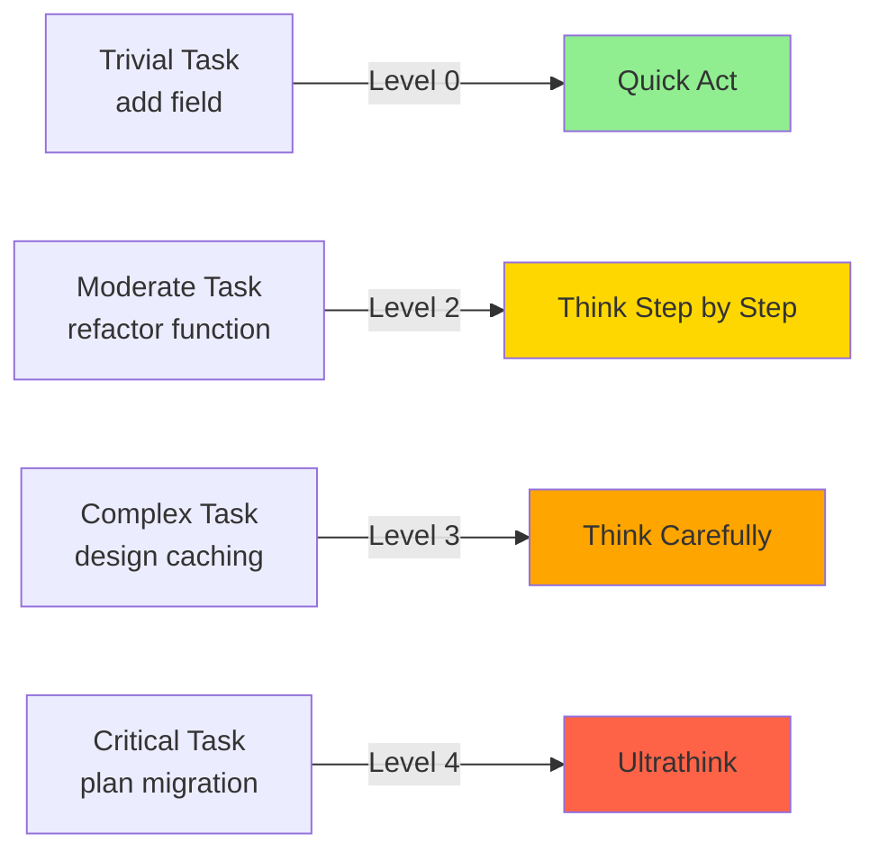

# Module 6.1: Think Mode (Extended Thinking)

> **Thời gian học**: ~30 phút
>
> **Yêu cầu trước**: Module 5.3 (Context Hình ảnh & Visual)
>
> **Kết quả**: Sau module này, bạn sẽ biết cách kích hoạt extended thinking mode, khi nào dùng think vs quick mode, và cách nhận kết quả tốt hơn đáng kể cho vấn đề phức tạp.

---

## 1. WHY — Tại Sao Cần Think Mode

Bạn bảo Claude: "Refactor module auth để hỗ trợ OAuth2." Nó lập tức viết code — nhưng nông cạn, bỏ sót edge case, không tận dụng session management có sẵn. Vấn đề? Claude đang sprint khi lẽ ra phải đi bộ và suy nghĩ. Giống như senior dev code trước, nghĩ sau — kết quả là phải rework.

Think mode chính là cách bạn nói với dev: "Đừng vội code. Nghĩ thấu đáo trước, RỒI MỚI implement." Ví von: đánh cờ — người mới thấy quân ăn được là ăn liền, kiện tướng nghĩ 5 nước sau. Think mode biến Claude từ "người mới háo hức" thành "kiện tướng có kế hoạch".

---

## 2. CONCEPT — Ý Tưởng Cốt Lõi

### Think Mode là gì?

Think mode là cách bạn bảo Claude dành nhiều thời gian **suy luận** trước khi hành động. Thay vì generate code ngay lập tức, Claude sẽ:
1. Phân tích constraint và dependency
2. Xem xét edge case và alternative approach
3. Đánh giá trade-off
4. **Sau đó mới** tạo solution chu đáo hơn

### Cách Kích Hoạt Think Mode

Think mode trigger qua **prompt engineering** — không phải lệnh hệ thống mà là cách bạn đặt câu hỏi:

| Level | Trigger Phrase | Độ Sâu Reasoning |
|-------|----------------|------------------|
| **Level 0** | (không có) | Quick mode — tạo ngay |
| **Level 1** | `"think about this"` | Basic extended reasoning |
| **Level 2** | `"think step by step"` | Chia vấn đề thành bước |
| **Level 3** | `"think carefully"` | Xét edge case, alternative, trade-off |
| **Level 4** | `"ultrathink"` ⚠️ | Reasoning depth tối đa (cần xác minh) |

⚠️ **Lưu ý**: Lệnh `/think` có thể tồn tại trong một số version — cần xác minh trong môi trường của bạn.

### Khi Nào THINK vs ACT

**Dùng THINK mode khi:**
- Architecture decision
- Refactoring phức tạp
- Debug issue bí ẩn (race condition, memory leak)
- Security review
- Database migration
- API design ảnh hưởng nhiều service

**KHÔNG cần think mode khi:**
- Generate code đơn giản (CRUD)
- Format code
- Thêm field vào class
- Viết unit test cơ bản
- File operation (copy, rename)

### Think-Act Spectrum

Think mode không phải nhị phân (0 hoặc 1) — nó là **gradient**. Matching think depth với complexity:



### Chi Phí Think Mode

Think mode **tốn nhiều token và lâu hơn**. Nhưng đây là đầu tư — dùng khi vấn đề xứng đáng. Một lần think cẩn thận = tránh 3 vòng rework.

---

## 3. DEMO — Từng Bước Một

Kịch bản: Refactor module payment để hỗ trợ Stripe, PayPal, và VNPay (Vietnamese payment gateway).

### Bước 1: KHÔNG Think Mode (Baseline)

```bash
$ claude
```

**Prompt:**
```
Refactor src/payment.ts to support multiple payment gateways: Stripe, PayPal, VNPay
```

**Kết quả Claude trả về:**
```typescript
// Generic strategy pattern - nông cạn
interface PaymentGateway {
  processPayment(amount: number): Promise<void>;
}

class StripeGateway implements PaymentGateway { ... }
// Bỏ sót: webhook verification, idempotency, VNPay hash signature
```

**Vấn đề**: Code compile được nhưng miss nhiều edge case thực tế.

---

### Bước 2: CÓ Think Mode Level 2

**Prompt:**
```
Think step by step:
1. What are the key differences between Stripe, PayPal, and VNPay?
2. What edge cases exist for Vietnamese payment gateways?
3. Design the payment module architecture

Then refactor src/payment.ts
```

**Kết quả Claude thinking (excerpt):**
```
Step 1 Analysis:
- Stripe: webhook-based, USD by default
- PayPal: redirect flow, sandbox required
- VNPay: HMAC-SHA256 signature, VND only, no decimal

Step 2 Edge Cases:
- VNPay requires vnp_TxnRef unique per day
- Settlement time differs: Stripe instant, VNPay T+1
- Refund flow different for each gateway

Step 3 Architecture:
[Đưa ra design với abstract factory + gateway-specific config]
```

**Code sinh ra**: Tốt hơn nhiều — có config per gateway, signature verification, idempotency key.

---

### Bước 3: CÓ Think Mode Level 3 (Carefully)

**Prompt:**
```
Think carefully about this payment refactoring:
- What could go wrong in production?
- What security risks exist?
- What are the trade-offs of different approaches?
- How does this affect existing transaction history?

Then design and refactor src/payment.ts
```

**Kết quả thinking thêm:**
```
Security Risks:
- VNPay hash must use secret key - never expose in client
- Webhook endpoint needs CSRF protection
- Store payment attempts for audit (NHNN compliance)

Trade-offs:
- Sync vs async payment processing
- Retry strategy vs manual reconciliation
- Monolith vs microservice for gateway isolation

Impact on Existing Data:
- Migrate payment_method ENUM → support new gateway codes
- Backfill vnp_TxnRef for old VNPay transactions (nullable)
```

**Code sinh ra**: Production-ready — có audit log, retry mechanism, migration script, security checklist.

---

### Bước 4: Kết Hợp Think + Act

**Best practice**: Think trước, act sau — không trộn lẫn.

```
# Phase 1: Think
Think carefully: design a payment gateway abstraction that supports
Stripe, PayPal, VNPay with proper security and audit trail.
Output the design document.

# Phase 2: Act (sau khi review design)
Based on the design above, implement:
1. src/payment/gateway.interface.ts
2. src/payment/gateways/vnpay.ts
3. Migration script for payment_method column
```

**Lợi ích**: Bạn review design trước khi code. Nếu sai hướng, dừng sớm — không mất công code rồi mới phát hiện.

---

### Bước 5: So Sánh Chi Phí

```bash
/cost
```

**Output:**
```
Recent conversation costs:
- No think mode:    850 input tokens,  2,100 output tokens
- Think level 2:  1,200 input tokens,  4,500 output tokens
- Think level 3:  1,500 input tokens,  6,800 output tokens

Think level 3 cost ~3x more BUT prevented 2 rework cycles
= net savings in real time and total tokens
```

**Insight**: Think mode tốn token hơn, nhưng **tiết kiệm tổng chi phí** nếu tránh được rework.

---

## 4. PRACTICE — Tự Làm Thử

### Bài Tập 1: Think vs Rush

**Mục tiêu**: So sánh trực tiếp quality của think mode vs không think.

**Hướng dẫn**:
1. Chọn task refactoring vừa phải (ví dụ: thêm caching layer cho user profile API)
2. Lần 1 — KHÔNG think mode:
   ```
   Add Redis caching to src/api/user.ts for getProfile() endpoint
   ```
3. Ghi lại: code quality, có xử lý cache invalidation không, có TTL strategy không
4. Lần 2 — CÓ think mode:
   ```
   Think carefully: Design a Redis caching strategy for user profile API
   - When to invalidate cache?
   - What TTL is appropriate?
   - How to handle cache stampede?
   Then implement in src/api/user.ts
   ```
5. So sánh: accuracy, edge case coverage, code quality
6. Check `/cost` cả hai lần

**Kết quả mong đợi**: Think mode cost cao hơn ~2x nhưng code quality tốt hơn rõ rệt.

<details>
<summary>💡 Gợi ý</summary>

Edge case cần check:
- Cache stampede (nhiều request cùng miss cache)
- Race condition khi update user + invalidate cache
- Partial cache failure (Redis down nhưng DB ok)
- Cache warming strategy
</details>

<details>
<summary>✅ Đáp Án</summary>

Think mode nên sinh ra design gồm:
- TTL: 5 phút cho profile data
- Cache key: `user:profile:{userId}`
- Invalidation: on user update event
- Stampede prevention: probabilistic early expiration hoặc distributed lock
- Graceful degradation: fallback to DB nếu Redis fail

Code nên có distributed lock để prevent stampede, TTL config, và proper error handling khi Redis fail.
</details>

---

### Bài Tập 2: Think Level Calibration

**Mục tiêu**: Học cách chọn think level phù hợp với task complexity.

**Hướng dẫn**: Với 5 task sau, xác định think level (0-4) và thử execute:

1. **Task A**: Thêm field `phoneNumber: string` vào User interface
2. **Task B**: Viết unit test cho function `calculateDiscount(price, couponCode)`
3. **Task C**: Refactor function `processOrder()` có 250 dòng thành smaller functions
4. **Task D**: Thiết kế distributed caching layer cho e-commerce platform (10M users)
5. **Task E**: Lập kế hoạch migration từ MongoDB sang PostgreSQL (500GB data)

**Câu hỏi**: Bạn sẽ dùng think level nào cho từng task? Tại sao?

<details>
<summary>💡 Gợi ý</summary>

Think về:
- Scope ảnh hưởng (1 file vs entire system)
- Risk nếu sai (typo vs data loss)
- Reversibility (dễ rollback vs không rollback được)
</details>

<details>
<summary>✅ Đáp Án</summary>

| Task | Think Level | Lý Do |
|------|-------------|-------|
| A | 0 (none) | Trivial — add field, no logic |
| B | 1 (basic) | Simple logic, need consider edge case (null coupon, expired) |
| C | 2 (step by step) | Moderate — break down logic, preserve behavior |
| D | 3 (carefully) | Complex — consider CAP theorem, stampede, cost, latency SLA |
| E | 4 (ultrathink) | Critical — data migration, downtime, rollback strategy, schema mapping |

**Quy tắc ngón tay cái**: Khi nghi ngờ, lên 1 bậc. Chi phí thêm token < chi phí sửa lỗi production.
</details>

---

## 5. CHEAT SHEET

| Think Level | Trigger Phrase | Phù Hợp Cho | Token Cost | Ví Dụ |
|-------------|----------------|-------------|------------|-------|
| **0** | (không có) | Trivial task | 1x | Add field, format code |
| **1** | `"think about this"` | Simple logic | 1.5x | Viết function đơn giản |
| **2** | `"think step by step"` | Moderate complexity | 2-3x | Refactor function, add validation |
| **3** | `"think carefully"` | Complex/risky task | 3-4x | API design, caching strategy |
| **4** | `"ultrathink"` ⚠️ | Critical decision | 4-5x | Migration plan, security architecture |

### Quy Tắc Vàng

```
Complexity × Risk = Think Level

Nghi ngờ → Lên 1 bậc
```

**Khi nào KHÔNG dùng think mode**:
- Task < 5 dòng code
- Pure formatting/linting
- Copy-paste operation

**Khi nào BẮT BUỘC think mode (level 3+)**:
- Task liên quan payment/security
- Database migration
- API breaking change
- Multi-service refactoring

---

## 6. PITFALLS — Sai Lầm Thường Gặp

| ❌ Sai Lầm | ✅ Đúng Cách |
|-----------|-------------|
| Dùng think mode cho trivial task (add field) | Chỉ think cho task moderate+ complexity |
| Không dùng think mode cho complex refactoring → rework 3 lần | Task > 50 dòng code hoặc multiple file → luôn think level 2+ |
| Bỏ qua thinking analysis Claude đưa ra, nhảy thẳng vào code | **Đọc kỹ thinking section** — đó là phần giá trị nhất |
| Dùng ultrathink cho mọi request → tốn token vô ích | Calibrate think level: match complexity |
| Kỳ vọng think mode fix prompt tệ | Think mode amplify prompt quality. Garbage in → garbage out |
| Không kết hợp think + act — trộn lẫn trong 1 prompt | **Tách riêng**: Think phase → Review → Act phase |

---

## 7. REAL CASE — Câu Chuyện Thực Tế

### Kịch Bản: Payment Reconciliation cho Banking App

**Team**: Fintech startup Việt Nam, đang build payment reconciliation system cho banking app.

**Bối cảnh**:
- Tiền VND (không có decimal — 10,000₫ không phải 10,000.00₫)
- Multi-bank: VietcomBank, Techcombank, MBBank (API khác nhau)
- Compliance NHNN (Ngân hàng Nhà nước) — audit trail bắt buộc
- Settlement time khác nhau giữa các bank

**Lần 1 — Không Think Mode**:

```
Implement payment reconciliation logic in src/reconcile.ts
```

Kết quả:
- Generic code giả định USD (dùng `amount: number` với decimal)
- Miss case VNPay settlement T+1 (assume instant như Stripe)
- Bỏ qua bank API differences
- Không có audit trail (NHNN compliance risk)

**Bug phát hiện**: 3 vòng review, mất 3 ngày sửa.

---

**Lần 2 — Có Think Mode Level 3**:

```
Think carefully about payment reconciliation for Vietnamese banking:
- VND currency specifics (no decimal)
- Multi-bank API differences (VietcomBank, Techcombank, MBBank)
- Settlement timing differences
- NHNN compliance requirements (audit trail)
- What could go wrong in production?

Then design src/reconcile.ts
```

Thinking output:
- VND: integer only, không decimal
- Bank adapter pattern cho API khác nhau
- State machine: PENDING → SETTLING → SETTLED
- Audit log với append-only constraint
- Retention 10 năm theo quy định NHNN

**Kết quả**: Pass compliance review lần đầu, QA tìm 0 bug critical. Tiết kiệm **2 ngày** so với lần trước.

---

**Bài Học Team**:

> "Bất kỳ task nào liên quan tiền hoặc compliance → **luôn dùng think carefully**. Chi phí token thấp hơn chi phí legal risk."

---

> **Tiếp theo**: [Module 6.2: Plan Mode](../02-plan-mode/) →
