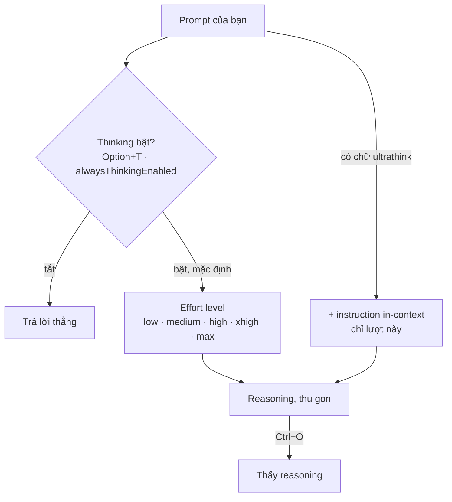

# Module 6.1: Think Mode (Extended Thinking)

> **Thời gian**: ~30 phút
>
> **Yêu cầu trước**: Module 5.3 (Image & Visual Context)
>
> **Kết quả**: Sau module này bạn biết extended thinking vốn đã bật sẵn, biết tăng/giảm nó
> bằng effort level, biết khi nào dùng `ultrathink`, và biết cách đọc phần reasoning mà
> Claude Code giấu đi.

---

## 1. WHY — Tại Sao Quan Trọng

Một nửa lời khuyên về Claude Code trên mạng bảo bạn gõ "think step by step" hoặc "think
harder" để mở một chế độ sâu hơn. Những câu đó **không làm gì cả**. Docs nói thẳng: Claude
Code "passes other phrases such as 'think', 'think hard', and 'think more' through as ordinary
prompt text and doesn't recognize them as keywords" — chúng đi thẳng vào prompt như text
thường.

Nghĩa là bạn trả tiền cho câu thần chú, trong khi hai thứ thật sự xoay được cái núm — **effort
level** và keyword **`ultrathink`** — thì nằm không. Tệ hơn: extended thinking đã bật sẵn từ
đầu. Module này thay folklore bằng bốn công tắc thật.

---

## 2. CONCEPT — Ý Tưởng Cốt Lõi

**Extended thinking bật mặc định.** Không có "mode" nào để vào. Thứ bạn điều khiển là: Claude
suy luận *nhiều bao nhiêu* (effort level, phạm vi cả session), một lượt có được thêm không
(`ultrathink`), có suy luận hay không (`Option+T`), và bạn có thấy nó không (`Ctrl+O`). Bốn
công tắc độc lập, không chồng lên nhau.

Effort level là núm chính: `low`, `medium`, `high`, `xhigh`, `max`, `ultracode`. `high` là
"the default on every model except Opus 4.7" — model đó mặc định `xhigh`. `max` không phải
bản nâng cấp miễn phí: nó "may show diminishing returns and is prone to overthinking".

`ultrathink` là keyword duy nhất Claude Code thật sự nhận ra, và chỉ có tác dụng một lượt:
"Include `ultrathink` anywhere in your prompt to request deeper reasoning on that turn without
changing your session effort setting… The effort level sent to the API is unchanged."



---

## 3. DEMO — Từng Bước

Mọi bước chạy trong một lab repo nhỏ có `src/math.js` và một file test.

**Bước 1: Đọc effort level bạn đang dùng**

Chạy `claude` và nhìn dòng ngay trên ô prompt. {/* docs: model-config */}

```text
# Output may vary
 ▐▛███▛█   Claude Code v2.1.278
▝▜██████▀  Opus 5 (1M context) · Claude Max
  ▝▝ ▝▝    ~/cc-lab
                                                                                  ● high · /effort
────────────────────────────────────────────────────────────────────────────────────
❯
```

`● high · /effort` là level hiện tại. Bạn chưa hề bật thinking — nó bật sẵn rồi.

**Bước 2: Mở slider bằng `/effort`**

Gõ `/effort` rồi Enter. {/* docs: model-config */}

```text
# Output may vary
   Effort
                   Faster                                                 Smarter
                   ────────────────────▲──────────────────────┆──────────────────
                   low     medium     high     xhigh      max       ultracode
                                                                xhigh + workflows
   ←/→ to adjust · Enter to confirm · s for this session only · Esc to cancel
```

Mọi level trong docs đều nằm trên slider. `/effort <level>` đặt thẳng; `/effort auto` xóa
level đã lưu cho model đang chạy.

**Bước 3: Xem công tắc bật/tắt với `Option+T`**

Nhấn `Option+T` (macOS) hoặc `Alt+T` (Windows/Linux). {/* docs: interactive-mode */}

```text
# Output may vary
  Toggle thinking mode
  Enable or disable thinking for this session.
  ❯ 1. Enabled ✔  Claude will think before responding
    2. Disabled   Claude will respond without extended thinking
  Enter to confirm · Esc to cancel
```

Enabled đã được tick sẵn. `/config` lưu lựa chọn này vĩnh viễn thành `alwaysThinkingEnabled`
trong `~/.claude/settings.json`.

**Bước 4: Dùng keyword duy nhất có tác dụng**

```text
ultrathink: does the guard in divide() in src/math.js also reject -0? Answer in one sentence.
```

```text
# Output may vary
❯ ultrathink: does the guard in divide() in src/math.js also reject -0? …
⏺ I'll read the file.
  Thought for 2s, read 1 file
⏺ Yes — b === 0 is true for -0 as well (strict equality doesn't distinguish the two zeros,
  unlike Object.is), so divide(1, -0) also throws instead of returning -Infinity.
```

`Thought for 2s` là tất cả những gì bạn thấy mặc định: "Claude Code collapses thinking output
by default."

**Bước 5: Mở reasoning bằng `Ctrl+O`**

Nhấn `Ctrl+O` để bật transcript viewer. {/* docs: model-config, interactive-mode */}

```text
# Output may vary
                                                                  10:00 PM claude-opus-5
⏺ I'll read the file.
⏺ Read(/Users/luatnq/cc-lab/src/math.js)
  ⎿  Read 6 lines
∴ Since -0 equals 0 in the comparison, it correctly rejects -0 too.
────────────────────────────────────────────────────────────────────────────────────
  Showing detailed transcript · ctrl+o to toggle · ? for shortcuts          verbose
```

Dòng `∴` là thinking summary. Capture này dùng `{ "showThinkingSummaries": true }` trong
`.claude/settings.json`, vì "interactive sessions on the Anthropic API receive redacted
thinking blocks by default."

**Bước 6: Đo chênh lệch bằng headless**

```bash
# docs: cli-reference
claude --effort low  -p "List the edge cases divide() in src/math.js does not handle." \
  --output-format json --permission-mode default --allowedTools "Read"
claude --effort high -p "List the edge cases divide() in src/math.js does not handle." \
  --output-format json --permission-mode default --allowedTools "Read"
```

Cả hai lượt chỉ đọc file nên `--allowedTools "Read"` là toàn bộ quyền cần cấp. Hai object JSON
với cùng prompt, cùng repo: `result` dài 1.399 ký tự ở `low` và 2.494 ở `high`; `num_turns`
2 so với 4; `duration_ms` 10.615 so với 40.056; `total_cost_usd` 0.381219 so với 0.479397.
Output may vary — đây là một cặp run trên một máy. So độ dài, số turn và nội dung, **đừng bao
giờ** so token count của thinking: Claude Code không in ra con số đó.

---

## 4. PRACTICE — Tự Làm

### Bài 1: Chứng minh cái thang "think" đã chết

**Mục tiêu**: Xác nhận "think step by step" chỉ là text thường, còn `ultrathink` thì không.

**Hướng dẫn**:
1. Trong repo của bạn, chạy `claude` và hỏi một câu có tiền tố `think step by step:`.
2. Nhấn `Ctrl+O` và ghi lại phần reasoning.
3. Hỏi đúng câu đó với tiền tố `ultrathink:`. Nhấn `Ctrl+O` lần nữa.
4. So hai transcript.

**Kết quả mong đợi**: Cả hai lượt đều suy luận, vì thinking bật mặc định. Chỉ lượt
`ultrathink` được thêm instruction.

<details>
<summary>💡 Gợi ý</summary>
Đừng tìm chỉ báo "mode". So độ dài reasoning trong transcript viewer — câu ở bước 1 đến model
dưới dạng text thường.
</details>

<details>
<summary>✅ Lời giải</summary>

Prompt đầu không khác gì prompt bình thường — Claude Code "passes other phrases such as
'think', 'think hard', and 'think more' through as ordinary prompt text." Prompt thứ hai được
nhận ra: Claude Code "adds an in-context instruction. The effort level sent to the API is
unchanged." `ultrathink` mua cho bạn một lượt sâu hơn; câu thần chú chỉ mua token.
</details>

### Bài 2: Tìm mức effort sàn của bạn

**Mục tiêu**: Chọn effort level rẻ nhất mà vẫn giải được một task bạn chạy thật.

**Hướng dẫn**:
1. Chọn một task lặp lại được (ví dụ "tóm tắt commit gần nhất đổi gì").
2. Chạy với `--effort low`, `--effort medium`, `--effort high`, mỗi lượt kèm
   `--output-format json`, lưu lại từng kết quả.
3. So field `result` theo **độ đúng**, không theo độ dài.
4. Ghim mức thắng bằng `/effort <level>` hoặc setting `effortLevel`.

**Kết quả mong đợi**: Một ghi chú nói bạn sẽ dùng level nào cho nhóm task này.

<details>
<summary>💡 Gợi ý</summary>
`low` dành cho việc "not intelligence-sensitive". Nếu `low` đã ra đúng đáp án duy nhất thì
`high` là tiền vứt đi.
</details>

<details>
<summary>✅ Lời giải</summary>

Với task cơ học, `low` thường hòa `high`, nên hãy ghim theo model bằng `modelSettings` thay vì
nâng default toàn cục. Lưu ý `effortLevel` "accepts `low`, `medium`, `high`, or `xhigh`. `max`
is not accepted here" — muốn `max` thì phải qua `/effort` hoặc `--effort`.
</details>

---

## 5. CHEAT SHEET

| Control | Ở đâu | Làm gì |
|---|---|---|
| `/effort` | Session | Mở slider; `s` = chỉ session này |
| `/effort <level>` | Session | `low`, `medium`, `high`, `xhigh`, `max`, `ultracode` |
| `/effort auto` | Session | Xóa level đã lưu cho model đang chạy |
| `--effort <level>` | CLI | Cùng bộ level; không persist |
| `effortLevel` | settings.json | Default cho model chưa có level riêng (không nhận `max`) |
| `modelSettings` | settings.json | Effort level lưu theo từng model |
| `ultrathink` | Trong prompt | Suy luận sâu hơn, chỉ lượt đó |
| `Option+T` / `Alt+T` | Session | Bật/tắt extended thinking |
| `alwaysThinkingEnabled` | settings.json | Tắt thinking cho mọi session |
| `MAX_THINKING_TOKENS=0` | Env var | Tắt thinking trên Anthropic API |
| `Ctrl+O` | Session | Bật/tắt transcript viewer |
| `showThinkingSummaries` | settings.json | Giữ summary đầy đủ thay vì block bị redact |

Mặc định: thinking bật; effort `high` trừ Opus 4.7 (`xhigh`). Không tắt được thinking trên
model Fable.

---

## 6. PITFALLS — Lỗi Thường Gặp

| ❌ Sai | ✅ Đúng |
|---|---|
| Gõ "think step by step" để mở chế độ sâu hơn | Thinking đã bật. Nâng `/effort`, hoặc dùng `ultrathink` |
| Trích con số "thinking tokens: 2,768" | Claude Code không in con số đó. So độ dài, số turn, chi phí |
| Tưởng `ultrathink` nâng effort level | "The effort level sent to the API is unchanged" |
| Để mọi thứ ở `max` | `max` "may show diminishing returns and is prone to overthinking" |
| `"effortLevel": "max"` trong settings.json | Không được nhận. Dùng `/effort max` hoặc `--effort max` |
| Trông chờ `Option+T` có tác dụng trên Fable | "You can't turn thinking off on Fable models" |
| Tưởng reasoning thu gọn là miễn phí | "You are charged for all thinking tokens generated, even when collapsed or redacted" |

---

## 7. REAL CASE — Câu Chuyện Thật

**Bối cảnh**: Một team fintech Việt Nam xây module đối soát thanh toán cho app ngân hàng: số
tiền VND (không có phần thập phân), ba ngân hàng với format API khác nhau (VietcomBank,
Techcombank, MBBank), và yêu cầu audit của Ngân hàng Nhà nước (SBV).

**Vấn đề**: Họ bảo Claude Code "implement payment reconciliation logic" ở effort mặc định,
trong một session đã chứa hai task không liên quan. Kết quả: giả định đơn vị nhỏ kiểu USD
(`amount * 100`), giả định ba ngân hàng cùng một shape response, và bỏ qua state machine cùng
audit trail theo yêu cầu SBV. Năm vòng sửa tiếp theo đều chất đống trong cùng một context đã
nhiễu.

**Giải pháp**: Team lead chạy `/clear`, nâng session bằng `/effort xhigh`, và viết lại prompt
mang theo đúng những ràng buộc mà lần đầu phải đoán: VND là integer currency, mỗi ngân hàng có
tên field riêng, SBV đòi state machine cộng audit trail, settlement window khác nhau theo ngân
hàng. Bài con khó nhất — đối soát settlement window lệch nhau — được cho riêng một lượt với
tiền tố `ultrathink`.

**Kết quả**: Lần thứ hai cho ra xử lý VND dạng integer, một lớp adapter theo từng ngân hàng, và
state machine tường minh kèm audit event. Điều họ ghi vào CLAUDE.md không phải "thêm chữ think
vào prompt", mà là: clear context, đưa ràng buộc vào prompt, và dùng effort cùng `ultrathink`
một cách có chủ đích.

---

> **Tiếp theo**: [Module 6.2: Plan Mode](../02-plan-mode/) →
