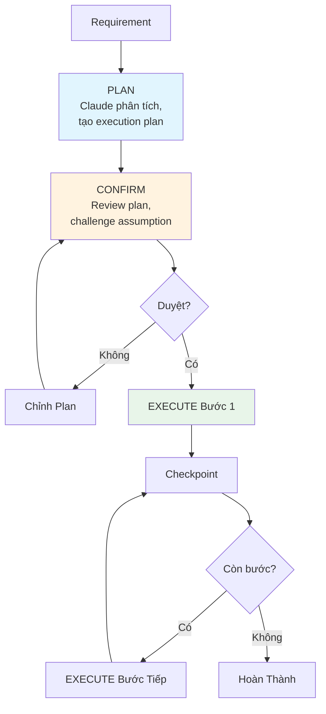

# Module 6.2: Chế độ Plan (Plan Mode)

> **Thời gian học**: ~35 phút
>
> **Yêu cầu trước**: Module 6.1 (Think Mode)
>
> **Kết quả**: Sau module này, bạn sẽ kích hoạt Plan Mode — Claude Code tạo execution plan chi tiết trước khi đụng code, rồi implement từng bước với checkpoint. Loại bỏ sai lầm #1: để Claude code trước khi plan.

---

## 1. WHY — Tại Sao Cần Plan Mode

PM đưa yêu cầu: "Thêm đa ngôn ngữ cho app." Mở Claude Code, gõ requirement. Claude code ngay — sửa 15 file, miss translation file, break 3 test, tạo đống mess. Vấn đề? Claude CODE khi lẽ ra phải PLAN.

Think Mode (6.1) giúp Claude suy luận sâu. Nhưng suy luận sâu MÀ KHÔNG CÓ plan cấu trúc vẫn dẫn đến execution hỗn loạn. Plan Mode thêm CẤU TRÚC — Claude tạo battle plan với exact file, step, dependency, checkpoint TRƯỚC khi viết dòng code nào.

Ví von: xây nhà không bản vẽ — thợ giỏi mấy cũng đập đi xây lại. 3 tiếng thiết kế tiết kiệm 3 tuần sửa sai.

---

## 2. CONCEPT — Ý Tưởng Cốt Lõi

### Plan Mode là gì?

Plan Mode là pattern vận hành nơi bạn CHỦ ĐỘNG bảo Claude tạo execution plan TRƯỚC khi viết code. Không phải toggle hay built-in command — là kỷ luật workflow bạn enforce qua prompt.

Câu thần chú: **"KHÔNG viết code. Cho tôi plan trước."**

### Pattern Plan-Confirm-Execute (PCE)



1. **PLAN**: Đưa requirement + constraint. Claude phân tích codebase, xác định file ảnh hưởng, list dependency, tạo step-by-step plan. CHƯA viết code.
2. **CONFIRM**: Review plan. Challenge: "Risk nào miss?" "Dependency nào?" Điều chỉnh scope.
3. **EXECUTE**: Implement từng bước. Checkpoint mỗi 3-5 bước với `/compact` để review progress.

**Tại sao hiệu quả**: Assumption sai bị bắt TRƯỚC khi thành code sai.

### Planning Prompt Template

```
Tôi cần [mục tiêu cụ thể].
Trạng thái hiện tại: [cái gì đã có]
Constraint: [cái gì không đổi được]

Trước khi viết BẤT KỲ code nào:
1. Phân tích cần thay đổi gì
2. Liệt kê TẤT CẢ file bị ảnh hưởng
3. Xác định risk và dependency
4. Tạo execution plan từng bước

KHÔNG viết code. CHỈ cho tôi plan.
```

### Chiến Lược Task Decomposition

| Strategy | Phù Hợp Khi | Ví Dụ |
|----------|-------------|-------|
| **Vertical Slicing** | Feature user-facing | Login → Register → Profile → Settings |
| **Horizontal Slicing** | Refactoring, migration | DB schema → API → Service → UI |
| **Risk-First** | Tech uncertain | Prove WebSocket scaling → xây feature |
| **Dependency-First** | Dependency chain phức tạp | Auth → User service → Notifications |

### Quy Tắc Plan Granularity

- Task **> 2 tiếng** → Cần plan
- Task **< 30 phút** → Code luôn

---

## 3. DEMO — Làm Mẫu Từng Bước

**Kịch bản**: Thêm notification system (email + push) vào Express/TypeScript API.

### Bước 1: PLAN — Kích Hoạt Plan Mode

```bash
$ claude
```

Prompt:
```
Tôi cần thêm notification system hỗ trợ email (SendGrid) và push (Firebase).
Gồm template system và rate limiting.

Hiện tại: Express + TypeScript + Prisma
Constraint: Không đổi user table schema

Trước khi viết code:
1. Phân tích file ảnh hưởng
2. List dependency
3. Xác định risk
4. Tạo plan từng bước

KHÔNG viết code. CHỈ plan.
```

Output mong đợi:
```
## Execution Plan: Notification System

### File Ảnh Hưởng (12 file)
- src/services/notification/ (thư mục mới)
- src/types/notification.ts (mới)
- src/config/notification.config.ts (mới)
- prisma/schema.prisma (sửa - thêm NotificationLog)
- package.json (thêm @sendgrid/mail, firebase-admin)
...

### Dependency
- SendGrid API key
- Firebase service account
- Redis cho rate limiting (optional)

### Risk
1. Firebase token expiry handling
2. SendGrid rate limits (100/sec)
3. Template variable injection security

### Execution Steps
1. Define notification interface và types
2. Tạo template system với variable substitution
3. Implement SendGrid email provider
4. Implement Firebase push provider
5. Thêm rate limiting middleware
6. Tạo NotificationService orchestrator
7. Database logging (Prisma migration)
8. Unit test cho provider
9. Integration test với test account
10. Documentation và config example
```

### Bước 2: CONFIRM — Challenge và Adjust

Prompt:
```
Plan tốt. Ba điều chỉnh:
1. Thêm SMS qua Twilio làm channel thứ 3
2. Template system lên bước 2 (provider phụ thuộc vào nó)
3. Firebase token expiry xử lý sao?

Cập nhật plan.
```

Claude revise — issue bị bắt TRƯỚC khi code.

### Bước 3: EXECUTE Bước 1

Prompt:
```
Plan approved. Implement bước 1: notification interface và types.
```

Claude generate code focused theo plan:
```typescript
// src/types/notification.ts
export interface NotificationPayload {
  channel: 'email' | 'push' | 'sms';
  recipient: string;
  template: string;
  variables: Record<string, string>;
}
```

### Bước 4: Checkpoint — Review Giữa Chừng

Sau khi hoàn thành bước 1-4:

```
/compact
```

Rồi:
```
Đang ở bước 5/12. Review progress so với plan.
On track? Cần adjust gì không?
```

Claude so sánh progress vs plan, đề xuất adjustment nếu cần.

### Bước 5: So Sánh Kết Quả

| Approach | Thời Gian | Rework |
|----------|-----------|--------|
| **Không Plan Mode** | 8+ tiếng | 2+ tiếng fix requirement miss |
| **Có Plan Mode** | 6.25h (30p plan + 15p confirm + 5.5h execute) | Zero |

---

## 4. PRACTICE — Tự Thực Hành

### Bài Tập 1: PCE in Action

**Mục tiêu**: Thực hành full cycle Plan-Confirm-Execute.

**Hướng dẫn**:
1. Chọn feature medium cho project (hoặc dùng: "Thêm CSV export cho user data")
2. Viết planning prompt theo template
3. Nhận plan Claude — ĐỪNG chấp nhận ngay
4. Challenge: "Risk nào miss?" "Nếu export 100K row thì sao?"
5. Refine đến khi confident
6. Execute 3 bước đầu
7. Đánh giá: planning tiết kiệm thời gian vs code ngay?

**Kết quả mong đợi**: Plan 6-10 bước, ít nhất 2 risk identified, 3 bước đầu implement clean.

<details>
<summary>💡 Gợi ý</summary>

Câu hỏi challenge tốt:
- "Nếu data quá lớn cho memory?"
- "Special character trong CSV xử lý sao?"
- "Concurrent export request thì sao?"
- "File generated lưu ở đâu?"
</details>

<details>
<summary>✅ Đáp án</summary>

**Planning prompt**:
```
Tôi cần thêm CSV export cho user data. Hỗ trợ filter theo date range
và user status. Hiện tại: Express API với Prisma ORM.

Trước khi viết code:
1. Phân tích cần đổi gì
2. List file ảnh hưởng
3. Xác định risk và dependency
4. Tạo plan từng bước

KHÔNG viết code. CHỈ plan.
```

**Challenge prompt**:
- "Nếu 100K user? Load hết vào memory không?"
- "Unicode character trong tên xử lý sao?"
- "Rate limit concurrent export?"

**Plan tốt nên có**:
- Streaming approach cho large dataset
- Proper CSV escaping cho special character
- Queue system hoặc rate limiting cho export
- Temporary file storage strategy
</details>

---

### Bài Tập 2: Chọn Decomposition Strategy

**Mục tiêu**: Chọn đúng decomposition strategy.

Với mỗi feature, chọn strategy phù hợp và justify:

1. **User authentication** (login, register, password reset, 2FA)
2. **Export CSV** (single feature, transform data)
3. **Real-time chat** (WebSocket, storage, presence)
4. **Admin dashboard** (users, stats, settings)

<details>
<summary>💡 Gợi ý</summary>

Tự hỏi:
- Nhiều user journey? → Vertical
- Single feature, nhiều layer? → Horizontal
- Tech uncertainty cao? → Risk-First
- Dependency chain rõ? → Dependency-First
</details>

<details>
<summary>✅ Đáp án</summary>

| Feature | Strategy | Lý Do |
|---------|----------|-------|
| User auth | **Vertical** | Mỗi auth feature (login, register, 2FA) là user journey hoàn chỉnh |
| CSV export | **Horizontal** | Single feature xuyên suốt layer: API → Service → File generation |
| Real-time chat | **Risk-First** | WebSocket scaling là unknown rủi ro — prove trước |
| Admin dashboard | **Vertical** | Các page độc lập (users, stats, settings) ship riêng được |
</details>

---

## 5. CHEAT SHEET

### Planning Prompt Template

```
Tôi cần [mục tiêu].
Hiện tại: [cái gì có]
Constraint: [không đổi được]

Trước khi viết code:
1. Phân tích cần đổi gì
2. List TẤT CẢ file ảnh hưởng
3. Xác định risk và dependency
4. Tạo execution plan từng bước

KHÔNG viết code. CHỈ plan.
```

### Checkpoint Template

```
Đang ở bước X/Y. /compact rồi review:
- Progress so với plan?
- Cần adjust?
- Risk nào xuất hiện?
```

### Plan Revision Template

```
Plan tốt. Điều chỉnh:
1. [Thêm/bỏ/sắp lại]
2. [Constraint mới]
3. [Hỏi về risk]

Cập nhật plan.
```

### Decomposition Decision Table

| Nếu... | Dùng... |
|--------|---------|
| Nhiều user feature | Vertical Slicing |
| Single feature, nhiều layer | Horizontal Slicing |
| Tech uncertainty cao | Risk-First |
| Dependency chain rõ | Dependency-First |

### Plan Granularity Rule

| Task Duration | Action |
|---------------|--------|
| > 2 tiếng | Full PCE cycle |
| 30p - 2h | Quick plan, minimal confirm |
| < 30 phút | Code luôn |

---

## 6. PITFALLS — Sai Lầm Thường Gặp

| ❌ Sai Lầm | ✅ Cách Đúng |
|-----------|-------------|
| Nhảy vào code không plan cho task >2h | LUÔN Plan-Confirm-Execute cho task đụng 3+ file |
| Over-plan task đơn giản (thêm 1 button) | Task <30p → skip plan, code luôn |
| Chấp nhận plan đầu tiên không challenge | CONFIRM phase bắt buộc. "Risk nào miss?" "Dependency?" |
| Plan hết rồi execute hết cùng lúc | Execute từng bước, checkpoint mỗi 3-5 bước |
| Không `/compact` giữa plan và execute | Sau CONFIRM, `/compact` trước EXECUTE bước 1 |
| Bỏ plan khi execution khó | Reality khác plan → DỪNG, re-plan. Đừng ép. |
| Claude plan không đọc codebase | Cho đọc key file TRƯỚC plan |

---

## 7. REAL CASE — Câu Chuyện Thật

**Bối cảnh**: Startup Việt Nam build quản lý kho e-commerce. Feature: multi-warehouse sync real-time stock update. 40+ file, 3 DB table mới, WebSocket, 2 external API.

**Không Plan Mode (lần đầu)**:
- Ngày 1-2: Code ngay, build basic sync
- Ngày 3: Phát hiện thiếu conflict resolution cho concurrent update
- Ngày 5: WebSocket không scale, phải đổi Redis pub/sub
- **Tổng: 7 ngày** (2 ngày rework)

**Có Plan Mode (feature tương tự tiếp)**:
1. **PLAN** (2h): Claude phân tích 35 file, 4 dependency, 12 bước plan, flag risk WebSocket scaling
2. **CONFIRM** (1h): Team phát hiện 2 bước thiếu. Claude suggest CRDT cho conflict, Redis pub/sub từ đầu.
3. **EXECUTE** (3 ngày): Từng bước, checkpoint mỗi 4 bước

**Kết quả**: 3.5 ngày vs 7 ngày. Zero rework. Team quote: "3 tiếng planning cứu 3.5 ngày coding."

---

> **Tiếp theo**: [Module 6.3: Kết hợp Think + Plan](../03-think-plan-combo/) →
