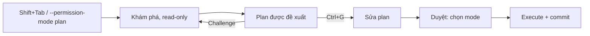

# Module 6.2: Plan Mode

> **Thời gian**: ~35 phút
>
> **Yêu cầu trước**: Module 6.1 (Think Mode)
>
> **Kết quả**: Sau module này bạn vào được plan mode native, đọc và sửa được plan nó đề xuất,
> duyệt plan vào đúng permission mode bạn muốn, và biết khi nào planning không đáng.

---

## 1. WHY — Tại Sao Quan Trọng

Bạn bảo "extract notification logic ra service riêng." Claude edit ngay. Hai mươi phút sau có
mười một file đã đổi, hai file sai, và bạn đang đọc diff để đoán nó hiểu ý bạn thế nào.

Plan mode lật ngược điều đó. Nó **không phải** một câu prompt — nó là một permission mode
chặn edit, ở mọi loại session trừ một, cho tới khi bạn đọc xong ý định của Claude. Bạn quyết
định một lần, với thiết kế trước mặt, thay vì mười một lần.

---

## 2. CONCEPT — Ý Tưởng Cốt Lõi

Plan mode là một permission mode, và docs định nghĩa rất rõ: "Plan mode tells Claude to
research and propose changes without making them. Claude reads files, runs shell commands to
explore, and writes a plan, but does not edit your source." Kèm theo đúng một điều kiện:
"**Except in interactive terminal sessions with bypass permissions available**, edits stay
blocked until you approve the plan." Ở mọi nơi khác — lượt `-p`, Agent SDK, panel chat của VS
Code — "plan mode keeps its blocks".

Ba cách vào: `Shift+Tab` cho tới khi status bar hiện `⏸ plan mode on`; thêm tiền tố `/plan`
cho một prompt; hoặc `claude --permission-mode plan`, mà `defaultMode: "plan"` trong
`.claude/settings.json` biến thành mặc định của project.

`Shift+Tab` lần nữa là thoát mà không duyệt. Còn duyệt thì "exits plan mode and switches the
session to the permission mode each approve option describes" — bạn chọn luôn bán kính ảnh
hưởng ngay lúc chấp nhận thiết kế.

**Vòng PCE** của khóa học — Plan, Challenge, Execute — ánh xạ thẳng vào bốn pha trong docs
(Explore → Plan → Implement → Commit):

| Bước PCE | Cơ chế native |
|---|---|
| **Plan** | Khám phá read-only rồi viết plan; `Ctrl+G` để sửa |
| **Challenge** | "Review this plan — what could go wrong?" trước khi duyệt |
| **Execute** | Duyệt (hoặc `Shift+Tab`) để rời plan mode, rồi implement |

Challenge không phải thủ tục cho có. AI-native SDLC playbook: "The agent that wrote the code
has no way to approve it." (S3) Với plan cũng vậy.

Và planning không miễn phí: "Planning is most useful when you're uncertain about the approach,
when the change modifies multiple files, or when you're unfamiliar with the code being
modified. If you could describe the diff in one sentence, skip the plan." (S1)


```mermaid
graph LR
    A[Shift+Tab / --permission-mode plan] --> B[Khám phá, read-only]
    B --> C[Plan được đề xuất]
    C -->|Ctrl+G| D[Sửa plan]
    C -->|Challenge| B
    D --> E[Duyệt: chọn mode]
    E --> F[Execute + commit]
```

---

## 3. DEMO — Từng Bước

Lab repo: `src/math.js` (`add`, `divide`) và một file test.

**Bước 1: Vào plan mode**

Nhấn `Shift+Tab` tới khi status bar báo. <!-- docs: permission-modes -->

```text
# Output may vary
────────────────────────────────────────────────────────────────────────────────────
❯
────────────────────────────────────────────────────────────────────────────────────
  ⏸ plan mode on (shift+tab to cycle)
```

Vòng lặp là `default` → `acceptEdits` → `plan`; từ `auto` thì lần nhấn đầu về `default`. Hoặc
vào thẳng: `claude --permission-mode plan`.

**Bước 2: Yêu cầu thay đổi**

```text
Add input validation to divide() in src/math.js: throw a RangeError when the divisor
is 0. Leave add() alone. Write the plan.
```

Claude đọc file, liệt kê thư mục, chạy một lệnh shell read-only. Không file nào bị sửa. Dòng
trạng thái cho biết tên file plan:

```text
# Output may vary
Planning: /Users/luatnq/.claude/plans/add-input-validation-to-enumerated-prism.md
```

Slug được sinh theo từng plan nên nó khác với màn hình duyệt bên dưới; cả hai capture đều
thật, từ hai lần chạy cùng một walkthrough.

⚠️ Needs verification — đường dẫn này hiện trong UI thật nhưng không có trên trang nào dưới
`https://code.claude.com/docs/en/`. Hãy coi `Ctrl+G` là cách vào được hỗ trợ.

**Bước 3: Đọc plan và màn hình duyệt**

```text
# Output may vary
 Ready to code?
 Here is Claude's plan:
 Add divide-by-zero validation to divide()
 Context
 src/math.js:2 currently is a bare a / b. With a divisor of 0 JavaScript returns
 Infinity, -Infinity, or NaN (for 0 / 0) instead of failing — a silent bad value
 that propagates to callers. add() is explicitly out of scope and stays as is.
 Change
 src/math.js — guard the divisor in divide(), keeping the existing one-line style
 …
 Claude has written up a plan and is ready to execute. Would you like to proceed?
 ❯ 1. Yes, and use auto mode
   2. Yes, manually approve edits
   3. Tell Claude what to change
      shift+tab to approve with this feedback
 ctrl+g to edit in Vim · ~/.claude/plans/add-input-validation-to-reflective-nova.md
```

Lựa chọn 3 là bước **Challenge**: trả plan về kèm "what breaks if `b` is `'0'`?" và bạn vẫn
ở trong plan mode.

**Bước 4: Duyệt, và nhìn mode đổi**

Chọn 1 để duyệt và đẩy session ra khỏi plan mode.

```text
# Output may vary
  ⎿  Updated src/math.js (+4 -1)
      1  export function add(a, b) { return a + b; }
      2 -export function divide(a, b) { return a / b; }
      2 +export function divide(a, b) {
      3 +  if (b === 0) throw new RangeError('Division by zero');
      4 +  return a / b;
      5 +}
  ⎿  Updated tests/math.test.mjs (+5 -1)
──────────────────────────────────────────────── add-divide-by-zero-validation ─
  ⏵⏵ auto mode on (shift+tab to cycle)
```

Hai hệ quả có trong docs: mode giờ là `auto`, và session lấy tiêu đề sinh từ plan.

**Bước 5: Kiểm chứng**

```bash
# docs: common-workflows
git diff --stat && npm test 2>&1 | tail -5
```

```text
# Output may vary
 src/math.js           | 5 ++++-
 tests/math.test.mjs   | 6 +++++-
# pass 5
# fail 0
```

Nếu plan sai, `/rewind` (hoặc `Esc` hai lần ở ô prompt trống) khôi phục hội thoại, code, hoặc
cả hai.

---

## 4. PRACTICE — Tự Làm

### Bài 1: Lên plan cho thay đổi nhiều file

**Mục tiêu**: Dùng plan mode đúng chỗ nó có giá trị — thay đổi nhiều file, code lạ.

**Hướng dẫn**:
1. Trong một repo thật, chạy `claude --permission-mode plan`.
2. Yêu cầu một thay đổi buộc phải chạm ít nhất ba file.
3. Đọc plan: nó kể tên bao nhiêu file, và có đúng file không?
4. Duyệt bằng **Yes, manually approve edits** để vẫn thấy từng lần ghi.

**Kết quả mong đợi**: Một plan bạn đã sửa trước khi có file nào đổi.

<details>
<summary>✅ Lời giải</summary>

Dấu hiệu plan mode đáng công là plan nêu ra file bạn đã quên. Nếu nó chỉ chép lại prompt thì
bạn chọn nhầm task — (S1) bảo bỏ qua: "If you could describe the diff in one sentence, skip
the plan."
</details>

### Bài 2: Để Claude phỏng vấn bạn thành SPEC.md

**Mục tiêu**: Viết spec cho một feature lớn, rồi thực thi trong session mới.

**Hướng dẫn**:
1. Vào plan mode và gửi prompt phỏng vấn trong best practices của Anthropic (S1):

```text
I want to build [brief description]. Interview me in detail using the AskUserQuestion tool.

Ask about technical implementation, UI/UX, edge cases, concerns, and tradeoffs. Don't ask
obvious questions, dig into the hard parts I might not have considered.

Keep interviewing until we've covered everything, then write a complete spec to SPEC.md.
```

2. Trả lời tới khi nó ngừng hỏi. Để nó ghi `SPEC.md`.
3. Thoát, mở một session **mới**, implement từ `SPEC.md`.

**Kết quả mong đợi**: Một spec tự chứa, rồi một session sạch context.

<details>
<summary>✅ Lời giải</summary>

"Once the spec is complete, start a fresh session to execute it." (S1) Spec tốt phải "name the
files and interfaces involved, state what is out of scope, and end with an end-to-end
verification step that proves the feature works." Ghi `SPEC.md` bản thân nó là một edit, nên
plan mode sẽ hỏi bạn duyệt — đúng thiết kế, không phải bug.
</details>

### Bài 3: Challenge cái plan

**Mục tiêu**: Từ chối plan một cách có ích thay vì duyệt rồi sửa sau.

**Hướng dẫn**:
1. Để Claude đề xuất một plan bất kỳ.
2. Chọn **Tell Claude what to change** và hỏi: "Review this plan — what could go wrong in
   production, and what did you assume about the existing code?"
3. So plan thứ hai với plan đầu.

**Kết quả mong đợi**: Plan thứ hai nói rõ các giả định của nó.

<details>
<summary>💡 Gợi ý</summary>
Từ chối dựa trên *giả định*, không phải style. "What did you assume?" lòi ra nhiều thứ hơn
"làm tốt hơn đi".
</details>

<details>
<summary>✅ Lời giải</summary>

Lựa chọn 3 giữ bạn trong plan mode, nên sửa plan tốn một turn — rẻ hơn duyệt rồi revert. Đó
là bước Challenge, cùng ý với (S3): "The agent that wrote the code has no way to approve
it."
</details>

---

## 5. CHEAT SHEET

| Việc | Cách làm |
|---|---|
| Vào plan mode | `Shift+Tab` tới `⏸ plan mode on`, hoặc `/plan <prompt>` |
| Khởi động sẵn | `claude --permission-mode plan` |
| Mặc định của project | `"permissions": { "defaultMode": "plan" }` trong `.claude/settings.json` |
| Thoát mà không duyệt | `Shift+Tab` |
| Sửa plan | `Ctrl+G` |
| Duyệt sang auto mode | **Yes, and use auto mode** |
| Duyệt, xem từng edit | **Yes, manually approve edits** |
| Challenge | **Tell Claude what to change** |
| Hoàn tác sau khi duyệt | `/rewind`, hoặc `Esc` hai lần ở prompt trống |
| Opus lên plan, Sonnet code | `claude --model opusplan` |

`opusplan` "uses `opus` during plan mode, then switches to `sonnet` for execution." Banner của
nó ghi `Opus Plan`.

---

## 6. PITFALLS — Lỗi Thường Gặp

| ❌ Sai | ✅ Đúng |
|---|---|
| Viết "do NOT write code yet" trong prompt | Plan mode cưỡng chế điều đó; prompt chỉ là xin |
| Lên plan cho một fix một dòng | "If you could describe the diff in one sentence, skip the plan." (S1) |
| Duyệt mà không đọc rồi revert | Dùng **Tell Claude what to change** — vẫn ở trong plan mode |
| Tưởng plan mode còn sau khi duyệt | Duyệt là "exits plan mode". `Shift+Tab` để quay lại |
| Tưởng nó chặn mọi lệnh | Nó cho phép đọc, và với auto mode thì cho lệnh được classifier duyệt |
| Tin plan mode khi có bypass permissions | Trong terminal tương tác có bypass permissions, blocks của plan mode không được cưỡng chế |
| Gõ lại plan để sửa một dòng | `Ctrl+G` |

---

## 7. REAL CASE — Câu Chuyện Thật

**Bối cảnh**: Một team KMP làm app ngân hàng Android + iOS cần chuyển session handling từ
module Android sang `commonMain`. Một tá file, trong đó hai cặp `expect`/`actual` cả năm nay
không ai đụng.

**Vấn đề**: Lần đầu chạy ở mode mặc định. Claude dời interface, dời implementation, rồi viết
lại `actual` phía iOS. Team chỉ phát hiện khi build iOS gãy — sáu file vào một diff chưa ai
đọc.

**Giải pháp**: Họ chạy lại với `claude --model opusplan --permission-mode plan` và chỉ xin
migration plan. Plan chỉ đúng cặp `expect`/`actual` là bước rủi ro và đề nghị làm nó sau cùng,
phía sau interface dùng chung. Team challenge một lần — "what did you assume about the iOS
Keychain wrapper?" — và bản sửa thêm bước đọc wrapper đó trước. Sau đó họ duyệt bằng **Yes,
manually approve edits**.

**Kết quả**: Migration xong trong một session, iOS xanh ở mọi bước. Bài học nằm ở mode, không
phải prompt: không prompt nào chặn được edit đầu tiên; plan mode thì chặn.

---

> **Tiếp theo**: [Module 6.3: Kết hợp Think + Plan](../03-think-plan-combo/) →
