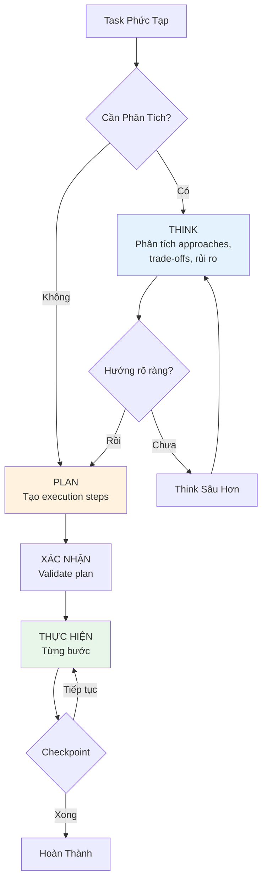

# Module 6.3: Kết hợp Think + Plan

> **Thời gian học**: ~30 phút
>
> **Yêu cầu trước**: Module 6.2 (Plan Mode)
>
> **Kết quả**: Sau module này, bạn sẽ master workflow Think→Plan→Execute — biết chính xác khi nào dùng Think alone, Plan alone, hoặc full combo. Đây là workflow pattern mạnh nhất cho complex software tasks với Claude Code.

---

## 1. WHY — Tại Sao Cần Điều Này

Bạn đã biết Think Mode (6.1) và Plan Mode (6.2) riêng lẻ. Nhưng khi nào thì dùng cái nào — hoặc cả hai? Đôi khi bạn suy nghĩ sâu sắc nhưng plan kém. Đôi khi bạn plan tỉ mỉ nhưng plan đó lại dựa trên analysis nông cạn.

**Ví dụ như bác sĩ**: Think Mode giống bác sĩ chẩn đoán bệnh (xem xét triệu chứng, nguyên nhân, các phương án điều trị). Plan Mode giống bác sĩ kê đơn thuốc (liều lượng cụ thể, thứ tự uống, lưu ý). **Think without Plan** = chẩn đoán đúng nhưng không có đơn thuốc → bệnh nhân chữa lung tung. **Plan without Think** = kê đơn chi tiết nhưng chẩn đoán sai bệnh → uống thuốc đúng cách nhưng sai loại thuốc.

Combo mạnh hơn tổng hai phần. Think first để chọn đúng HƯỚNG, rồi Plan để thực hiện đúng CÁCH. Expert developers làm việc như này — họ không chỉ think HOẶC plan. Họ think TRƯỚC, rồi plan SAU.

---

## 2. CONCEPT — Khái Niệm Cốt Lõi

### Workflow Think→Plan→Execute (TPE)



**Ba giai đoạn:**

1. **THINK**: "Think carefully về cách tốt nhất cho X. Xem xét trade-offs, edge cases, alternatives. Chưa cần plan hay code — chỉ phân tích thôi."
2. **PLAN**: "Dựa trên analysis, tạo step-by-step execution plan. List files, dependencies, risks. Chưa code."
3. **EXECUTE**: "Implement bước 1." (với checkpoints)

Đây là **SUPERSET của PCE** từ Module 6.2 — thêm Think phase trước khi Planning.

### Khi Nào Dùng Mode Nào

| Loại Task | Chỉ Code | Chỉ Plan | Chỉ Think | Think + Plan |
|-----------|----------|----------|-----------|--------------|
| Đơn giản (thêm field, sửa typo) | ✅ | ❌ | ❌ | ❌ |
| Trung bình (thêm endpoint, tests) | ❌ | ✅ | ❌ | ❌ |
| Phức tạp (feature mới, refactor) | ❌ | ❌ | ❌ | ✅ |
| Architecture (migration, redesign) | ❌ | ❌ | Chỉ analysis | ✅ Implementation |
| Debugging (tìm root cause) | ❌ | ❌ | ✅ | ❌ |

### Pattern Prompt Combo

**Giai đoạn 1 — THINK:**
```
Think carefully về [vấn đề].
Xem xét: [trade-offs cụ thể cần đánh giá]
Ưu/nhược điểm của mỗi approach là gì?
Chưa plan hay code — chỉ phân tích.
```

**Giai đoạn 2 — PLAN:**
```
Dựa trên analysis, [approach đã chọn] là phù hợp nhất.
Tạo detailed execution plan. List tất cả files, steps, risks.
Chưa code.
```

**Giai đoạn 3 — EXECUTE:**
```
Plan approved. Implement bước 1.
```

### Mỗi Mode Đóng Góp Gì

- **Think thêm**: phân tích sâu hơn, phát hiện edge cases, reasoning về trade-offs, tìm alternatives
- **Plan thêm**: cấu trúc execution, map files, sắp xếp dependencies, ước lượng effort
- **Combo thêm**: Hướng ĐÚNG được thực hiện theo CÁCH đúng

---

## 3. DEMO — Từng Bước Một

**Scenario**: Tách User Service từ monolithic Express API sang microservices.

### Bước 1: THINK — Phân Tích Sâu Trước

```bash
$ claude
```

Prompt:
```
Think carefully về việc extract User Service từ monolith của chúng ta.
Xem xét:
1. Sync vs async communication giữa các services
2. Data ownership — tables nào thuộc User Service
3. Authentication flow sẽ thay đổi như thế nào
4. Backward compatibility trong quá trình migration
5. Database strategy — shared DB hay separate DB

Phân tích trade-offs của từng cái. Chưa plan hay code.
```

Expected output:
```
## Analysis: User Service Extraction

### 1. Communication Pattern
- Sync (REST/gRPC): Đơn giản hơn, nhưng tạo coupling và single point of failure
- Async (Message Queue): Resilience tốt hơn, nhưng có eventual consistency challenges
→ Khuyến nghị: Async cho non-critical ops, sync cho auth validation

### 2. Data Ownership
- users, user_preferences, user_sessions → User Service
- orders.user_id → ở lại Order Service (chỉ foreign key reference)
→ Rủi ro: JOIN queries spanning services cần API composition

### 3. Database Strategy
- Shared DB: Migration dễ hơn, nhưng phá vỡ microservice isolation
- Separate DB: Isolation thật sự, cần data sync strategy
→ Khuyến nghị: Separate DB với event-driven sync

### 4. Authentication Flow
- Current: Session trong shared DB
- Option A: JWT với shared secret → stateless
- Option B: Auth Service riêng → phức tạp hơn
→ Khuyến nghị: JWT first, Auth Service sau nếu cần

### 5. Backward Compatibility
- API Gateway giữ old routes
- Proxy requests đến User Service
- Gradual migration theo từng endpoint
...
```

### Bước 2: Đánh Giá Think Output

Prompt:
```
Good analysis. Tôi đồng ý với separate DB + async events.
Câu hỏi: còn JOIN queries hiện đang span user và order tables thì sao?
```

Claude sẽ think deeper, suggest API composition pattern với caching.

### Bước 3: PLAN — Dựa Trên Think Analysis

Prompt:
```
Dựa trên analysis: separate DB, async events, API composition.
Tạo detailed execution plan để extract User Service.
List tất cả files, files mới, migration steps, risks, checkpoints.
Chưa code.
```

Expected output:
```
## Execution Plan: User Service Extraction

### Files Bị Ảnh Hưởng (23 files)
- src/services/user/ → extract sang service mới
- src/models/User.ts → move + tạo shared types
- src/routes/users.ts → convert thành API gateway proxy
- src/middleware/auth.ts → refactor để call User Service
- db/migrations/ → thêm user service DB migration
...

### Execution Steps
1. Tạo User Service project structure (Express + TypeScript)
2. Define shared types package (@myapp/user-types)
3. Implement User Service core (auth, profile CRUD)
4. Set up message queue (RabbitMQ)
5. Migrate database tables sang User Service DB
6. Update monolith để call User Service thay vì direct DB
7. Implement API composition cho cross-service queries
8. Add caching layer (Redis) cho API composition
9. Testing: integration tests cho old + new flow
10. Deploy: canary release với feature flag

### Risks Đã Giải Quyết
- Backward compatibility: API gateway giữ old routes
- Data sync: Event sourcing cho audit trail
- JOIN queries: Cached API composition
- Rollback plan: Feature flag để switch back

### Checkpoints
- Sau bước 3: User Service chạy standalone
- Sau bước 6: Monolith call User Service thành công
- Sau bước 9: 100% test cases pass
```

### Bước 4: XÁC NHẬN — Validate Với Think Insights

Prompt:
```
Cross-check: plan này đã address hết risks từ Think phase chưa?
Cụ thể: backward compatibility, data ownership, JOIN query issue.
```

Claude validates plan completeness dựa trên Think analysis.

### Bước 5: THỰC HIỆN — Implement Với Confidence

Prompt:
```
Plan approved. Implement bước 1: Tạo User Service project structure.
```

Implementation flows mượt mà — các decisions đã được làm ở Think phase rồi.

### Bước 6: So Sánh Kết Quả

| Approach | Kết Quả |
|----------|---------|
| **Chỉ Plan** | Chọn shared DB (shallow analysis) → phải re-plan ở bước 8 |
| **Think + Plan** | Chọn separate DB với events → execute mượt mà |
| **Thời gian tiết kiệm** | Tránh được 2 ngày re-planning |

---

## 4. PRACTICE — Thực Hành Thôi

### Bài Tập 1: Mode Selection Challenge

Chọn mode phù hợp cho từng task:

1. Sửa CSS alignment bug → ?
2. Thêm pagination cho API endpoint → ?
3. Thiết kế caching strategy → ?
4. Migrate từ REST sang GraphQL → ?
5. Viết unit tests cho function hiện tại → ?
6. Refactor auth từ session sang JWT → ?

<details>
<summary>💡 Gợi Ý</summary>

Tự hỏi:
- Bao nhiêu files liên quan? (1 = code, 2-5 = plan, 5+ = think+plan)
- Có architectural decisions không? (Có = cần think)
- Pattern này đã quen chưa? (Rồi = plan là đủ)
</details>

<details>
<summary>✅ Giải Pháp</summary>

| Task | Mode | Lý Do |
|------|------|-------|
| CSS fix | Chỉ code | 1 file, fix rõ ràng |
| Pagination | Chỉ plan | Pattern quen thuộc, 2-3 files |
| Caching strategy | Think + Plan | Quyết định architecture + implementation |
| REST → GraphQL | Think + Plan | Architecture change lớn |
| Unit tests | Chỉ plan | Pattern quen, structured approach |
| Session → JWT | Think + Plan | Security implications, nhiều approaches |
</details>

---

### Bài Tập 2: So Sánh Chất Lượng

Lấy MỘT task phức tạp và thử BA approaches:
1. Code trực tiếp (không think, không plan)
2. Chỉ plan (skip think)
3. Think + Plan combo

So sánh kết quả: Think đã thêm gì mà Plan alone bỏ lỡ?

<details>
<summary>💡 Gợi Ý</summary>

Tasks tốt cho bài tập này:
- "Thêm rate limiting cho API"
- "Implement file upload với S3"
- "Thêm search functionality"

Track: các decisions đã làm, issues phát hiện, rework cần thiết.
</details>

<details>
<summary>✅ Giải Pháp</summary>

Ví dụ với "Thêm rate limiting":

**Code trực tiếp**: Chọn token bucket, hardcode limits → phát hiện cần per-user limits sau đó, phải rework

**Chỉ plan**: 8-step plan → chọn sai storage (memory thay vì Redis) → failed ở production với multiple instances

**Think + Plan**: Phân tích storage options, user tiers, distributed systems → chọn Redis + sliding window → plan cover hết edge cases → zero rework

Think đã catch được: distributed system implications, user tier requirements, storage choice
</details>

---

## 5. CHEAT SHEET

### Ma Trận Quyết Định Mode

| Loại Task | Mode | Tại Sao |
|-----------|------|---------|
| Đơn giản (1 file) | Chỉ code | Over-processing lãng phí thời gian |
| Trung bình (2-5 files) | Chỉ plan | Cần structure, không cần deep analysis |
| Phức tạp (5+ files) | Think + Plan | Cần right approach VÀ right execution |
| Architecture | Think + Plan | Wrong decisions rất tốn kém |
| Debugging | Chỉ think | Analysis quan trọng, không cần execution plan |
| Research | Chỉ think | Reasoning quan trọng, không có code |

### TPE Workflow Template

**Giai đoạn 1 — THINK:**
```
Think carefully về [vấn đề]. Xem xét [trade-offs].
Chưa plan hay code.
```

**Giai đoạn 2 — PLAN:**
```
Dựa trên analysis, tạo execution plan.
List files, steps, risks. Chưa code.
```

**Giai đoạn 3 — EXECUTE:**
```
Plan approved. Implement bước 1.
```

### Hướng Dẫn Timing /compact

- Sau THINK → `/compact` → giữ lại key decisions
- Mỗi 4-5 EXECUTE steps → `/compact` → review progress
- Trước khi hỏi "có on track không?" → `/compact`

### Quick Self-Check

- "Mình đang think khi nên plan?"
- "Mình đang plan khi nên think?"
- "Mình đã convert Think insights thành Plan steps chưa?"

---

## 6. PITFALLS — Lỗi Thường Gặp

| ❌ Sai Lầm | ✅ Cách Đúng |
|-----------|--------------|
| Dùng Think+Plan cho simple tasks | Simple (1 file) → chỉ code. Combo chỉ dành cho complex tasks. |
| Think và plan trong CÙNG prompt | Tách riêng. Think TRƯỚC, Plan SAU. Mix lại sẽ ra shallow versions của cả hai. |
| Skip Think cho architecture decisions | Architecture cần deep analysis trước. Plan without Think = organized march theo hướng sai. |
| Analysis hay nhưng không có plan | Think output phải feed vào Plan. Nếu không thì analysis bỏ đó không dùng. |
| Không `/compact` giữa Think và Plan | Think làm đầy context. `/compact` để preserve decisions trước khi plan. |
| Re-think trong lúc Execute | Nếu đang thực hiện mà bắt đầu nghi ngờ approach, DỪNG. Quay lại Think. |

---

## 7. REAL CASE — Câu Chuyện Thực Tế

**Scenario**: Team fintech Việt Nam redesign payment processing system. Cần support VNPay, Momo, ZaloPay, Stripe. 60+ files, 5 DB tables, 4 external APIs.

**Lần Thử Một — Think Only**:
- Analysis tốt về sự khác biệt giữa các providers, VND handling, settlement cycles
- Không có structured execution → implementation loạn xạ, 3 devs đạp lên nhau
- **Kết quả**: Bỏ dở sau 4 ngày

**Lần Thử Hai — Plan Only**:
- 15-step plan có tổ chức, chia file rõ ràng
- Shallow analysis → chọn Strategy Pattern trong khi Adapter Pattern mới đúng
- **Kết quả**: Phát hiện mismatch ở bước 8, phải re-plan. 5 ngày lãng phí.

**Lần Thử Ba — Think + Plan**:
1. **THINK**: Phân tích sâu về API contracts, VND decimals (không có cent!), settlement timing → chọn Adapter Pattern + Event Sourcing
2. **PLAN**: 18-step plan dựa trên analysis, file ownership rõ ràng, checkpoints mỗi 4 steps
3. **EXECUTE**: 5 ngày, zero re-planning

**Kết quả**: Lần thử ba mất 5 ngày. Hai lần đầu combined mất 9 ngày. Team rule bây giờ: **"Payment features = luôn luôn Think+Plan."**

**Insight thú vị**: Think phase phát hiện được VND không có decimal places → ảnh hưởng đến schema design (INT thay vì DECIMAL) và API contracts (amount là integer, không phải float). Plan only đã miss điểm này và phải refactor sau.

---

> **Tiếp theo**: [Module 7.1: Các Mức Độ Auto Coding](../../phase-07-multi-agent-auto/01-auto-coding-levels/) →
