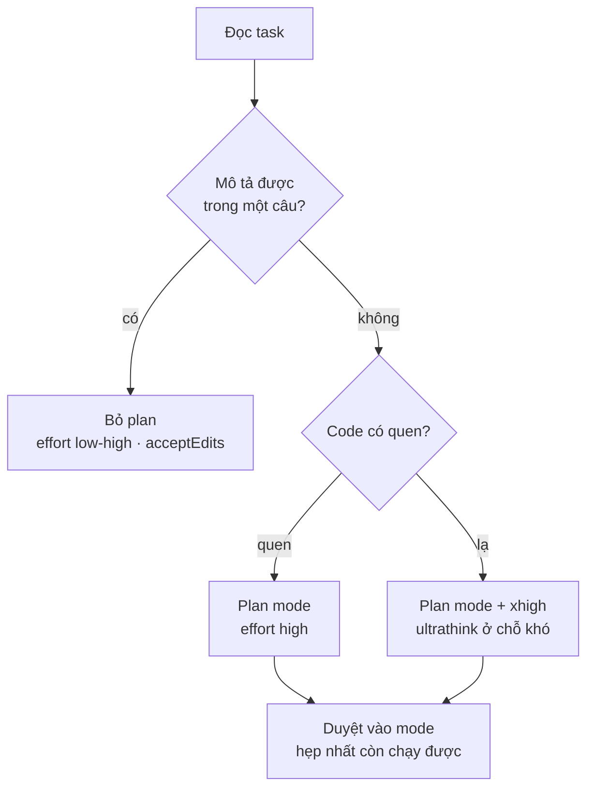

# Module 6.3: Think + Plan Combo

> **Thời gian**: ~30 phút
>
> **Yêu cầu trước**: Module 6.2 (Plan Mode)
>
> **Kết quả**: Sau module này bạn chọn được effort level, permission mode và quyết định
> plan-hay-không cho một task trong một lượt, và giải thích được từng lựa chọn dựa trên đúng
> chức năng thật của feature.

---

## 1. WHY — Tại Sao Quan Trọng

Module 6.1 cho bạn một cái núm (effort), Module 6.2 một cái cổng (plan mode). Phần lớn người
dùng sau đó chốt một setting cho mọi thứ: lúc nào cũng `max`, lúc nào cũng plan mode, hoặc
chẳng bao giờ dùng. Cả hai thói quen đều tốn.

Lúc nào cũng plan là bỏ năm phút lên kế hoạch cho một lỗi chính tả. Không bao giờ plan là
những diff mười một file bạn chưa đọc. Kỹ năng ở đây không phải "dùng Think + Plan" — mà là
đọc task trong mười giây rồi biết nó xứng đáng núm nào.

---

## 2. CONCEPT — Ý Tưởng Cốt Lõi

Ba setting độc lập, chọn theo **task**, không phải theo thói quen cá nhân:

1. **Effort** — Claude suy luận nặng bao nhiêu. `/effort low|medium|high|xhigh|max`, hoặc
   `ultrathink` cho đúng một lượt.
2. **Plan hay không** — một bản plan viết ra và được duyệt có đáng một turn không?
3. **Permission mode** — cho nó làm gì khi bắt đầu: `default`, `acceptEdits`, `plan`, `auto`,
   `dontAsk`, `bypassPermissions`.

Hướng dẫn của Anthropic quyết hộ bạn câu thứ hai: "Planning is most useful when you're
uncertain about the approach, when the change modifies multiple files, or when you're
unfamiliar with the code being modified. If you could describe the diff in one sentence, skip
the plan." (S1)

### Ma trận chọn mode

| Dạng task | Effort | Plan? | Permission mode |
|---|---|---|---|
| Diff một câu (typo, thêm log, rename) | `low`–`high` | Không | `acceptEdits` |
| Sửa một file, code quen | `high` | Không | `acceptEdits` |
| Sửa nhiều file, code quen | `high` | Có | duyệt vào `acceptEdits` |
| Code lạ, kích cỡ nào cũng vậy | `high`–`xhigh` | Có | duyệt vào **manually approve edits** |
| Architecture hoặc migration | `xhigh`, `ultrathink` ở quyết định khó | Có, và challenge nó | **manually approve edits** |
| Batch chạy không người trông hoặc CI | `low`–`medium` | Không | `dontAsk` + `--allowedTools` |

Ma trận không có dòng nào cho "thang think Level 1-3", vì không có cái thang đó: Claude Code
"passes other phrases such as 'think', 'think hard', and 'think more' through as ordinary
prompt text."


```mermaid
graph TD
    A[Đọc task] --> B{Mô tả được<br/>trong một câu?}
    B -->|có| C[Bỏ plan<br/>effort low-high · acceptEdits]
    B -->|không| D{Code có quen?}
    D -->|quen| E[Plan mode<br/>effort high]
    D -->|lạ| F[Plan mode + xhigh<br/>ultrathink ở chỗ khó]
    E --> G[Duyệt vào mode<br/>hẹp nhất còn chạy được]
    F --> G
```

---

## 3. DEMO — Từng Bước

Vẫn lab repo đó, ba task, ba câu trả lời khác nhau từ ma trận.

**Bước 1: Diff một câu — bỏ plan**

"Thêm một dòng JSDoc trên `divide()`" mô tả được trong một câu, nên không plan mode, và dùng
mode hẹp nhất còn ghi được file: <!-- docs: cli-reference, permission-modes -->

```bash
# docs: cli-reference
claude -p "Add a one-line JSDoc comment above divide() in src/math.js saying it throws \
RangeError on a zero divisor. Nothing else." \
  --permission-mode acceptEdits --allowedTools "Edit"
```

```text
# Output may vary
Added the JSDoc line above `divide()` in `src/math.js:1`.
```

```bash
git diff src/math.js
```

```text
# Output may vary
+/** Divides a by b; throws RangeError when the divisor is zero. */
 export function divide(a, b) {
```

Lượt headless có ghi file phải cấp quyền trước — `--permission-mode acceptEdits` hoặc một
`--allowedTools` bao được nó. Đưa cả hai là bản chặt nhất: mode cho edit qua, `Edit` là tool
duy nhất nó có.

**Bước 2: Thay đổi không mô tả nổi trong một câu — lên plan**

```bash
# docs: model-config, permission-modes
claude --model opusplan --permission-mode plan
```

```text
# Output may vary
 ▐▛███▛█   Claude Code v2.1.278
▝▜██████▀  Opus Plan · Claude Max
  ▝▝ ▝▝    ~/cc-lab
────────────────────────────────────────────────────────────────────────────────────
❯
  ⏸ plan mode on (shift+tab to cycle)
```

`Opus Plan` trên banner là `opusplan` đang chạy: Opus lên kế hoạch, Sonnet code. Bạn chỉ trả
giá Opus cho đoạn suy nghĩ thật sự quan trọng.

**Bước 3: Đổ effort vào chỗ có quyết định, không đổ khắp nơi**

Nâng núm cho đoạn khó rồi hạ xuống sau, ngay trong cùng session:

```text
/effort xhigh
```

```text
# Output may vary
   Effort
                   Faster                                                 Smarter
                   ────────────────────▲──────────────────────┆──────────────────
                   low     medium     high     xhigh      max       ultracode
   ←/→ to adjust · Enter to confirm · s for this session only · Esc to cancel
```

Nhấn `s` để chỉ áp dụng cho session này. Nếu chỉ có một câu hỏi khó, giữ nguyên session và
đặt `ultrathink` vào riêng prompt đó.

**Bước 4: Duyệt vào mode hẹp nhất đủ để xong việc**

Duyệt là núm cuối. **Yes, manually approve edits** giữ bạn trong vòng lặp ở từng lần ghi;
**Yes, and use auto mode** giao phần còn lại cho classifier. Chọn theo mức bạn tin vào plan —
sai thì `/rewind` khôi phục code, hội thoại, hoặc cả hai.

---

## 4. PRACTICE — Tự Làm

### Bài 1: Phân loại năm task thật

**Mục tiêu**: Biến ma trận thành phản xạ.

**Hướng dẫn**:
1. Liệt kê năm task trong sprint hiện tại của bạn.
2. Với mỗi task, viết một câu mô tả cái diff. Không viết nổi → đánh dấu "plan".
3. Gán effort level và permission mode cho từng task.
4. Chạy hai cực — task nhỏ nhất và lớn nhất — rồi kiểm lại phán đoán.

**Kết quả mong đợi**: Một bảng năm dòng, và hai lượt chạy xác nhận hoặc sửa nó.

<details>
<summary>💡 Gợi ý</summary>
Bài test "một câu" quyết định cả cột thứ ba. Đừng nghĩ nhiều về hai cột kia: `high` và
`acceptEdits` đúng nhiều hơn sai.
</details>

<details>
<summary>✅ Lời giải</summary>

Kết quả thường gặp: ba trên năm task không cần plan. Đúng với (S1) — "If you could describe
the diff in one sentence, skip the plan." Hai task còn lại thường đụng vào code bạn chưa đọc
trong quý này, tức là "unfamiliar with the code being modified", chứ không phải "task to".
</details>

### Bài 2: Tính chi phí của combo

**Mục tiêu**: Đo xem combo đắt hơn đường rẻ bao nhiêu trên một task thật.

**Hướng dẫn**:
1. Chọn một thay đổi hai hoặc ba file.
2. Lượt A: `claude --permission-mode acceptEdits`, không plan, effort mặc định.
3. `/rewind` về đầu, hoặc `git checkout -- .`.
4. Lượt B: `claude --model opusplan --permission-mode plan`, `/effort xhigh`, challenge plan
   một lần, rồi duyệt.
5. So thời gian thực tế và số lần phải sửa sau đó của mỗi lượt.

**Kết quả mong đợi**: Một con số để trích dẫn lần sau khi ai đó bảo planning là phí thời gian.

<details>
<summary>✅ Lời giải</summary>

Lượt B thường đắt hơn ở đầu và rẻ hơn tổng thể với việc nhiều file, vì mỗi lần sửa sau lượt A
tốn một turn và làm bẩn context. Với thay đổi một file thì thứ tự đảo lại — và đó chính là lý
do ma trận có nhiều dòng thay vì một đáp án.
</details>

---

## 5. CHEAT SHEET

| Câu hỏi | Setting | Giá trị |
|---|---|---|
| Suy luận nặng cỡ nào? | `/effort`, `--effort` | `low`, `medium`, `high`, `xhigh`, `max`, `ultracode` |
| …làm default đã lưu? | `effortLevel`, `modelSettings` | chỉ `low`, `medium`, `high`, `xhigh` — `ultracode` có key riêng |
| Chỉ đúng lượt này? | `ultrathink` trong prompt | — |
| Có cần plan trước không? | `Shift+Tab`, `/plan`, `--permission-mode plan` | diff một câu → không |
| Ai lên plan, ai code? | `--model opusplan` | Opus plan, Sonnet execute |
| Được làm gì? | `--permission-mode` | `default`, `acceptEdits`, `plan`, `auto`, `dontAsk`, `bypassPermissions` |
| Được gọi tool nào? | `--allowedTools` | ví dụ `"Edit"`, `"Bash(npm test)"` |
| Hoàn tác | `/rewind`, `Esc` hai lần | hội thoại, code, hoặc cả hai |

Quy tắc ngón tay cái: mặc định `high` + `acceptEdits`; thêm plan mode khi cái diff cần nhiều
hơn một câu; thêm `xhigh` hoặc `ultrathink` chỉ ở chỗ có ngã rẽ quyết định.

---

## 6. PITFALLS — Lỗi Thường Gặp

| ❌ Sai | ✅ Đúng |
|---|---|
| Plan cho mọi task | "If you could describe the diff in one sentence, skip the plan." (S1) |
| Không bao giờ plan | Plan khi hướng đi chưa chắc, nhiều file, hoặc code lạ (S1) |
| Để mọi thứ ở `max` | `max` "may show diminishing returns and is prone to overthinking" |
| `/compact` giữa think và plan | Không docs page nào nói thinking hay plan sống sót (hay chết) qua compact. Dùng `/clear` giữa các task không liên quan |
| Viết "think first, then plan" trong prompt | Plan mode mới là cái cổng; mấy chữ đó chỉ là prompt text thường |
| Duyệt vào `auto` theo quán tính | Chọn option duyệt khớp với mức bạn tin vào plan |
| Headless ghi file mà không có permission flag | Mọi `claude -p` có edit đều cần `--permission-mode` hoặc `--allowedTools` |

---

## 7. REAL CASE — Câu Chuyện Thật

**Bối cảnh**: Một team fintech Việt Nam thêm nhà cung cấp thanh toán thứ tư (ZaloPay) bên cạnh
VNPay, Momo và một card gateway. Interface provider, một DB enum, job đối soát và một webhook
route đều phải sửa — cộng thêm một cặp `expect`/`actual` trong app mobile.

**Vấn đề**: Style nội bộ của họ đã thành "lúc nào cũng plan, lúc nào cũng `max`". Một thay
đổi enum hai dòng phải chờ sau turn planning bốn phút, còn phần đối soát — phần không ai hiểu
rõ — bị đối xử y hệt, nên bước rủi ro bị chôn giữa toàn việc vặt.

**Giải pháp**: Họ chia việc theo ma trận thay vì theo lịch. Enum và webhook route đi qua các
lượt headless với `--permission-mode acceptEdits` và `--allowedTools` thu hẹp, không plan. Job
đối soát được `claude --model opusplan --permission-mode plan` với `/effort xhigh`, một lượt
`ultrathink` cho câu hỏi settlement window, và một vòng challenge trước khi duyệt. Phần đó họ
duyệt bằng **Yes, manually approve edits**.

**Kết quả**: Việc vặt xong trong vài phút thay vì chờ sau các turn planning, còn phần rủi ro
có một plan nói thẳng giả định về settlement window. Quy tắc họ giữ là bài test một câu — mọi
thứ khác suy ra từ đó. Về tự động hóa, xem [Module 7.2: Full Auto
Workflow](../../phase-07-multi-agent-auto/02-full-auto-workflow/); để biến một check thành bắt
buộc, xem [Module 11.3: Hooks System](../../phase-11-automation-headless/03-hooks-system/).

---

> **Tiếp theo**: [Module 7.1: Các Mức Độ Auto Coding](../../phase-07-multi-agent-auto/01-auto-coding-levels/) →
