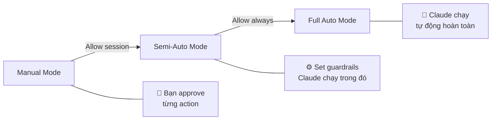

# Module 7.1: Các Cấp Độ Auto Coding

> **Thời gian học**: ~30 phút
>
> **Yêu cầu trước**: Phase 6 (Thinking & Planning), Module 2.2 (Permission System)
>
> **Kết quả**: Sau module này, bạn sẽ hiểu automation spectrum trong Claude Code, biết configure từng level, và quyết định khi nào tăng/giảm automation dựa trên task risk.

---

## 1. WHY — Tại Sao Phải Hiểu Các Cấp Độ

Bạn đang refactor một API controller. Click "approve" cho tất cả thay đổi vì tin Claude Code. Sáng hôm sau, server không start được — hoá ra Claude "dọn dẹp" config file cho gọn, nghĩ là file test cũ.

Hoặc ngược lại: bạn đang rename một variable xuất hiện 47 chỗ. Claude Code hỏi approve từng chỗ. Bạn click "y", Enter, "y", Enter... 47 lần. Mất 10 phút cho task 30 giây.

Vấn đề: chúng ta coi automation như công tắc on/off. Thực tế, nó là một spectrum — giống lái xe vậy. Manual Mode là lái tay, Semi-Auto là cruise control, Full Auto là xe tự lái. Đường quen thì cruise control okay, đường hoàn toàn rõ ràng thì để xe tự lái, đường lạ trời mưa thì lái tay an toàn hơn. Claude Code cũng vậy — **automation level phải match với risk level**.

---

## 2. CONCEPT — Ba Cấp Độ Automation

### Automation Spectrum



### Level 1: Manual Mode (Default)

**Đặc điểm**: Claude hỏi approve cho TỪNG action — đọc file, edit, chạy command.

**Khi nào dùng**:
- Codebase mới, chưa quen
- Task high-risk: database migration, authentication, payment processing
- Production environment (không sandbox)
- Đang học cách Claude Code hoạt động

**Ưu điểm**: Kiểm soát tối đa, bắt lỗi sớm
**Nhược điểm**: Chậm, phải focus liên tục

### Level 2: Semi-Auto Mode

**Đặc điểm**: Bạn set guardrails một lần ("allow for session"), Claude execute tự động trong guardrails đó.

**Khi nào dùng**:
- Task quen thuộc với codebase đã hiểu
- Task low-to-medium risk: refactoring, test generation, formatting
- Có plan rõ ràng, scope xác định
- Muốn tăng velocity nhưng vẫn giữ safety net

**Ưu điểm**: Balance giữa tốc độ và control
**Nhược điểm**: Vẫn phải monitor, có thể miss edge cases

### Level 3: Full Auto Mode

**Đặc điểm**: Claude execute hoàn toàn tự động, không hỏi approve. Cần opt-in explicit.

**Khi nào dùng**:
- Task rất quen, đã làm nhiều lần (như CI/CD automation)
- Sandbox environment với rollback dễ dàng
- Đã có plan chi tiết + Think Mode validation
- Codebase có test suite tốt để verify

**Ưu điểm**: Tốc độ tối đa, focus vào strategy thay vì tactics
**Nhược điểm**: Rủi ro cao nếu plan sai, khó debug khi có lỗi

### Risk Assessment Matrix

| Task Risk | Độ quen codebase | Level khuyến nghị |
|-----------|------------------|-------------------|
| Thấp (format, tests) | Cao | Semi-Auto hoặc Full Auto |
| Thấp | Thấp | Semi-Auto |
| Cao (DB, auth, payments) | Cao | Manual hoặc Semi-Auto |
| Cao | Thấp | **Luôn Manual** |

**Lưu ý**: Level này liên kết với **Permission System** (Module 2.2). Semi-Auto và Full Auto vẫn tuân theo permission boundaries — không có permission thì vẫn bị chặn.

### So Sánh Các Phương Pháp Tự Động Hóa

Các mức tự động hóa của Claude Code so sánh như thế nào trong các workflow khác nhau?

| Phương pháp | Mức kiểm soát | Tốc độ | Chất lượng Context | Kịch bản phù hợp |
|-------------|--------------|--------|-------------------|-------------------|
| **Manual Mode** | Tối đa | Chậm | Hoàn hảo — bạn xác nhận từng bước | Học tập, code rủi ro cao, security-critical |
| **Semi-Auto Mode** | Cân bằng | Nhanh | Tốt — trust trong phạm vi session | Phát triển hàng ngày, feature work |
| **Full Auto Mode** | Tối thiểu | Nhanh nhất | Phụ thuộc chất lượng CLAUDE.md | CI/CD, môi trường sandbox |
| **Multi-Agent** (Phase 7.3) | Theo từng agent | Song song | Mới cho mỗi agent | Tác vụ phức tạp nhiều file |
| **Headless/SDK** (Phase 11) | Lập trình | Tự động | Định nghĩa bởi script | Production pipelines, batch ops |

**Điểm mấu chốt**: Đây không phải các phương pháp cạnh tranh — chúng **kết hợp** với nhau. Một workflow nâng cao điển hình có thể dùng Semi-Auto cho phát triển tương tác, spawn Full Auto agents cho các subtask rõ ràng, và orchestrate qua SDK trong CI/CD. Kỹ năng là khớp đúng mức tự động hóa cho từng phần của workflow.

---

## 3. DEMO — Cùng Task, Ba Cách Thực Hiện

**Task**: Refactor `src/utils/helpers.ts` — extract 3 functions (formatDate, validateEmail, truncateText) ra file riêng `src/utils/string.ts` và `src/utils/validation.ts`.

### Demo 1: Manual Mode

```bash
$ claude
```

**Prompt 1**:
```
Read src/utils/helpers.ts and show me the 3 functions to extract
```

Claude: "I'll read the file..."
→ **Approve?** `y` (bạn phải confirm)

Output:
```typescript
// Found:
export function formatDate(date: Date): string { ... }
export function validateEmail(email: string): boolean { ... }
export function truncateText(text: string, max: number): string { ... }
```

**Prompt 2**:
```
Extract formatDate and truncateText to src/utils/string.ts
```

Claude: "I'll create src/utils/string.ts..."
→ **Approve?** `y`

Claude: "I'll edit src/utils/helpers.ts to remove those functions..."
→ **Approve?** `y`

Claude: "I'll add export statement..."
→ **Approve?** `y`

**Prompt 3**:
```
Extract validateEmail to src/utils/validation.ts
```

Claude: "I'll create src/utils/validation.ts..."
→ **Approve?** `y`

Claude: "I'll update helpers.ts..."
→ **Approve?** `y`

**Prompt 4**:
```
Update all imports across the codebase
```

Claude: "I'll search for imports of helpers.ts..."
→ **Approve?** `y`

Claude: "I'll edit src/components/UserForm.tsx..."
→ **Approve?** `y`

Claude: "I'll edit src/pages/Dashboard.tsx..."
→ **Approve?** `y`

**Tổng cộng**: 6-8 prompts, ~5 phút, 8 lần approve. Full control nhưng chậm.

---

### Demo 2: Semi-Auto Mode

```bash
$ claude
```

**Prompt 1**:
```
Refactor src/utils/helpers.ts: extract formatDate + truncateText to src/utils/string.ts, validateEmail to src/utils/validation.ts, update all imports
```

Claude: "I'll need to:
1. Read helpers.ts
2. Create string.ts and validation.ts
3. Update helpers.ts
4. Update imports in 3 files

May I proceed?"

→ **Approve?** `a` (allow for session)

Claude executes tất cả actions tự động. Bạn thấy:
```
✓ Read src/utils/helpers.ts
✓ Created src/utils/string.ts
✓ Created src/utils/validation.ts
✓ Updated src/utils/helpers.ts
✓ Updated src/components/UserForm.tsx
✓ Updated src/pages/Dashboard.tsx
Done!
```

**Tổng cộng**: 1 prompt, ~2 phút, 1 lần approve. Balanced.

---

### Demo 3: Full Auto Mode ⚠️

**Chuẩn bị**: Tạo plan file trước (best practice cho Full Auto)

```bash
$ claude --plan refactor-helpers.md  # ⚠️ Cần xác minh - flag có thể khác
```

**File `refactor-helpers.md`**:
```markdown
# Refactor helpers.ts

## Goal
Extract 3 functions to separate files for better organization

## Steps
1. Extract formatDate, truncateText → src/utils/string.ts
2. Extract validateEmail → src/utils/validation.ts
3. Update all imports (search *.tsx, *.ts)
4. Run tests to verify

## Safety
- Rollback: git reset --hard (working tree clean)
- Test: npm test src/utils/
```

**Execute**:
```bash
$ claude --auto --plan refactor-helpers.md  # ⚠️ Cần xác minh
```

Output:
```
Full Auto Mode enabled with plan: refactor-helpers.md
Executing...

✓ Analyzed helpers.ts (3 functions found)
✓ Created string.ts with 2 functions
✓ Created validation.ts with 1 function
✓ Updated helpers.ts (removed extracted functions)
✓ Updated 3 import statements
✓ Running tests...
  ✓ All tests passed (12/12)

Completed in 47 seconds.
```

**Tổng cộng**: 0 prompts interactive, ~1 phút, 0 lần approve. Fast nhưng cần trust + planning.

---

## 4. PRACTICE — Tự Thử Nghiệm

### Bài 1: Level Calibration

**Goal**: Làm quen với cảm giác của từng level

**Instructions**:
1. Tạo folder `practice-auto/` với 5 files:
   ```bash
   mkdir practice-auto && cd practice-auto
   touch utils.ts api.ts helpers.ts validators.ts formatters.ts
   ```

2. Mỗi file có 1 function đơn giản:
   ```typescript
   export function processData(data: any) {
     return data;
   }
   ```

3. Task: Thêm `console.log('Processing:', data)` vào đầu TỪNG function

4. Làm task này 3 lần với 3 levels:
   - **Lần 1 (Manual)**: Đếm số lần approve
   - **Lần 2 (Semi-Auto)**: Đo thời gian
   - **Lần 3 (Full Auto)**: Viết plan file trước, execute

**Expected result**:
- Manual: ~8-10 approvals, ~3-4 phút
- Semi-Auto: 1 approval, ~1 phút
- Full Auto: 0 approvals, ~30 giây

<details>
<summary>💡 Hint</summary>

Cho Semi-Auto, prompt: "Add console.log to all functions in practice-auto/*.ts"
Cho Full Auto, plan file:
```markdown
# Add logging
1. Read all .ts files
2. Add console.log at start of each function
3. Save files
```
</details>

<details>
<summary>✅ Solution</summary>

**Manual Mode**:
```bash
$ claude

> Read utils.ts
[approve: y]

> Add console.log('Processing:', data) to processData function
[approve: y]

> Repeat for api.ts...
[approve: y]
...
```

**Semi-Auto Mode**:
```bash
$ claude

> Add console.log('Processing:', data) to the start of processData function in all .ts files in practice-auto/
[approve: a]  # Allow for session
# Claude executes all edits automatically
```

**Full Auto Mode**:
Create `add-logging.md`:
```markdown
# Add Logging to All Functions

## Steps
1. Read all .ts files in practice-auto/
2. For each file, add console.log('Processing:', data) at start of processData
3. Preserve all other code
```

Execute:
```bash
$ claude --auto --plan add-logging.md
```
</details>

---

### Bài 2: Risk Assessment

**Goal**: Luyện khả năng đánh giá risk để chọn level

**Instructions**: Với mỗi task dưới đây, xác định:
- Risk level (Low / Medium / High)
- Độ quen codebase (Cao / Thấp)
- Level khuyến nghị (Manual / Semi-Auto / Full Auto)
- Lý do

**5 Tasks**:
1. Format tất cả files với Prettier
2. Add TypeScript types cho API mới bạn chưa từng thấy
3. Refactor authentication logic trong app banking
4. Generate unit tests cho utils functions đã có
5. Update dependencies trong package.json (major version bumps)

<details>
<summary>💡 Hint</summary>

Dùng Risk Matrix ở phần CONCEPT. Cân nhắc:
- Task tự động hoá được không? (format — yes, auth logic — no)
- Hậu quả nếu sai? (tests — dễ fix, banking auth — disaster)
- Rollback dễ không? (prettier — git reset, deps — có thể break build)
</details>

<details>
<summary>✅ Solution</summary>

1. **Format với Prettier**
   - Risk: Low (idempotent, dễ rollback)
   - Độ quen: Không quan trọng (tool-based)
   - Level: **Full Auto** (hoặc Semi-Auto)
   - Lý do: Pure formatting, không đụng logic

2. **Add types cho API mới**
   - Risk: Medium (có thể type sai, break compile)
   - Độ quen: Thấp (chưa hiểu API)
   - Level: **Manual**
   - Lý do: Cần hiểu API behavior, types ảnh hưởng correctness

3. **Refactor banking auth**
   - Risk: High (security-critical)
   - Độ quen: Giả sử Cao
   - Level: **Manual** (hoặc Semi-Auto với review kỹ)
   - Lý do: Auth bugs = security breach, luôn cẩn thận

4. **Generate unit tests**
   - Risk: Low (tests không break production)
   - Độ quen: Cao (utils đã có)
   - Level: **Semi-Auto** (hoặc Full Auto nếu có plan)
   - Lý do: Test generation an toàn, nhưng nên review test quality

5. **Update dependencies (major)**
   - Risk: High (breaking changes có thể phá app)
   - Độ quen: Không quan trọng
   - Level: **Manual** (đọc changelog từng package)
   - Lý do: Major updates cần đọc migration guide, test kỹ
</details>

---

## 5. CHEAT SHEET

### Quick Decision Guide

```
┌─────────────────────────────────────────────────────────┐
│  Task Type              →  Level khuyến nghị            │
├─────────────────────────────────────────────────────────┤
│  Format / Lint          →  Semi-Auto / Full Auto        │
│  Generate tests         →  Semi-Auto                    │
│  Refactor (quen code)   →  Semi-Auto                    │
│  Refactor (lạ code)     →  Manual                       │
│  Add features (quen)    →  Semi-Auto                    │
│  Add features (lạ)      →  Manual                       │
│  Security / Auth        →  Manual                       │
│  Database migration     →  Manual                       │
│  Config changes         →  Manual (review kỹ)           │
│  CI/CD automation       →  Full Auto (trong sandbox)    │
└─────────────────────────────────────────────────────────┘
```

### Permission Shortcuts

| Key | Meaning | Level Impact |
|-----|---------|--------------|
| `y` | Yes, approve this action | Stays in Manual Mode |
| `n` | No, reject this action | Stays in Manual Mode |
| `a` | Allow for session | Switches to Semi-Auto |
| `always` | Allow always (persistent) | Switches to Full Auto ⚠️ |

### Level Selection Reference

| Factor | Manual | Semi-Auto | Full Auto |
|--------|--------|-----------|-----------|
| **Task familiarity** | Low | Medium-High | Very High |
| **Code familiarity** | Low | Medium-High | High |
| **Risk level** | Any | Low-Medium | Low only |
| **Approval frequency** | Every action | Once per session | None |
| **Speed** | Slow | Fast | Fastest |
| **Control** | Maximum | Balanced | Minimum |
| **Best for** | Learning, high-risk | Daily work | Automation, CI/CD |

---

## 6. PITFALLS — Những Sai Lầm Thường Gặp

| ❌ Sai lầm | ✅ Cách đúng |
|-----------|-------------|
| Dùng Full Auto cho mọi task vì "nhanh hơn" | Full Auto chỉ cho task low-risk + đã plan kỹ. High-risk tasks luôn dùng Manual hoặc Semi-Auto. |
| Click "allow always" lần đầu tiên dùng Claude Code | Bắt đầu với Manual Mode. Chỉ escalate lên Semi/Full khi đã hiểu behavior của Claude. |
| Dùng Manual Mode cho task formatting 200 files | Task repetitive, low-risk → Semi-Auto hoặc Full Auto với plan. Manual Mode lãng phí thời gian. |
| Không có plan khi dùng Full Auto | Full Auto cần plan rõ ràng. Không plan = Claude tự improvise → unpredictable results. |
| Quên rollback strategy khi dùng Full Auto | Luôn có `git status` clean hoặc backup trước Full Auto. Nếu không rollback được → đừng dùng Full Auto. |
| Dùng Semi-Auto cho codebase production lạ | Codebase lạ + production = Manual Mode. Học codebase trước, automation sau. |

---

## 7. REAL CASE — Onboarding Team Microservices

**Scenario**: Team Việt Nam (5 devs) onboard vào hệ thống microservices của khách hàng Mỹ. 30+ services, tech stack lạ (Go, gRPC, Kubernetes).

**Tuần 1 — Manual Mode Only**:
- Quy định: Tất cả devs PHẢI dùng Manual Mode
- Mục tiêu: Học cách services giao tiếp, hiểu deployment flow
- Dev A click approve ~200 lần/ngày nhưng **bắt lỗi sớm**: Claude Code định sửa config file critical, dev thấy ngay và reject
- Kết quả: Không có incident nào, team hiểu 70% architecture sau 1 tuần

**Tuần 2 — Cho phép Semi-Auto**:
- Điều kiện: Chỉ cho services đã quen, task low-risk (add logging, update tests)
- Dev B refactor một service Go: dùng Semi-Auto, velocity tăng 3x so với tuần trước
- Dev C vẫn dùng Manual cho service lạ (payment gateway) → đúng quyết định

**Tuần 3 — Full Auto Cho CI/CD**:
- Setup sandbox Kubernetes cluster riêng
- Dùng Full Auto để test deployment scripts, rollback strategies
- Plan file chi tiết cho từng scenario
- Kết quả: Tìm được 2 bugs trong deployment flow mà manual testing bỏ qua

**Mistake**: Dev D dùng Full Auto để migrate database schema của một service — không có plan rõ ràng. Claude Code thực hiện migration nhưng quên update indices. Service chậm đi 10x. Phải rollback, làm lại với Manual Mode + Think+Plan.

**Lesson Learned**:
> "Full Auto phải kiếm được, không phải mặc định. Nó là phần thưởng khi bạn đã hiểu task + code + risk đủ rõ để trust autonomous execution. Tuần 1 chúng tôi chậm, nhưng tuần 3 chúng tôi nhanh gấp 5 lần — vì đã hiểu khi nào nên thả tay."

---

> **Tiếp theo**: [Module 7.2: Quy Trình Full Auto](../02-full-auto-workflow/) →
