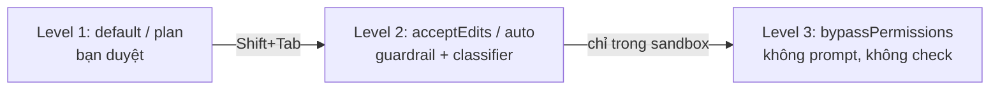

# Module 7.1: Các mức Auto Coding

> **Thời gian ước tính**: ~30 phút
>
> **Điều kiện tiên quyết**: Phase 6 (Thinking & Planning),
> [Module 2.2 (Permission System)](../../phase-02-security/02-permission-system/)
>
> **Kết quả**: Sau module này, bạn chọn được **permission mode** cho từng task theo ma trận
> Risk × Familiarity, đổi mode bằng `Shift+Tab` / `--permission-mode` /
> `permissions.defaultMode`, và giải thích được vì sao `auto` không phải `bypassPermissions`.

---

## 1. WHY — Tại sao quan trọng

Bạn bấm "Yes" 40 lần chỉ để thêm log vào mười hàm. Hôm sau tắt hết prompt, và Claude "dọn dẹp"
luôn file config bạn đang cần. Hai lần cùng một lỗi: coi tự động hoá là công tắc bật/tắt.

Claude Code cung cấp cả dải đó dưới tên **permission mode**. Ba "level" ở đây chỉ là nhãn; mode
mới là cơ chế, do Claude Code cưỡng chế, không phải do model.

---

## 2. CONCEPT — Ý tưởng cốt lõi

### Các mode trang docs liệt kê

Trang permissions liệt kê **sáu mode cộng một alias**. Khoá học gom thành ba level:

| Level | Mode | Chạy không cần hỏi | Hợp với |
|---|---|---|---|
| **1 — Manual** | `default` (alias `manual`) | Chỉ đọc | Duyệt từng thao tác, việc nhạy cảm |
| 1 | `plan` | Đọc, cộng lệnh được classifier duyệt khi auto mode khả dụng; không sửa source cho tới khi bạn duyệt plan | Khảo sát trước khi đổi gì |
| **2 — Semi-Auto** | `acceptEdits` | Đọc, sửa file, và `mkdir`/`touch`/`rm`/`rmdir`/`mv`/`cp`/`sed` trong working dir | Sửa code bạn sẽ xem lại bằng `git diff` |
| 2 | `auto` | Mọi thứ, có **classifier** duyệt từng hành động | Task dài, mỏi tay bấm prompt |
| 2 (CI) | `dontAsk` | Đọc + tool đã pre-approve; thứ gì lẽ ra phải hỏi thì **bị deny** | Script khoá chặt |
| **3 — Full Auto** | `bypassPermissions` | Mọi thứ | **Chỉ** container/VM cô lập |

Đọc kỹ dòng `acceptEdits`: `rm` và `rmdir` nằm trong bộ đó. Việc tự duyệt chỉ áp dụng cho đường
dẫn trong working directory và `additionalDirectories` — nhưng trong phạm vi đó, một lệnh xoá
chạy mà không hỏi.


```mermaid
graph LR
    L1["Level 1: default / plan<br/>bạn duyệt"] -->|Shift+Tab| L2["Level 2: acceptEdits / auto<br/>guardrail + classifier"]
    L2 -->|chỉ trong sandbox| L3["Level 3: bypassPermissions<br/>không prompt, không check"]
```

### Cách đặt mode

- **Trong session**: `Shift+Tab` xoay vòng `default` → `acceptEdits` → `plan` → (`auto` nếu
  khả dụng) → quay lại. `bypassPermissions` chỉ vào vòng xoay khi bạn khởi động với nó;
  `dontAsk` không bao giờ.
- **Một session**: `claude --permission-mode plan` (dùng được cả với `-p`).
- **Mọi session trong project**: `permissions.defaultMode` trong `.claude/settings.json`. Session
  terminal nhận mọi giá trị ở đó **trừ** `auto` và `bypassPermissions`, hai giá trị chỉ có hiệu
  lực từ user settings hoặc managed settings.
- **Khoá toàn tổ chức**: `permissions.disableBypassPermissionsMode` / `disableAutoMode` =
  `"disable"` trong managed settings.

### Auto mode là gì — và không là gì

`auto` là mode khởi động mặc định trên Pro/Max/Team. Một model thứ hai, classifier, duyệt từng
hành động và chặn thứ gì "vượt quá yêu cầu của bạn, nhắm vào hạ tầng lạ, hoặc có vẻ bị nội
dung độc hại Claude vừa đọc điều khiển". Anthropic báo cáo **84% ít prompt hơn** khi dùng nội
bộ với thiết kế classifier hai lớp này (S13, "How we built Claude Code auto mode", 2026-03-25).
Docs nói thẳng: *"Auto mode reduces permission prompts but does not guarantee safety."* Level 2
có người duyệt, không phải Level 3. Nếu classifier chặn 3 lần liên tiếp (hoặc 20 lần tổng), auto
mode tạm dừng và bạn được hỏi lại.

### Ma trận Risk × Familiarity (giữ nguyên)

| Rủi ro task | Độ quen | Mode |
|---|---|---|
| Thấp (format, test) | Cao | `acceptEdits` hoặc `auto` |
| Thấp | Thấp | `plan` trước, rồi `acceptEdits` |
| Cao (DB, auth, payment) | Cao | `default` + `permissions.deny` cho đường nóng |
| Cao | Thấp | **`default` — luôn luôn** |

Mode là nền. Rule `permissions.allow/deny/ask` xếp lên trên, và **deny rule chặn ở mọi mode, kể
cả `bypassPermissions`** (Module 2.2). CLAUDE.md chỉ là lời khuyên.

> `(S13)`: `docs/references/anthropic-sources.md`.

---

## 3. DEMO — Từng bước

Chạy trong `~/cc-lab` (`src/math.js`, `tests/math.test.mjs`, `npm test`). Máy này có user
settings khởi động ở `auto`, nên mỗi lệnh đều ghim mode.

**Bước 1: Đọc mode indicator, rồi xoay vòng**

```bash
# docs: permission-modes#switch-permission-modes
claude --permission-mode default
```

Status bar lúc khởi động, rồi sau mỗi lần `Shift+Tab`:

```text
# Output may vary
  ⏸ manual mode on
  ⏵⏵ accept edits on (shift+tab to cycle)
  ⏸ plan mode on (shift+tab to cycle)
  ⏵⏵ auto mode on (shift+tab to cycle)
```

Vì sao: dòng đó là nơi duy nhất hiện mode — đọc trước khi làm việc rủi ro.

**Bước 2: Level 1 headless — plan mode đề xuất, không sửa**

```bash
# docs: permission-modes#analyze-before-you-edit-with-plan-mode
claude --permission-mode plan -p "Propose how to add a subtract function to src/math.js with a test. Do not edit any file."
git status --short
```

```text
# Output may vary
Here's the proposal (no files touched; the plan is saved at `~/.claude/plans/propose-how-to-add-keen-dahl.md`).
…
- `src/math.js:1-2` exports `add` and `divide` as one-liners.
…
Run `npm test` — expect 2 passing tests (`add`, `subtract`), 0 failing.
```

`git status` không in gì: plan mode chỉ đọc repo và ghi mỗi plan.

**Bước 3: Level 1 tương tác — permission prompt thật**

```bash
# docs: permissions#permission-system
claude --permission-mode default
```

Prompt: `Create a file hello.txt containing hi`

```text
# Output may vary
⏺ Write(hello.txt)
 Create file
 hello.txt
  1 hi
 Do you want to create hello.txt?
 ❯ 1. Yes
   2. Yes, and switch to accept edits (auto-approve file edits and common file commands) for this session
      (shift+tab)
   3. No
 Esc to cancel · Tab to amend
```

Lựa chọn 2 *chính là* cú nhảy lên Level 2. Prompt cho Bash có lựa chọn thứ hai khác,
`Yes, and don't ask again for: npm test *`, được lưu vào `.claude/settings.local.json` dưới dạng
`Bash(npm test *)`. Bấm `Esc`, Claude báo `User rejected write to hello.txt`.

**Bước 4: Headless không có prompt — nên mode quyết định**

```bash
# docs: headless#auto-approve-tools
claude -p "Create a file hello.txt containing hi" --permission-mode default
ls hello.txt
```

```text
# Output may vary
The write to `hello.txt` was blocked pending your permission. Please approve the write request and I'll create the file, or let me know if you'd prefer a different approach.
ls: hello.txt: No such file or directory
```

`--permission-mode default` ép hành vi gốc; trên gói Pro, Max và Team, starting mode built-in
là `auto`, và `permissions.defaultMode` ghi đè nó. Level 2:

```bash
claude -p "Create a file hello.txt containing hi" --permission-mode acceptEdits
cat hello.txt
```

```text
# Output may vary
Created `/Users/luatnq/cc-lab/hello.txt` containing `hi`.
hi
```

**Bước 5: Đặt Level 2 làm mặc định cho project**

```bash
# docs: permission-modes#start-in-a-different-mode
mkdir -p .claude && cat > .claude/settings.json << 'EOF'
{
  "permissions": {
    "defaultMode": "acceptEdits"
  }
}
EOF
claude
```

```text
# Output may vary
  ⏵⏵ accept edits on (shift+tab to cycle)
```

Project settings thắng file user, nên session vào thẳng Level 2, không cần cờ.

**Bước 6: Level 3 — cờ thật, chỉ trong sandbox**

```bash
# docs: cli-reference — tương đương --permission-mode bypassPermissions
claude --dangerously-skip-permissions
```

Cờ này có thật; đừng chạy trên máy host. Chỉ dùng trong sandbox hoặc container (Module 2.3).
Nó từ chối chạy dưới root và deny rule vẫn áp dụng — nhưng mọi prompt và classifier đều biến mất.

Dọn dẹp: `rm hello.txt .claude/settings.json`.

---

## 4. PRACTICE — Tự thực hành

### Bài 1: Đếm số prompt

**Mục tiêu**: Cảm nhận khác biệt Level 1 và Level 2 trên task rủi ro thấp.
**Hướng dẫn**:
1. `claude --permission-mode default`, prompt: "Add a one-line JSDoc comment above each function
   in src/math.js". Đếm số prompt.
2. `git checkout -- src`, lặp lại với `--permission-mode acceptEdits`. Mode nào khớp rủi ro?

**Kết quả mong đợi**: mỗi edit một prompt ở `default`; không prompt nào ở `acceptEdits`.

<details>
<summary>💡 Gợi ý</summary>
Nhìn status bar; ở `acceptEdits` bạn xem lại kết quả bằng `git diff`, không phải inline.
</details>

<details>
<summary>✅ Lời giải</summary>
`default` hỏi một lần cho mỗi `Edit`. `acceptEdits` tự duyệt edit trong working directory nên
lượt chạy im lặng; `git diff src/math.js` là bước review.
</details>

### Bài 2: Chọn mode

**Mục tiêu**: Luyện ma trận. Với mỗi task, chọn một mode và một rule.
1. Prettier trên 150 file. 2. Sửa DB migration. 3. Endpoint mới theo pattern có sẵn.
4. Đổi logic auth. 5. Sinh test cho pure function.

<details>
<summary>✅ Lời giải</summary>

| Task | Mode | Guardrail thêm |
|---|---|---|
| Prettier | `acceptEdits` | `git diff --stat` sau khi chạy |
| Migration | `default` | `"deny": ["Edit(./migrations/**)"]` tới khi review xong |
| Endpoint | `acceptEdits` | `plan` trước nếu pattern chưa rõ |
| Auth | `default` | `"deny": ["Read(./.env)"]` |
| Test | `auto` | Stop hook chạy `npm test` (Module 11.3) |
</details>

---

## 5. CHEAT SHEET

| Lệnh / Tính năng | Mô tả | Ví dụ |
|---|---|---|
| `Shift+Tab` | Xoay mode trong session | `default` → `acceptEdits` → `plan` → `auto` |
| `--permission-mode <mode>` | Khởi động ở một mode; dùng được với `-p` | `claude --permission-mode plan` |
| `permissions.defaultMode` | Mặc định theo máy/project/tổ chức | `{"permissions": {"defaultMode": "acceptEdits"}}` |
| `/permissions` | Xem/sửa rule allow, ask, deny | rule xét theo thứ tự deny → ask → allow |
| `/plan` | Plan mode cho một prompt | `/plan refactor the parser` |
| `--dangerously-skip-permissions` | = `--permission-mode bypassPermissions` | chỉ sandbox/container |
| `disableBypassPermissionsMode` | Công tắc khoá managed | `"disable"` |
| Phím ở prompt | `1`/`Enter` Yes · `2` session/rule · `Esc` huỷ · `Tab` thêm ghi chú | — |

---

## 6. PITFALLS — Lỗi thường gặp

| ❌ Sai lầm | ✅ Cách đúng |
|---|---|
| Dạy hoặc chờ prompt `[y]/[a]/[n]` | Không tồn tại. Prompt là các lựa chọn đánh số; `Esc` huỷ, `Tab` thêm ghi chú |
| `bypassPermissions` trên laptop | Chỉ trong sandbox/container; deny rule vẫn giữ, mọi thứ khác thì không |
| Coi `auto` là "an toàn tuyệt đối" | Nó giảm prompt; không thay thế review cho thay đổi nhạy cảm |
| `defaultMode: "auto"` trong `.claude/settings.json` | Bị bỏ qua ở đó — đặt vào `~/.claude/settings.json` hoặc managed settings |
| Ranh giới chỉ nêu trong prompt | Classifier có đọc nhưng compaction có thể làm mất; thêm rule `permissions.deny` |
| Một mode cho mọi task | Dùng ma trận: độ quen và bán kính thiệt hại, không phải thói quen |

---

## 7. REAL CASE — Câu chuyện thực tế

**Bối cảnh**: Một team Việt Nam onboarding vào backend 15 service với shared library.

**Vấn đề**: Tuần 1 ở `default` chậm nhưng bắt được nhiều hiểu nhầm. Sang tuần 2 việc lặp lại
chạy ở `acceptEdits`, còn CI sinh docs chạy headless với `--permission-mode acceptEdits` trong
container. Rồi một dev đổi schema ở `auto` với prompt mơ hồ: "Add user preferences table".
Claude đoán kiểu cột; migration fail ở staging.

**Giải pháp**: Quy tắc team trở thành ma trận. Chưa quen + rủi ro cao → `default`, kèm
`"deny": ["Edit(./migrations/**)"]` tới khi có người review. Quen + rủi ro thấp →
`acceptEdits`. `bypassPermissions` chỉ trong container CI. Migration làm lại ở `plan` mode, rồi
chạy với `acceptEdits`.

**Kết quả**: Hai tháng sau không còn sự cố staging nào do chọn sai mức tự động hoá.

---

> **Tiếp theo**: [Module 7.2: Full Auto Workflow](../02-full-auto-workflow/) →
