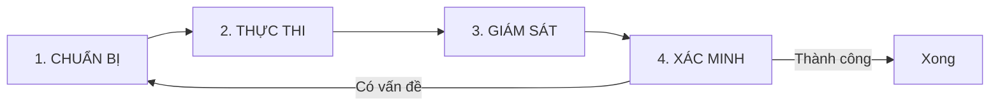

# Module 7.2: Quy Trình Full Auto

> **Thời gian học**: ~35 phút
>
> **Yêu cầu trước**: Module 7.1 (Các Cấp Độ Auto Coding), Module 6.3 (Think+Plan Combo)
>
> **Kết quả**: Sau module này, bạn sẽ có workflow đầy đủ cho Full Auto mode an toàn — từ pre-flight check đến post-execution verify. Biết chính xác khi nào Full Auto phù hợp và cách set guardrail.

---

## 1. WHY — Tại Sao Cần Workflow

Nghe Full Auto mạnh nhưng nguy hiểm. Phần lớn dev rơi vào 2 cực: hoặc tránh hoàn toàn vì sợ (miss toàn bộ productivity boost), hoặc dùng bừa rồi gây damage (overwrite logic, break dependency). Không có middle ground vì chưa ai dạy WORKFLOW cụ thể.

Full Auto không phải cái nút bấm xong ngồi uống cà phê. Nó là một **protocol đầy đủ** — như phi công commercial. Phi công có autopilot nhưng vẫn phải làm pre-flight checklist, monitor instrument, verify landing. Skip một step = crash. Full Auto cũng thế — nếu không có workflow, bạn đang ngồi trên time bomb.

---

## 2. CONCEPT — Bốn Pha Full Auto

Full Auto workflow gồm 4 phase tuần tự. Skip phase nào cũng tăng risk. Đây không phải "best practice" — đây là **minimum viable safety protocol**.



### Phase 1: CHUẨN BỊ (Critical Phase)

Đây là phase quyết định 80% success rate.

- **Think+Plan trước** (Module 6.3) — KHÔNG BAO GIỜ Full Auto mà không có plan. Plan không cần perfect, nhưng phải rõ: input/output là gì, boundary là gì, success criteria là gì.
- **Safety net**: `git checkout -b feature/auto-experiment` — LUÔN LUÔN branch mới. Full Auto làm việc trên main branch = Russian roulette.
- **Define boundary**: file/directory nào được phép touch, cái nào forbidden. Ví dụ: "Only touch `src/services/*.ts`, DO NOT modify `src/config/` or `package.json`".

### Phase 2: THỰC THI

- **Prompt rõ ràng reference plan**: "Follow the plan in CLAUDE.md Phase 3. Generate unit tests for all functions in `src/services/`. Stop after 5 files and wait for checkpoint."
- **Stop condition + checkpoint**: Không để chạy end-to-end 100 file. Chia batch. Sau mỗi batch, verify trước khi tiếp.

### Phase 3: GIÁM SÁT

Full Auto ≠ unattended. Bạn vẫn phải watch output realtime.

- **Look for**: file access lạ (sao nó đọc `.env`?), error pattern, scope creep (sao nó sửa file ngoài boundary?)
- **Ctrl+C ready**: Nếu thấy đi sai hướng, stop ngay. Đừng để chạy hết rồi mới rollback — waste token + time.

### Phase 4: XÁC MINH

Sau khi Full Auto claim "Done", verify TRƯỚC KHI merge:

- **`git diff`**: scan toàn bộ change — có file nào lạ không?
- **Run test**: `npm test` hoặc `cargo test` — CI có pass không?
- **Verify vs plan**: output có match với plan ban đầu không?

Nếu fail → quay lại Phase 1, adjust plan, retry.

---

### Full Auto Eligibility Checklist

Task có ĐỦ 5 điều kiện này mới nên dùng Full Auto:

- ✅ **Repetitive**: 10+ item giống nhau (e.g., generate test cho 50 function)
- ✅ **Well-defined**: input/output rõ ràng, không ambiguous
- ✅ **Isolated**: không touch critical infrastructure (auth, payment, config)
- ✅ **Reversible**: có git branch, dễ rollback
- ✅ **Verifiable**: có cách test objective (unit test, build pass, lint clean)

Thiếu 1/5 → xuống Assisted mode (Module 7.1).

---

## 3. DEMO — Generate Unit Test Cho Cả Service Layer

**Task**: Generate unit test cho `src/services/` — 15 file TypeScript, ~50 function. Manual estimate: 2-3 tiếng. Target: 15 phút với Full Auto.

---

**Step 1: CHUẨN BỊ**

Tạo safety net:
```bash
$ git checkout -b feature/auto-generate-tests
```

Chạy Think+Plan:
```bash
$ claude
You: "I want to generate unit tests for all functions in src/services/.
Use Jest, 80% coverage minimum, mock external dependencies."

Claude: [Think mode] Analyzing 15 files...
Plan:
1. Scan src/services/*.ts
2. For each function: generate test file in __tests__/
3. Use jest.mock() for DB/API calls
4. Run npm test after each batch (5 files/batch)
```

Compact context để tránh bloat:
```bash
/compact
```

Define boundary trong CLAUDE.md:
```markdown
## Full Auto Boundary
ALLOWED: Create/modify files in src/services/__tests__/
FORBIDDEN: Modify src/services/*.ts (source files), package.json, jest.config.js
```

---

**Step 2: THỰC THI**

Prompt với reference plan + checkpoint:
```bash
You: "Follow the plan above. Generate tests for FIRST 5 FILES in src/services/,
then STOP and show summary. Do NOT proceed to next batch until I confirm."

Claude: [Full Auto] Starting batch 1/3...
✓ Created src/services/__tests__/user.service.test.ts (12 tests)
✓ Created src/services/__tests__/order.service.test.ts (8 tests)
...
Summary: 5 files, 47 tests, 0 errors. Ready for checkpoint.
```

---

**Step 3: GIÁM SÁT**

Trong lúc Claude chạy, watch output:
```
Creating src/services/__tests__/user.service.test.ts  ← OK
Reading src/config/database.ts                         ← Warning! Out of boundary?
  (context: need DB schema for mock)                   ← OK, read-only
Creating src/services/user.service.ts                  ← RED FLAG! Modifying source!
```

Nếu thấy dòng cuối → `Ctrl+C` ngay. Trong case này, Claude chỉ read config (OK), không modify source.

---

**Step 4: XÁC MINH**

Check git diff:
```bash
$ git diff --stat
src/services/__tests__/user.service.test.ts    | 89 +++++++++++
src/services/__tests__/order.service.test.ts   | 67 ++++++++
...
5 files changed, 312 insertions(+)
```

Verify: chỉ file trong `__tests__/`, không có file khác → ✅

Run test:
```bash
$ npm test
PASS src/services/__tests__/user.service.test.ts
PASS src/services/__tests__/order.service.test.ts
...
Tests: 47 passed, 47 total
Coverage: 83.2% (target: 80%)
```

✅ Pass. Confirm tiếp batch 2.

---

**Result**:
3 batch x 5 phút = 15 phút total. Coverage 83%, zero manual test viết. So với 2-3 tiếng manual → tiết kiệm 90% time.

---

## 4. PRACTICE — Thử Workflow Của Bạn

### Bài 1: Pre-Flight Checklist Của Riêng Bạn
**Mục tiêu**: Tạo checklist cụ thể cho project/tech stack của bạn
**Hướng dẫn**:
1. Pick một task lặp trong codebase (e.g., add TypeScript type cho 20 function, generate API doc cho 10 endpoint)
2. Viết plan (Think+Plan hoặc manual)
3. Define boundary (file nào OK, file nào forbidden)
4. Execute Full Auto với checkpoint
5. Post-mortem: ghi lại điều gì work, điều gì không

**Kết quả mong đợi**: Một checklist 5-7 item bạn sẽ dùng cho mọi Full Auto session sau này.

<details>
<summary>💡 Gợi ý</summary>
Checklist nên include: git branch check, /compact, boundary trong CLAUDE.md, stop condition trong prompt, verify command (test/build).
</details>

<details>
<summary>✅ Giải pháp mẫu</summary>

```markdown
## My Full Auto Checklist
- [ ] git checkout -b auto/[task-name]
- [ ] /compact (if context > 50k tokens)
- [ ] Write boundary in CLAUDE.md
- [ ] Prompt includes: plan reference + stop condition
- [ ] Watch output for out-of-boundary access
- [ ] git diff + npm test before merge
```
</details>

---

### Bài 2: Boundary Testing
**Mục tiêu**: Verify Claude có respect boundary không
**Hướng dẫn**:
1. Tạo fake project với `src/` (allowed) và `config/` (forbidden)
2. Prompt: "Add logger to all files in src/, DO NOT touch config/"
3. Sau khi execute, check `git diff` — có file trong `config/` bị modify không?

**Kết quả mong đợi**: Không có file nào trong `config/` thay đổi. Nếu có → cần rõ ràng hơn trong prompt.

<details>
<summary>✅ Giải pháp</summary>
Nếu Claude vẫn touch `config/`, thử prompt: "HARD RULE: You are FORBIDDEN to write/modify any file in config/. Only READ is allowed. Confirm you understand before starting."
</details>

---

## 5. CHEAT SHEET

### Pre-Flight Checklist
| Step | Command/Action |
|------|----------------|
| Safety net | `git checkout -b auto/experiment` |
| Context prep | `/compact` nếu > 50k token |
| Define boundary | Ghi rõ trong CLAUDE.md hoặc prompt |
| Plan | Think+Plan hoặc manual plan |

### Prompt Template
```
Follow this plan: [link/summary]
Scope: [boundary - file/directory allowed]
Stop condition: After [N items/files], show summary and WAIT
FORBIDDEN: [critical files/dirs]
```

### Emergency Stop
| Trigger | Action |
|---------|--------|
| Out-of-boundary access | `Ctrl+C` ngay |
| Unexpected error pattern | `Ctrl+C`, review plan |
| Scope creep | `Ctrl+C`, clarify boundary |

### Post-Execution Checklist
- [ ] `git diff --stat` — check file list
- [ ] `git diff` — scan actual change
- [ ] Run test (`npm test`, `cargo test`, etc.)
- [ ] Verify output vs plan
- [ ] If pass → merge; if fail → `git reset --hard`, adjust plan

---

## 6. PITFALLS — Lỗi Thường Gặp

| ❌ Sai lầm | ✅ Đúng cách |
|---|---|
| Full Auto không plan, không boundary | Luôn Think+Plan + define boundary trước |
| Chạy trên `main` branch trực tiếp | `git checkout -b` — LUÔN LUÔN dùng branch riêng |
| Để Full Auto chạy 100 item một lúc | Chia batch 5-10 item, checkpoint giữa batch |
| Không watch output, đi uống cà phê | Full Auto ≠ unattended. Phải monitor realtime |
| `git diff` sau khi merge rồi | Verify TRƯỚC KHI merge. Rollback sau merge = nightmare |
| Không test — tin Claude claim "Done" | LUÔN run test/build. AI hallucinate "success" |
| Dùng Full Auto cho critical infra (auth, payment) | Critical code = Manual hoặc Assisted. Không bao giờ Full Auto |

---

## 7. REAL CASE — Migration TypeScript Cho Legacy Codebase

**Scenario**: Startup Việt Nam (fintech) cần migrate legacy JavaScript sang TypeScript. 200+ file, không có type, không có test. Deadline: 2 tuần.

**Lần thử 1 (Sai lầm)**:
Dev nghe "Full Auto mạnh" → prompt: "Convert all .js to .ts, add types". Không plan, không boundary, chạy luôn trên `develop` branch.

**Kết quả**:
- 4 giờ sau, 150 file converted
- Build break — 50+ import path sai (`.js` → `.ts`)
- Type inference sai ở async function → runtime bug
- Rollback mất 4 giờ untangle từng commit

**Lần thử 2 (Đúng workflow)**:
1. **CHUẨN BỊ**:
   - Think+Plan: chia 6 batch theo module (user, order, payment, admin, report, util)
   - Branch: `git checkout -b feature/typescript-migration`
   - Boundary: mỗi batch chỉ touch 1 module
2. **THỰC THI**:
   - Batch 1 (user module, 30 file) → checkpoint
   - Verify → commit
   - Batch 2...
3. **GIÁM SÁT**: Watch import path, type error
4. **XÁC MINH**: `tsc --noEmit` + `npm test` sau mỗi batch

**Kết quả**:
- 6 batch x 1 giờ = 6 giờ total
- Zero rollback
- 95% type coverage
- Quote từ lead: "Full Auto tiết kiệm 1 tuần công, nhưng chỉ vì chúng tôi follow đúng workflow. Lần đầu fail vì nghĩ nó là magic button."

---

> **Tiếp theo**: [Module 7.3: Kiến Trúc Multi-Agent](../03-multi-agent-architecture/) →
