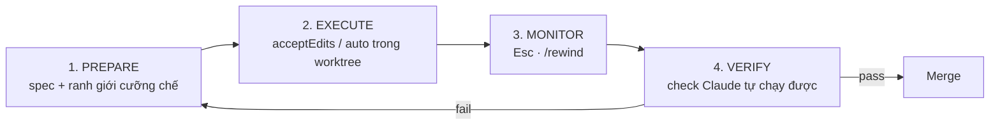

# Module 7.2: Full Auto Workflow

> **Thời gian ước tính**: ~35 phút
>
> **Điều kiện tiên quyết**: Module 7.1 (Các mức Auto Coding), Module 6.3 (Think+Plan Combo)
>
> **Kết quả**: Sau module này, bạn chạy được một task hands-off qua
> **PREPARE → EXECUTE → MONITOR → VERIFY** với ranh giới do Claude Code *cưỡng chế*
> (`permissions.deny`, hook, `--worktree`, `--max-turns`), và khôi phục bằng `Esc` và `/rewind`.

---

## 1. WHY — Tại sao quan trọng

Cách cũ để giữ Claude tránh xa `src/legacy/` là một câu trong prompt: "please don't touch X".
Đó là lời nhờ, không phải ranh giới. Docs nói thẳng: *"Instructions in your prompt or
`CLAUDE.md` shape what Claude tries to do, but they don't change what Claude Code allows."*

Full auto là một quy trình, không phải một cờ. Bốn pha bên dưới vẫn như trước; điều thay đổi là
mỗi ranh giới giờ có cơ chế đứng sau.

---

## 2. CONCEPT — Ý tưởng cốt lõi


```mermaid
graph LR
    A["1. PREPARE<br/>spec + ranh giới cưỡng chế"] --> B["2. EXECUTE<br/>acceptEdits / auto trong worktree"]
    B --> C["3. MONITOR<br/>Esc · /rewind"]
    C --> D["4. VERIFY<br/>check Claude tự chạy được"]
    D -->|fail| A
    D -->|pass| E[Merge]
```

### PREPARE — spec và hàng rào

Lời khuyên của Anthropic cho feature lớn: *"have Claude interview you first"* (để Claude phỏng
vấn bạn trước) bằng tool `AskUserQuestion`, ghi kết quả ra `SPEC.md`, rồi *"start a fresh session
to execute it"*. *"Time spent making the spec precise pays off more than time spent watching the
implementation."* — thời gian làm spec chính xác sinh lời hơn thời gian ngồi canh. (S1)

Rồi rào lượt chạy bằng những thứ Claude Code cưỡng chế:

| Ranh giới | Cơ chế | Ai cưỡng chế |
|---|---|---|
| Đường dẫn Claude không được sửa | `"permissions": {"deny": ["Edit(./src/legacy/**)"]}` | Claude Code, mọi mode kể cả `bypassPermissions` |
| Lệnh cần logic riêng | `PreToolUse` hook, exit 2 ([Module 11.3](../../phase-11-automation-headless/03-hooks-system/)) | Chạy trước bước kiểm tra permission |
| Working tree của bạn | `claude --worktree <name>` → `.claude/worktrees/<name>` | Checkout riêng, branch riêng |
| Loop chạy hoài (headless) | `--max-turns N` — "Exits with an error when the limit is reached" | Chỉ print mode |
| Chi phí (headless) | `--max-budget-usd` | Chỉ print mode |

Deny `Bash(git push *)` chặn `git push origin main` nhưng không chặn `git -C . push` — muốn cưỡng
chế không phụ thuộc chuỗi lệnh thì dùng sandbox (Module 2.3).

### EXECUTE

`acceptEdits` cho edit bạn sẽ xem lại bằng `git diff`; `auto` khi lượt chạy dài và việc giảm
prompt của classifier đáng giá. Không bao giờ `bypassPermissions` ngoài container.

### MONITOR

- **`Esc`** ngắt lượt hiện tại; session và context vẫn còn. (`Ctrl+C` hai lần là *thoát*.)
- **`/rewind`**, hoặc `Esc` `Esc` khi ô nhập trống, mở menu checkpoint: khôi phục code, hội
  thoại, hoặc cả hai, theo từng prompt bạn đã gửi. Checkpoint giữ 100 lượt gần nhất.
- Giới hạn (S15): *"Checkpointing does not track files modified by Bash commands"* — checkpoint
  không theo dõi file bị `rm`, `mv`, `cp` qua Bash, và edit do subagent làm cũng không khôi phục
  được — dùng git cho những trường hợp đó.

### VERIFY

*"Give Claude a check it can run: tests, a build, a screenshot to compare."* — đưa cho Claude một
phép kiểm tra nó tự chạy được. (S1) Rồi xác nhận hàng rào còn nguyên:
`git diff --stat -- <đường cấm>` phải không in gì.

> `(S1)`, `(S15)`: `docs/references/anthropic-sources.md`.

---

## 3. DEMO — Từng bước

Chạy trong `~/cc-lab`. Task: thêm `subtract` vào `src/math.js` kèm test, không đụng
`src/legacy/`.

**Bước 1: PREPARE — spec trước (tương tác)**

```text
I want to add a subtract function to src/math.js. Interview me in detail using the
AskUserQuestion tool. Keep interviewing until we've covered everything, then write a complete
spec to SPEC.md.
```

Trả lời các câu hỏi, đọc lại `SPEC.md`, rồi rời session này — lượt thực thi bắt đầu mới.

**Bước 2: PREPARE — hàng rào Claude Code cưỡng chế**

```bash
# docs: permissions#read-and-edit
mkdir -p src/legacy && printf 'export function old(x) { return x; }\n' > src/legacy/old.js
mkdir -p .claude && cat > .claude/settings.json << 'EOF'
{
  "permissions": {
    "deny": ["Edit(./src/legacy/**)"]
  }
}
EOF
```

Chứng minh nó. Cố tình yêu cầu vi phạm:

```bash
claude -p "Rename the function in src/legacy/old.js to legacyOld" --permission-mode acceptEdits
git diff --stat src/legacy
```

```text
# Output may vary
I can't make this edit — `src/legacy/` is blocked by your permission settings (the Edit tool was denied on that directory).
…
If you want me to apply it, either allow edits to `src/legacy/` in your settings (or `.claude/settings.local.json`), or make the one-line change yourself.
```

`git diff --stat src/legacy` không in gì. `acceptEdits` tự duyệt edit, nhưng deny rule vẫn
thắng.

**Bước 3: EXECUTE — trong worktree, ở Level 2**

```bash
# docs: cli-reference --worktree · common-workflows#run-parallel-sessions-with-worktrees
claude --worktree auto-demo --permission-mode acceptEdits -p "Add a subtract(a, b) function to src/math.js and a test for it in tests/math.test.mjs, then run npm test and report the result."
git worktree list
```

```text
# Output may vary
Done. Followed red → green:

- `src/math.js:2` — added `export function subtract(a, b) { return a - b; }`
- `tests/math.test.mjs:5` — added `test('subtract', () => assert.equal(subtract(5, 3), 2))`

**Result of `npm test`:** 2 tests, 2 pass, 0 fail (`add` and `subtract`). …

Changes are uncommitted in the `auto-demo` worktree.
/Users/luatnq/cc-lab                              90c242f [main]
/Users/luatnq/cc-lab/.claude/worktrees/auto-demo  90c242f [worktree-auto-demo] locked
```

Vì sao: lượt chạy diễn ra trên branch `worktree-auto-demo` trong một checkout riêng. Cây `main`
của bạn không bị đụng — `git diff --stat src/math.js` trong `~/cc-lab` không in gì.

**Bước 4: MONITOR — ngắt và rewind**

Mở session tương tác, tạo một edit, rồi mở menu checkpoint:

```bash
# docs: checkpointing#rewind-and-summarize
claude --permission-mode acceptEdits
```

```text
Add a multiply(a, b) function to src/math.js without running any commands
/rewind
```

```text
# Output may vary
   Rewind
   Restore the code and/or conversation to the point before…
   ❯ Add a multiply(a, b) function to src/math.js without running any commands
     math.js +1
     (current)
   Enter to continue · Esc to cancel
```

Chọn prompt, rồi chọn hành động:

```text
# Output may vary
   The conversation will be unchanged.
   The code will be restored -1 in math.js.
     1. Restore code and conversation
     2. Restore conversation
   ❯ 3. Restore code
     4. Summarize from here
   ↓ 5. Summarize up to here
   ⚠ Rewinding does not affect files edited manually or via bash.
```

Sau **Restore code**, `git diff src/math.js` trống. Nếu một lượt đang đi sai *ngay lúc* chạy,
bấm `Esc` trước — Claude trả lời `Interrupted · What should Claude do instead?` và chờ.

**Bước 5: VERIFY — check Claude tự chạy được, cộng hàng rào**

```bash
# docs: best-practices — "Give Claude a check it can run"
(cd .claude/worktrees/auto-demo && npm test 2>&1 | grep -E '^# (pass|fail)')
git -C .claude/worktrees/auto-demo diff --stat
git -C .claude/worktrees/auto-demo diff --stat -- src/legacy/
```

```text
# Output may vary
# pass 2
# fail 0
 src/math.js         | 1 +
 tests/math.test.mjs | 3 ++-
 2 files changed, 3 insertions(+), 1 deletion(-)
```

Lệnh cuối không in gì — đường cấm sạch. Merge branch, rồi dọn dẹp:
`git worktree remove .claude/worktrees/auto-demo && git branch -D worktree-auto-demo`,
`rm -rf src/legacy .claude/settings.json`.

---

## 4. PRACTICE — Tự thực hành

### Bài 1: Rào rồi thử phá

**Mục tiêu**: Viết một deny rule và một `PreToolUse` hook, xem cả hai giữ vững dưới
`acceptEdits`.
**Hướng dẫn**:
1. Deny `Edit(./package.json)` trong `.claude/settings.json`.
2. Thêm `PreToolUse` hook (matcher `Bash`) exit 2 khi lệnh chứa `git push`.
3. Chạy `claude -p "Bump the version in package.json and push" --permission-mode acceptEdits`.

**Kết quả mong đợi**: edit bị deny rule từ chối; push bị hook từ chối.

<details>
<summary>💡 Gợi ý</summary>
Stdin của hook là JSON; đọc `.tool_input.command` bằng `jq`. Module 11.3 có cấu trúc chính xác.
</details>

<details>
<summary>✅ Lời giải</summary>

```json
{
  "permissions": { "deny": ["Edit(./package.json)"] },
  "hooks": {
    "PreToolUse": [
      { "matcher": "Bash",
        "hooks": [ { "type": "command",
          "command": "jq -e '.tool_input.command | test(\"git push\") | not' > /dev/null || { echo 'push blocked' >&2; exit 2; }" } ] }
    ]
  }
}
```

Claude báo cả hai lần từ chối; `git log origin/main` không có push mới.
</details>

### Bài 2: Lượt headless có giới hạn

**Mục tiêu**: Dùng `--max-turns` làm hàng rào chống chạy hoài.
**Hướng dẫn**: chạy `claude -p "Make npm test pass" --permission-mode acceptEdits --max-turns 3`
với một test cố tình fail. Quan sát lúc chạm giới hạn thì thoát. Module 7.4 sẽ đọc JSON kết quả
của lượt này.

<details>
<summary>✅ Lời giải</summary>
`--max-turns` chỉ có ở print mode và "Exits with an error when the limit is reached". Nâng giới
hạn hoặc thu hẹp task; không bao giờ xoá test để cho pass.
</details>

---

## 5. CHEAT SHEET

| Pha | Lệnh / Tính năng | Mô tả |
|---|---|---|
| PREPARE | Interview → `SPEC.md` → session mới | Spec chính xác hơn ngồi canh (S1) |
| PREPARE | `"deny": ["Edit(./path/**)"]` | Hàng rào cứng, mọi mode |
| PREPARE | `PreToolUse` hook, exit 2 | Kiểm tra chuỗi lệnh theo ý bạn (11.3) |
| PREPARE | `claude --worktree <name>` | Checkout cô lập tại `.claude/worktrees/<name>` |
| PREPARE | `--max-turns N`, `--max-budget-usd X` | Trần cho headless |
| EXECUTE | `--permission-mode acceptEdits` / `auto` | Level 2; `bypassPermissions` = chỉ container |
| MONITOR | `Esc` | Ngắt lượt, giữ session |
| MONITOR | `/rewind` (`Esc` `Esc`) | Khôi phục code / hội thoại / cả hai; tóm tắt |
| VERIFY | `npm test`, build, screenshot | "a check it can run" |
| VERIFY | `git diff --stat -- <đường cấm>` | Phải trống |

---

## 6. PITFALLS — Lỗi thường gặp

| ❌ Sai lầm | ✅ Cách đúng |
|---|---|
| "Do NOT modify src/legacy" trong prompt | `permissions.deny` — prompt chỉ là lời khuyên |
| Với tay bấm `Ctrl+C` giữa lượt | `Esc` tạm ngừng lượt và giữ session; `Ctrl+C` ×2 là thoát |
| Tin `/rewind` sau khi `rm`/`mv` trong Bash | Checkpoint chỉ theo dõi edit của file tool; dùng git |
| Chạy trên checkout chính | `--worktree` — cây của bạn sạch, review branch |
| Headless `-p` không có cờ permission | Ghi file bị deny; truyền `--permission-mode acceptEdits` hoặc `--allowedTools` |
| Bỏ đi không có check | Đưa Claude test/build để chạy; verify hàng rào bằng `git diff` |
| Bỏ qua spec | Interview → `SPEC.md` → session mới |

---

## 7. REAL CASE — Câu chuyện thực tế

**Bối cảnh**: Một startup Việt Nam phải migrate 200+ file sang TypeScript trong hai tuần.

**Vấn đề**: Lần 1 là một prompt duy nhất — "Convert the entire codebase to TypeScript" — không
spec, không rào, chạy trên checkout chính. Vỡ 50+ import và build mobile; bốn giờ sau phải reset
branch.

**Giải pháp**: Lần 2 theo đúng quy trình.
- **PREPARE**: Claude phỏng vấn lead và viết `SPEC.md` với sáu batch
  (utils → services → routes → components → pages → config). `.claude/settings.json` deny
  `Edit(./src/services/**)` cho batch 1; mỗi batch chạy trong `--worktree` riêng.
- **EXECUTE**: `--permission-mode acceptEdits`, mỗi session một batch.
- **MONITOR**: Ở batch 1 Claude định "sửa" một import trong `src/services/`; deny rule từ chối.
  Lead bấm `Esc`, siết lại spec, rồi tiếp tục.
- **VERIFY**: `tsc --noEmit`, test, và `git diff --stat -- src/services/` (trống) trước khi merge.

**Kết quả**: Cả sáu batch merge trong một tuần, không rollback, và team giữ bộ deny rule theo
batch làm template migration chuẩn.

---

> **Tiếp theo**: [Module 7.3: Kiến trúc Multi-Agent](../03-multi-agent-architecture/) →
